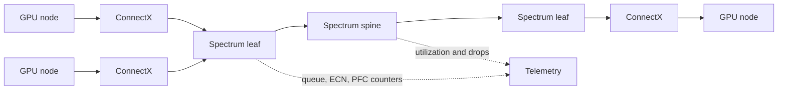
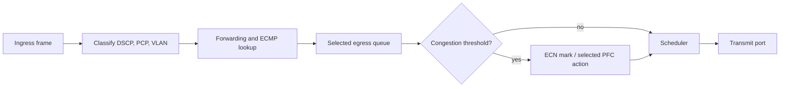

# Spectrum Switches for AI

## Introduction

An AI Ethernet switch is not a passive collection of ports. It is the point at which many endpoint queues meet, traffic is classified, packets are buffered and scheduled, and congestion becomes either visible and controlled or widespread and mysterious. A fabric can show every link as up while a small number of oversubscribed egresses extend training steps for an entire job.

Spectrum switches provide the Ethernet forwarding, queueing, congestion, and telemetry layer commonly paired with ConnectX adapters. This chapter is about design decisions and operational evidence, not a substitute for the release-specific hardware installation guide or Network Operating System (NOS) documentation.

| Chapter field | Value |
|---|---|
| Difficulty | Advanced |
| Estimated reading time | 55–70 minutes |
| Prerequisites | Chapters 01–06; familiarity with leaf-spine routing |
| Primary focus | Switch behavior, topology, and operations for AI Ethernet |

## Story: The Fast Fabric with a Slow Rack

A 256-GPU cluster meets pairwise bandwidth expectations. Under two concurrent training jobs, one rack becomes a persistent straggler. Port status, optics, and host counters look healthy. Queue and ECN telemetry eventually show that a set of destination-facing uplinks carries a disproportionate share of traffic; the design had enough aggregate capacity but insufficient usable capacity for the placement and path distribution.

The correction is not a blind buffer increase. The team validates cabling and routing, corrects the path and workload placement imbalance, then records per-rack congestion baselines. The important lesson is that switch capacity must be evaluated as a topology and queueing system.

## Learning Objectives

After this chapter, you can:

- explain the switch responsibilities between a ConnectX endpoint and an AI workload;
- distinguish radix, port speed, buffering, and usable bisection bandwidth;
- design queue, ECN, PFC, and routing operations without treating them as independent features;
- build switch telemetry that separates physical faults from congestion;
- plan changes, failures, and upgrades with measurable acceptance criteria.

## Big Picture



**Figure 9.7.1 — The switch is an active queueing and forwarding participant.** End-to-end behavior emerges from the adapters, switches, routing policy, and workload at once.

## Why Switch Design Changes for AI

Collectives can create synchronized bursts: many senders target a small set of destinations, then repeat the pattern at another stage. A switch must arbitrate between ingress traffic competing for an egress, apply the intended traffic class, and signal congestion early enough for endpoints to react. A high headline switching capacity does not guarantee a nonblocking cluster.

Use the following distinction in design reviews:

| Term | What it answers | What it does not prove |
|---|---|---|
| Port speed | Rate available on one negotiated link | End-to-end payload or application rate |
| Radix | Number of usable ports on a switch design | Adequate uplinks or fault isolation |
| Aggregate capacity | Sum of relevant port capacities | Nonblocking bisection for a workload |
| Buffer/queue design | How contention is absorbed and managed | That congestion control is correctly configured |
| Telemetry capability | What evidence can be collected | That alerts and ownership exist |

The design target is predictable behavior during realistic contention, not a claim that congestion never occurs.

## The Forwarding and Queueing Path

At a conceptual level, an arriving frame is classified, assigned to a forwarding decision and egress queue, arbitrated for transmission, and counted. Exact pipeline order and counters depend on switch model and NOS, so use the platform documentation for implementation detail.



**Figure 9.7.2 — Classification must remain consistent with the QoS policy defined in Chapter 06.** A frame in the wrong class can make otherwise correct ECN and PFC settings ineffective.

### Buffers are transient protection, not capacity

An egress buffer absorbs a mismatch between arrival and service rate. It cannot make a long-lived offered load fit through a smaller link. As occupancy grows, the intended response is normally ECN marking so RoCE endpoints reduce injection; PFC is a targeted, last-resort loss-protection mechanism for the chosen priority, not a general congestion solution. See Chapters 04–06 for the protocol behavior.

Poorly scoped PFC can propagate pause upstream and cause head-of-line blocking. Conversely, omitting the loss-control design where the deployed RoCE profile requires it can produce drops and retransmission behavior that is hard to attribute. Establish one reviewed policy per fabric class, then validate it hop by hop.

## Topology, Radix, and Failure Domains

A leaf-spine fabric gains path diversity only when the uplinks, spines, routing policy, and endpoint flow behavior can use it. Count capacity in normal and degraded states.

```text
effective available capacity = capacity of the relevant path cut
                               after topology, policy, and failure constraints
```

This is a planning model, not a performance prediction. Evaluate at least these cases:

- a node-to-node flow inside a rack;
- a representative cross-rack collective;
- concurrent jobs sharing a leaf or spine cut;
- one uplink unavailable;
- one switch unavailable, where the design intends to tolerate it;
- maintenance windows and growth increments.

| Choice | Benefit | Cost or risk |
|---|---|---|
| Higher-radix leaf | Fewer devices and cables | Larger blast radius and dense service event |
| More uplinks | More path diversity and degraded capacity | More optics, ports, and routing complexity |
| Intentional oversubscription | Lower initial cost | Must be justified by measured workload demand |
| Dedicated compute fabric | Predictable traffic class and operations | Additional infrastructure footprint |
| Shared converged fabric | Better utilization of common infrastructure | Stronger QoS and change-control requirements |

## Routing and Load Distribution

ECMP distributes eligible flows according to the switch and NOS policy. It is not a guarantee that a single flow, a small number of flows, or a communication library will spread evenly. In a multi-rail GPU design, endpoint interface selection and GPU affinity also determine whether the fabric can use available paths.

Before changing a hash field, adaptive-routing setting, or routing policy, capture:

1. topology and expected next hops;
2. interface-to-rail and GPU-to-NIC mappings;
3. per-link utilization under the affected workload;
4. queue, ECN, and PFC counter deltas;
5. the rollback configuration and success criteria.

Do not diagnose a physical failure as a routing issue, or a capacity problem as a hash problem. The evidence is different.

## Spectrum Operations and Telemetry

Telemetry should resolve a symptom from workload to port, peer, cable, configuration version, and traffic class. NVIDIA documents interface counters, buffer events, and What Just Happened (WJH) drop sampling as telemetry capabilities on supported Spectrum/NOS combinations; availability and syntax are release dependent.

Collect these families, retaining counter deltas rather than only lifetime totals:

| Layer | Evidence | Why it matters |
|---|---|---|
| Physical | link state, negotiated speed, FEC, errors, transceiver state | Separates a faulty path from contention |
| Forwarding | route/next-hop state, ECMP membership, port utilization | Explains path concentration |
| Queue | occupancy where available, queue drops, scheduler statistics | Identifies the congested egress |
| Congestion | ECN marks, PFC transmit/receive, pause duration | Validates the control loop |
| Change | NOS, configuration, optics/cable, firmware inventory | Makes regressions explainable |
| Workload | job/rack/rail placement and collective duration | Connects fabric evidence to impact |

Alert on unexpected rate of change, sustained asymmetry, and deviation from a known-good baseline. A nonzero cumulative counter is not automatically an active incident.

## Production Deployment Pattern

Treat switch configuration as a tested release artifact, with templates generated from a source of truth. The artifact should include port roles, breakout and optic expectations, MTU, routing, QoS classification, ECN/PFC profile, management access, telemetry export, and rollback instructions.

### Acceptance ladder

1. Confirm inventory, cable/optic identity, port role, and negotiated physical state.
2. Verify L2/L3 reachability, MTU, and routing from representative hosts.
3. Validate the end-to-end QoS mapping and intended counter visibility.
4. Run host-memory RDMA tests, then GPU-buffer and collective tests.
5. Repeat under expected concurrency and at least one planned degraded state.
6. Record topology, software versions, counters, and workload results as the baseline.

### Upgrade discipline

NOS changes can alter command behavior, telemetry availability, supported features, or queue behavior. Qualify a representative rack first; compare the same workload and evidence set before and after; use a maintenance plan that preserves a rollback path. Do not infer an upgrade is safe because links return to `up`.

## Troubleshooting

### Scenario 1 — One rack is slow, but links are healthy

**Symptoms:** a recurring job has longer step time only when scheduled in one rack; port state and basic error counters are normal.

**Diagnosis:** compare the rack’s uplink utilization, ECN marking rate, PFC deltas, route membership, and workload placement with a healthy rack. Trace the evidence to a shared egress or an imbalanced path before changing thresholds.

**Resolution:** correct the route, placement, cabling, or capacity condition that created the concentration. Re-run the same workload and verify that queue/congestion asymmetry and step-time tail return to baseline.

**Prevention:** include rack-level congestion and rail-balance views in acceptance and admission reviews.

### Scenario 2 — PFC counters rise across multiple leaves

**Symptoms:** pause frames increase at several hops and unrelated traffic experiences latency.

**Diagnosis:** find the traffic priority and trace the pause direction toward the congested egress. Validate that all hops use the same classification and that PFC is enabled only for the intended priority. Review ECN marking and endpoint reaction rather than assuming PFC is the root cause.

**Resolution:** remove the underlying oversubscription or misclassification; restore the approved ECN/PFC policy; confirm pause counters no longer grow during the test window.

**Prevention:** deploy QoS from a single source of truth and test congestion scenarios before production rollout.

### Scenario 3 — A port runs below the expected rate

**Evidence:** negotiated speed/FEC, error deltas, peer-port state, cable or transceiver identity, and recent changes.

**Likely causes:** unsupported or degraded media, a configuration mismatch, a peer limitation, or a physical fault.

**Resolution and verification:** isolate by controlled substitution using approved components, then confirm expected negotiation and stable error deltas under load. Do not close the incident based on administrative state alone.

## Customer Architecture Discussion

The right switch design begins with workload communication and operations, not a port-count quote. Establish three explicit criteria before choosing a topology: the number and communication pattern of concurrent jobs that must meet a step-time objective; the capacity and latency behavior permitted after a defined uplink, leaf, or maintenance loss; and the named team that owns NOS, optics, configuration automation, telemetry, and incident evidence.

Full bisection is a cost and resilience choice. Measured oversubscription can be appropriate when workload locality and concurrency measurements support it. The architecture decision should document normal and degraded service expectations, the evidence used to accept them, and the escalation owner—not only aggregate switch capacity.

## Interview Preparation

1. Why does a switch with sufficient aggregate bandwidth still permit slow collectives?
2. How do ECN, PFC, egress queues, and endpoint congestion control relate?
3. What evidence distinguishes a congested path from a failing optical link?
4. Why can ECMP leave a multi-rail cluster imbalanced?
5. What must be tested before a switch NOS upgrade?

## Architecture Summary

Spectrum switches provide the forwarding, queueing, telemetry, and congestion-signaling layer of an AI Ethernet fabric. Their value comes from a coherent topology, QoS policy, endpoint behavior, and operational release process. Buffers absorb brief mismatch; they do not replace capacity. Telemetry and baselines turn an opaque performance complaint into a path-specific engineering decision.

## Key Takeaways

- Evaluate switch capacity at the relevant traffic cut, including concurrent jobs and degraded states.
- Use ECN, PFC, queues, and endpoint behavior as one reviewed control system.
- Prove routing and rail balance with workload and counter evidence, not port-up state.
- Assign lifecycle and incident ownership for NOS, optics, automation, and telemetry before deployment.

## Quick Revision Sheet

- Validate usable path capacity in normal and degraded states.
- Keep classification, ECN, and PFC policies consistent end to end.
- Use queue and congestion counter *deltas*, joined with topology and workload data.
- Treat routing changes and NOS upgrades as workload-validated releases.
- Diagnose physical faults and congestion with different evidence.

## Lab Checklist

- [ ] Inventory leaf/spine ports, peers, optics, negotiated state, and expected speed.
- [ ] Capture route membership and per-link utilization for a representative workload.
- [ ] Record ECN/PFC/queue counter deltas before and after a controlled load test.
- [ ] Save a configuration and telemetry baseline with the change record.

## Cross References

- Previous: [Data Center Bridging and QoS](./chapter-06-data-center-bridging-and-qos)
- Next: [ConnectX Ethernet Adapters](./chapter-08-connectx-ethernet-adapters)
- Related: [Fabric Validation and Capacity Planning](./chapter-10-fabric-validation-and-capacity-planning)

## Further Reading

- [NVIDIA Spectrum telemetry documentation](https://docs.nvidia.com/networking/display/neov27/telemetry)
- [Historical/reference NVIDIA WJH configuration documentation](https://docs.nvidia.com/networking/display/onyxv3102002/configure%2Bwhat%2Bjust%2Bhappened%2B%28wjh%29%2Busing%2Bcli) — use the current NOS documentation for supported syntax and availability.
- [NVIDIA RoCE overview](https://docs.nvidia.com/networking-ethernet-software/cumulus-linux-40/Network-Solutions/RDMA-over-Converged-Ethernet-RoCE/)
