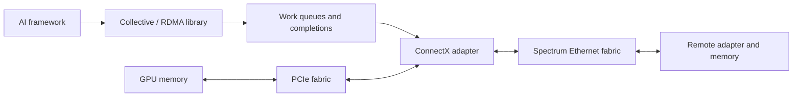
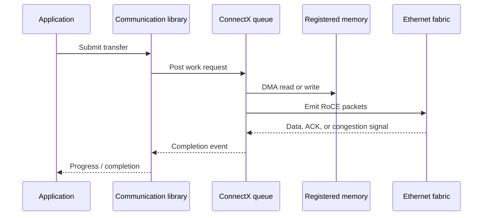
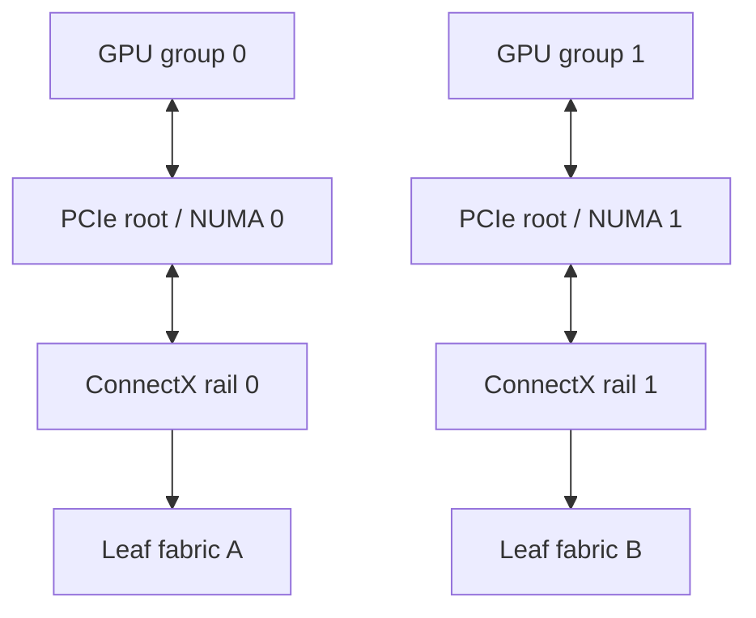

# ConnectX Ethernet Adapters

## Introduction

The adapter is where GPU and host memory, PCIe, RDMA work queues, Ethernet frames, and congestion response meet. In an AI cluster, it is not reasonable to treat a ConnectX port as an interchangeable network interface: the port’s PCIe and GPU locality, configuration, firmware, and rail assignment determine whether the fabric can use its installed capacity.

ConnectX adapters can provide Ethernet and hardware-assisted RoCE functions, but the exact capability depends on the adapter generation, firmware, driver, operating mode, and platform. Use the qualified compatibility matrix for a deployment; this chapter teaches the stable reasoning model.

| Chapter field | Value |
|---|---|
| Difficulty | Advanced |
| Estimated reading time | 55–70 minutes |
| Prerequisites | Chapters 02–07 and basic PCIe/NUMA concepts |
| Primary focus | Endpoint data path, topology, lifecycle, and diagnosis |

## Story: Two Ports, One Effective Rail

A team adds a dual-port adapter to every GPU server and expects twice the network throughput. Link counters show both ports up, but large jobs use one port almost exclusively. The second port is attached to a different leaf, yet process placement and library interface selection favor the first NIC. When traffic finally uses both ports, a shared PCIe path becomes the next limit.

The adapters were not defective. The design had not proved that application, GPU, NIC, PCIe, and fabric paths aligned. Installed port capacity is an input; usable multi-rail capacity is an end-to-end result.

## Learning Objectives

After this chapter, you can:

- describe the adapter’s queue-based data path and RDMA responsibilities;
- evaluate PCIe, NUMA, and GPU-to-NIC locality before interpreting throughput;
- explain why multi-port and multi-rail designs require application-aware mapping;
- build a lifecycle and telemetry baseline for ConnectX endpoints;
- troubleshoot low bandwidth, imbalance, and RoCE endpoint failures with evidence.

## Big Picture

**Figure 9.8.1 — The adapter bridges local I/O topology and the Ethernet fabric.** Both sides must be healthy for an application to reach its expected rate.

## What the Adapter Does

An RDMA-capable adapter works with software that registers memory and posts work requests to queue resources. Hardware performs transport processing and DMA according to the configured transport and protection rules; completion events report progress to the software. NVIDIA’s RoCE documentation describes RoCE as RDMA over Ethernet, with transport and memory translation/placement handled in hardware for supported adapters.

This model does not mean the CPU disappears from all data movement. Setup, memory registration, queue management, completion handling, and library progress remain software responsibilities. The implementation and tuning choices vary by stack.

## RoCE Endpoint Responsibilities

The NIC is one endpoint in the congestion-control loop described in Chapters 04 and 05. Switches may mark congestion; an endpoint configured for the relevant RoCE profile reacts according to its supported congestion-control behavior. The hosts send and receive RoCE packets—switch configuration enables the network behavior but does not replace endpoint configuration.

For a routed RoCEv2 design, verify the complete path: IP reachability, MTU, GID/addressing, QoS classification, ECN behavior, and the adapter/driver profile. RoCEv1 and RoCEv2 have different scope and encapsulation; do not generalize a configuration or troubleshooting step from one to the other.

| Validation area | Evidence to retain |
|---|---|
| PCIe | negotiated generation/width, topology, correctable-error trend |
| Locality | NUMA node, GPU-to-NIC affinity, CPU placement where relevant |
| Ethernet | speed, FEC, MTU, errors, peer switch port |
| RoCE | device/port state, GID/addressing, QP test result, relevant counters |
| Congestion | ECN/PFC deltas and per-rail utilization during load |
| Release state | adapter firmware, driver, RDMA userspace, GPU/collective stack |

## PCIe, NUMA, and GPUDirect Paths

A network link can advertise more capacity than the local I/O path sustains. PCIe generation and width, root-complex placement, switch topology, memory path, and GPU/NIC affinity can limit injection or receive rate. A dual-port adapter can also share an upstream PCIe link; sum of port line rates is not automatically a host capability.

**Figure 9.8.2 — A multi-rail topology only helps when the workload can use local GPU-to-NIC paths and independent fabric rails.** Cross-socket paths may be valid but deserve measurement.

Before accepting a node, inventory PCI bus address, negotiated PCIe state, NUMA node, nearby GPU identifiers, port-to-switch mapping, and expected rail. Treat this as production telemetry context, not an installation-time artifact.

## Multi-Port and Multi-Rail Design

Several ports can improve capacity and fault tolerance, but the design must make their independence real:

| Design question | Reasoning |
|---|---|
| Does software select all intended NICs? | A link-up second port can remain unused by the workload. |
| Are rails attached to distinct relevant failure domains? | Two ports on one failed leaf do not provide fabric resilience. |
| Is the PCIe path sufficient for aggregate use? | Shared local bandwidth can cap multiple ports. |
| Are GPU/NIC mappings documented? | Mapping determines remote versus local I/O paths. |
| Is traffic distribution observable by rail? | It is the evidence that the design works in production. |

Generic host bonding can be appropriate for conventional service traffic. It may conceal topology from a collective library, however, so use the application and platform guidance before applying it to an AI data path. Prefer an explicit, tested rail mapping over an assumption that hashing will balance a collective.

## Offloads, Virtualization, and Boundaries

ConnectX capabilities can include DMA, packet-processing offloads, virtualization resources, RDMA transport support, hardware counters, and QoS-related behavior. Enable a small, qualified feature set that serves a named workload; every enabled capability adds observability and lifecycle obligations.

| Capability class | Potential value | Operational question |
|---|---|---|
| RDMA transport | Efficient queue-based remote-memory data movement | Is the end-to-end RoCE profile consistent? |
| Packet offloads | Reduces selected host processing | How will the hardware path be observed and debugged? |
| Virtualization/steering | Resource partitioning or directed flows | Who owns resource limits and policy? |
| Hardware counters | Endpoint-specific evidence | Are counters exported with port, rail, and workload context? |

Avoid claiming that an offload automatically improves training. Measure the workload result and keep the comparison environment fixed.

## Production Lifecycle

Firmware, kernel driver, RDMA userspace, GPU driver, collective library, switch NOS, and congestion/QoS configuration form a compatibility surface. Manage them as a release set, not as unrelated tickets.

### Node acceptance ladder

1. Confirm approved adapter, optic/cable, firmware, driver, and PCIe state.
2. Confirm host IP/RoCE addressing, MTU, and QoS mapping to the intended traffic class.
3. Run a controlled host-memory RDMA test between known peers.
4. Run the approved GPU-buffer and collective validation for the rail design.
5. Capture physical, RoCE, congestion, and application evidence under load.
6. Repeat after a selected failure or maintenance-path test, where supported by the environment.

Preserve before-and-after configuration and a rollback plan. A successful driver load or link-up test is necessary, but it does not prove GPU locality, congestion response, or collective behavior.

## Troubleshooting

### Scenario 1 — One rail is nearly idle

**Symptoms:** both ports are active, but one rail has little workload traffic and aggregate throughput is below expectation.

**Diagnosis:** verify collector coverage first, then compare application interface selection, rank/GPU placement, route state, port-to-leaf mapping, and library configuration. Check whether the desired test actually creates enough concurrent work to use both rails.

**Resolution:** correct the explicit interface or affinity mapping; do not change switch QoS until endpoint selection is proven. Verify per-rail byte deltas and workload throughput together.

**Prevention:** make the GPU-to-NIC and NIC-to-rail map part of node inventory and admission testing.

### Scenario 2 — RoCE test fails while IP works

**Symptoms:** basic IP reachability succeeds but the RDMA/RoCE test cannot establish or sustain the expected path.

**Diagnosis:** inspect the selected RDMA device/port, RoCE GID/addressing, MTU, traffic-class mapping, endpoint state, and switch ECN/PFC evidence. Compare every item with a known-good peer. IP success alone does not prove RoCE configuration.

**Resolution:** restore the approved end-to-end profile, then validate at the RDMA layer before repeating GPU-buffer or collective tests.

**Prevention:** version-control the host and fabric profile and continuously check drift.

### Scenario 3 — Pairwise bandwidth is good; collective bandwidth is poor

**Diagnosis:** inspect PCIe/GPU locality, rail distribution, collective/rank placement, shared-fabric congestion, and topology cuts. Pairwise testing exercises only a small fraction of the communication pattern.

**Verification:** re-run the same collective with captured per-rail utilization and queue/congestion counter deltas. Accept improvement only when the evidence agrees.

## Customer Architecture Discussion

Adapter selection is a platform decision. Begin with desired GPU count per node, PCIe topology, target rail count, switch and optic design, workload communication pattern, and operations maturity. More port speed can be valuable, but it cannot fix a narrow PCIe path, remote GPU affinity, or an oversubscribed fabric cut.

Offer customers performance expectations as measured acceptance ranges for a defined configuration, not as universal line-rate promises. State what changes invalidate the baseline: firmware, drivers, topology, collective library, or workload shape.

## Interview Preparation

1. Why can two active adapter ports fail to double application throughput?
2. What differs between proving IP reachability and proving a RoCE path?
3. How would you detect a GPU-to-NIC locality issue?
4. When can bonding be counterproductive for an AI data path?
5. Which components belong in an adapter compatibility release set?

## Architecture Summary

ConnectX adapters are active RoCE endpoints and local I/O devices, not just high-speed Ethernet ports. Their delivered performance depends on queueing, PCIe and GPU locality, rail-aware software, fabric behavior, and a qualified lifecycle. Observe and accept the complete path from application to remote memory.

## Key Takeaways

- Treat a ConnectX port as an RDMA endpoint attached to a specific local I/O topology.
- Validate RoCE resource selection, route, MTU, and traffic treatment together.
- Prove multi-rail behavior with per-rail workload evidence; active ports alone are insufficient.
- Qualify adapter firmware and drivers with the host, collective stack, and fabric release set.

## Quick Revision Sheet

- Link rate is not usable application rate.
- Validate PCIe and GPU/NIC locality before blaming the fabric.
- Multi-rail needs explicit endpoint and workload mapping.
- IP success does not prove the RoCE data path.
- Baseline firmware, driver, NOS, and workload together.

## Lab Checklist

- [ ] Record PCIe, NUMA, GPU affinity, port, rail, and peer-switch inventory.
- [ ] Validate the approved RoCE path before a GPU-buffer test.
- [ ] Compare host-memory, GPU-buffer, and collective results.
- [ ] Capture per-rail utilization and congestion counter deltas during the same run.

## Cross References

- Previous: [Spectrum Switches for AI](./chapter-07-spectrum-switches-for-ai)
- Next: [BlueField DPUs and DOCA](./chapter-09-bluefield-dpus-and-doca)
- Related: [Fabric Validation and Capacity Planning](./chapter-10-fabric-validation-and-capacity-planning)

## Further Reading

- [NVIDIA RoCE documentation](https://docs.nvidia.com/networking-ethernet-software/cumulus-linux-40/Network-Solutions/RDMA-over-Converged-Ethernet-RoCE/)
- [NVIDIA networking documentation](https://docs.nvidia.com/networking/)
- [Volume 07: ConnectX and GPU Network Adapters](../volume-07/chapter-07-connectx-and-gpu-network-adapters)
