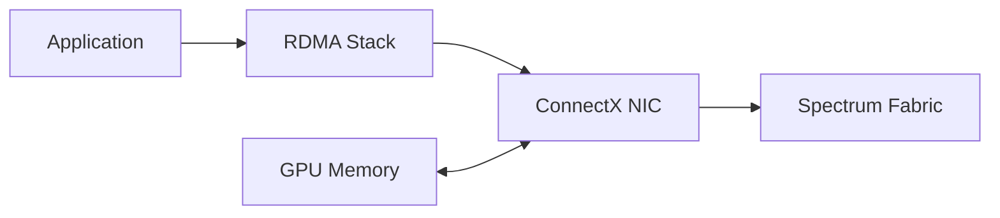

# ConnectX Ethernet Adapters

The network adapter is where host memory, GPU memory, PCIe, RDMA queues, Ethernet frames, congestion control, and firmware meet. ConnectX adapters can expose high-speed Ethernet, RoCE, hardware telemetry, and direct GPU data paths.

## Learning Objectives

Explain adapter queues and offloads, evaluate PCIe and NUMA placement, and operate firmware and congestion profiles as part of the fabric.

## Data Path

## Capabilities and Constraints

Adapters can perform DMA, checksum and segmentation offloads, RSS, virtualization, RoCE transport, ECN response, and telemetry. Exact features depend on model, firmware, driver, and configuration.

The host PCIe path must support the intended aggregate port rate. A dual-port adapter can be limited by one upstream PCIe link. NUMA and GPU locality determine whether traffic crosses CPU sockets.

| Validation area | Evidence |
|---|---|
| PCIe | negotiated generation/width and topology |
| Ethernet | port rate, FEC, MTU, errors |
| RoCE | GID, QP, RDMA tests |
| Congestion | ECN/PFC/DCQCN counters |
| GPU direct | peer path and library selection |
| Firmware | qualified and consistent version |

## Production Operations

Treat firmware, driver, switch software, and congestion settings as one release set. Preserve configuration before replacement. Monitor link errors, PCIe health, temperatures, queue behavior, congestion feedback, and RDMA failures.

Multi-port and multi-rail systems need explicit source-interface and GPU mapping. Hashing alone may not provide balanced GPU traffic.

## Troubleshooting

**Symptoms:** one port is unused, RoCE traffic falls back, or bandwidth is lower than line rate.

Check application interface selection, GID index, PCIe uplink, NUMA locality, port bonding or routing, switch queues, and firmware parity. Compare host-memory and GPU-memory tests.

## Customer Perspective

Adapter selection must match the platform’s PCIe capacity, desired rails, switch design, optics, and support matrix. Buying the fastest NIC does not fix an underprovisioned host or fabric.

## Interview Preparation

**Question:** Why might two active adapter ports not double throughput?

Traffic may use only one path, both ports may share PCIe capacity, the fabric may be oversubscribed, or the application may not create enough parallel flows.

## Key Takeaways

- ConnectX is an active RDMA and congestion-control endpoint.
- Host PCIe and NUMA topology constrain delivered rate.
- Firmware and switch profiles must be qualified together.
- Multi-rail requires deliberate workload mapping.

## Cross References

- [Spectrum Switches](./chapter-07-spectrum-switches-for-ai)
- [Next: BlueField and DOCA](./chapter-09-bluefield-dpus-and-doca)
