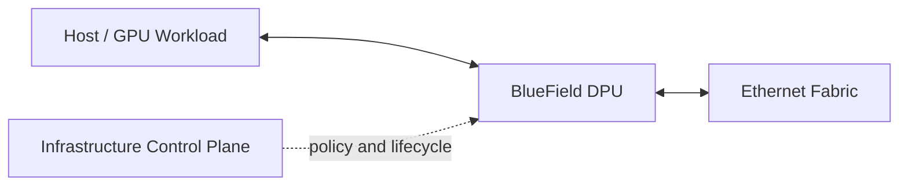

# BlueField DPUs and DOCA

A GPU node spends resources on networking, storage, security, telemetry, and virtualization. A Data Processing Unit (DPU) provides programmable infrastructure compute close to the network. BlueField combines network interfaces, embedded processing, memory, and acceleration engines. DOCA provides APIs and services for building and operating DPU-accelerated functions.

## Learning Objectives

Explain the DPU trust and data-plane boundary, distinguish offload from bypass, and evaluate operational and security trade-offs.

## Architecture

A DPU can terminate or steer network traffic, implement virtual switching, enforce policy, process storage protocols, and export telemetry. The exact function depends on mode and software.

## Why Offload

Offload can free host CPU, create a stronger isolation boundary, standardize services across servers, and move policy closer to ingress/egress. It also adds another operating system, firmware stack, control plane, and failure domain.

| Benefit | Trade-off |
|---|---|
| Host resource savings | Additional platform complexity |
| Infrastructure isolation | New patching and identity domain |
| Programmable data path | Requires DPU-specific skills |
| Consistent policy | Must integrate with cluster orchestration |
| Telemetry and acceleration | Troubleshooting spans host and DPU |

## DOCA

DOCA exposes libraries, services, and development frameworks for networking, security, storage, and acceleration use cases. Architecture should prefer supported packaged services where they meet requirements; custom DPU applications introduce software lifecycle and support obligations.

## Production Design

Define ownership for DPU firmware, embedded OS, credentials, certificates, policy, monitoring, and recovery. Ensure out-of-band access survives host failure. Validate how Kubernetes, virtualization, or bare-metal provisioning configures the DPU.

## Troubleshooting

**Symptoms:** host networking works partially, policy differs across nodes, or traffic disappears between host and switch.

Inspect host interface, DPU embedded state, virtual switch/representors, uplink, policy, and control-plane logs separately. A healthy physical uplink does not prove host-to-DPU forwarding.

## Customer Perspective

Recommend DPUs when offload, isolation, or infrastructure programmability provides measurable value. Do not add them only because the GPU platform supports them; complexity must be justified.

## Interview Preparation

**Question:** Does a DPU replace the NIC?

It includes NIC functionality but adds programmable infrastructure compute and accelerators. The operational model is closer to a managed infrastructure subsystem than a simple adapter.

## Key Takeaways

- BlueField creates a programmable infrastructure boundary at the server edge.
- Offload improves isolation or efficiency only when operated correctly.
- DOCA enables services and applications on the DPU.
- Host, DPU, and fabric must be troubleshot as separate layers.

## Cross References

- [ConnectX Ethernet Adapters](./chapter-08-connectx-ethernet-adapters)
- [Next: Validation and Capacity](./chapter-10-fabric-validation-and-capacity-planning)
