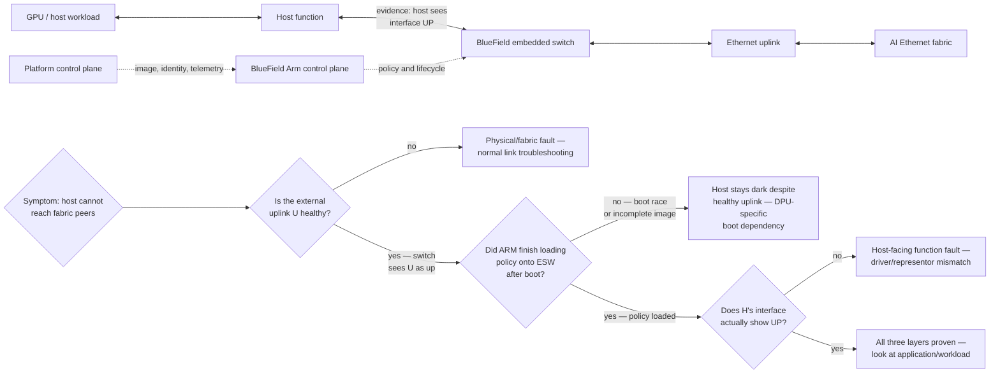
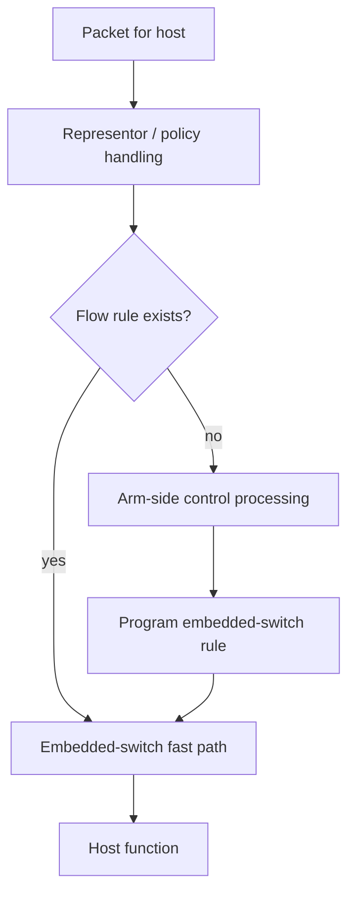
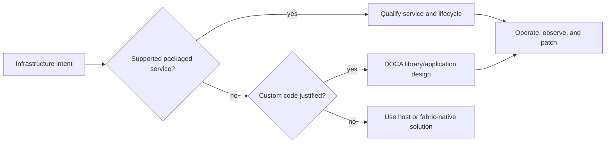

# BlueField DPUs and DOCA

## Introduction

GPU servers concentrate valuable compute and sensitive tenant workloads behind a network edge. Networking, virtual switching, storage services, policy enforcement, telemetry, and lifecycle management compete with the host’s application work. A Data Processing Unit (DPU) moves selected infrastructure responsibilities to a programmable device at that edge.

BlueField combines network interfaces with embedded Arm processing, memory, and hardware acceleration. NVIDIA DOCA is the software framework, libraries, tools, samples, applications, and services used to build and operate supported BlueField-accelerated functions. Neither name is a design outcome: a DPU should be selected only when its isolation, offload, or operational value exceeds the new control plane and failure-domain complexity.

| Chapter field | Value |
|---|---|
| Difficulty | Advanced |
| Estimated reading time | 60–75 minutes |
| Prerequisites | Chapters 07–08; Linux networking and infrastructure operations |
| Primary focus | Trust boundaries, traffic paths, lifecycle, and design trade-offs |

## Story: The Security Boundary That Became an Outage Boundary

A platform adopts DPUs to centralize host-edge policy and telemetry. During a maintenance event, a new DPU image reaches a subset of servers but its virtual-switch policy is incomplete. The physical uplink is healthy, yet host networking stays unavailable after boot. The incident team initially investigates the leaf switch because that is where packet loss would normally be found.

The actual failure is the control and data-path dependency introduced by the DPU. The corrected design adds a staged image rollout, DPU-specific health checks, out-of-band recovery, and a test that proves host connectivity only after policy is loaded. Infrastructure isolation is valuable, but it must be operated as a first-class platform.

## Learning Objectives

After this chapter, you can:

- describe the DPU as a distinct host-edge trust and operations domain;
- distinguish a control-plane slow path from a hardware-offloaded data-plane fast path;
- compare DPU ownership modes without making stale product assumptions;
- decide when packaged DOCA services are preferable to custom DPU software;
- design lifecycle, observability, and incident response for host, DPU, and fabric layers.

## Big Picture



**Figure 9.9.1 — A DPU inserts an independently managed infrastructure layer between a host and the fabric, and the diagram now encodes exactly the trap this chapter's story falls into.** A switch-side view of "uplink U is healthy" says nothing about whether the Arm control plane finished loading policy onto the embedded switch after boot — which is precisely why the incident team's instinct to investigate the leaf switch first was wrong. The decision path forces checking the DPU's own boot/policy state as a distinct layer before assuming a healthy uplink means a healthy host path.

## Why a DPU Exists

A DPU can host or accelerate infrastructure functions near ingress and egress: virtual switching and steering, policy enforcement, telemetry export, storage/network services, and workload isolation. The potential gains are reduced host CPU consumption, more consistent per-server infrastructure behavior, and a clearer administrative boundary. These gains are conditional on a well-defined operating model.

| Potential outcome | What must be true | New obligation |
|---|---|---|
| Host CPU is available for workloads | The selected function is truly offloaded and measured | Capacity and performance validation |
| Stronger host-edge control | DPU administration and identity are separately protected | Credentials, patching, recovery, audit |
| Consistent service deployment | Orchestration applies the same desired state | Versioning, drift detection, rollback |
| Richer telemetry | DPU and host evidence are correlated | Collector ownership and retention |
| Programmable path | A supported service or maintainable application exists | Software engineering and support lifecycle |

Do not describe a DPU as simply “a NIC with CPUs.” It has NIC functions, but its purpose in a DPU design is the managed infrastructure boundary and the extra platform responsibilities that come with it.

## Operating Modes and Traffic Paths

BlueField documentation describes DPU mode (also called Embedded CPU Function Ownership, or ECPF) as the default for BlueField **DPU SKUs**. In that mode the embedded Arm subsystem owns NIC resources and the embedded switch; host networking is managed through this DPU-controlled model. This default must not be generalized to BlueField **SuperNIC SKUs**, whose documented default is NIC mode. NVIDIA also documents restricted variants and mode constraints. Exact supported modes and transitions differ by SKU and release, so confirm the current product documentation before deployment.



**Figure 9.9.2 — Policy can be established through an Arm-side path, then implemented in the embedded switch for subsequent traffic.** This conceptual diagram does not imply that every deployment uses the same rule model.

In current NVIDIA documentation, DPU mode can use representors for an Arm-side path and embedded-switch rules for a fast path. Treat host availability during boot, representor behavior, and permitted host administration as design constraints, not incidental details.

**Illustrative annotated output — checking each of the three layers in Figure 9.9.1's decision path separately, the way the story's corrected incident process does:**

```text
# Layer 3: is the external uplink healthy from the switch's point of view?
$ (on leaf switch) show interface status swp14
swp14      up    100G   full   RoCE-compute   <- uplink is healthy — this is what misled the first responders

# Layer 2: did the DPU's Arm control plane finish loading policy after boot?
$ (on BlueField Arm, via out-of-band mgmt) systemctl status openvswitch-policy-load.service
● openvswitch-policy-load.service - Embedded switch policy load
     Loaded: loaded
     Active: failed (Result: exit-code) since 09:14:02 UTC   <- policy load FAILED during this boot
     Process: 812 ExecStart=/usr/bin/policy-load --profile prod (code=exited, status=1)

# Layer 1: does the host actually see a usable interface?
$ (on host) ip -br link show
enp1s0f0np0    DOWN   <mac>   <state DORMANT>       <- host-facing function never came up
```

This is the exact evidence chain that separates "the leaf switch is fine" from "the host has no network" — the uplink (`swp14 up`) told the first responders nothing was wrong at the layer they knew how to check, while the actual fault was one layer inward: the Arm-side policy-load service failing during this specific boot, which left the host-facing representor without the rules it needed to bring the interface up. Checking only the switch, or only the host, would each individually suggest "everything looks fine but the host" or "everything looks fine but the switch" — only checking the DPU's own control-plane service state reveals the actual failed component.

### Trust and administration

In a DPU-controlled model, the platform administrator manages a distinct system with its own firmware, embedded OS, network reachability, credentials, certificates, software inventory, and logs. This can limit a host administrator’s ability to change the data path, which may be intentional. It also means an incident can involve three independently observable layers:

1. host workload and host-facing interface;
2. DPU Arm control plane and embedded switch;
3. external Ethernet uplink and fabric.

An out-of-band recovery path should continue to work when the host OS, host network function, or DPU service path is impaired.

## DOCA: Framework, Not a Feature Toggle

DOCA provides software infrastructure for BlueField platforms and, in current NVIDIA documentation, includes SDK libraries, drivers, tools, samples, applications, and containerized services. DOCA APIs and deployment artifacts are release-specific. A sample demonstrates an API or component; it is not automatically a supported production service or an operational design.



### Select the smallest sustainable option

| Option | Best fit | Trade-off |
|---|---|---|
| Supported DOCA service | A documented use case matching the required outcome | Still needs version, security, and operations qualification |
| DOCA reference application/sample | Evaluation or learning | Not a production support commitment by itself |
| Custom DOCA application | A differentiated requirement with long-term ownership | Test, security, release, and support burden |
| Host/fabric-native implementation | DPU adds no measurable value | May retain host CPU or a weaker edge boundary |

The architecture review should name the service owner, desired-state controller, secrets and certificate authority, upgrade policy, telemetry destination, rollback path, and escalation boundary before custom development begins.

## Production Design Pattern

### Separate desired state from device state

Keep DPU image, firmware, mode, embedded-switch policy, host driver compatibility, network addresses, certificates, and service configuration in a controlled inventory. Observe actual state independently. A green orchestration task does not prove host-to-fabric forwarding.

### Change and recovery sequence

1. Qualify a release set: DPU firmware/image, DOCA components, host driver, switch/NOS profile, and the selected service.
2. Capture baseline data-plane behavior, host/DPU/fabric telemetry, and rollback artifacts.
3. Canary a representative hardware and workload group.
4. Verify DPU readiness, host-facing function, external uplink, policy enforcement, and application traffic separately.
5. Expand in batches only after comparing workload and failure-path evidence with baseline.
6. Preserve a documented out-of-band recovery and image rollback procedure.

### Security and reliability questions

- Who can log into, reimage, reset, or change the DPU mode?
- Where are DPU credentials, certificates, and audit records managed?
- What is the consequence if policy does not load during boot?
- Can the affected host be diagnosed and recovered without relying on its data network?
- How are DPU vulnerabilities patched without an unplanned cluster outage?
- Which workloads fail closed, fail open, or must be explicitly fenced?

The answers are architecture requirements, not post-deployment documentation.

## Observability

Correlate host, DPU, and switch records using stable identifiers: server, DPU, host interface, representor/function, uplink, switch port, rail, image version, and policy revision. Capture change time and timezone consistently.

| Layer | Minimum evidence |
|---|---|
| Host | interface state, route/address, driver log, application symptom |
| DPU control plane | image/firmware, service health, policy revision, authentication and lifecycle logs |
| DPU data plane | embedded-switch/representor state, steering/policy counters where available |
| Fabric | peer port state, errors, drops, QoS and congestion deltas |
| Platform | deployment event, desired-state revision, owner, rollback record |

The monitoring goal is a traceable failure boundary: “host cannot reach DPU function after policy revision X” is actionable; “the node network is broken” is not.

## Troubleshooting

### Scenario 1 — Physical uplink is healthy, host traffic is absent

**Symptoms:** the switch sees the DPU uplink as healthy, while the host cannot reach required peers after a reboot or update.

**Diagnosis:** verify the host-facing function, DPU control-plane readiness, embedded-switch/representor state, policy revision, and external uplink as separate checkpoints. Compare the DPU image and policy with a healthy node. Do not infer host forwarding from uplink state.

**Evidence in practice — this is the exact three-layer capture from the "Trust and administration" section above:** `swp14 up` at the leaf switch, `openvswitch-policy-load.service` showing `Active: failed` on the DPU's Arm side, and `enp1s0f0np0 DOWN` on the host. The middle layer is the divergent one — comparing this DPU's policy-load service status against a healthy node's (`Active: active (exited)`, load succeeded) is what actually localizes the fault, not re-checking the uplink a second time or assuming a host driver problem.

**Resolution:** restore the approved DPU policy or image via the documented recovery path, then validate host-to-fabric traffic and the workload separately — confirming both `openvswitch-policy-load.service` reports success and `enp1s0f0np0` comes up before considering the node ready.

**Prevention:** gate node readiness on host connectivity and policy verification, not only DPU boot completion.

### Scenario 2 — Policy differs between otherwise identical servers

**Symptoms:** a subset of hosts has unexpected reachability or performance; broad fabric counters look normal.

**Diagnosis:** compare desired state and actual DPU mode, image, embedded-switch rules, certificates, and service revisions. Correlate the first divergence with deployment events.

**Evidence in practice:**

```text
$ for h in node07 node08 node09; do echo "== $h =="; ssh $h-bmc "cat /etc/dpu-image-version"; done
== node07 ==
dpu-image-24.10-prod-3
== node08 ==
dpu-image-24.10-prod-3
== node09 ==
dpu-image-24.07-prod-1        <- older image, missed the last rollout

$ ssh node09-bmc "journalctl -u dpu-agent --since '-7 days' | grep -i 'deploy\|reconcile'"
Aug 01 03:12:04 node09-dpu dpu-agent: reconcile failed: image pull timeout, retrying with backoff
Aug 01 03:45:11 node09-dpu dpu-agent: reconcile abandoned after 5 retries
```

Comparing image versions across three "identical" servers immediately isolates `node09` as the divergent one, and the DPU agent's own log shows exactly why: an image pull that timed out repeatedly during the original rollout and was silently abandoned after retries, rather than escalated. The node kept running its previous image the whole time — which is why fabric-wide counters look normal (this node was never disconnected, just running stale policy).

**Resolution:** reconcile the node through the controlled deployment mechanism instead of making an undocumented local change. Verify the revision and data path afterward — confirm `dpu-image-version` matches the fleet and the reconcile log shows a clean success, not just that reachability returned.

**Prevention:** use immutable release artifacts, inventory reconciliation, and canary rollout with drift alerts.

### Scenario 3 — A DPU service consumes resources or increases latency

**Diagnosis:** establish whether traffic is on the intended hardware fast path, inspect DPU CPU/memory and service telemetry, then compare a controlled baseline with the same workload. Confirm the service’s supported configuration rather than tuning blindly.

**Resolution:** correct policy/steering, scale or constrain the service, roll back, or choose a different implementation if the requirement cannot be met sustainably.

## Customer Architecture Discussion

Recommend a BlueField DPU only when at least one required infrastructure function has a stated measurable outcome—such as a host CPU budget, an enforced host-edge isolation boundary, or a per-node service policy that must remain independent of tenant-host administration—and an identified owner can operate the DPU image, identity, monitoring, patching, and recovery. If neither a measurable requirement nor that operational ownership exists, retain the host/fabric-native design rather than adding a DPU.

Frame the decision in service outcomes: isolation boundary, host CPU budget, failure behavior, upgrade cadence, and evidence required for incidents. Avoid promising a performance improvement without a workload baseline and a defined offload path.

## Interview Preparation

**1. How is a BlueField DPU operationally different from a conventional NIC?**

"A conventional NIC is a single trust and administration domain — whoever administers the host administers the NIC's behavior. A DPU in its default DPU-SKU mode is a genuinely separate managed system: its own firmware, its own embedded OS, its own credentials and certificates, its own software lifecycle, sitting between the host and the fabric. That means an incident can have three independently observable layers instead of two — host, DPU control plane, and external uplink — and I've seen a host-facing interface stay dark after a reboot purely because the DPU's own policy-load service failed, while the external uplink and the host's own OS were both completely healthy. That third layer is the operational difference, not the packet-forwarding hardware itself."

**2. What distinguishes an Arm-side control path from an embedded-switch fast path?**

"The embedded switch is the hardware forwarding path — once a flow rule exists, packets matching it get switched at hardware speed with no CPU involvement. The Arm-side path is what handles a packet when no matching rule exists yet, or when policy needs to be established or changed — it runs on the DPU's embedded CPU cores, which is orders of magnitude slower per packet than the hardware fast path. The operational implication is that 'the fast path is hardware-offloaded' doesn't mean the DPU is out of the critical path entirely — the Arm side still owns programming that fast path in the first place, and if it can't do that job during boot, the fast path never gets populated no matter how fast it would be once it is."

**3. Why can a healthy DPU uplink coexist with failed host networking?**

"Because the uplink being healthy only tells you the DPU can talk to the external fabric — it says nothing about whether the DPU's Arm control plane finished setting up the host-facing side of the embedded switch. I've walked through exactly this: the leaf switch showed the DPU's uplink port up and error-free, while the host's own interface was `DOWN`/`DORMANT`, and the actual root cause, found by checking the DPU's own policy-load service, was a failed policy load during that specific boot. Three layers, three separate health checks — an uplink being up only proves one of them."

**4. When should a team use a packaged DOCA service instead of custom software?**

"Whenever a supported, documented DOCA service already matches the required outcome — because a packaged service comes with a defined support and patching lifecycle that custom code doesn't. I'd reach for custom DOCA development only when there's a genuinely differentiated requirement that no packaged option covers, and even then only with the understanding that we're now signing up for the full software lifecycle ourselves — testing, security patching, release management, on-call support — on top of whatever the DPU itself already requires. And I'd be explicit that a DOCA sample or reference application is a starting point for evaluation, not something I'd hand to production without that lifecycle in place."

**5. What must be in a DPU change rollback plan?**

"A documented out-of-band recovery path that works even when the host OS, the DPU's own service path, or the primary network is impaired — because that's usually exactly the situation a DPU change goes wrong in. Immutable, versioned image and policy artifacts I can revert to atomically, not incremental hand-edits. A tested procedure — actually exercised in a non-production environment, not just written down — and clear health gates that verify all three layers (host interface, DPU control-plane service state, external uplink) independently before declaring a node ready again. The BlueField story earlier in this chapter is the cautionary example: without a staged rollout and a tested out-of-band path, an incomplete policy push during routine maintenance turned into hosts unreachable after boot, with the team initially looking in the wrong place."

## Architecture Summary

BlueField can establish a programmable, independently managed infrastructure boundary at the server edge. DOCA supplies the software framework and deployment building blocks for supported services and applications. The benefit is conditional: the DPU, host, and fabric must be designed, monitored, secured, upgraded, and troubleshot as separate but connected layers.

## Key Takeaways

- Distinguish DPU-SKU default DPU mode from SuperNIC-SKU default NIC mode; validate the exact SKU and release.
- Adopt a DPU only for a measurable infrastructure requirement with named lifecycle ownership.
- Separate Arm-side control behavior, embedded-switch fast paths, host functions, and external fabric evidence.
- Prefer a supported packaged service when it meets the requirement; custom DOCA software carries a full product lifecycle.

## Quick Revision Sheet

- A DPU adds a trust boundary and an operations boundary.
- DPU mode ownership, host boot dependency, and data paths must be validated on the exact release.
- A hardware fast path still needs control-plane policy and observability.
- DOCA samples are not automatic production designs.
- Out-of-band recovery is mandatory for a managed host-edge layer.

## Lab Checklist

- [ ] Record DPU SKU, mode, firmware/image, host driver, service, and policy revision.
- [ ] Validate host-to-DPU and DPU-to-fabric paths independently.
- [ ] Capture DPU, host, and switch evidence for a healthy workload run.
- [ ] Test the documented rollback/recovery procedure in a safe environment.

## Cross References

- Previous: [ConnectX Ethernet Adapters](./chapter-08-connectx-ethernet-adapters)
- Next: [Fabric Validation and Capacity Planning](./chapter-10-fabric-validation-and-capacity-planning)
- Related: [Production Troubleshooting](./chapter-11-production-troubleshooting)

## Further Reading

- [NVIDIA BlueField modes of operation](https://docs.nvidia.com/doca/sdk/bluefield-modes-of-operation.pdf)
- [NVIDIA DOCA overview](https://docs.nvidia.com/doca/sdk/doca-overview.pdf)
- [NVIDIA DOCA programming guide](https://docs.nvidia.com/doca/sdk/doca-programming-guide/)
