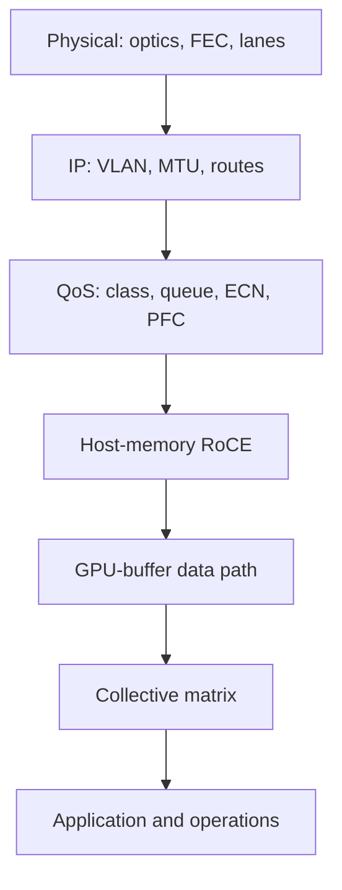
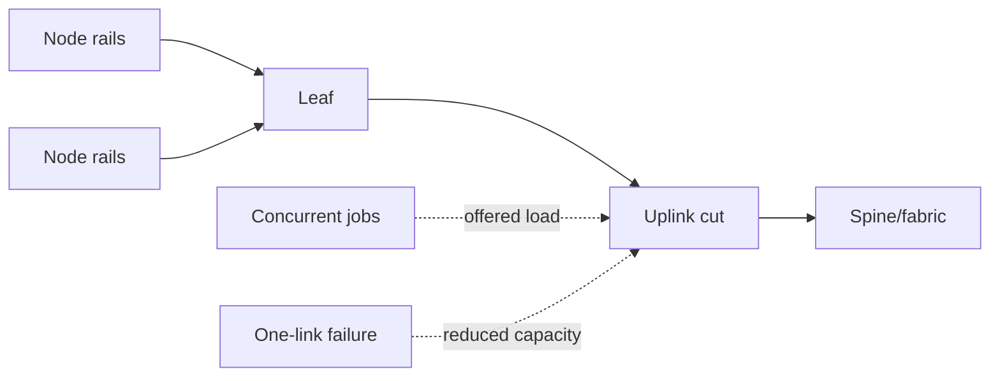
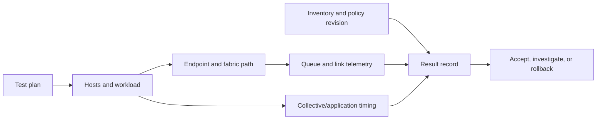

# Fabric Validation and Capacity Planning

The first deployment mistake is accepting an AI fabric because every link is up. The second is planning it from average utilization. A distributed workload exercises queues, paths, endpoints, collectives, and failure states together; acceptance must prove each layer and then prove their interaction under representative demand.

| Chapter field | Value |
|---|---|
| Difficulty | Advanced |
| Estimated reading time | 50–60 minutes |
| Primary focus | Evidence-based qualification and degraded-state capacity |
| Prerequisites | Chapters 03–06 and GPU-networking validation from Volume 07 |

## Learning Objectives

After this chapter, you can build a layered validation plan, explain oversubscription in terms of an actual traffic cut, define environment-scoped acceptance baselines, and plan capacity for concurrent jobs and component failures.

## Story: The Rack That Passed Commissioning

A new GPU rack passes optics, ping, and a short RDMA test. Its first all-to-all job is inconsistent. The hidden difference is not line rate: an uplink cut is shared by concurrent jobs, ECMP distribution is uneven for the test, and the original acceptance plan never recorded queue or application-tail behavior. The repair is a validation ladder and a capacity model that contains workload concurrency and a defined failure state.

## Validation Is a Ladder

**Figure 9.10.1 — Each stage reduces uncertainty before the next adds complexity.** A successful application run is not a substitute for the lower evidence.

| Stage | Question | Minimum evidence |
|---|---|---|
| Physical | Is the link healthy at intended capability? | peer map, negotiated state, FEC/error deltas |
| IP | Does the intended routed packet path work? | address, MTU, route/neighbor, path evidence |
| QoS | Does marked RoCE reach the expected queue? | mapping export, queue/ECN/PFC deltas |
| RoCE | Can endpoints complete an approved RDMA test? | endpoint errors, counters, result and versions |
| GPU path | Is the intended GPU-to-NIC path in use? | topology, affinity, approved GPU-buffer test |
| Collectives | Does concurrency use the fabric predictably? | operation/size/rank matrix and tail metrics |
| Operations | Can humans detect and recover failure? | dashboards, runbooks, rollback and drill evidence |

Do not invent universal performance pass numbers. Establish approved ranges for a specific node design, topology, software/firmware set, operation, message range, and load. The baseline is a release artifact, not a screenshot.

## Model Capacity at the Bottleneck Cut

For each traffic pattern, identify the links that separate active sources from their destinations. Compare demand traversing that cut with usable capacity, then repeat after the failure you claim to tolerate. A leaf with many downlinks is not automatically oversubscribed; the answer depends on which endpoints communicate, how many jobs overlap, and what traffic leaves the rack.

| Input | Planning question |
|---|---|
| Endpoint rails | How much can a node inject concurrently? |
| Topology and uplinks | Which cut carries remote traffic? |
| Workload pattern | AllReduce, all-to-all, checkpoint, or inference fan-out? |
| Locality | How much remains within a leaf/rack? |
| Job concurrency | Which peaks overlap in time? |
| Failure target | What remains after an uplink, spine, or maintenance loss? |
| Growth | Which tier reaches its limit first? |

Oversubscription is a design trade-off, not an automatic defect. It is acceptable only when the workload and failure policy tolerate the resulting contention. State the denominator: theoretical port capacity, usable post-failure capacity, or measured workload throughput are not interchangeable.

## Acceptance and Change Control

An acceptance record should include topology and cabling identity, intended port rate/FEC/MTU, host and switch releases, QoS policy revision, test commands and raw results, counter deltas, workload profile, and known limitations. Capture healthy and intentionally degraded baselines. That makes later regressions diagnosable rather than anecdotal.

Use a canary process for new node, NIC, switch, or profile releases:

1. compare inventory and configuration to the approved design;
2. run the ladder from physical through collective tests;
3. run representative concurrent traffic and one safe failure condition;
4. compare application tail, ECN/PFC, queue, error, and utilization evidence with baseline;
5. promote only after an owner accepts deviations; retain rollback artifacts.

## Capacity, Reliability, and Cost

Full bisection bandwidth, spare paths, and unused headroom cost capital and ports. They also reduce the probability that an upgrade, a hot destination, or a concurrent checkpoint becomes an application outage. Admission control, topology-aware scheduling, and maintenance windows can reduce required peak capacity, but they add platform complexity and must be explicit in the service objective.

Never plan to 100% average utilization. Queues absorb bursts, failures remove paths, and synchronized collectives can generate demand that averages conceal. Monitor headroom, not just utilization: post-failure cut capacity, queue occupancy, ECN/PFC trends, and job placement are operational capacity signals.

## Data Flow and Measurement Design

The validation data path runs in both directions. A scheduler or test controller selects hosts and a workload shape. Endpoints inject traffic through the intended NIC and rail; switches expose queue, marking, pause, utilization, and error deltas; the application exposes operation time and rank skew. Inventory and configuration revisions supply the context needed to decide whether two runs are comparable.

Do not accept a result that cannot be reproduced. For every test, preserve its hypothesis, source and destination identities, traffic pattern, duration, warm-up behavior, concurrency, raw output, counter windows, and limitation. A result measured on an empty fabric answers a component-capability question; it does not establish shared-production behavior.

## Production Trade-offs

| Decision | Benefit | Cost or risk | Required control |
|---|---|---|---|
| Full-bisection topology | Predictable remote capacity | Ports, optics, power, and space | Failure and growth model |
| Measured oversubscription | Lower initial cost | Hot cuts during concurrent jobs | Admission, placement, and degradation objective |
| Larger validation matrix | Better failure discovery | Time and hardware reservation | Automate repeatable layers |
| Aggressive canary rollout | Faster expansion | Wider exposure to hidden regression | Promotion gates and rollback |
| Synthetic-only acceptance | Simple to execute | Misses workload behavior | Add collective and application evidence |

## Troubleshooting Scenarios

### Pairwise RoCE is healthy; collectives are not

Compare rank mapping, GPU/NIC locality, route distribution, rail balance, concurrency, and queue/ECN/PFC evidence. Pairwise tests prove one path; collectives exercise many paths and synchronization.

### A new rack passes idle tests but degrades shared production

Run the same workload matrix with concurrent jobs and inspect the leaf-to-spine cut, queue occupancy, and job placement. The likely correction is capacity, placement, or policy consistency—not a larger single-test result.

### One failure consumes all performance margin

Verify the actual failed-state route and available cut capacity, then either revise the resilience claim, add path capacity, or use admission control during maintenance. Do not hide the condition by changing the acceptance workload.

### A release passes microbenchmarks but regresses application tail

**Evidence:** pairwise throughput is within its baseline; application iteration percentiles widen; queue and ECN counters increase only during concurrent jobs.

**Diagnosis:** compare rank placement, job concurrency, actual traffic mix, and policy revision with the baseline. The release may be valid at the component layer while a change in path selection or workload interaction exposes a shared cut.

**Resolution and verification:** restrict rollout, restore the known-good release or placement, then rerun the exact collective/application matrix. Promote only after both median and tail behavior return to the agreed range.

## Customer Architecture Discussion

Present normal and degraded-state behavior separately. A customer may consciously buy a cost-optimized oversubscribed design for a workload with locality and scheduling controls, while another requires predictable remote collective performance after a failure. Both are valid choices when assumptions, evidence, and operational controls are documented.

## Interview Preparation

1. Why does a port-speed inventory not constitute a capacity model?
2. What evidence would you require before accepting a new AI rack?
3. How do you test a claimed N-1 capacity objective without endangering production?

## Key Takeaways

- Validate from physical links through the real application, retaining evidence at every layer.
- Model the traffic cut, concurrency, locality, and failure state—not only aggregate port totals.
- Baselines are release- and topology-specific.
- Capacity, scheduling, and operational response form one production design.

## Quick Revision Sheet

| Term | Remember |
|---|---|
| Validation ladder | Ordered evidence from component to workload |
| Bottleneck cut | Links separating offered demand from destination capacity |
| Baseline | Comparable result tied to topology, workload, and versions |
| N-1 state | Capacity and behavior after one defined component/path loss |

## Interview and Lab Materials

**Whiteboard prompt:** draw two leaves with a shared spine cut. Add two concurrent jobs, then remove one uplink. Identify the measurements required before claiming the design meets its objective.

**Customer prompt:** which degradation is acceptable during maintenance: reduced job concurrency, reduced performance, or no new jobs? The answer determines the capacity and scheduler design.

**Lab checklist:**

- [ ] Build an inventory-backed path map for one representative job.
- [ ] Run a physical-to-collective validation ladder and retain raw evidence.
- [ ] Add concurrent traffic and compare queue/tail metrics with the idle baseline.
- [ ] Safely simulate one agreed failure in a nonproduction environment.
- [ ] Document the acceptance range, owner, and rollback decision.

## Further Reading

- [NVIDIA Cumulus Linux QoS documentation](https://docs.nvidia.com/networking-ethernet-software/cumulus-linux-57/Layer-1-and-Switch-Ports/Quality-of-Service/)
- [Volume 07 performance benchmarking](../../volume-07/chapter-10-performance-bottlenecks-and-benchmarking)

## Cross References

- [Data Center Bridging and QoS](./chapter-06-data-center-bridging-and-qos)
- [BlueField DPUs and DOCA](./chapter-09-bluefield-dpus-and-doca)
- [Production Ethernet AI Troubleshooting](./chapter-11-production-troubleshooting)
