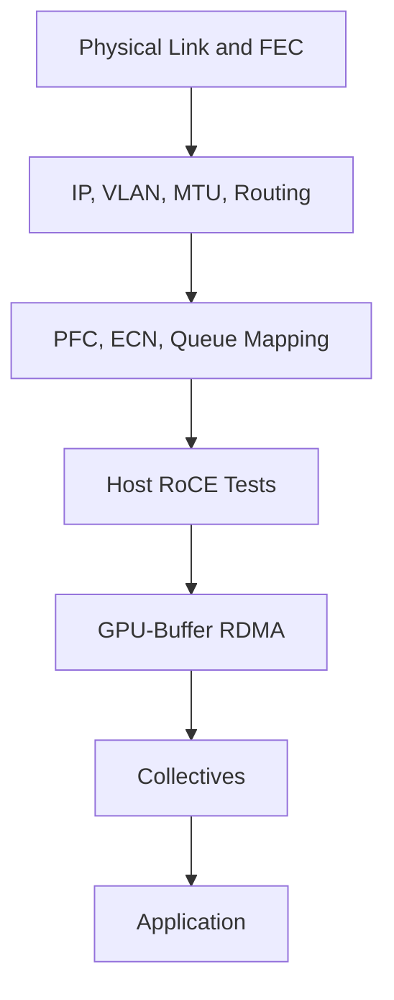

# Fabric Validation and Capacity Planning

An Ethernet AI fabric must be validated under the traffic it will carry, not only with link checks. Capacity planning combines endpoint demand, topology, oversubscription, queue behavior, failure states, and workload concurrency.

## Learning Objectives

Build a test ladder, calculate effective oversubscription, define acceptance ranges, and model growth and failure capacity.

## Validation Ladder

Each stage should pass before the next. Collect endpoint and switch counters with every run.

## Capacity Model

Estimate offered traffic by workload, job size, and concurrency. Compare endpoint-facing bandwidth with leaf uplinks and spine capacity. Repeat for one-link, one-switch, and maintenance states.

| Input | Example question |
|---|---|
| Node rail capacity | How much can one server inject? |
| Active job count | How many nodes peak together? |
| Traffic locality | Same-rack or cross-rack? |
| Collective pattern | All-reduce, all-gather, point-to-point? |
| Failure state | What capacity remains after an uplink loss? |
| Growth | Which tier reaches exhaustion first? |

## Acceptance Criteria

- expected port rate, FEC, and MTU;
- consistent QoS and congestion profiles;
- no unexplained drops or sustained pause;
- ECN feedback produces stable sender response;
- RDMA and GPU RDMA within defined ranges;
- collective scaling meets workload objectives;
- telemetry and runbooks are operational.

## Production Planning

Reserve capacity for maintenance and bursts. A fabric designed to 100% average utilization has no resilience. Use workload admission or topology-aware scheduling when aggregate demand can exceed capacity.

Preserve baselines by rack, node type, NIC generation, and software release. New hardware should enter service only after comparison with an equivalent healthy group.

## Troubleshooting

If collectives are poor but GPU RDMA is healthy, inspect ECMP distribution, incast, queue behavior, and rank placement. If host RDMA is poor, return to physical, IP, and QoS layers.

## Customer Perspective

Capacity is a business choice. Full bisection costs more; measured oversubscription may be appropriate. Present performance during normal and degraded operation, not only the best case.

## Interview Preparation

**Question:** How do you accept a new AI Ethernet rack?

Cover physical inventory, configuration drift, link/FEC, routing, PFC/ECN, RDMA, GPU direct, collectives, telemetry, failover, and documented ranges.

## Key Takeaways

- Validate in layers from link to application.
- Capacity planning must include concurrency and failure states.
- Queue health and congestion response belong in acceptance.
- Baselines are scoped by topology and software release.

## Cross References

- [BlueField and DOCA](./chapter-09-bluefield-dpus-and-doca)
- [Next: Production Troubleshooting](./chapter-11-production-troubleshooting)
