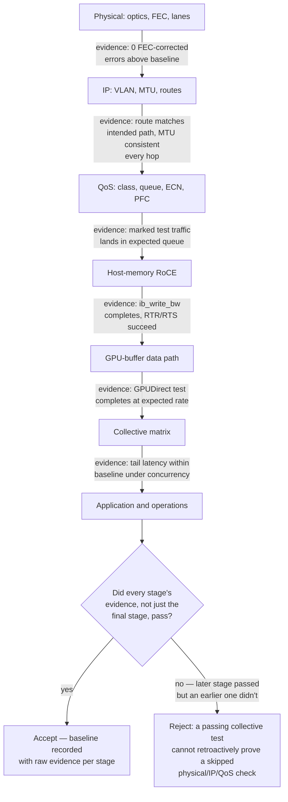
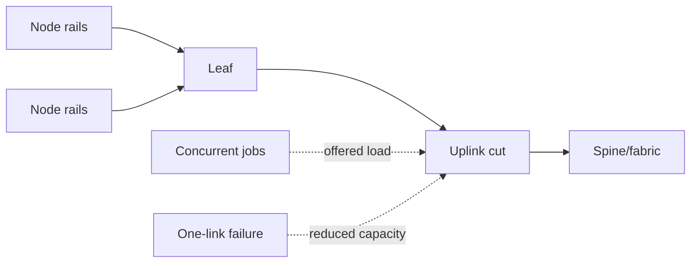
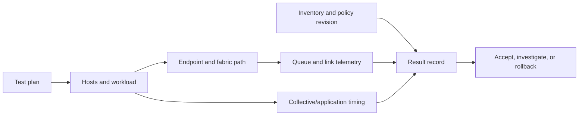

# Fabric Validation and Capacity Planning

The first deployment mistake is accepting an AI fabric because every link is up. The second is planning it from average utilization. A distributed workload exercises queues, paths, endpoints, collectives, and failure states together; acceptance must prove each layer and then prove their interaction under representative demand.

| Chapter field | Value |
|---|---|
| Difficulty | Advanced |
| Estimated reading time | 50–60 minutes |
| Primary focus | Evidence-based qualification and degraded-state capacity |
| Prerequisites | Chapters 03–06 and GPU-networking validation from Volume 07 |

## Learning Objectives

After this chapter, you can build a layered validation plan, explain oversubscription in terms of an actual traffic cut, define environment-scoped acceptance baselines, and plan capacity for concurrent jobs and component failures.

## Story: The Rack That Passed Commissioning

A new GPU rack passes optics, ping, and a short RDMA test. Its first all-to-all job is inconsistent. The hidden difference is not line rate: an uplink cut is shared by concurrent jobs, ECMP distribution is uneven for the test, and the original acceptance plan never recorded queue or application-tail behavior. The repair is a validation ladder and a capacity model that contains workload concurrency and a defined failure state.

## Validation Is a Ladder



**Figure 9.10.1 — Each stage reduces uncertainty before the next adds complexity, and the diagram now makes explicit the trap this chapter's story fell into: a passing later stage is not proof of an earlier one.** The rack in the opening story passed optics, ping, and a short RDMA test — stages P, I, and a thin slice of R — but nobody captured queue evidence at stage Q or ran the collective matrix at realistic concurrency, so the first all-to-all job under real load was effectively the first time stages C and A were tested at all. The `PASS` decision node is the acceptance discipline: every stage needs its own retained evidence, not just the last one that happened to succeed.

| Stage | Question | Minimum evidence |
|---|---|---|
| Physical | Is the link healthy at intended capability? | peer map, negotiated state, FEC/error deltas |
| IP | Does the intended routed packet path work? | address, MTU, route/neighbor, path evidence |
| QoS | Does marked RoCE reach the expected queue? | mapping export, queue/ECN/PFC deltas |
| RoCE | Can endpoints complete an approved RDMA test? | endpoint errors, counters, result and versions |
| GPU path | Is the intended GPU-to-NIC path in use? | topology, affinity, approved GPU-buffer test |
| Collectives | Does concurrency use the fabric predictably? | operation/size/rank matrix and tail metrics |
| Operations | Can humans detect and recover failure? | dashboards, runbooks, rollback and drill evidence |

Do not invent universal performance pass numbers. Establish approved ranges for a specific node design, topology, software/firmware set, operation, message range, and load. The baseline is a release artifact, not a screenshot.

## Model Capacity at the Bottleneck Cut

For each traffic pattern, identify the links that separate active sources from their destinations. Compare demand traversing that cut with usable capacity, then repeat after the failure you claim to tolerate. A leaf with many downlinks is not automatically oversubscribed; the answer depends on which endpoints communicate, how many jobs overlap, and what traffic leaves the rack.

| Input | Planning question |
|---|---|
| Endpoint rails | How much can a node inject concurrently? |
| Topology and uplinks | Which cut carries remote traffic? |
| Workload pattern | AllReduce, all-to-all, checkpoint, or inference fan-out? |
| Locality | How much remains within a leaf/rack? |
| Job concurrency | Which peaks overlap in time? |
| Failure target | What remains after an uplink, spine, or maintenance loss? |
| Growth | Which tier reaches its limit first? |

Oversubscription is a design trade-off, not an automatic defect. It is acceptable only when the workload and failure policy tolerate the resulting contention. State the denominator: theoretical port capacity, usable post-failure capacity, or measured workload throughput are not interchangeable.

**A worked capacity calculation — the arithmetic behind "state the denominator," with illustrative but representative numbers:**

A rack of 16 GPU nodes, each with 2×400Gb RoCE rails (800Gb/node injection capacity), connects to a leaf switch with 8×400Gb uplinks to the spine.

```text
Downlink demand (worst case, all nodes injecting at once):
  16 nodes × 800 Gb/s  = 12,800 Gb/s

Uplink capacity (normal state):
  8 × 400 Gb/s          = 3,200 Gb/s

Oversubscription ratio (normal state):
  12,800 / 3,200 = 4:1

Uplink capacity (N-1: one uplink drained for maintenance):
  7 × 400 Gb/s           = 2,800 Gb/s

Oversubscription ratio (degraded state):
  12,800 / 2,800 ≈ 4.57:1
```

A 4:1 downlink-to-uplink ratio is not automatically a defect — it's fine if the workload's actual traffic pattern rarely has all 16 nodes injecting toward off-rack destinations simultaneously (heavy intra-rack locality, staggered checkpoint writes, etc.). But it is a number that has to be stated and tested against the real collective pattern, not left implicit — a training job whose all-reduce genuinely saturates all rails toward off-rack peers at once will queue heavily at this leaf regardless of how "fast" the spine is. The N-1 recalculation (4.57:1) is the number that answers "what's the capacity impact of one planned uplink drain" — it is not a dramatically different ratio here, which is itself useful evidence that this design tolerates single-uplink maintenance without a large capacity cliff.



## Acceptance and Change Control

An acceptance record should include topology and cabling identity, intended port rate/FEC/MTU, host and switch releases, QoS policy revision, test commands and raw results, counter deltas, workload profile, and known limitations. Capture healthy and intentionally degraded baselines. That makes later regressions diagnosable rather than anecdotal.

Use a canary process for new node, NIC, switch, or profile releases:

1. compare inventory and configuration to the approved design;
2. run the ladder from physical through collective tests;
3. run representative concurrent traffic and one safe failure condition;
4. compare application tail, ECN/PFC, queue, error, and utilization evidence with baseline;
5. promote only after an owner accepts deviations; retain rollback artifacts.

## Capacity, Reliability, and Cost

Full bisection bandwidth, spare paths, and unused headroom cost capital and ports. They also reduce the probability that an upgrade, a hot destination, or a concurrent checkpoint becomes an application outage. Admission control, topology-aware scheduling, and maintenance windows can reduce required peak capacity, but they add platform complexity and must be explicit in the service objective.

Never plan to 100% average utilization. Queues absorb bursts, failures remove paths, and synchronized collectives can generate demand that averages conceal. Monitor headroom, not just utilization: post-failure cut capacity, queue occupancy, ECN/PFC trends, and job placement are operational capacity signals.

## Data Flow and Measurement Design

The validation data path runs in both directions. A scheduler or test controller selects hosts and a workload shape. Endpoints inject traffic through the intended NIC and rail; switches expose queue, marking, pause, utilization, and error deltas; the application exposes operation time and rank skew. Inventory and configuration revisions supply the context needed to decide whether two runs are comparable.



Do not accept a result that cannot be reproduced. For every test, preserve its hypothesis, source and destination identities, traffic pattern, duration, warm-up behavior, concurrency, raw output, counter windows, and limitation. A result measured on an empty fabric answers a component-capability question; it does not establish shared-production behavior.

## Production Trade-offs

| Decision | Benefit | Cost or risk | Required control |
|---|---|---|---|
| Full-bisection topology | Predictable remote capacity | Ports, optics, power, and space | Failure and growth model |
| Measured oversubscription | Lower initial cost | Hot cuts during concurrent jobs | Admission, placement, and degradation objective |
| Larger validation matrix | Better failure discovery | Time and hardware reservation | Automate repeatable layers |
| Aggressive canary rollout | Faster expansion | Wider exposure to hidden regression | Promotion gates and rollback |
| Synthetic-only acceptance | Simple to execute | Misses workload behavior | Add collective and application evidence |

## Troubleshooting Scenarios

### Pairwise RoCE is healthy; collectives are not

Compare rank mapping, GPU/NIC locality, route distribution, rail balance, concurrency, and queue/ECN/PFC evidence. Pairwise tests prove one path; collectives exercise many paths and synchronization.

**Evidence in practice:**

```text
$ ib_write_bw -d mlx5_0 <peer-ip> --report_gbits
  BW average: 392.11 Gb/s        <- pairwise: essentially line rate, looks perfect

$ (during 16-rank all-reduce) ethtool -S swp9 | egrep "rx_ecn_marked_prio3|rx_pfc_prio3"
     rx_ecn_marked_prio3:     288400
     rx_pfc_prio3:            61200    <- heavy pause activity that the pairwise test never touched
```

The pairwise result (392 Gb/s on a 400Gb link) genuinely proves the point-to-point path is healthy — that's real, useful evidence, just narrow. It exercises exactly one source, one destination, one path. The collective's 16 ranks converging on shared leaf/spine cuts simultaneously is a completely different traffic shape, and the PFC activity during the collective run shows a queue under real pressure that the pairwise test had no way to expose, because it never created concurrent demand on a shared egress.

### A new rack passes idle tests but degrades shared production

Run the same workload matrix with concurrent jobs and inspect the leaf-to-spine cut, queue occupancy, and job placement. The likely correction is capacity, placement, or policy consistency—not a larger single-test result.

**Evidence in practice:**

```text
$ show what-just-happened drop-reason all | grep -i tail    # new rack's leaf, idle acceptance test
Tail drop (queue full)       -            -               0     -

$ show what-just-happened drop-reason all | grep -i tail    # same leaf, one week later, shared production
Tail drop (queue full)      10.20.6.40   10.20.9.12    38210    3s ago
```

Identical query, same leaf, two weeks apart: zero drops during the isolated acceptance test, active tail drops once the rack joined shared production and started contending with other jobs for the same leaf-to-spine cut. This is the concrete version of "idle tests don't expose contention" — the acceptance test wasn't wrong, it just measured a traffic condition (isolated, single job) that production never actually presents.

### One failure consumes all performance margin

Verify the actual failed-state route and available cut capacity, then either revise the resilience claim, add path capacity, or use admission control during maintenance. Do not hide the condition by changing the acceptance workload.

### A release passes microbenchmarks but regresses application tail

**Evidence:** pairwise throughput is within its baseline; application iteration percentiles widen; queue and ECN counters increase only during concurrent jobs.

**Diagnosis:** compare rank placement, job concurrency, actual traffic mix, and policy revision with the baseline. The release may be valid at the component layer while a change in path selection or workload interaction exposes a shared cut.

**Resolution and verification:** restrict rollout, restore the known-good release or placement, then rerun the exact collective/application matrix. Promote only after both median and tail behavior return to the agreed range.

## Customer Architecture Discussion

Present normal and degraded-state behavior separately. A customer may consciously buy a cost-optimized oversubscribed design for a workload with locality and scheduling controls, while another requires predictable remote collective performance after a failure. Both are valid choices when assumptions, evidence, and operational controls are documented.

## Interview Preparation

**1. Why does a port-speed inventory not constitute a capacity model?**

"Because port speed tells you what a single link can theoretically carry, not what the actual traffic pattern demands from the specific cut that matters. I'd walk through the arithmetic to make the point concrete: 16 nodes at 800Gb/s injection each is 12,800Gb/s of potential downlink demand, against 8×400Gb/s of uplink — that's a real 4:1 ratio, and whether that's fine depends entirely on how much of the actual workload's traffic stays local to the rack versus crosses that uplink simultaneously. A port-speed inventory has all the individual numbers and none of the traffic-pattern context that turns them into a capacity answer."

**2. What evidence would you require before accepting a new AI rack?**

"The full ladder, not just the top of it: physical evidence — clean FEC and error deltas; IP evidence — routes and MTU consistent hop to hop; QoS evidence — known marked test traffic actually landing in the intended queue, verified, not just configured; host-memory RDMA completing cleanly; GPU-buffer tests at expected rate; and critically, a collective matrix run under realistic concurrency, not just a single isolated job. I've seen a rack pass every one of those stages individually while idle and still degrade production once it joined shared traffic, because nobody ran the collective stage under contention — an idle acceptance test and a production traffic pattern are genuinely different tests, and passing one doesn't retroactively validate the other."

**3. How do you test a claimed N-1 capacity objective without endangering production?**

"In a non-production or carefully scoped maintenance window, I'd actually drain the specific link or spine the N-1 claim depends on — not simulate it on paper — and rerun the exact same collective/application matrix used for the normal-state baseline, capturing the same evidence set. I'd calculate the expected degraded ratio beforehand so I know what to expect — going from a 4:1 to a 4.57:1 downlink-to-uplink ratio after one uplink drain, for instance — and then confirm the measured tail latency and queue evidence actually land in a range consistent with that math, not just 'nothing crashed.' If I can't safely drain a real link, the honest answer is that the N-1 claim is unverified, not verified-by-inference — I wouldn't sign off on a resilience number I hadn't actually measured under the failure it claims to tolerate."

## Key Takeaways

- Validate from physical links through the real application, retaining evidence at every layer.
- Model the traffic cut, concurrency, locality, and failure state—not only aggregate port totals.
- Baselines are release- and topology-specific.
- Capacity, scheduling, and operational response form one production design.

## Quick Revision Sheet

| Term | Remember |
|---|---|
| Validation ladder | Ordered evidence from component to workload |
| Bottleneck cut | Links separating offered demand from destination capacity |
| Baseline | Comparable result tied to topology, workload, and versions |
| N-1 state | Capacity and behavior after one defined component/path loss |

## Interview and Lab Materials

**Whiteboard prompt:** draw two leaves with a shared spine cut. Add two concurrent jobs, then remove one uplink. Identify the measurements required before claiming the design meets its objective.

> "I'll start with two leaves, each with a set of uplinks to a shared spine — this cut here, where both leaves' uplinks converge, is the one that actually matters, not the individual port speeds. Now I'll put Job A on leaf one and Job B on leaf two, both needing to reach peers across the spine at the same time — that's concurrent demand on the same cut, which is the thing a single-job test never exposes. Before I remove anything, I need a baseline: queue occupancy, ECN marks, and PFC counters on this cut, plus each job's collective tail time, under this two-job load, with all uplinks present. Now I pull one uplink — say we're draining it for maintenance. I recompute the cut's capacity with one fewer link, and I re-run the exact same two jobs and re-measure the same things. The claim 'this design meets its N-1 objective' is only proven if that second measurement — the degraded one — falls inside whatever range we agreed was acceptable beforehand. If I only ever measured the healthy state, I haven't tested the objective at all, I've just tested that things work when nothing's broken."

**Customer prompt:** which degradation is acceptable during maintenance: reduced job concurrency, reduced performance, or no new jobs? The answer determines the capacity and scheduler design.

**Lab checklist:**

- [ ] Build an inventory-backed path map for one representative job.
- [ ] Run a physical-to-collective validation ladder and retain raw evidence.
- [ ] Add concurrent traffic and compare queue/tail metrics with the idle baseline.
- [ ] Safely simulate one agreed failure in a nonproduction environment.
- [ ] Document the acceptance range, owner, and rollback decision.

## Acceptance Record Template

Use a consistent record so that operations can compare a future result with commissioning evidence.

| Field | Record |
|---|---|
| Design identity | rack, rail, leaf/spine roles, cabling and expected paths |
| Release identity | host OS, driver, NIC firmware, NOS, DPU image, policy revision |
| Workload | operation, message range, rank map, concurrency, duration |
| Measurements | raw result, percentiles, queue/ECN/PFC/error deltas, utilization |
| Decision | accepted range, deviations, risk owner, promotion/rollback action |

### Capacity-review mistakes to avoid

- Summing port speeds without identifying the traffic cut.
- Calling a one-job test a shared-fabric acceptance result.
- Comparing tests with different rank maps, software versions, or topology.
- Ignoring degraded-state path selection because the normal topology is healthy.
- Treating a counter snapshot as proof of stable behavior rather than using rates and time series.

## Further Reading

- [NVIDIA Cumulus Linux Quality of Service](https://docs.nvidia.com/networking-ethernet-software/cumulus-linux-57/Layer-1-and-Switch-Ports/Quality-of-Service/)
- [NVIDIA NCCL documentation](https://docs.nvidia.com/deeplearning/nccl/user-guide/docs/)

## Further Reading

- [NVIDIA Cumulus Linux QoS documentation](https://docs.nvidia.com/networking-ethernet-software/cumulus-linux-57/Layer-1-and-Switch-Ports/Quality-of-Service/)
- [Volume 07 performance benchmarking](../volume-07/chapter-10-performance-bottlenecks-and-benchmarking)

## Cross References

- [Data Center Bridging and QoS](./chapter-06-data-center-bridging-and-qos)
- [BlueField DPUs and DOCA](./chapter-09-bluefield-dpus-and-doca)
- [Production Ethernet AI Troubleshooting](./chapter-11-production-troubleshooting)
