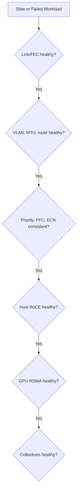

# Production Ethernet AI Troubleshooting

Ethernet AI incidents cross team boundaries. The server team sees GPU underutilization, the network team sees active links, and the application team sees NCCL timeouts. A shared layered method prevents ownership loops.

## Learning Objectives

Apply a decision tree, interpret PFC/ECN symptoms, and create a support-ready evidence package.

## Incident Flow

## Common Scenarios

### Link Up, High Errors

Inspect FEC, cable/optic qualification, port rate, lane state, and temperature. Correct the physical defect before tuning queues.

### Ping Works, RoCE Fails

Check GID selection, VLAN, route, MTU, priority mapping, RDMA device state, and QP completions.

### Excessive PFC

Find the congested egress and trace pause upstream. Verify ECN marking and sender rate response. Persistent pause often indicates oversubscription, receiver slowdown, or wrong thresholds.

### ECN Marks but No Rate Change

Check NIC congestion profile, firmware, traffic-class mapping, and whether feedback reaches the source.

### Good RDMA, Poor NCCL

Inspect GPU/NIC locality, interface selection, ECMP entropy, message size, rank mapping, and multi-rail use.

## Evidence Package

- topology and cable map;
- host, NIC, and switch versions;
- link rate, FEC, MTU, VLAN, and route;
- DSCP/PCP and queue mappings;
- PFC, ECN, queue, drop, and NIC counters;
- GID and RDMA device information;
- host and GPU RDMA tests;
- NCCL logs and application timing.

## Prevention

Continuously validate configuration drift, preserve baselines, test congestion profiles under load, and use staged upgrades. Assign ownership for endpoint, switch, DPU, and application layers.

## Interview Preparation

**Question:** A RoCE job times out. What is your first action?

Preserve evidence and identify scope. Then validate physical, IP, QoS, RDMA, GPU-direct, and collective layers in order.

## Key Takeaways

- Link-up and ping do not prove RoCE health.
- PFC and ECN symptoms must be correlated with queue and sender behavior.
- Troubleshoot from the first diverging layer.
- Shared evidence prevents cross-team escalation loops.

## Cross References

- [Fabric Validation](./chapter-10-fabric-validation-and-capacity-planning)
- [Next: Volume 09 Summary](./chapter-12-volume-09-summary)
