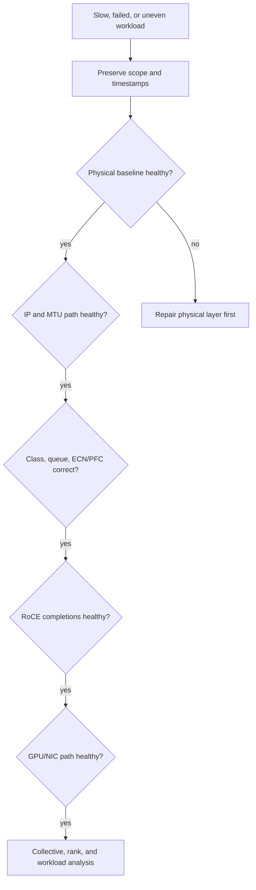
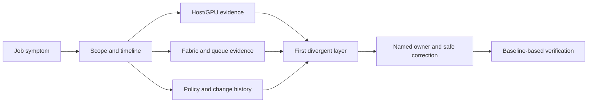

# Production Ethernet AI Troubleshooting

A failed collective has many plausible owners. The network team may see active links, the platform team may see healthy GPUs, and the application team may see a timeout. Productive incident response begins by preserving evidence and finding the first layer that diverges from a known-good baseline. It does not begin by changing PFC values or restarting every node.

| Chapter field | Value |
|---|---|
| Difficulty | Expert |
| Estimated reading time | 50–60 minutes |
| Primary focus | Layered isolation, evidence, and recovery verification |
| Prerequisites | Chapters 03–10 |

## Learning Objectives

You will be able to scope a failure, collect a support-ready evidence package, distinguish physical from congestion symptoms, and progress from link to application without treating ping or link-up as proof of RoCE health.

## Incident Method

**Figure 9.11.1 — Move downward from the symptom only until the first diverging layer is found.** Do not continue tuning upper layers while a lower layer is unhealthy.

### First ten minutes

1. Record job ID, node/rank set, topology, onset time, change events, and scope.
2. Stop destructive retries or configuration changes that erase the signal.
3. Compare an affected node/path with an equivalent healthy one.
4. Collect time-windowed counter deltas, not only cumulative totals.
5. Form one testable hypothesis and change one variable at a time.

## Evidence Package

| Layer | Preserve |
|---|---|
| Physical | peer ports, negotiated speed/FEC, lane/optic/cable state, error deltas |
| IP | addresses, VLAN, MTU, route/neighbor and intended path |
| QoS | DSCP/PCP, trust/rewrite, class/queue mapping, ECN/PFC/drop counters |
| RoCE | device/GID selection, completion errors, relevant NIC counters |
| GPU path | GPU/NIC topology and affinity, driver/runtime release, approved test result |
| Application | collective logs, rank placement, message size, timing and straggler evidence |
| Change history | host/NIC/switch/DPU release and policy revision, deployment timestamps |

Stable identifiers connect the evidence: host, GPU, NIC port, DPU if present, switch port, rack, rail, and job. “Port 17 has errors” is not actionable until it can be placed in that graph.

## Escalation Data Flow

An incident should flow from symptom to evidence to a bounded owner, then back to verified service. The network is only one participant: a job scheduler can concentrate demand, a host change can select the wrong NIC, and a DPU policy can interrupt a healthy uplink. Preserve this causal chain in the incident record.

The incident commander should state the current hypothesis, evidence that would falsify it, and the next safe observation or change. That discipline prevents a restart from being mistaken for a repair.

## Failure Patterns

### Link up, but errors grow

**Symptoms:** retry, corruption, link recovery, or FEC-related indicators grow; throughput may vary.

**Diagnosis:** compare negotiated capability and error deltas with a healthy peer; inspect supported cabling/media, temperature, lane state, and port history. Congestion counters can rise secondarily when a physical link degrades.

**Resolution:** correct or replace the faulty component under the approved maintenance process, then re-baseline the physical path before tuning QoS.

### Ping works, RoCE fails

**Symptoms:** IP reachability succeeds while an RDMA application reports connection, completion, retry, or throughput failure.

**Diagnosis:** verify GID/interface selection, VLAN, route, end-to-end MTU, queue/class mapping, RDMA device state, and completion evidence. Ping does not exercise registered memory, queue pairs, RoCE priority, or the same packet size.

**Resolution:** repair the first discrepancy, prove host-memory RoCE, then GPU-buffer traffic before retrying the application.

### PFC is persistent

**Symptoms:** pause counters or durations climb at a port and application tail increases without obvious loss.

**Diagnosis:** begin at the downstream congested egress and trace the class upstream. Correlate queue occupancy, utilization, ECN marks, sender response, destination speed, route distribution, and job placement.

**Resolution:** fix the bottleneck—receiver behavior, class mapping, route/placement, congestion feedback, or capacity. Blindly disabling PFC can exchange a stall for drops and retries.

### ECN marks rise but senders do not slow

**Diagnosis:** prove the packet is in the intended queue, that receiver notification reaches the sender, and that the deployed NIC profile is compatible with the qualified design. Check configuration consistency across endpoints and switches.

**Resolution:** restore the qualified end-to-end profile and validate with controlled incast before changing thresholds.

### RDMA is good; NCCL/collective performance is poor

**Diagnosis:** inspect GPU/NIC locality, interface and rail selection, rank mapping, route entropy, concurrent jobs, collective type/message size, and per-rank timeline. A point-to-point test does not represent synchronized all-to-all traffic.

**Resolution:** correct topology/rank placement or fabric contention, then compare the same collective matrix with the baseline.

### Only one rail is slow after maintenance

**Evidence:** the affected rail has lower utilization or higher tail time; peers may remain clean; topology and release inventory differ from the healthy rail.

**Diagnosis:** compare negotiated link state, cable/peer mapping, route membership, NIC/firmware/driver revision, QoS policy, and GPU/NIC affinity rail by rail. Do not average rails into one healthy aggregate.

**Resolution and verification:** repair the first difference, rerun a per-rail pairwise test and a multi-rail collective, and confirm balance returns under the same workload.

### The problem begins immediately after a policy change

**Evidence:** timestamps align with a QoS, DPU, driver, or switch deployment; only the changed population is affected.

**Diagnosis:** compare actual running policy and release state with the approved revision. Verify class-to-queue mapping using evidence, not just intended configuration.

**Resolution and prevention:** use the prepared rollback or controlled reconciliation procedure; canary future policy changes with an end-to-end RoCE and collective gate.

## Recovery and Prevention

Every incident should produce a verification statement: the exact test, topology, workload, counters, and time window that demonstrate recovery. “The job succeeded once” is inadequate. Update the runbook with the discriminating evidence, alert on the earliest useful signal, and add the failure to canary validation where practical.

Use staged upgrades for host drivers, NIC firmware, switch software, DPU images, and QoS profiles. A release matrix plus a tested rollback is more valuable than a collection of individually supported versions.

## Customer Architecture Discussion

Supportability is an architecture feature. Customers should establish one incident owner who can assemble fabric, endpoint, and workload evidence; change ownership for each layer; and a stated escalation boundary for hardware, network operating system, driver, DPU, and application components. Without that model, a multi-team incident becomes a handoff loop.

The operating model has a cost: topology inventory, telemetry retention, test capacity, release management, and on-call expertise. It also prevents expensive prolonged outages. A customer unable to operate PFC/ECN and endpoint versioning consistently should reduce architecture complexity or invest in the ownership model before growing the cluster.

## Interview Preparation

1. Why is an active Ethernet link insufficient evidence for a healthy RoCE job?
2. How do you distinguish congestion from a physical fault?
3. What is the first action when PFC is continuous?
4. Which evidence would you attach to a vendor support case?

## Key Takeaways

- Preserve scope, time, and counter deltas before changing the system.
- Diagnose from physical through QoS, RoCE, GPU path, and collectives.
- Persistent PFC and ECN are congestion evidence that requires a root-cause path analysis.
- Verify recovery against a baseline and turn the finding into a validation control.

## Quick Revision Sheet

| Symptom | First discriminating evidence |
|---|---|
| Link errors | peer capability, FEC/lane/cable error deltas |
| Ping only | GID, MTU, QP/completion and QoS path |
| PFC | downstream queue and upstream propagation |
| ECN | mark, notification, sender rate, queue timeline |
| Slow collective | rank, rail, route, locality, concurrency |

## Interview and Lab Materials

**Architecture prompt:** design the telemetry and ownership path that lets an on-call engineer distinguish an optic issue from a pause tree within one incident window.

**Scenario prompt:** a canary rack is slow only under all-to-all traffic. Explain the evidence sequence before changing ECN thresholds.

**Lab checklist:**

- [ ] Capture a healthy evidence bundle for a known job and topology.
- [ ] Inject one safe, reversible failure in a test environment and practice the decision tree.
- [ ] Compare a healthy and affected rail without aggregating counters.
- [ ] Verify rollback restores both configuration revision and workload baseline.

## Incident Communication Template

State facts separately from hypotheses. For example: “Ranks 8–15 show increased collective tail from 10:14 UTC; leaf B queue 3 ECN deltas rose; no physical error delta is observed.” Then state the hypothesis: “The affected rank placement concentrates demand on leaf B’s uplinks.” This prevents a suspicion from becoming incident history.

| Update field | Required content |
|---|---|
| Scope | affected jobs, nodes, rails, customer impact, start time |
| Evidence | comparison baseline, counter windows, release/policy differences |
| Hypothesis | one testable root cause and its falsifying observation |
| Action | safe diagnostic/change owner and rollback point |
| Verification | exact workload and evidence required to close |

### Common anti-patterns

- Resetting endpoints before collecting completion and counter evidence.
- Changing PFC, ECN, routing, and firmware in one maintenance window.
- Treating an aggregated fabric graph as evidence that every rail is healthy.
- Closing an incident because connectivity returned without repeating the affected workload.

## Further Reading

- [RFC 3168: Explicit Congestion Notification](https://www.rfc-editor.org/info/rfc3168/)
- [NVIDIA networking documentation](https://docs.nvidia.com/networking/)

## Further Reading

- [NVIDIA RoCE documentation](https://docs.nvidia.com/networking-ethernet-software/cumulus-linux-44/Layer-1-and-Switch-Ports/Quality-of-Service/RDMA-over-Converged-Ethernet-RoCE/)
- [Volume 07 collective paths](../../volume-07/chapter-09-multi-node-collectives-and-nccl-paths)

## Cross References

- [ECN and DCQCN](./chapter-05-ecn-and-dcqcn)
- [Fabric Validation and Capacity Planning](./chapter-10-fabric-validation-and-capacity-planning)
- [Volume 09 Summary](./chapter-12-volume-09-summary)
