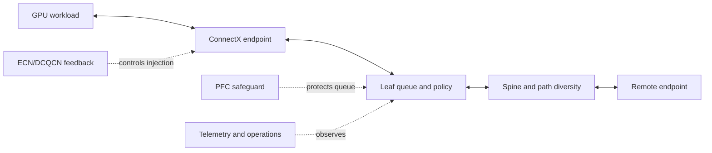

# Volume 09 Summary

Ethernet becomes an AI fabric when it is engineered as a complete system rather than assembled from fast ports. The endpoint chooses an RDMA path; the fabric forwards it through queues; QoS gives the packet a class; ECN and endpoint behavior regulate congestion; PFC protects a narrow transient condition; topology and placement determine available capacity; telemetry makes the result operable.

## The System Model

**Figure 9.12.1 — AI Ethernet performance emerges from the interaction of endpoints, queues, paths, feedback, and operations.** No single configuration flag proves the system healthy.

## What You Should Now Be Able to Explain

| Question | Volume 09 answer |
|---|---|
| Why is ordinary Ethernet validation insufficient? | RDMA and synchronized collectives depend on QoS, congestion, endpoint, and topology behavior beyond IP reachability. |
| What does RoCEv2 add? | RDMA semantics carried over routed UDP/IP Ethernet, with endpoint and fabric configuration requirements. |
| What is PFC for? | Short, local protection of a selected priority; it is not fairness or capacity. |
| Why ECN/DCQCN? | To convert incipient queue pressure into end-to-end source-rate response before sustained pause. |
| What does DCB/QoS decide? | Class, queue, scheduling, congestion treatment, and observability for traffic intent. |
| What makes a fabric production-ready? | A qualified release, workload baselines, capacity/failure evidence, telemetry, and recovery ownership. |

## Design Principles

1. Begin with workload traffic patterns, not a switch feature list.
2. Preserve a single, versioned marking-to-queue contract across hosts and every switch role.
3. Keep the loss-sensitive class small; isolate infrastructure and best-effort behavior deliberately.
4. Use ECN and endpoint reaction to control offered load; use PFC as a narrowly scoped safety mechanism.
5. Treat endpoint firmware/drivers, switch software, QoS policy, and DPU services as a tested release set.
6. Plan capacity through the actual traffic cut, concurrent workload demand, and defined failure state.
7. Measure tail behavior, queue pressure, and path asymmetry—not only link-up or average utilization.
8. Make recovery and evidence collection part of the deployment design.

## End-to-End Acceptance Checklist

### Before production

- [ ] Physical inventory, cable/optic support, peer mapping, speed, and FEC are validated.
- [ ] IP addressing, VLANs, routes, neighbors, and MTU match the intended RoCE path.
- [ ] GID/interface selection and endpoint configuration are recorded.
- [ ] DSCP/PCP, trust/rewrite, priority, queue, ECN, PFC, and scheduler mappings are exported and tested.
- [ ] Host-memory and GPU-buffer paths are tested with recorded topology and versions.
- [ ] Collective tests cover relevant operations, messages, node counts, rails, and concurrency.
- [ ] Queue, ECN, PFC, error, and application-tail baselines exist.
- [ ] Normal and degraded-state capacity claims are tested and documented.
- [ ] Upgrade canary, rollback, incident evidence, and ownership paths are accepted.

### During operations

- [ ] Detect policy drift and topology changes.
- [ ] Alert on new physical errors, sustained/asymmetric queue pressure, and degraded rails.
- [ ] Correlate workload placement and collective tails with fabric telemetry.
- [ ] Review capacity against actual concurrency and growth, including maintenance states.
- [ ] Requalify the release set after material endpoint, switch, DPU, or policy changes.

## Troubleshooting Order

When an AI workload is slow or fails, preserve evidence before changing the system. Move in order: physical link and FEC; IP/VLAN/MTU/route; marking and queue mapping; PFC/ECN feedback; RoCE endpoint state; GPU/NIC affinity; collective and application behavior. The first layer that diverges from a comparable healthy baseline is the investigation boundary.

| Misleading shortcut | Better question |
|---|---|
| “Ping works.” | Does the selected RoCE queue pair, MTU, priority, and completion path work? |
| “PFC is enabled.” | Is pause transient, in only the intended class, and traceable to a root bottleneck? |
| “The ports add up.” | Does the relevant cut sustain concurrent workload demand after the stated failure? |
| “The benchmark is fast.” | Does the representative collective/application remain stable under concurrency? |
| “The switch is healthy.” | Are queue, route, endpoint, and workload timelines consistent with baseline? |

## Architecture Review Questions

1. Which flows need loss-sensitive treatment, and why?
2. Where are markings trusted, normalized, and verified?
3. What traffic is isolated from the RoCE pause domain?
4. Which path or destination is the capacity bottleneck for each workload pattern?
5. What happens to that bottleneck after a link or switch failure?
6. Which release set is qualified, and how is it rolled back?
7. Who owns the endpoint, switch, DPU, and application evidence in an incident?

## Interview Notes

Avoid describing RoCE as “InfiniBand over Ethernet.” It carries RDMA semantics on Ethernet/IP and must be engineered through Ethernet routing, queues, congestion signaling, endpoint behavior, and operations. The senior-level answer is always a system answer: a fast adapter cannot compensate for an unqualified queue policy, a congested cut, or an unobservable change process.

## Key Takeaways

- Ethernet for AI is a controlled, observable RDMA system—not merely high-speed connectivity.
- Classification consistency links host intent to the queue and congestion behavior that actually occur.
- ECN/DCQCN, PFC, topology, capacity, and placement solve different parts of the problem.
- Publication-ready operations require baselines, failure-state validation, and cross-team evidence.

## Further Reading and Cross References

- [Why Ethernet for AI Is Different](./chapter-01-why-ethernet-for-ai-is-different)
- [RoCEv2 and RDMA over Ethernet](./chapter-03-rocev2-and-rdma-over-ethernet)
- [Priority Flow Control](./chapter-04-priority-flow-control)
- [ECN and DCQCN](./chapter-05-ecn-and-dcqcn)
- [Data Center Bridging and QoS](./chapter-06-data-center-bridging-and-qos)
- [Fabric Validation and Capacity Planning](./chapter-10-fabric-validation-and-capacity-planning)
- [Production Ethernet AI Troubleshooting](./chapter-11-production-troubleshooting)

## Next Volume

[Volume 10 — Kubernetes GPU Platform](../volume-10/index) moves from the physical and network foundation into cluster software: drivers, container runtime, device discovery, scheduling, GPU Operator, upgrades, validation, and production operations.
