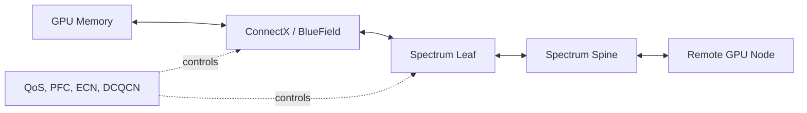

# Volume 09 Summary

Ethernet becomes an AI fabric when endpoints, switches, routing, QoS, congestion control, topology, telemetry, and workload placement are engineered as one system.

## Architecture Summary

## Quick Revision

| Concept | Purpose |
|---|---|
| RoCEv2 | RDMA over routed UDP/IP Ethernet |
| PFC | Selective hop-by-hop pause |
| ECN | Congestion marking |
| DCQCN | Sender rate response for RoCE |
| DCB/ETS | Traffic-class and bandwidth policy |
| Spectrum | Ethernet switching platform |
| ConnectX | RDMA and GPU-direct endpoint |
| BlueField | Programmable infrastructure/DPU boundary |

## Production Principles

- Separate or deliberately classify compute, storage, service, and management traffic.
- Validate MTU, VLAN, route, GID, priority, queue, PFC, and ECN end to end.
- Use PFC narrowly and ECN to control sources before sustained pause.
- Treat NIC, DPU, and switch software as one release matrix.
- Model oversubscription and failure-state capacity.
- Benchmark host RDMA, GPU RDMA, collectives, and applications.
- Preserve queue-level telemetry and configuration history.

## Troubleshooting Checklist

1. Physical link, FEC, cable, and negotiated rate.
2. IP route, VLAN, neighbor, and MTU.
3. DSCP/PCP and queue mapping.
4. PFC pause, ECN marks, and sender response.
5. GID and RDMA completion state.
6. GPU/NIC locality and direct registration.
7. ECMP, multi-rail, NCCL, and application behavior.

## Interview Notes

Do not describe RoCE as “InfiniBand over Ethernet.” It uses RDMA concepts and verbs, but the data plane is Ethernet/IP and depends on Ethernet-specific routing, QoS, PFC, ECN, and operations.

## Lab Checklist

- Inventory the AI Ethernet path.
- Validate RoCE addressing and MTU.
- Observe PFC/ECN under controlled load.
- Troubleshoot a degraded RoCE path.

## Next Volume

[Volume 10 — Kubernetes GPU Platform](../volume-10/index) moves from physical and network infrastructure into cluster software: drivers, container runtime, device discovery, scheduling, GPU Operator, validation, upgrades, and production operations.
