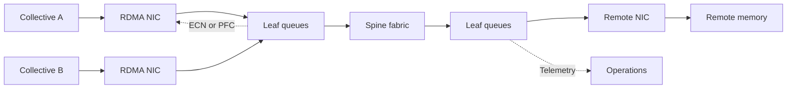
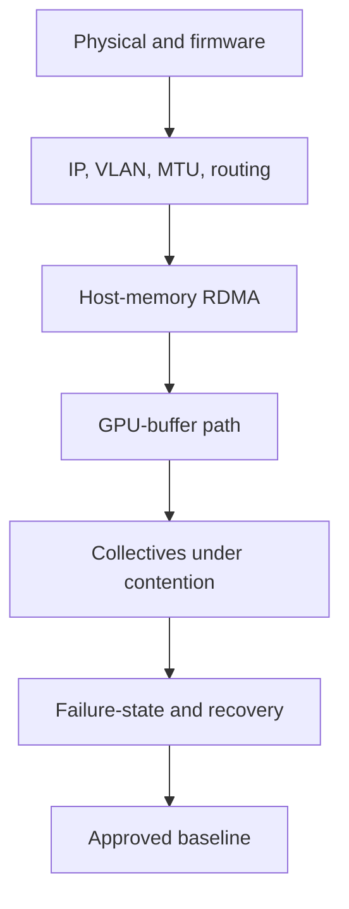

# Volume 09 — Ethernet for AI

A GPU cluster can have healthy links, low average utilization, and disappointing job throughput at the same time. Distributed AI exposes short congestion events that ordinary application dashboards smooth away. A single delayed flow can hold an entire collective at a synchronization barrier, leaving expensive accelerators idle.

This volume treats AI Ethernet as one feedback-controlled system: GPU and host memory, RDMA adapters, routed Ethernet, switch queues, traffic classification, congestion signaling, workload placement, and telemetry. The goal is not to make Ethernet “lossless” by enabling one feature. The goal is predictable application communication under contention and failure.

| Volume field | Value |
|---|---|
| Difficulty | Advanced |
| Estimated reading time | 16–20 hours |
| Prerequisites | Volume 07 GPU data paths and Volume 08 fabric fundamentals |
| Primary focus | RoCEv2, queue protection, congestion control, and production operations |
| Reader outcome | Design, validate, and troubleshoot an operationally sustainable AI Ethernet fabric |

## The Production Problem

Consider a cluster that passes every single-flow acceptance test. The first multi-rack training job also passes. When two teams run collectives concurrently, iteration time becomes unstable. PFC counters rise, ECN marks appear only on a few egress queues, and GPU utilization falls even though no link remains saturated for an entire monitoring interval.

This is a system failure, not merely a port failure. The investigation must connect:

- the communication pattern and placement of the jobs;
- the paths selected by ECMP;
- traffic markings and queue mappings at every hop;
- switch queue occupancy, ECN, PFC, and discard counters;
- endpoint congestion notifications and rate response;
- collective timing and GPU idle periods.

## Learning Outcomes

After completing this volume, you will be able to:

- explain why synchronized AI traffic invalidates common enterprise-network assumptions;
- trace a RoCEv2 operation from an application work request to remote memory;
- distinguish routing, reliability, loss protection, and congestion control;
- explain PFC XOFF/XON behavior and pause propagation;
- describe the ECN-to-CNP-to-sender DCQCN control loop;
- design traffic classes without making every class lossless;
- reason about switch, adapter, DPU, topology, and workload-placement trade-offs;
- build validation plans that progress from physical links to real collectives;
- diagnose congestion using time-correlated endpoint, fabric, and application evidence.

## The Big Picture

**Figure 9.0.1 — AI Ethernet couples application bursts, endpoint rate control, switch queues, and operations.** Nominal link speed describes only one component.

## The Three Control Timescales

AI Ethernet uses several mechanisms because one mechanism cannot solve every congestion timescale.

| Timescale and scope | Mechanism | Responsibility | Failure if misused |
|---|---|---|---|
| Per-hop, urgent | PFC | Protect selected ingress buffering while in-flight traffic stops | Congestion spreading, head-of-line blocking, deadlock risk |
| End-to-end, reactive | ECN and DCQCN | Signal queue pressure and reduce source rate | Oscillation, persistent under-rate, or late PFC |
| Operational | Capacity, placement, admission, automation | Avoid chronic oversubscription and unsafe combinations | A control loop forced to compensate for bad architecture |

PFC is therefore a guardrail. ECN-based rate control should do most of the routine congestion work. Capacity and workload policy must prevent persistent overload.

## Reading Map

| Chapter | Engineering question |
|---|---|
| 01 — Why Ethernet for AI Is Different | Why can a healthy general-purpose fabric fail synchronized GPU jobs? |
| 02 — Ethernet Architecture for AI | Which planes, paths, queues, and ownership boundaries form the system? |
| 03 — RoCEv2 and RDMA over Ethernet | How does a work request become routed packets and remote-memory completion? |
| 04 — Priority Flow Control | How does selective pause protect a queue, and how does it spread failure? |
| 05 — ECN and DCQCN | How does the fabric tell a sender to slow down and recover? |
| 06 — Data Center Bridging and QoS | How are markings mapped into consistent traffic behavior? |
| 07 — Spectrum Switches for AI | What must the switch data plane and buffers provide? |
| 08 — ConnectX Adapters | What does the endpoint own in RDMA and congestion response? |
| 09 — BlueField DPUs | Where can infrastructure services and isolation move off the host? |
| 10 — DOCA and Programmable Services | How are programmable services introduced safely? |
| 11 — Fabric Design and Validation | How are topology, capacity, and acceptance criteria combined? |
| 12 — Production Troubleshooting | How is evidence correlated across the complete path? |

## Lab Map

The labs move from inventory to control-loop validation:

1. inspect Ethernet and RDMA capabilities;
2. validate RoCE configuration and the selected data path;
3. observe congestion signals and performance evidence;
4. review and troubleshoot a production AI Ethernet design.

Hardware-dependent commands are deliberately concentrated in the labs. Chapters explain what evidence to request and how to interpret it without presenting unverified output.

## How to Use This Volume

### Architects

Read Chapters 01–06 before making topology or product choices. The important decision is not “Ethernet or not.” It is whether the organization can operate the required control loop, isolate failure domains, and validate the workload at the intended scale.

### Platform and Network Engineers

Use the chapters to create one shared contract. The platform team owns workload intent, GPU/NIC locality, software qualification, and application evidence. The network team owns forwarding, queue policy, capacity, and fabric telemetry. Both teams own end-to-end validation.

### SRE and Operations Teams

Start with the healthy-flow diagrams and revision sheets. During an incident, localize the first failing layer before changing thresholds. A pause counter, an ECN mark, or an RDMA retry is evidence—not a root cause by itself.

## Production Acceptance Strategy

Every layer must have pass criteria and retained evidence. A two-host line-rate result cannot approve a multi-tenant fabric. Acceptance must include representative job sizes, concurrent traffic, path diversity, maintenance states, and failure-state oversubscription.

## Architectural Principles

- Start with the workload communication matrix, not a switch SKU.
- Treat QoS markings as an end-to-end contract.
- Keep the number of traffic classes small and explain every class.
- Tune ECN, PFC, endpoint response, and buffers as one system.
- Separate management and recovery paths from the traffic they must diagnose.
- Prefer qualified profiles over hand-copied threshold values.
- Baseline counters and collective timing before production traffic arrives.
- Test rollback and degraded operation before a maintenance window.

## Security and Multi-Tenancy

RDMA changes the consequence of endpoint and policy mistakes because adapters access registered memory and often bypass the ordinary host networking path. Production design must control who can create RDMA resources, how tenants are isolated, which markings they may assert, and how virtual functions or containers map to physical queues. QoS is not a security boundary; enforcement belongs at trusted edges and in the endpoint/fabric control planes.

## Definition of Volume Completion

The volume is complete only when every chapter and lab passes structural, technical, editorial, duplication, route, Mermaid, and integration review; hardware labs pass reproducibility review; all links resolve; and CI is green. A draft merged once is not evidence that those gates were met.

## Authoritative Foundations

- [NVIDIA: RDMA over Converged Ethernet](https://docs.nvidia.com/networking/display/mlnxenv23102131201lts/rdma+over+converged+ethernet+(roce))
- [NVIDIA Cumulus Linux: RoCE](https://docs.nvidia.com/networking-ethernet-software/cumulus-linux-518/Layer-1-and-Switch-Ports/Quality-of-Service/RDMA-over-Converged-Ethernet-RoCE/)
- [RFC 3168: Explicit Congestion Notification](https://www.rfc-editor.org/rfc/rfc3168.html)
- [Zhu et al.: Congestion Control for Large-Scale RDMA Deployments](https://conferences.sigcomm.org/sigcomm/2015/pdf/papers/p523.pdf)

## Begin

Start with [Chapter 01 — Why Ethernet for AI Is Different](./chapter-01-why-ethernet-for-ai-is-different).
