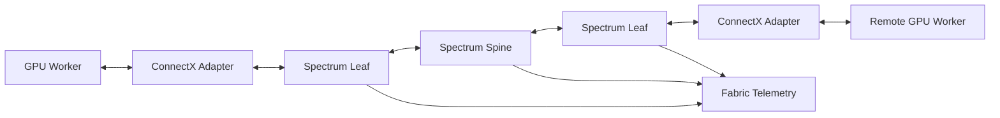

# Volume 09 — Ethernet for AI

Ethernet is familiar, widely supported, and deeply integrated into enterprise operations. AI workloads, however, expose behavior that ordinary application traffic can tolerate but synchronized GPU jobs cannot. Packet loss, queue buildup, pause propagation, uneven paths, and incast can transform a fast network into an unpredictable distributed-compute bottleneck.

This volume explains how Ethernet is adapted for AI using Remote Direct Memory Access over Converged Ethernet, explicit congestion signaling, traffic-class design, modern adapters, programmable infrastructure, and production observability.

| Volume field | Value |
|---|---|
| Difficulty | Advanced |
| Estimated reading time | 16–20 hours |
| Prerequisites | Volumes 07 and 08 |
| Primary focus | Loss-sensitive Ethernet for GPU clusters |
| Outcome | Design and troubleshoot an operationally sustainable AI Ethernet fabric |

## The Big Picture

**Figure 9.0.1 — AI Ethernet is a system of endpoints, queues, switches, congestion controls, and telemetry.** Link speed alone does not determine distributed performance.

## Planned Chapter Sequence

1. Why Ethernet for AI Is Different
2. RoCE and RDMA over Ethernet
3. Loss, Queues, and Head-of-Line Blocking
4. Priority Flow Control
5. ECN and DCQCN
6. Spectrum Switching Architecture
7. ConnectX Adapters and Data Paths
8. BlueField DPUs and Infrastructure Offload
9. DOCA and Programmable Services
10. Fabric Design and Validation
11. Production Troubleshooting
12. Volume 09 Summary

## Planned Labs

- Inspect Ethernet and RDMA capabilities
- Validate RoCE configuration
- Observe congestion signals and counters
- Review a production AI Ethernet design

The pull request will be raised only after all planned chapters and labs are complete.
