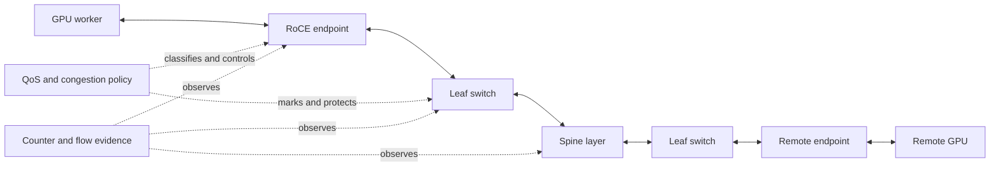

# Volume 09 — Ethernet for AI

A fabric can report clean links, pass an IP test, and still be the reason a distributed GPU job slows down or fails. AI communication exposes short bursts, synchronized collectives, shared queues, and failure modes that conventional application traffic often masks. This volume teaches Ethernet as a complete operating system: endpoints, switching, routing, traffic classes, congestion feedback, observability, and workload placement must agree.

It does not promise that one feature makes Ethernet "lossless" or that a successful point-to-point benchmark proves cluster readiness. Instead, it builds the engineering evidence needed to decide whether a design is fit for a workload and to locate the first layer that is not.

| Volume field | Value |
|---|---|
| Difficulty | Advanced |
| Estimated reading time | 16–20 hours, plus labs |
| Prerequisites | [Volume 07 — GPU Networking](../volume-07/index) and [Volume 08 — InfiniBand](../volume-08/index) |
| Primary focus | RoCE-capable Ethernet for distributed AI workloads |
| Outcome | Design, qualify, operate, and troubleshoot an evidence-backed AI Ethernet fabric |

## The Engineering Problem

An infrastructure team expands a GPU cluster onto an existing Ethernet fabric. Early host tests look healthy. Under concurrent training jobs, iteration time becomes erratic, pause counters rise, and a workload in another rack slows down. None of those observations alone identifies the cause. The fault can sit in physical signaling, MTU consistency, route selection, traffic classification, queue pressure, ECN feedback, endpoint configuration, PCIe locality, or application placement.

The working question for this volume is therefore not *Can Ethernet carry AI traffic?* It is: *what evidence shows that this specific endpoint, fabric, and workload combination remains predictable under contention and degraded operation?*

## The Big Picture

**Figure 9.0.1 — AI Ethernet is an end-to-end control system, not a collection of fast links.** Congestion control should reduce offered load before queues need sustained pause; telemetry proves whether that control loop is behaving as intended.

## What You Will Learn

By the end of this volume, you should be able to:

- explain why synchronized GPU communication produces different network pressure than independent request/response traffic;
- trace a RoCEv2 path across endpoint memory, adapter, IP/Ethernet fabric, queues, and remote completion;
- separate PFC's bounded, hop-local protection role from ECN/DCQCN congestion response;
- design a small, auditable QoS contract that remains consistent across hosts and switches;
- assess switch, adapter, DPU, and DOCA responsibilities without turning product names into architecture decisions;
- qualify a fabric in layers—from link and routing through RoCE, GPU-direct paths, collectives, and application behavior;
- investigate a stall using preserved evidence rather than ownership assumptions; and
- present normal-state and degraded-state capacity trade-offs to a customer or review board.

## How to Use This Volume

Read Chapters 01–06 in order. They establish the workload, fabric, RoCE, PFC, ECN/DCQCN, and QoS concepts that later operational material assumes. Chapters 07–09 explain the practical infrastructure roles. Chapters 10–11 turn those components into a qualification and incident method; Chapter 12 is a synthesis and revision tool.

The labs are designed as controlled observation and validation exercises. They intentionally avoid changing production route, MTU, PFC, ECN, or switch policy. Run them only with an approved fabric owner, a documented scope, and a stop condition.

## Chapter Map

| Chapter | Question it answers | Primary boundary |
|---|---|---|
| [01 — Why Ethernet for AI Is Different](./chapter-01-why-ethernet-for-ai-is-different) | Why can a healthy Ethernet fabric still impede distributed AI? | Workload and congestion behavior |
| [02 — Ethernet Architecture for AI](./chapter-02-ethernet-architecture-for-ai) | What is the end-to-end system to design? | Fabric, control, and management planes |
| [03 — RoCEv2 and RDMA over Ethernet](./chapter-03-rocev2-and-rdma-over-ethernet) | How does a remote-memory operation travel over Ethernet? | Endpoint and transport path |
| [04 — Priority Flow Control](./chapter-04-priority-flow-control) | What does PFC protect, and how can it hurt? | Hop-local queue protection |
| [05 — ECN and DCQCN](./chapter-05-ecn-and-dcqcn) | How does congestion feedback reduce offered load? | Marking and sender response |
| [06 — Data Center Bridging and QoS](./chapter-06-data-center-bridging-and-qos) | How is traffic classification kept coherent end to end? | Policy and queue mapping |
| [07 — Spectrum Switches for AI](./chapter-07-spectrum-switches-for-ai) | What must the switching layer prove operationally? | Switching, telemetry, lifecycle |
| [08 — ConnectX Ethernet Adapters](./chapter-08-connectx-ethernet-adapters) | What endpoint conditions determine usable RoCE behavior? | NIC, host, and locality |
| [09 — BlueField DPUs and DOCA](./chapter-09-bluefield-dpus-and-doca) | When does infrastructure offload add value? | DPU ownership and services |
| [10 — Fabric Validation and Capacity Planning](./chapter-10-fabric-validation-and-capacity-planning) | How is readiness measured under load and failure? | Qualification and capacity |
| [11 — Production Troubleshooting](./chapter-11-production-troubleshooting) | How is a stall investigated without team ping-pong? | Evidence and recovery |
| [12 — Volume 09 Summary](./chapter-12-volume-09-summary) | How do the decisions form one operating model? | Synthesis and revision |

## Lab Map

| Lab | Outcome |
|---|---|
| [01 — Inventory an AI Ethernet Path](./labs/lab-01-inventory-an-ai-ethernet-path) | Produce a scoped endpoint-to-fabric evidence record. |
| [02 — Validate RoCE Addressing and MTU](./labs/lab-02-validate-roce-addressing-and-mtu) | Verify path assumptions without changing network policy. |
| [03 — Observe PFC and ECN Under Load](./labs/lab-03-observe-pfc-and-ecn-under-load) | Observe bounded, approved congestion behavior on an isolated path. |
| [04 — Troubleshoot a RoCE Path](./labs/lab-04-troubleshoot-a-roce-path) | Apply a reversible, layer-by-layer diagnostic method. |

## Production Principles

- Treat endpoint, switch, and workload configuration as one compatibility and change-control boundary.
- Use PFC narrowly and validate that ECN-based feedback reduces offered load before sustained pause dominates.
- Keep configuration claims and acceptance ranges qualified by the selected hardware, network operating system, driver, firmware, and workload.
- Baseline normal behavior by topology, software release, and concurrency; a generic line-rate result is not an acceptance record.
- Measure degraded operation deliberately: link, rail, or maintenance loss changes both capacity and failure domain.
- Preserve queue, pause, ECN, drop, and endpoint evidence before remediation changes the scene.

## Readiness Checklist

Before accepting a new rack or rail, confirm that the team can show:

1. physical, FEC, MTU, routing, and traffic-class evidence for the intended path;
2. a documented endpoint and fabric compatibility set;
3. host RoCE, GPU-aware path, collective, and application results at representative concurrency;
4. queue-level and endpoint telemetry with a named owner;
5. a bounded failure and recovery test; and
6. an escalation package that another team can reproduce.

## Further Reading

- [NVIDIA RoCE documentation](https://docs.nvidia.com/networking/display/mlnxofedv23100540/rdma%2Bover%2Bconverged%2Bethernet%2B%28roce%29)
- [RFC 3168 — The Addition of ECN to IP](https://www.rfc-editor.org/rfc/rfc3168.html)
- [IEEE 802.1Qbb overview](https://1.ieee802.org/dcb/802-1qbb/)

Proceed to [Chapter 01 — Why Ethernet for AI Is Different](./chapter-01-why-ethernet-for-ai-is-different).
