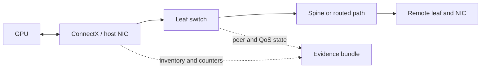

# Lab 01 — Inventory an AI Ethernet Path

| Field | Value |
|---|---|
| Difficulty | Intermediate |
| Estimated time | 60–90 minutes |
| Platform | Two Linux GPU nodes; read-only switch access |
| Lab type | Discovery and operational baseline |

## 1. Objective

Create a time-stamped, endpoint-to-endpoint inventory that lets an operator trace a future RoCE symptom from GPU and PCIe topology through NIC, VLAN/IP route, switch port, queue policy, and cable peer.

## 2. Background

Performance investigations fail when the team cannot answer a basic question: *which physical and logical path did this workload use?* Link state alone does not identify the selected RDMA device, GID, route, traffic class, queue, or GPU locality. This lab captures the evidence before a failure.

## 3. Learning Outcomes

You will be able to map a selected host interface to its RDMA device, PCIe/NUMA/GPU locality, IP route, switch peer, and operational counters; identify missing inventory; and save a baseline without resetting shared counters.

## 4. Architecture



## 5. Prerequisites

- Two approved lab hosts and their management access.
- `iproute2`, `ethtool`, `rdma-core`, and `nvidia-smi` where GPUs are present.
- Read-only access to the source-of-truth and matching switch-port/QoS information.
- A place to store redacted evidence. Do not publish IP addresses, hostnames, or serial numbers outside the approved environment.

## 6. Environment

Set the following placeholders locally; do not copy secrets into shell history. Replace `ensXfY`, `mlx5_N`, and `<peer-ip>` with the selected lab path.

| Item | Record |
|---|---|
| Time and timezone | Collection start/end |
| Endpoint identity | approved asset ID, not public hostname |
| NIC/RDMA device | interface, PCI address, RDMA port |
| Topology | NUMA node, GPU affinity, leaf and switch port |
| Network | VLAN, route, MTU, expected priority/queue |
| Release | NIC firmware/driver, host OS, switch NOS/config revision |

## 7. Components

- Linux network interface and RDMA device;
- PCIe and GPU topology;
- RoCE GID/addressing and L3 route;
- leaf/spine switch ports, cable/optic peer, QoS profile;
- NIC and switch counters, collected as deltas later.

## 8. Deployment Steps

### Step 1 — Capture host interface state

**Purpose:** identify the chosen Ethernet interface and its administrative/operational state.

```bash
ip -br link show dev ensXfY
ip -br addr show dev ensXfY
```

**Expected output:** representative output is `ensXfY UP ...` followed by the interface’s configured address. This is illustrative; names and addresses vary.

**Explanation:** record the interface name and address; do not infer its RDMA device from the name.

**Common failure interpretation:** `DOWN` or `NO-CARRIER` is a link or host-state issue and must be resolved before RoCE testing.

### Step 2 — Map Ethernet to RDMA resources

**Purpose:** capture the RDMA device and port that correspond to the selected interface.

```bash
rdma link show
ibv_devinfo -l
```

**Expected output:** representative `rdma link` output associates an `mlx5_*` device/port with a netdev. `ibv_devinfo -l` lists available RDMA devices.

**Explanation:** record the device and port used by later labs; exact GID-query syntax differs by `rdma-core` release.

**Common failure interpretation:** no RDMA device can indicate a missing driver, unsupported mode, or an unqualified adapter stack.

### Step 3 — Record route, MTU, and physical settings

**Purpose:** prove the likely L3 path and local MTU/physical state without changing it.

```bash
ip route get <peer-ip>
ip link show dev ensXfY
ethtool ensXfY
```

**Expected output:** the route identifies egress interface and next hop; link output includes MTU; `ethtool` reports negotiated link state where supported. Output is illustrative.

**Explanation:** compare the egress interface with Step 2. Save negotiated speed/FEC information from the approved platform tools if `ethtool` does not expose it.

**Common failure interpretation:** route selects a different interface than expected; record this as a design or configuration finding, not as a performance conclusion.

### Step 4 — Capture locality and counter baseline

**Purpose:** connect the NIC to PCIe/NUMA/GPU topology and preserve counters before any load.

```bash
nvidia-smi topo -m
ethtool -S ensXfY
```

**Expected output:** `nvidia-smi topo -m` presents a topology matrix on GPU hosts; `ethtool -S` returns driver-specific counters. Both outputs are illustrative and vary by driver.

**Explanation:** save raw output with timestamp. Never reset shared production counters for this lab.

**Common failure interpretation:** unavailable GPU topology is normal on non-GPU hosts; record it rather than substituting assumptions.

### Step 5 — Join switch evidence

**Purpose:** complete the path map with the peer switch port and QoS treatment.

Use your organization’s read-only NOS or controller query to record port peer, speed/FEC, MTU, configured QoS classification, ECN/PFC profile, and current counter values. Do not include vendor-specific write commands in this generic lab.

## 9. Validation

The inventory is valid when the selected interface, RDMA device/port, route, MTU, PCIe/GPU locality, switch peer, and expected QoS policy are all traceable in one evidence bundle. Escalate any unknown mapping before performance work.

## 10. Verification

Ask a second operator to choose one recorded NIC and trace it from host interface to the matching leaf port and peer endpoint using only the bundle. A successful trace demonstrates operational usefulness; it does not prove RoCE throughput.

## 11. Observability

Store collection timestamps and counter snapshots. Monitor link state, negotiated speed/FEC, error deltas, interface bytes, ECN/PFC deltas, queue data where available, and configuration revision. Join each metric to host, NIC, rail, switch port, and cable identity.

## 12. Performance Measurements

This is not a load lab. Record negotiated capability and topology only. Do not call line rate a measured application bandwidth result.

## 13. Failure Injection

**Safe exercise:** create an offline copy of the inventory table and deliberately replace one field—for example, map the interface to the wrong leaf port. Have a peer detect the inconsistency using the unmodified evidence. No NIC, route, MTU, switch, or workload configuration changes are permitted.

## 14. Troubleshooting

| Symptom | Evidence | Likely boundary | Safe next action |
|---|---|---|---|
| Interface has no carrier | `ip`, `ethtool`, switch peer state | cable/optic/port or host link | stop and use physical-fault runbook |
| Route uses another NIC | `ip route get` | host routing/policy | confirm intended design before tests |
| No RDMA mapping | `rdma link`, driver logs | driver/device mode | compare with approved host profile |
| Unknown QoS treatment | source-of-truth and switch read-only view | inventory/config drift | resolve with fabric owner |

## 15. Cleanup

No network state was changed. Secure or redact the evidence bundle according to policy; remove any local temporary copy that contains sensitive addresses or serial data.

## 16. Summary

You created the path context required to interpret later RoCE, congestion, and workload evidence. Inventory is an operational control: it converts a port counter into a known server, rail, peer, and policy.

## 17. Challenge Exercises

1. Produce a machine-readable inventory schema with host, NIC, GPU affinity, rail, peer port, and release fields.
2. Compare the expected topology with a fresh discovery snapshot and flag drift.
3. Define which fields must be refreshed after a cable, firmware, or switch change.

## 18. Further Reading

- [Ethernet Architecture for AI](../chapter-02-ethernet-architecture-for-ai)
- [ConnectX Ethernet Adapters](../chapter-08-connectx-ethernet-adapters)
- [Fabric Validation and Capacity Planning](../chapter-10-fabric-validation-and-capacity-planning)
