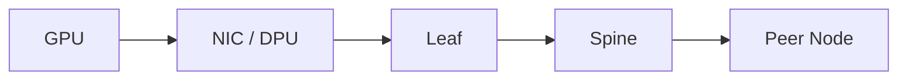

# Lab 01 — Inventory an AI Ethernet Path

| Field | Value |
|---|---|
| Difficulty | Intermediate |
| Estimated time | 60 minutes |
| Platform | Linux GPU nodes and Ethernet fabric |
| Lab type | Exploration |

## 1. Objective

Create an endpoint-to-endpoint path inventory suitable for RoCE troubleshooting.

## 2. Background

AI Ethernet failures often result from one inconsistent hop or queue mapping.

## 3. Learning Outcomes

You will map interfaces, GIDs, VLANs, routes, MTU, priorities, switch ports, and GPU/NIC locality.

## 4. Architecture

## 5. Prerequisites

Read access to hosts and switches, NVIDIA/RDMA tools, and current cable map.

## 6. Environment

Record host, NIC, DPU, switch software, firmware, driver, and timestamp.

## 7. Components

PCIe topology, interface, VLAN, IP, GID, queue, DSCP/PCP, PFC, ECN, switch ports, and cable.

## 8. Deployment Steps

Collect `ip -br link`, `ip addr`, `ip route`, `rdma link`, `ibv_devinfo`, GID tables, `ethtool` state/counters, and `nvidia-smi topo -m`. Query matching switch ports and QoS configuration.

## 9. Validation

Confirm the intended source and destination interfaces, route, MTU, and physical path.

## 10. Verification

Trace one RoCE traffic class from host marking to switch queue and remote endpoint.

## 11. Observability

Save NIC and switch counter snapshots without resetting them.

## 12. Performance Measurements

No load test is required; record negotiated capability.

## 13. Failure Injection

Use an offline copy with an incorrect MTU or priority mapping and identify the expected failure.

## 14. Troubleshooting

Resolve missing GIDs, inconsistent MTU, wrong VLAN, or unexpected PCIe locality before performance testing.

## 15. Cleanup

Secure configuration snapshots and remove sensitive addresses from public artifacts.

## 16. Summary

You built the path map required for all later labs.

## 17. Challenge Exercises

Generate a machine-readable inventory and drift check.

## 18. Further Reading

- [Ethernet Architecture for AI](../chapter-02-ethernet-architecture-for-ai)
- [ConnectX Ethernet Adapters](../chapter-08-connectx-ethernet-adapters)
