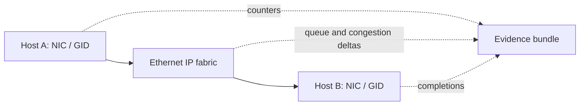

# Lab 02 — Validate RoCE Addressing and MTU

| Field | Value |
|---|---|
| Difficulty | Intermediate |
| Estimated time | 75–90 minutes |
| Platform | Two approved RoCE-capable Linux lab hosts |
| Lab type | Endpoint and path validation |

## 1. Objective

Prove that a selected endpoint pair uses the intended RDMA device, IP/GID identity, route, traffic class, and MTU before measuring application or GPU-buffer performance.

## 2. Background

IP reachability is necessary but not sufficient for RoCE. A route can select the wrong interface, a GID can be unsuitable for the chosen path, and an MTU mismatch can surface only under packetized RDMA traffic. This lab validates identity and path without changing shared switch policy.

## 3. Learning Outcomes

You will select and document a RoCE endpoint pair, inspect its route and interface MTU, run an approved host-memory RDMA smoke test, compare counters, and isolate a reversible client-side selection error.

## 4. Architecture



## 5. Prerequisites

- Completed Lab 01 inventory for both hosts.
- An isolated or approved maintenance test window.
- RDMA tools approved by the platform owner, such as `perftest` if installed.
- Read-only access to matching switch-port and QoS counters.
- No production workload dependent on the selected ports.

## 6. Environment

Record source/destination asset IDs, interfaces, RDMA devices/ports, address family, VLAN/VRF where applicable, route, host and switch MTU, expected traffic class, firmware/driver, and test-tool version. Use values from your inventory; do not guess GID indexes across hosts.

## 7. Components

- Host network interface and RoCE device/port;
- GID/addressing table and selected route;
- path MTU and switch MTU policy;
- host-memory RDMA test server/client;
- NIC, queue, ECN/PFC, and switch-port counters.

## 8. Deployment Steps

### Step 1 — Confirm local identity and route

**Purpose:** demonstrate that the selected peer address exits the expected interface.

```bash
ip -br addr show dev ensXfY
ip route get <peer-ip>
rdma link show
```

**Expected output:** representative route output contains `dev ensXfY`; `rdma link` lists an RDMA device and port associated with a netdev. Output is illustrative.

**Explanation:** record the exact local interface and RDMA device/port for the test plan.

**Common failure interpretation:** if the route chooses another interface, stop; changing the test tool cannot validate the intended rail.

### Step 2 — Inspect MTU and GID information

**Purpose:** establish the endpoint inputs that must agree with the approved design.

```bash
ip link show dev ensXfY
ibv_devinfo -d mlx5_N -i 1
```

**Expected output:** `ip link` includes an MTU; `ibv_devinfo` reports device/port information. GID display fields differ by rdma-core version, so use the platform-approved GID query if required.

**Explanation:** compare both endpoints and the switch policy. Do not assume a numeric GID index means the same thing on every host.

**Common failure interpretation:** an unexpected MTU or inactive port is a configuration finding; do not change it in this lab.

### Step 3 — Capture pre-test evidence

**Purpose:** preserve the baseline needed to distinguish a test failure from a pre-existing fault.

```bash
ethtool -S ensXfY
date -u
```

**Expected output:** driver-specific counter names and a UTC timestamp. Output is illustrative.

**Explanation:** capture equivalent counter snapshots on both NICs and corresponding switch ports. Never reset counters.

**Common failure interpretation:** missing counters are a telemetry gap to document, not a reason to run unobserved.

### Step 4 — Run an approved host-memory RoCE smoke test

**Purpose:** validate the RDMA data path before GPU-buffer or collective tests.

On the receiving lab host, start the tool using the documented device/port options for your installed version. On the sending host, use the same selected device/port and the peer’s approved address. Example only—confirm flags with `--help` before use:

```bash
# Illustrative perftest pattern; options vary by version.
ib_write_bw --help
```

**Expected output:** a successful tool reports completed transfers and measured values. Treat all numeric results as environment-specific; do not use published sample output as an acceptance threshold.

**Explanation:** the objective is clean completion using the intended resources, not peak benchmark performance.

**Common failure interpretation:** connection/setup failure can indicate device selection, GID/addressing, MTU, or end-to-end RoCE configuration; preserve the first error and counters.

## 9. Validation

Validation passes when both endpoints’ selected RDMA resources, route, MTU, and expected traffic treatment match the approved inventory, and the controlled host-memory test completes without unexplained errors.

## 10. Verification

Run small and larger message sizes supported by the approved tool, using the same device/port selection. Compare pre/post NIC and switch counter deltas. A clean test proves this defined path; it does not prove GPU-direct performance or all-job scaling.

## 11. Observability

Capture completion status, test parameters, timestamps, byte/packet/error deltas, route/GID evidence, and switch queue/ECN/PFC/drop deltas where available. Attach configuration revisions and rail identity.

## 12. Performance Measurements

Report repeatable host-memory latency/bandwidth ranges only for the recorded tool, message sizes, concurrency, topology, and release set. Do not compare these values with line rate or GPU-buffer results without explaining the path difference.

## 13. Failure Injection

**Safe reversible exercise:** run a *client process* with an intentionally nonpreferred local interface/device selection that is known to be reachable but not the intended rail. Do not change routes, MTUs, GID tables, VLANs, or switch configuration. Capture the selection mismatch, stop the process, then rerun with the approved selection. If no safe alternate interface exists, skip injection and document why.

## 14. Troubleshooting

| Symptom | Evidence to inspect | Corrective boundary |
|---|---|---|
| IP works; RDMA setup fails | selected device/port, GID/addressing, MTU, first tool error | endpoint RoCE profile |
| Test uses unexpected rail | `ip route get`, tool options, counters | route/interface selection |
| Errors rise during test | NIC and switch deltas, physical/FEC evidence | physical or QoS path |
| Completion succeeds but rate is low | message size, PCIe/GPU locality, rail load, congestion | measure before tuning |

## 15. Cleanup

Stop the test server and client, remove any temporary environment variables or logs containing sensitive topology data, and verify no test process remains. No shared network configuration should have changed.

## 16. Summary

You validated the selected Ethernet and RoCE identity path, not merely a ping response. This gives later labs a controlled baseline for congestion and workload testing.

## 17. Challenge Exercises

1. Repeat across a routed boundary only if that path is approved for RoCEv2.
2. Add an automated preflight that rejects a route/interface mismatch.
3. Define a result schema that preserves tool version and complete environment context.

## 18. Further Reading

- [RoCEv2 and RDMA over Ethernet](../chapter-03-rocev2-and-rdma-over-ethernet)
- [ConnectX Ethernet Adapters](../chapter-08-connectx-ethernet-adapters)
- [Production Troubleshooting](../chapter-11-production-troubleshooting)
