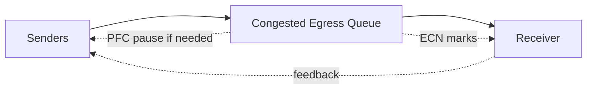

# Lab 03 — Observe PFC and ECN Under Load

| Field | Value |
|---|---|
| Difficulty | Advanced |
| Estimated time | 90 minutes |
| Platform | Isolated RoCE test fabric |
| Lab type | Performance and observability |

## 1. Objective

Observe congestion controls without changing production-wide policy.

## 2. Background

PFC, ECN, and sender rate control must be interpreted together.

## 3. Learning Outcomes

You will create controlled contention, capture queue telemetry, and distinguish healthy ECN response from sustained pause.

## 4. Architecture

## 5. Prerequisites

A nonproduction path, approved traffic generator or RDMA tests, and access to NIC/switch counters.

## 6. Environment

Record queue mappings, PFC priorities, ECN thresholds, DCQCN profile, link rates, and topology.

## 7. Components

Senders, congested egress, queue occupancy, ECN marks, congestion notifications, PFC frames, and source rates.

## 8. Deployment Steps

Run a baseline below link capacity. Then introduce controlled incast or competing flows while polling per-queue and endpoint counters.

## 9. Validation

Confirm traffic enters the intended priority and queue.

## 10. Verification

Observe ECN marks and sender response before sustained PFC. Exact behavior depends on the qualified profile.

## 11. Observability

Collect queue depth, ECN, pause frames/duration, drops, throughput, and tail latency.

## 12. Performance Measurements

Plot offered load, delivered throughput, queue behavior, and application latency over time.

## 13. Failure Injection

Increase offered load only within the isolated lab’s safety limit. Do not alter global thresholds.

## 14. Troubleshooting

If PFC rises without ECN response, verify classification, marking, feedback, and NIC congestion profile. If ECN is excessive at low load, inspect thresholds and queue mapping.

## 15. Cleanup

Stop traffic and confirm counters stop increasing.

## 16. Summary

You observed the feedback loop rather than treating PFC or ECN as standalone metrics.

## 17. Challenge Exercises

Compare normal and one-uplink-failure capacity states.

## 18. Further Reading

- [Priority Flow Control](../chapter-04-priority-flow-control)
- [ECN and DCQCN](../chapter-05-ecn-and-dcqcn)
