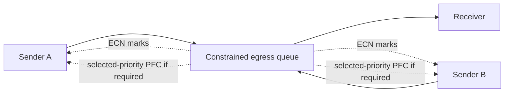

# Lab 03 — Observe PFC and ECN Under Load

| Field | Value |
|---|---|
| Difficulty | Advanced |
| Estimated time | 90–120 minutes |
| Platform | Isolated RoCE test fabric with approved load tooling |
| Lab type | Observability and controlled congestion |

## 1. Objective

Observe a qualified RoCE profile as offered load approaches a constrained egress. Confirm classification, collect ECN and PFC evidence, and distinguish a healthy feedback response from sustained pause or loss.

## 2. Background

ECN, endpoint congestion response, queues, and PFC are one control system. A PFC counter alone does not establish cause; an ECN mark alone does not establish application impact. This lab uses an isolated path and approved safety limits because congestion experiments can affect unrelated traffic.

## 3. Learning Outcomes

You will establish an unloaded baseline, create bounded contention, collect synchronized endpoint and switch telemetry, explain the result without inventing thresholds, and restore the lab to idle state.

## 4. Architecture



## 5. Prerequisites

- Dedicated nonproduction hosts, ports, VLAN/VRF, and maintenance approval.
- Completed Labs 01 and 02 with healthy baseline evidence.
- Written fabric-owner approval of queue, ECN/PFC profile, offered-load ceiling, duration, abort condition, and rollback.
- Synchronized time plus read-only endpoint/switch telemetry access.
- A known-safe load tool; never use production training jobs as a generator.

## 6. Environment

Record topology, link rates, sender/receiver assets, intended traffic class and queue, ECN/PFC profile revision, tool version, time source, baseline counters, duration limit, maximum concurrency, and abort owner. Thresholds from another environment are not universal settings.

## 7. Components

- Two or more senders, receiver, and selected egress queue;
- qualified RoCE endpoint congestion profile;
- switch queue/ECN/PFC/drop and port counters;
- endpoint throughput and completion evidence;
- an operator who can stop all tests immediately.

## 8. Deployment Steps

### Step 1 — Confirm isolation and abort path

**Purpose:** prevent a lab experiment from becoming a shared-fabric incident.

```bash
ip route get <receiver-ip>
date -u
```

**Expected output:** representative route output identifies the approved lab egress interface; UTC time is recorded. Output is illustrative.

**Explanation:** compare the route against inventory and test the traffic generator’s stop mechanism before sending load.

**Common failure interpretation:** an unapproved or shared path is an immediate stop condition.

### Step 2 — Capture idle baseline

**Purpose:** establish deltas and normal state before contention.

```bash
ethtool -S ensXfY
rdma link show
```

**Expected output:** driver-specific counters and RDMA device state; output is illustrative.

**Explanation:** collect matching switch queue, ECN/PFC, drop, and port counters at the same time.

**Common failure interpretation:** rising pre-test errors, pause, or drops invalidate the experiment until investigated.

### Step 3 — Run an uncongested control

**Purpose:** verify the generator and traffic class below the approved safety ceiling.

Use the approved tool with fixed device/port, message size, concurrency, duration, and logging. Check version-specific arguments locally before use:

```bash
ib_write_bw --help
```

**Expected output:** representative outcome is stable completion with no unexpected error/drop trend. Numeric throughput is environment-specific and illustrative.

**Explanation:** this is a control run, not a saturation test.

**Common failure interpretation:** if control traffic is unhealthy, stop and return to Lab 02; do not add senders.

### Step 4 — Introduce bounded contention

**Purpose:** create repeatable egress competition without changing network configuration.

Start a second sender only after approval. Increase concurrency or offered load in small, timed steps and never exceed the written ceiling. At each step record endpoint results and synchronized switch counters. Stop immediately for unexpected drops, impact outside the lab, sustained pause beyond the approved limit, control-plane alarms, or operator request.

**Expected output:** response is profile- and workload-specific. The useful result is a time-correlated change in offered load, queue/congestion evidence, and delivered throughput—not a predefined number.

**Explanation:** do not adjust ECN/PFC thresholds during the lab; this observes a qualified profile.

**Common failure interpretation:** absent ECN/PFC evidence can mean traffic missed the class/queue, telemetry is incomplete, or load was insufficient. It does not prove congestion control is absent.

## 9. Validation

Validate that test traffic used the intended isolated path and class, timestamps align, and every load step has endpoint and switch evidence. Abort and invalidate the run if unrelated services are affected.

## 10. Verification

Create a timeline containing offered load, delivered rate, completion errors, queue occupancy where available, ECN marks, PFC transmit/receive deltas, and drops. Interpret whether the feedback loop behaves consistently with the approved profile; do not turn it into a universal benchmark.

## 11. Observability

Retain raw snapshots and calculate deltas. Add peer port, queue/priority, rail, topology, profile revision, sender count, and test phase. Use sustained rates and asymmetry for alerts, not one nonzero lifetime counter.

## 12. Performance Measurements

For every step report offered work, achieved throughput, completion/tail behavior if exposed by the tool, duration, and topology. Compare only like-for-like runs. A full queue, ECN mark, or PFC event alone is not a performance verdict.

## 13. Failure Injection

The only permitted injection is **bounded offered-load increase** within the dedicated lab, using approved ceilings and abort criteria. Do not modify PFC, ECN, DCQCN, MTU, routing, switch queues, or shared policies. Stop generators to reverse it, then confirm counters stop increasing and no processes remain.

## 14. Troubleshooting

| Observation | Evidence | Safe response |
|---|---|---|
| PFC rises before expected ECN evidence | class/queue mapping, ECN counters, endpoint profile | stop and verify with fabric owner |
| ECN rises at low offered load | queue mapping, baseline utilization, timestamps | check pre-existing contention/collector semantics |
| Drops occur | port/queue drops, physical-error deltas, scope | stop immediately; do not tune live |
| One sender dominates | rail selection, routes, generator options | validate endpoint placement and inputs |

## 15. Cleanup

Stop senders and receivers by the approved procedure; confirm processes are absent; collect final endpoint and switch snapshots; verify idle traffic and alarm state; archive the evidence. No shared configuration should require rollback.

## 16. Summary

You observed congestion as classification, queue pressure, switch marks/pauses, endpoint behavior, and workload results. The safe output is a reusable evidence pattern, not a copied threshold.

## 17. Challenge Exercises

1. Repeat after one planned lab-uplink reduction, if the isolated topology supports it.
2. Build a dashboard joining queue/ECN/PFC deltas to sender count and rail.
3. Write an on-call abort runbook for the experiment.

## 18. Further Reading

- [Priority Flow Control](../chapter-04-priority-flow-control)
- [ECN and DCQCN](../chapter-05-ecn-and-dcqcn)
- [Data Center Bridging and QoS](../chapter-06-data-center-bridging-and-qos)
