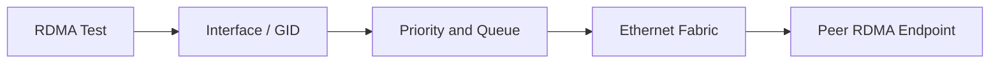

# Lab 04 — Troubleshoot a RoCE Path

| Field | Value |
|---|---|
| Difficulty | Advanced |
| Estimated time | 90 minutes |
| Platform | Nonproduction RoCE lab |
| Lab type | Failure and troubleshooting |

## 1. Objective

Use the link-to-application troubleshooting ladder to isolate and repair a controlled RoCE failure.

## 2. Background

RoCE incidents often look like generic network or NCCL failures. Layered evidence identifies the actual boundary.

## 3. Learning Outcomes

You will preserve evidence, find the first divergent layer, repair the condition, and verify recovery.

## 4. Architecture

## 5. Prerequisites

Completed Labs 01–03 and permission to modify only test-process configuration.

## 6. Environment

Capture healthy path, counters, and benchmark results.

## 7. Components

Interface, GID, route, MTU, marking, queue, PFC/ECN, QP, and completion status.

## 8. Deployment Steps

Inject one safe fault: select a wrong interface/GID, use a nonpreferred priority in an isolated namespace, or force a remote NIC. Record the expected symptom.

## 9. Validation

Confirm the fault is limited to the test.

## 10. Verification

Reproduce the failure and capture the first error or performance deviation.

## 11. Observability

Collect host route/GID state, NIC counters, switch queue telemetry, PFC/ECN, and RDMA completion data.

## 12. Performance Measurements

Compare healthy, failed, and repaired runs with identical parameters.

## 13. Failure Injection

Do not disable shared switch queues or change production MTU.

## 14. Troubleshooting

Validate physical/FEC, IP/VLAN/MTU, priority mapping, PFC/ECN, RDMA identity, GPU locality, and application transport in order.

## 15. Cleanup

Restore the healthy selection and rerun the baseline.

## 16. Summary

You isolated a RoCE path failure without random infrastructure changes.

## 17. Challenge Exercises

Automate a preflight report that identifies the injected mismatch.

## 18. Further Reading

- [Production Troubleshooting](../chapter-11-production-troubleshooting)
- [Volume 09 Summary](../chapter-12-volume-09-summary)
