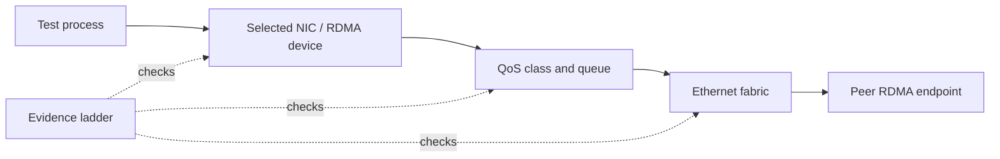

# Lab 04 — Troubleshoot a RoCE Path

| Field | Value |
|---|---|
| Difficulty | Advanced |
| Estimated time | 90–120 minutes |
| Platform | Isolated nonproduction RoCE lab |
| Lab type | Failure injection and diagnosis |

## 1. Objective

Use a link-to-application evidence ladder to isolate, repair, and verify a reversible RoCE *test-process* interface or device-selection fault without changing shared fabric configuration.

## 2. Background

RoCE incidents can present as generic application, NCCL, or network failures. Randomly changing MTU, PFC, ECN, or switch policies during an incident expands the blast radius. A layered method finds the first divergent condition and makes the repair provable.

## 3. Learning Outcomes

You will preserve a healthy baseline, inject one scoped selection error, capture the first meaningful failure evidence, distinguish endpoint selection from physical/fabric faults, restore the approved path, and compare repaired results with the original baseline.

## 4. Architecture



## 5. Prerequisites

- Completed Labs 01–03 and a documented healthy host-memory RoCE baseline.
- A dedicated lab path with permission to run test processes only.
- A second, reachable but nonpreferred interface/device selection **or** approval to skip injection.
- Approved test tool, stop procedure, and read-only host/switch telemetry.
- No production jobs or shared policy changes on the path.

## 6. Environment

Record healthy test parameters, source/destination assets, desired interface/RDMA device/port/GID selection, route, MTU, traffic class, switch peer, firmware/driver, tool version, timestamps, and baseline counters. Define the operator who can stop the test.

## 7. Components

- Source and peer host interfaces and RDMA resources;
- route/GID/addressing and host-memory RDMA test;
- NIC and switch physical/queue/congestion counters;
- inventory and configuration revisions from Lab 01;
- evidence bundle storage and recovery checklist.

## 8. Deployment Steps

### Step 1 — Reproduce the healthy baseline

**Purpose:** prove the environment before creating any test fault.

```bash
ip route get <peer-ip>
rdma link show
ethtool -S ensXfY
```

**Expected output:** the recorded route/device and a counter snapshot. Output is illustrative and must match the lab’s approved inventory.

**Explanation:** run the same approved host-memory test used in Lab 02 and save the command, result, and timestamp.

**Common failure interpretation:** if baseline is not healthy, do not inject a fault; investigate the existing condition first.

### Step 2 — Inject one process-scoped selection fault

**Purpose:** create a diagnosable failure without modifying routes, MTU, NIC, or switch policy.

Start the approved client test with an intentionally nonpreferred but reachable local interface or RDMA device/port selection. Use only options verified by that tool’s local `--help`; do not copy unverified syntax into an automation runbook.

```bash
# Inspect supported device/interface-selection options for this installed tool.
ib_write_bw --help
```

**Expected output:** the test may fail setup, use an unexpected rail, or show a measurable deviation. The exact output is tool and environment specific; label captured output as observed evidence.

**Explanation:** the injected state is confined to the test process. It is reversible by stopping it and using the healthy selection.

**Common failure interpretation:** if the alternate selection is not safe or reachable, stop and skip injection rather than changing infrastructure.

### Step 3 — Capture the evidence ladder

**Purpose:** find the earliest layer that differs from the healthy run.

```bash
ip route get <peer-ip>
rdma link show
ip link show dev ensXfY
ethtool -S ensXfY
```

**Expected output:** route/device/interface/counter state, with values varying by platform.

**Annotated real example — evidence ladder for device-selection fault:**

```bash
# Healthy baseline (Lab 02 result):
# ib_write_bw -d mlx5_0 -i 1 <peer-ip>
# Result: 392 Gb/s sustained, RTR success, no retries

# Injected fault: deliberately use mlx5_1 (wrong port/NUMA node):
$ ib_write_bw -d mlx5_1 -i 1 <peer-ip>
# Result: 156 Gb/s, 24 RETRY_EXC_ERR completions, completed in 8.2s instead of 2.1s

# Evidence layer 1 — Physical (switches to alternate device):
$ rdma link show
link mlx5_0/1 state ACTIVE physical_state LINK_UP netdev ens1f0    <- Primary, clean
link mlx5_1/1 state ACTIVE physical_state LINK_UP netdev ens1f1    <- Secondary, also clean
# Decision: both links are clean; issue is not physical.

# Evidence layer 2 — Route/MTU:
$ ip route get 10.20.8.5
10.20.8.5 via 10.20.0.1 dev ens1f1 src 10.20.4.24    <- forced to ens1f1 by device selection
    cache users 1 mtu 9000                           <- MTU matches

# Evidence layer 3 — RoCE/device (where first divergence appears):
$ ibv_devinfo -d mlx5_1 -i 1 | grep GID
GID[3]:  ... fe80::0c42:a1ff:fec8:d79d/64          <- valid but mismatched from expected
$ ibv_devinfo -d mlx5_0 -i 1 | grep GID
GID[3]:  ... fe80::0c42:a1ff:fec8:d79b/64          <- healthier neighbor mapping

# Evidence layer 4 — QoS/queue deltas during injected fault:
$ ethtool -S ens1f1 | egrep "ecn_marked|retry|completions"
     rx_ecn_marked_prio3: 142        <- higher mark rate (congestion feedback)
     Some driver-specific counters may show high-retry signatures
```

**Explanation:** First three layers clean; first divergence at Layer 3 (RoCE GID mismatch). The symptom (392→156 Gb/s drop, retries) stems from selecting a misaligned endpoint GID, not from physical faults or fabric misconfiguration. Repair: stop the test and rerun with `-d mlx5_0` (the health baseline device). The evidence ladder prevents misdirected tuning of ECN/PFC when the root is endpoint selection.

**Common failure interpretation:** clean physical and switch counters plus wrong test selection points to an endpoint/process issue, not a reason to tune PFC.

### Step 4 — Repair and verify

**Purpose:** prove that the identified mismatch, not an unrelated change, caused the symptom.

Stop the faulty process. Restart the same approved test with the healthy device/interface selection and otherwise identical parameters. Capture final endpoint and switch deltas.

**Expected output:** completion and behavior return to the documented healthy range. Numeric results are valid only for the recorded environment.

**Explanation:** compare healthy, injected, and repaired records. If the repair does not restore behavior, stop and escalate with the evidence bundle.

**Common failure interpretation:** a persistent issue after restoring selection may reveal a real lab fault; do not add new changes.

## 9. Validation

The exercise is valid when the injected mismatch is restricted to the test process, baseline and repair use identical parameters, no shared policy changed, and the evidence identifies the first divergent layer.

## 10. Verification

Create a three-column comparison: healthy, injected, repaired. Include interface/device choice, route, test outcome, relevant NIC/switch deltas, and timestamps. A successful repair must be demonstrated by the same test and path, not a different tool or endpoint.

## 11. Observability

Collect host route/GID/device state, test logs and first error, NIC physical/error counters, switch port/queue/ECN/PFC/drop deltas, and configuration revisions. Preserve the selected rail and peer port so the result is reproducible.

## 12. Performance Measurements

Compare only the same message size, concurrency, tool version, endpoint pair, and duration. Report the injected run as a diagnostic observation; never generalize it into a platform benchmark.

## 13. Failure Injection

Only a **test-process interface or RDMA device selection mismatch** is permitted. Never disable a port, alter MTU, change GID tables, modify PFC/ECN/DCQCN, alter routing, or change a switch queue. Reversal is stopping the process and rerunning with the recorded healthy selection.

## 14. Troubleshooting

| Layer | Question | Evidence | Action |
|---|---|---|---|
| Physical | Is link/FEC state healthy? | host and switch port state/errors | stop for a physical fault |
| L3/MTU | Does route use the intended path? | `ip route get`, MTU inventory | restore test selection; do not edit route |
| RoCE | Is the expected device/port/GID selected? | RDMA inventory/tool options | correct process arguments |
| QoS | Is traffic in expected class? | queue/ECN/PFC deltas | involve fabric owner if mismatch |
| Workload | Does repair restore the same test? | controlled comparison | escalate if it does not |

## 15. Cleanup

Stop all test processes; verify no listeners/clients remain; restore the approved process selection; collect final counters; check that lab alarms and traffic are idle; store or redact the evidence bundle according to policy.

## 16. Summary

You diagnosed a RoCE symptom by preserving evidence and changing one process-scoped variable. This limits risk and makes the repair auditable.

## 17. Challenge Exercises

1. Build a preflight script that detects a route/device mismatch before a test starts.
2. Add a topology-aware report showing selected GPU, NIC, rail, leaf port, and peer.
3. Write an incident handoff template containing the first divergent layer and evidence links.

## 18. Further Reading

- [ConnectX Ethernet Adapters](../chapter-08-connectx-ethernet-adapters)
- [Fabric Validation and Capacity Planning](../chapter-10-fabric-validation-and-capacity-planning)
- [Production Troubleshooting](../chapter-11-production-troubleshooting)
