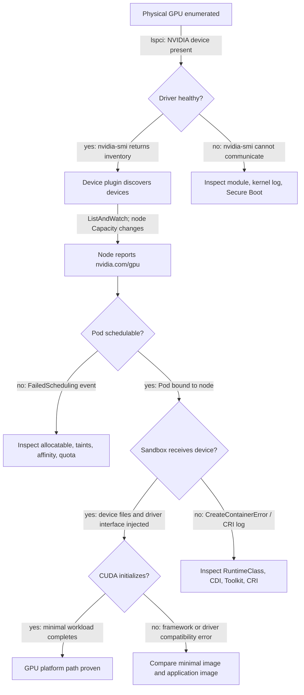
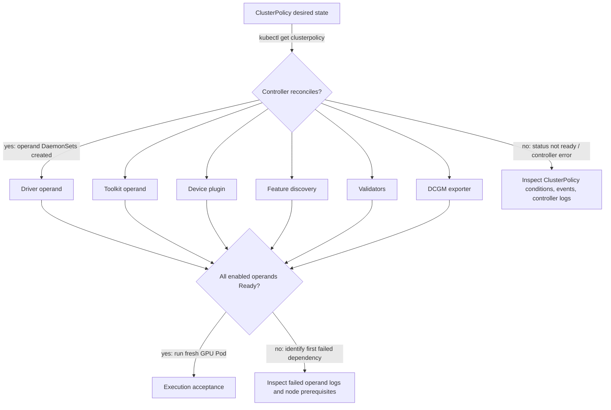

# Why Kubernetes Needs a GPU Platform Layer

Kubernetes knows how to reserve CPU and memory that the kubelet already understands. A GPU arrives with a different operating contract. Before a Pod can execute CUDA, the host must enumerate the device and load a working driver; a device plugin must report an allocatable resource; the kubelet must allocate a device; and the container runtime must construct a sandbox with the selected device and compatible driver interface. Kubernetes supplies extension points for this process. It does not supply the vendor-specific implementation or the lifecycle discipline around it.

That distinction matters in production. A node can be `Ready` while its driver module is absent. It can advertise `nvidia.com/gpu` while a runtime change prevents containers from seeing the allocated device. It can run a basic CUDA sample while still being the wrong placement for a topology-sensitive distributed job. The GPU platform layer owns the evidence between those statements.

## Learning Objectives

After this chapter, you can:

- trace the control and execution paths from a physical GPU to a running Pod;
- separate driver, runtime, discovery, allocation, scheduling, and workload responsibilities;
- identify the layers that must be validated after node or cluster change;
- choose a host-managed, operator-managed, or hybrid ownership model; and
- explain why a GPU Operator is lifecycle infrastructure rather than an installation shortcut.

## Two Paths Must Agree



**Figure 10.1.1 — The first diagram is also the incident decision path.** Every edge carries the evidence that proves the handoff. A node is not admitted because one box is green; it is admitted only when the path reaches a completed workload.

The device plugin reports devices and their health to the kubelet. The kubelet makes the resulting extended resource visible through node status. The scheduler uses that resource request when choosing a node. After binding, the kubelet invokes allocation and hands the result to the runtime. The runtime integration, not the scheduler, performs the device-facing work needed to start the container.

This order is a useful incident boundary. A Pending Pod is usually a resource or placement question. A bound Pod whose GPU process cannot initialize is usually a runtime, driver, image, or application question. Starting with that split avoids treating every GPU failure as “a Kubernetes problem.”

### Read the path from real evidence

The following outputs are **representative**, not captured from the current documentation build environment. They are structurally realistic and use concrete values so that every field can be interpreted.

**Purpose:** prove that Kubernetes is generally healthy but the GPU resource contract is missing.

```bash
kubectl get node gpu-node-01 -o custom-columns='NAME:.metadata.name,READY:.status.conditions[?(@.type=="Ready")].status,GPU-CAP:.status.capacity.nvidia\.com/gpu,GPU-ALLOC:.status.allocatable.nvidia\.com/gpu'
```

**Representative output:**

```text
NAME          READY   GPU-CAP   GPU-ALLOC
gpu-node-01   True    <none>    <none>
```

`READY=True` proves that kubelet heartbeats and the general node health contract are working. `<none>` in both GPU columns proves that Kubernetes has no registered `nvidia.com/gpu` capacity on this node. It does **not** prove that the physical GPU is absent; the next boundary is host driver and device-plugin registration.

**Purpose:** distinguish host-driver health from the Kubernetes advertisement failure.

```bash
nvidia-smi --query-gpu=index,name,uuid,driver_version,memory.total --format=csv,noheader
```

**Representative healthy output:**

```text
0, NVIDIA H100 80GB HBM3, GPU-3c2e38d1-6a2c-4a31-b44b-9d82a8c80735, 550.54.15, 81559 MiB
1, NVIDIA H100 80GB HBM3, GPU-722d1344-1b6d-4a95-8cb9-1c572eb5ad94, 550.54.15, 81559 MiB
```

The two rows prove that the host driver can enumerate two devices and retrieve NVML data. The UUIDs are stable device identities and are more reliable than index numbers across some lifecycle operations. This output narrows the incident to the device-plugin or kubelet registration path; it does not validate container runtime injection.

A broken host boundary looks different:

```text
NVIDIA-SMI has failed because it couldn't communicate with the NVIDIA driver.
Make sure that the latest NVIDIA driver is installed and running.
```

That message moves the investigation below Kubernetes. Restarting the device-plugin DaemonSet would only add noise while the host driver remains unavailable.

## Why a Count Is Not a GPU Service

Kubernetes extended resources intentionally model a vendor device as a quantity. A request for `nvidia.com/gpu: 1` says that one allocatable unit is required. It does not communicate usable memory, compute capability, NVLink adjacency, GPU-to-NIC locality, sharing mode, tenant policy, or the application’s communication pattern.

| Layer | Platform responsibility | Typical false positive |
|---|---|---|
| Hardware and firmware | Enumerate a healthy device and preserve a supportable platform state | PCI device exists but is unusable after a reset |
| Driver | Bind the kernel to the GPU and provide the driver interface | Module package is installed but not loaded |
| Runtime integration | Inject the allocated device and required driver-facing artifacts | Pod starts without a usable GPU |
| Device plugin and kubelet | Publish healthy capacity and service allocation | Resource is advertised but runtime access fails |
| Scheduling policy | Select an eligible node and enforce workload intent | One GPU is available, but not in the required pool or topology |
| Workload stack | Initialize CUDA and execute the intended job | Minimal test passes; framework image fails |

This is why a platform normally publishes workload classes in addition to the bare resource name. Labels, taints, affinity, quotas, topology policy, and—where applicable—sharing configuration express the constraints that a device count cannot. [Chapter 8](./chapter-08-gpu-scheduling-and-topology) examines the cost: each constraint improves predictability but can fragment capacity.

### Worked capacity example: free GPUs that cannot satisfy a request

Assume four nodes each have one free GPU:

```text
node-a: 1 free
node-b: 1 free
node-c: 1 free
node-d: 1 free
----------------
cluster total: 4 free GPUs
```

A Pod requesting four GPUs requires all four on **one** node because a Kubernetes Pod is bound to one node:

```yaml
resources:
  limits:
    nvidia.com/gpu: 4
```

The cluster has four free GPUs in aggregate but zero nodes satisfying the request. This is fragmentation, not a discrepancy in accounting. Adding the four node values together produces a capacity number that is operationally misleading for this workload shape.

## The Operational Failure of Manual Configuration

Manual installation may be acceptable for a tightly controlled lab node. It ages poorly in a fleet. Kernel updates can invalidate a driver build; an image refresh can replace runtime configuration; a rebuilt node can return without discovery or telemetry; and a one-off fix can leave no declarative record of intended state. The result is not merely configuration drift. It is an inability to prove which nodes may safely receive expensive jobs.

Consider a maintenance window that updates the base operating system across a mixed CPU and GPU pool. CPU Pods return after reboot. GPU Pods are Pending on part of the fleet because those nodes no longer advertise a resource. Other nodes advertise GPUs but fail during container creation because their runtime configuration differs. The incident is not one failure; it is two broken contracts caused by one uncontrolled lifecycle change.

A production response starts with a GPU-specific node acceptance gate: driver evidence, runtime evidence, advertised capacity, a minimal workload, and telemetry. Nodes that do not pass stay out of the eligible pool. The longer-term response makes the gate automatic and the version set explicit.

### Worked rollout example

A 32-node GPU pool has eight GPUs per node:

```text
32 nodes × 8 GPUs = 256 physical GPUs
```

Upgrading four nodes at a time removes 32 GPUs from service:

```text
4 nodes × 8 GPUs = 32 GPUs unavailable
224 / 256 = 87.5% nominal capacity remains
```

That 87.5% is an upper bound. If queued jobs require eight GPUs on the same node, draining four nodes may remove four entire scheduling slots and create fragmentation before raw utilization reaches 87.5%. The maintenance plan therefore needs workload-shape evidence, not only a fleet-wide percentage.

## What the GPU Operator Changes—and What It Does Not

NVIDIA GPU Operator reconciles a set of Kubernetes operands for the GPU software stack. Depending on its configuration, those operands can include driver management, container-toolkit configuration, the device plugin, feature discovery, validators, and DCGM-based telemetry. It makes desired state visible in Kubernetes and makes node-local deployment repeatable.



**Figure 10.1.2 — The operator coordinates operands; it does not erase their boundaries.** A single policy improves consistency, but it can also distribute a bad configuration quickly. Promotion still depends on workload evidence.

| Ownership model | Appropriate when | Principal trade-off |
|---|---|---|
| Host-managed driver and runtime | A base-image or OS team owns the complete host lifecycle | Desired state and diagnosis span systems outside Kubernetes |
| Operator-managed node stack | Kubernetes is the primary lifecycle control plane and supported node images are deliberate | Operator, kernel, driver, and runtime versions must be qualified together |
| Hybrid | Enterprise controls require host ownership of selected layers | Boundaries must be written down; two systems must never reconcile the same setting |

The decision is architectural, not ideological. Immutable OS policy, secure-boot processes, disconnected registries, support boundaries, and rollback requirements can justify different choices. What cannot vary is ownership: for each layer, one team and one reconciler must be authoritative.

## Production Checklist: Before a GPU Node Accepts Work

1. Confirm the host sees the intended GPUs and the supported driver is loaded.
2. Confirm the runtime integration works with a minimal GPU container.
3. Confirm the device plugin publishes the expected allocatable resource.
4. Confirm discovery labels and pool policy make the node eligible for the intended workloads.
5. Confirm a representative workload and telemetry pass on the canary.

Steps 2 and 3 deliberately test different paths. The exact evidence and safe commands belong in the change procedure; do not substitute an application team’s ad hoc container for the platform’s acceptance test.

## Troubleshooting Model

| Symptom | First boundary to inspect | Next question |
|---|---|---|
| `nvidia.com/gpu` absent | Driver, device plugin, and kubelet | Is the device healthy and the plugin registered? |
| Pod remains Pending | Request, allocatable capacity, taints, and affinity | Is this capacity shortage, fragmentation, or policy? |
| Pod is bound but cannot see a GPU | Allocation result and runtime integration | Did the sandbox receive the selected device? |
| CUDA initialization fails | Driver-to-container compatibility and image | Is the failure node-specific or image-specific? |
| Only one pool fails | Drift in kernel, driver, toolkit, or policy | What differs from the last known-good node? |

### Evidence row 1: resource absent while the host is healthy

**Purpose:** find whether the device-plugin DaemonSet is present and ready on the affected node.

```bash
kubectl -n gpu-operator get pods -o wide | grep gpu-node-01
```

**Representative broken output:**

```text
nvidia-driver-daemonset-7z9kp          1/1   Running            0   18m   10.42.3.12   gpu-node-01
nvidia-container-toolkit-daemonset-x5m 1/1   Running            0   17m   10.42.3.14   gpu-node-01
nvidia-device-plugin-daemonset-bp7jf   0/1   CrashLoopBackOff   6   16m   10.42.3.15   gpu-node-01
```

The host driver and toolkit operands are Running, while the device-plugin Pod is failing. This matches the missing resource: the component responsible for kubelet registration is unavailable. `CrashLoopBackOff` is a restart policy state, not a root cause; the next evidence is the previous container log.

```bash
kubectl -n gpu-operator logs nvidia-device-plugin-daemonset-bp7jf --previous
```

```text
E0806 12:14:09.772091 factory.go:115] Incompatible strategy detected: auto
E0806 12:14:09.772145 main.go:227] error creating plugin manager: no valid devices found
```

The first line identifies configuration strategy evaluation; the second states that the plugin produced no valid devices. Because host `nvidia-smi` already succeeded, compare plugin configuration and mounts rather than reinstalling the driver.

### Evidence row 2: Pending Pod caused by fragmentation, not total shortage

```bash
kubectl describe pod four-gpu-trainer | sed -n '/Events:/,$p'
```

**Representative output:**

```text
Events:
  Type     Reason            Age   From               Message
  ----     ------            ----  ----               -------
  Warning  FailedScheduling  42s   default-scheduler  0/4 nodes are available: 4 Insufficient nvidia.com/gpu.
```

```bash
kubectl get nodes -o custom-columns='NAME:.metadata.name,ALLOC:.status.allocatable.nvidia\.com/gpu' \
  && kubectl get pods -A -o custom-columns='NODE:.spec.nodeName,GPU:.spec.containers[*].resources.limits.nvidia\.com/gpu' | grep gpu-node
```

```text
NAME          ALLOC
gpu-node-a    8
gpu-node-b    8
gpu-node-c    8
gpu-node-d    8

NODE          GPU
gpu-node-a    7
gpu-node-b    7
gpu-node-c    7
gpu-node-d    7
```

Each node advertises eight GPUs and already has seven allocated, leaving one free per node. The scheduler message is therefore correct: no single node has four available GPUs. The fix is to drain or reschedule lower-priority work, change the workload shape, or add a suitable node—not to restart the scheduler.

### Evidence row 3: bound Pod fails at the runtime boundary

```bash
kubectl get pod cuda-check -o wide
kubectl describe pod cuda-check | sed -n '/Events:/,$p'
```

```text
NAME         READY   STATUS                 NODE
cuda-check   0/1     CreateContainerError   gpu-node-02

Events:
  Warning  Failed  8s  kubelet  Error: failed to create containerd task: failed to create shim task:
  OCI runtime create failed: requested CDI device vendor.com/nvidia/gpu=0 not found
```

The Pod is already assigned to `gpu-node-02`; scheduler policy is no longer the active boundary. The explicit CDI device-resolution error points to runtime/toolkit configuration or a stale CDI specification. Inspecting quotas or adding affinity would not address this failure.

Do not delete all operator Pods to “start fresh.” That can erase the first useful symptom and expand an outage. Identify the lowest failed layer, capture its events and logs, correct the dependency, and then verify the next layer upward.

## Customer Architecture Discussion

When a customer asks why ordinary Kubernetes is insufficient, answer in terms of service ownership: Kubernetes schedules a resource after a plugin advertises it. It does not install the GPU driver, integrate the runtime, label capabilities, validate CUDA, coordinate a kernel change, or define which workload classes may use which pool. The platform layer makes those responsibilities explicit and observable.

The strongest design deliverable is therefore a support contract, not a Helm command: supported combinations, owner for each layer, acceptance evidence, change gates, rollback point, and escalation path.

### Worked customer sizing discussion

A customer with eight nodes and eight GPUs per node owns 64 GPUs. If they reserve one node as a canary and one node as failure/maintenance headroom, the guaranteed production pool is:

```text
(8 total nodes − 2 reserved nodes) × 8 GPUs = 48 guaranteed GPUs
```

The remaining 16 GPUs are not wasted. They purchase controlled change, failure recovery, and the ability to compare a suspect release with a known-good node. The architecture conversation should make this reliability trade-off explicit instead of advertising all 64 GPUs as continuously schedulable capacity.

## Interview Questions

**Why can `nvidia-smi` work on the host while a Kubernetes Pod cannot use the GPU?**

> “I treat host visibility and Pod usability as separate gates. A successful `nvidia-smi` proves that the host driver can communicate with the device. It does not prove that the device plugin advertised capacity, that kubelet allocated a device, or that the container runtime injected the assigned device and driver interface. I would first check whether the Pod is Pending, bound, or failing during container creation. That state tells me whether to investigate scheduling, allocation, or runtime injection rather than restarting components indiscriminately.”

**Why is the default GPU resource model insufficient for distributed training?**

> “The extended resource communicates quantity, not communication topology. A request for eight GPUs does not say whether those GPUs share NVLink, whether they are close to the selected NIC, or whether eight training ranks must start together. I would combine the resource request with controlled node labels, affinity, topology policy, and a job scheduler that understands coordinated placement. I would also explain the utilization trade-off, because tighter placement constraints can leave otherwise healthy GPUs idle.”

**Whiteboard question: draw the GPU Pod path and explain where you would diagnose a failure.**

> “I would draw two paths that meet at container creation. The control path goes from the physical device to the driver, device plugin, kubelet, API server, scheduler, and Pod binding. The execution path goes from the bound Pod through kubelet allocation, the CRI runtime, NVIDIA Toolkit or CDI, the host driver, and finally CUDA initialization. At each edge I would write one proof: `nvidia-smi` for the driver, node allocatable resources for plugin registration, scheduler events for placement, CRI events for sandbox creation, and a minimal CUDA command for execution. Then I would start at the first failed proof rather than the most visible symptom.”

## Key Takeaways

- A GPU platform is the agreement between host, Kubernetes, runtime, and workload contracts.
- Resource advertisement and container execution are independent validation gates.
- An extended-resource count is not a topology, performance, or tenancy policy.
- Operator reconciliation reduces drift but cannot replace version qualification or rollback discipline.
- Node `Ready` is not GPU-platform ready.

## Cross References

- [Volume 10 introduction](./index)
- [GPU Software Lifecycle in Kubernetes](./chapter-02-gpu-software-lifecycle-in-kubernetes)
- [CUDA Software Stack](../volume-03/chapter-02-cuda-software-stack)
- [GPU Scheduling and Topology](./chapter-08-gpu-scheduling-and-topology)
