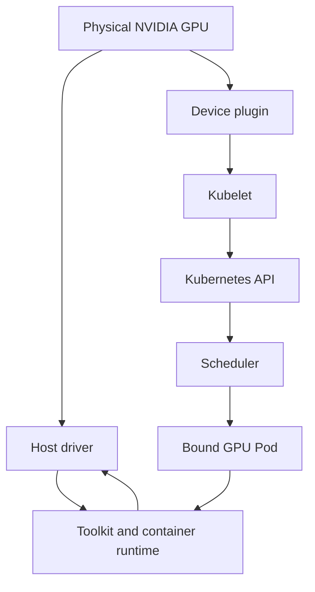
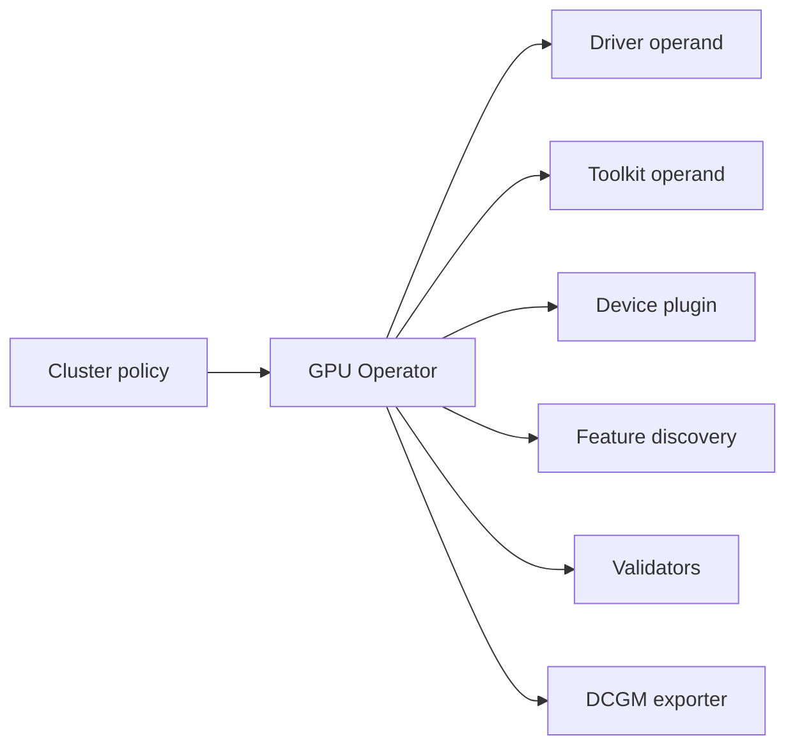

# Why Kubernetes Needs a GPU Platform Layer

Kubernetes knows how to reserve CPU and memory that the kubelet already understands. A GPU arrives with a different operating contract. Before a Pod can execute CUDA, the host must enumerate the device and load a working driver; a device plugin must report an allocatable resource; the kubelet must allocate a device; and the container runtime must construct a sandbox with the selected device and compatible driver interface. Kubernetes supplies extension points for this process. It does not supply the vendor-specific implementation or the lifecycle discipline around it.

That distinction matters in production. A node can be `Ready` while its driver module is absent. It can advertise `nvidia.com/gpu` while a runtime change prevents containers from seeing the allocated device. It can run a basic CUDA sample while still being the wrong placement for a topology-sensitive distributed job. The GPU platform layer owns the evidence between those statements.

## Learning Objectives

After this chapter, you can:

- trace the control and execution paths from a physical GPU to a running Pod;
- separate driver, runtime, discovery, allocation, scheduling, and workload responsibilities;
- identify the layers that must be validated after node or cluster change;
- choose a host-managed, operator-managed, or hybrid ownership model; and
- explain why a GPU Operator is lifecycle infrastructure rather than an installation shortcut.

## Two Paths Must Agree

**Figure 10.1.1 — Control-plane advertisement and runtime execution are distinct.** The upper-left path exposes a resource to Kubernetes. The lower-right path makes the device selected for a particular Pod available in its container. A platform is healthy only when both paths work.

The device plugin reports devices and their health to the kubelet. The kubelet makes the resulting extended resource visible through node status. The scheduler uses that resource request when choosing a node. After binding, the kubelet invokes allocation and hands the result to the runtime. The runtime integration, not the scheduler, performs the device-facing work needed to start the container.

This order is a useful incident boundary. A Pending Pod is usually a resource or placement question. A bound Pod whose GPU process cannot initialize is usually a runtime, driver, image, or application question. Starting with that split avoids treating every GPU failure as “a Kubernetes problem.”

## Why a Count Is Not a GPU Service

Kubernetes extended resources intentionally model a vendor device as a quantity. A request for `nvidia.com/gpu: 1` says that one allocatable unit is required. It does not communicate usable memory, compute capability, NVLink adjacency, GPU-to-NIC locality, sharing mode, tenant policy, or the application’s communication pattern.

| Layer | Platform responsibility | Typical false positive |
|---|---|---|
| Hardware and firmware | Enumerate a healthy device and preserve a supportable platform state | PCI device exists but is unusable after a reset |
| Driver | Bind the kernel to the GPU and provide the driver interface | Module package is installed but not loaded |
| Runtime integration | Inject the allocated device and required driver-facing artifacts | Pod starts without a usable GPU |
| Device plugin and kubelet | Publish healthy capacity and service allocation | Resource is advertised but runtime access fails |
| Scheduling policy | Select an eligible node and enforce workload intent | One GPU is available, but not in the required pool or topology |
| Workload stack | Initialize CUDA and execute the intended job | Minimal test passes; framework image fails |

This is why a platform normally publishes workload classes in addition to the bare resource name. Labels, taints, affinity, quotas, topology policy, and—where applicable—sharing configuration express the constraints that a device count cannot. [Chapter 8](./chapter-08-gpu-scheduling-and-topology) examines the cost: each constraint improves predictability but can fragment capacity.

## The Operational Failure of Manual Configuration

Manual installation may be acceptable for a tightly controlled lab node. It ages poorly in a fleet. Kernel updates can invalidate a driver build; an image refresh can replace runtime configuration; a rebuilt node can return without discovery or telemetry; and a one-off fix can leave no declarative record of intended state. The result is not merely configuration drift. It is an inability to prove which nodes may safely receive expensive jobs.

Consider a maintenance window that updates the base operating system across a mixed CPU and GPU pool. CPU Pods return after reboot. GPU Pods are Pending on part of the fleet because those nodes no longer advertise a resource. Other nodes advertise GPUs but fail during container creation because their runtime configuration differs. The incident is not one failure; it is two broken contracts caused by one uncontrolled lifecycle change.

A production response starts with a GPU-specific node acceptance gate: driver evidence, runtime evidence, advertised capacity, a minimal workload, and telemetry. Nodes that do not pass stay out of the eligible pool. The longer-term response makes the gate automatic and the version set explicit.

## What the GPU Operator Changes—and What It Does Not

NVIDIA GPU Operator reconciles a set of Kubernetes operands for the GPU software stack. Depending on its configuration, those operands can include driver management, container-toolkit configuration, the device plugin, feature discovery, validators, and DCGM-based telemetry. It makes desired state visible in Kubernetes and makes node-local deployment repeatable.

**Figure 10.1.2 — The operator coordinates operands; it does not remove their compatibility boundaries.** A single policy can improve consistency, but it can also spread a bad version or configuration quickly. Canary pools, drains, validation, and rollback remain platform responsibilities.

| Ownership model | Appropriate when | Principal trade-off |
|---|---|---|
| Host-managed driver and runtime | A base-image or OS team owns the complete host lifecycle | Desired state and diagnosis span systems outside Kubernetes |
| Operator-managed node stack | Kubernetes is the primary lifecycle control plane and supported node images are deliberate | Operator, kernel, driver, and runtime versions must be qualified together |
| Hybrid | Enterprise controls require host ownership of selected layers | Boundaries must be written down; two systems must never reconcile the same setting |

The decision is architectural, not ideological. Immutable OS policy, secure-boot processes, disconnected registries, support boundaries, and rollback requirements can justify different choices. What cannot vary is ownership: for each layer, one team and one reconciler must be authoritative.

## Production Checklist: Before a GPU Node Accepts Work

1. Confirm the host sees the intended GPUs and the supported driver is loaded.
2. Confirm the runtime integration works with a minimal GPU container.
3. Confirm the device plugin publishes the expected allocatable resource.
4. Confirm discovery labels and pool policy make the node eligible for the intended workloads.
5. Confirm a representative workload and telemetry pass on the canary.

Steps 2 and 3 deliberately test different paths. The exact evidence and safe commands belong in the change procedure; do not substitute an application team’s ad hoc container for the platform’s acceptance test.

## Troubleshooting Model

| Symptom | First boundary to inspect | Next question |
|---|---|---|
| `nvidia.com/gpu` absent | Driver, device plugin, and kubelet | Is the device healthy and the plugin registered? |
| Pod remains Pending | Request, allocatable capacity, taints, and affinity | Is this capacity shortage, fragmentation, or policy? |
| Pod is bound but cannot see a GPU | Allocation result and runtime integration | Did the sandbox receive the selected device? |
| CUDA initialization fails | Driver-to-container compatibility and image | Is the failure node-specific or image-specific? |
| Only one pool fails | Drift in kernel, driver, toolkit, or policy | What differs from the last known-good node? |

Do not delete all operator Pods to “start fresh.” That can erase the first useful symptom and expand an outage. Identify the lowest failed layer, capture its events and logs, correct the dependency, and then verify the next layer upward.

## Customer Architecture Discussion

When a customer asks why ordinary Kubernetes is insufficient, answer in terms of service ownership: Kubernetes schedules a resource after a plugin advertises it. It does not install the GPU driver, integrate the runtime, label capabilities, validate CUDA, coordinate a kernel change, or define which workload classes may use which pool. The platform layer makes those responsibilities explicit and observable.

The strongest design deliverable is therefore a support contract, not a Helm command: supported combinations, owner for each layer, acceptance evidence, change gates, rollback point, and escalation path.

## Interview Questions

**Why can `nvidia-smi` work on the host while a Kubernetes Pod cannot use the GPU?**

Host visibility validates the driver and host device path. It does not validate device-plugin allocation or the runtime injection that occurs when the Pod sandbox is created.

**Why is the default GPU resource model insufficient for distributed training?**

It represents quantity. It does not inherently express peer topology, CPU and NIC locality, or coordinated placement of multiple Pods. Those requirements need explicit labels, policies, and often job-level scheduling controls.

## Key Takeaways

- A GPU platform is the agreement between host, Kubernetes, runtime, and workload contracts.
- Resource advertisement and container execution are independent validation gates.
- An extended-resource count is not a topology, performance, or tenancy policy.
- Operator reconciliation reduces drift but cannot replace version qualification or rollback discipline.
- Node `Ready` is not GPU-platform ready.

## Cross References

- [Volume 10 introduction](./index)
- [GPU Software Lifecycle in Kubernetes](./chapter-02-gpu-software-lifecycle-in-kubernetes)
- [CUDA Software Stack](../volume-03/chapter-02-cuda-software-stack)
- [GPU Scheduling and Topology](./chapter-08-gpu-scheduling-and-topology)
