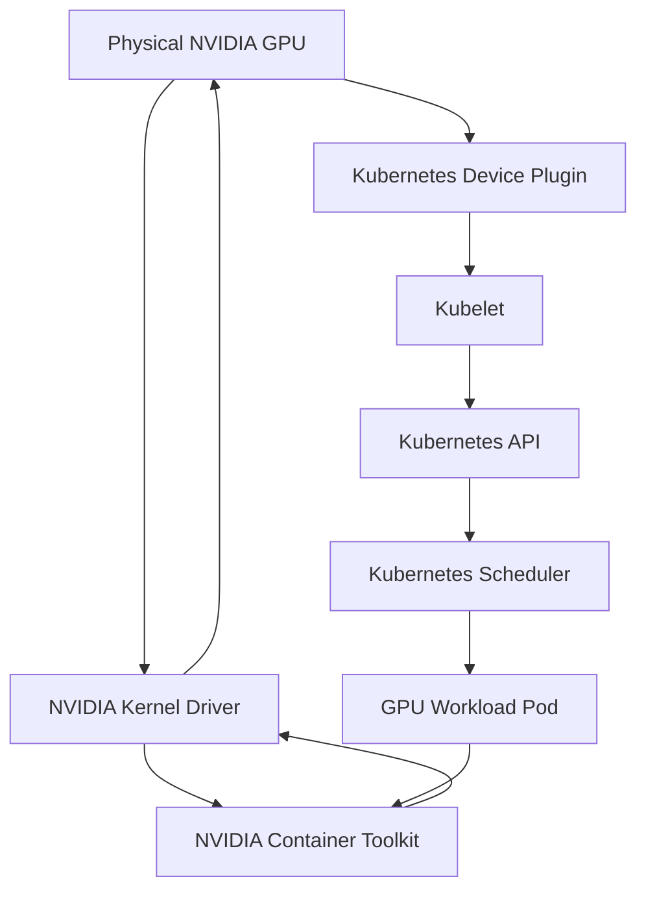
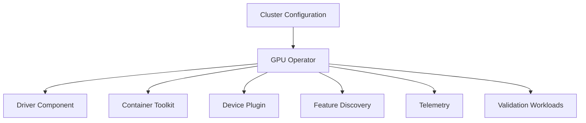

# Why Kubernetes Needs a GPU Platform Layer

A Kubernetes cluster can schedule CPU and memory without installing a special platform stack on every node. A GPU is different. The operating system must load a compatible driver, the container runtime must expose device libraries and files, Kubernetes must discover and advertise the resource, the scheduler must place a Pod on an appropriate node, and the workload must receive a healthy device at runtime.

If any link in that chain fails, the Pod may remain pending, start without GPU access, crash during initialization, or run on a node whose software state is inconsistent with the rest of the fleet.

## Learning Objectives

After completing this chapter, you will be able to:

- explain why Kubernetes does not manage GPUs natively as ordinary CPU resources;
- trace the path from physical hardware to a schedulable extended resource;
- distinguish driver, runtime, discovery, scheduling, and health responsibilities;
- explain the operational problem solved by GPU Operator;
- identify failure domains in a Kubernetes GPU node;
- describe when operator-managed and host-managed approaches are appropriate.

## The Resource Does Not Appear Automatically

Kubernetes does not inspect a GPU and construct a complete device lifecycle on its own. Several components must cooperate.

**Figure 10.1.1 — A GPU becomes usable through two related paths.** The control path advertises the resource to Kubernetes; the runtime path exposes the selected device to the container.

A node can have a functioning driver while advertising no GPU resource. It can advertise a resource while the container runtime is misconfigured. It can schedule a Pod successfully while the workload fails because user-space libraries are incompatible. Each layer needs separate validation.

## Extended Resources and Scheduling

Kubernetes represents vendor devices as extended resources. A device plugin discovers available devices and reports their capacity to the kubelet. The kubelet publishes allocatable resources to the API. A Pod requests a resource such as an NVIDIA GPU, and the scheduler selects a node that reports sufficient capacity.

This model deliberately avoids teaching the core scheduler every hardware-specific detail. The benefit is extensibility. The cost is that the vendor integration must provide discovery, allocation, and health behavior correctly.

The scheduler normally treats the GPU as an integer resource. It does not automatically understand memory capacity, interconnect topology, workload communication patterns, graphics capability, or tenant-isolation requirements. Additional labels, policies, schedulers, or resource-sharing mechanisms are needed when placement requires more than device count.

## The Five Layers of a GPU Node

| Layer | Responsibility | Typical failure |
|---|---|---|
| Hardware and firmware | Provide a visible and healthy device | GPU missing, reset failure, hardware fault |
| Kernel driver | Bind the operating system to the GPU | Module not loaded, version mismatch |
| Container runtime integration | Inject devices and user-space libraries | Pod starts without GPU access |
| Kubernetes discovery and allocation | Advertise and assign resources | No allocatable GPU, unhealthy device |
| Workload software | Use a compatible CUDA and framework stack | Initialization or runtime error |

A production runbook should preserve this order. Starting with the application logs before confirming hardware, driver, and allocation state often wastes time.

## Why Manual Node Configuration Does Not Scale

A small cluster can be configured by installing drivers and runtime packages manually. At fleet scale, several operational problems emerge:

- nodes drift to different driver versions;
- kernel updates invalidate modules;
- runtime configuration differs by node;
- discovery components are missing after rebuilds;
- monitoring is installed inconsistently;
- upgrades occur without drain and rollback policy;
- operators cannot determine the intended state from the cluster API.

Manual work also makes recovery dependent on the engineer who remembers how a node was prepared.

A platform layer converts these steps into declarative resources and controllers. The desired software stack becomes visible, repeatable, and observable through Kubernetes.

## The Role of GPU Operator

GPU Operator coordinates the lifecycle of several NVIDIA components. Depending on configuration, it can manage or deploy:

- drivers or driver containers;
- container toolkit integration;
- device plugin;
- node and GPU feature discovery;
- health and validation workloads;
- telemetry components;
- supporting runtime configuration.

The operator does not remove the need for architecture. Teams must still choose host-installed or containerized drivers, define supported versions, control upgrades, separate node pools, monitor health, and design rollback procedures.

## Host-Managed Versus Operator-Managed Components

| Approach | Strengths | Trade-offs |
|---|---|---|
| Host-managed driver and runtime | Fits established OS image and configuration-management practices | Kubernetes sees less of the lifecycle; drift may exist outside cluster control |
| Operator-managed components | Declarative deployment, consistent reconciliation, cluster-visible health | Requires compatibility planning and careful coordination with OS/kernel changes |
| Hybrid model | Preserves selected enterprise controls while using operator services | Ownership boundaries must be explicit to avoid two systems managing one component |

The correct approach depends on platform ownership, OS immutability, security policy, support matrix, disconnected operation, and upgrade practices.

## Production Scenario

A cluster upgrade changes the host kernel on half of the GPU nodes. CPU workloads recover normally, but GPU Pods remain pending because the driver module did not rebuild successfully. Other nodes still advertise GPUs, causing uneven capacity and queue delays.

The incident review finds that the Kubernetes upgrade plan did not include the GPU software compatibility matrix or an explicit validation gate. The remediation introduces a dedicated GPU node canary, drain procedures, driver readiness checks, a CUDA validation Pod, and rollback criteria before expanding the change.

The lesson is that Kubernetes lifecycle and GPU lifecycle must be planned together.

## Troubleshooting Framework

**Symptoms**

- `nvidia.com/gpu` is absent from node capacity;
- a GPU Pod remains pending despite visible hardware;
- the Pod starts but cannot execute `nvidia-smi`;
- only some nodes accept GPU workloads;
- resources disappear after a reboot or kernel update;
- device plugin Pods restart repeatedly.

**Diagnosis**

1. Confirm the node sees the physical GPU.
2. Validate the NVIDIA driver on the host.
3. Inspect container runtime configuration.
4. Check device-plugin and operator component health.
5. Review node capacity and allocatable resources.
6. Describe the pending or failed Pod.
7. Validate the workload image and CUDA compatibility.

**Root cause pattern**

One layer reports success while an upstream or downstream dependency is unhealthy or incompatible.

**Prevention**

Define a node acceptance test, version policy, canary process, automated validation workload, and observability for every GPU platform component.

## Customer Perspective

When a customer says, “We already have Kubernetes; why do we need GPU Operator?” the answer should focus on lifecycle coordination. Kubernetes schedules the resource after it has been discovered and advertised. It does not by itself install the vendor driver, configure the runtime, deploy the device plugin, label capabilities, validate the stack, or manage telemetry.

The value is repeatability and operational control—not merely installation convenience.

## Interview Preparation

### Architecture question

Trace the path from a physical GPU to a running Kubernetes Pod.

A strong answer covers hardware enumeration, driver binding, runtime integration, device-plugin discovery, kubelet resource publication, scheduler placement, device allocation, container injection, and workload-library compatibility.

### Troubleshooting question

`nvidia-smi` works on the host, but the node reports no allocatable GPUs. What do you inspect?

Focus on the device plugin, kubelet registration, operator state, plugin logs, node capacity, taints and labels, runtime configuration, and whether the plugin marked devices unhealthy.

## Key Takeaways

- Kubernetes does not provide a complete GPU lifecycle by itself.
- Control-plane resource advertisement and container runtime access are separate paths.
- GPU nodes contain several independently failing layers.
- GPU Operator turns much of the node software stack into declarative cluster state.
- Upgrades must coordinate Kubernetes, kernel, driver, runtime, and workload compatibility.

## Cross References

- [Volume 10 Introduction](./index)
- [Volume 03 — CUDA Software Stack](../volume-03/chapter-02-cuda-software-stack)
- [Volume 07 — GPU Networking](../volume-07/index)
