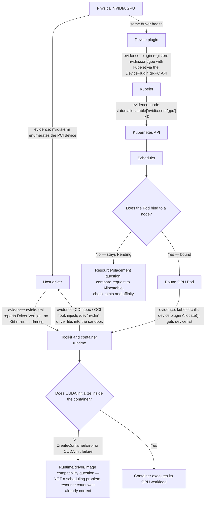
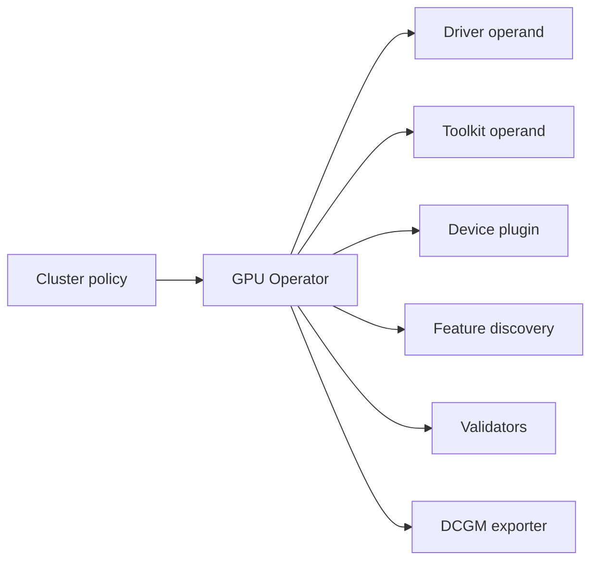

# Why Kubernetes Needs a GPU Platform Layer

Kubernetes knows how to reserve CPU and memory that the kubelet already understands. A GPU arrives with a different operating contract. Before a Pod can execute CUDA, the host must enumerate the device and load a working driver; a device plugin must report an allocatable resource; the kubelet must allocate a device; and the container runtime must construct a sandbox with the selected device and compatible driver interface. Kubernetes supplies extension points for this process. It does not supply the vendor-specific implementation or the lifecycle discipline around it.

That distinction matters in production. A node can be `Ready` while its driver module is absent. It can advertise `nvidia.com/gpu` while a runtime change prevents containers from seeing the allocated device. It can run a basic CUDA sample while still being the wrong placement for a topology-sensitive distributed job. The GPU platform layer owns the evidence between those statements.

## Learning Objectives

After this chapter, you can:

- trace the control and execution paths from a physical GPU to a running Pod;
- separate driver, runtime, discovery, allocation, scheduling, and workload responsibilities;
- identify the layers that must be validated after node or cluster change;
- choose a host-managed, operator-managed, or hybrid ownership model; and
- explain why a GPU Operator is lifecycle infrastructure rather than an installation shortcut.

## Two Paths Must Agree



**Figure 10.1.1 — Control-plane advertisement and runtime execution are distinct.** The upper-left path exposes a resource to Kubernetes. The lower-right path makes the device selected for a particular Pod available in its container. A platform is healthy only when both paths work, and the two decision points (`Bound?`, `CudaInit?`) are where a real incident actually forks: a Pending Pod never reaches the runtime path at all, while a bound Pod that fails CUDA init never had a scheduling problem in the first place.

The device plugin reports devices and their health to the kubelet. The kubelet makes the resulting extended resource visible through node status. The scheduler uses that resource request when choosing a node. After binding, the kubelet invokes allocation and hands the result to the runtime. The runtime integration, not the scheduler, performs the device-facing work needed to start the container.

This order is a useful incident boundary. A Pending Pod is usually a resource or placement question. A bound Pod whose GPU process cannot initialize is usually a runtime, driver, image, or application question. Starting with that split avoids treating every GPU failure as “a Kubernetes problem.”

**Reading the two paths as real command output.** On the host, the upper-left path's evidence looks like this:

```text
$ nvidia-smi
Thu Aug  6 09:12:44 2026
+-----------------------------------------------------------------------------------------+
| NVIDIA-SMI 550.90.07     Driver Version: 550.90.07     CUDA Version: 12.4                |
|-----------------------------------------+------------------------+----------------------+
| GPU  Name                 Persistence-M | Bus-Id          Disp.A | Volatile Uncorr. ECC |
| Fan  Temp   Perf          Pwr:Usage/Cap |           Memory-Usage | GPU-Util  Compute M. |
|===========================================+========================+======================|
|   0  NVIDIA A100-SXM4-80GB          On   | 00000000:07:00.0 Off  |                    0 |
| N/A   34C    P0             62W / 400W   |      0MiB / 81920MiB   |      0%      Default |
+-----------------------------------------------------------------------------------------+
```
`Driver Version: 550.90.07` is the fact the whole rest of the chain depends on — no driver line here (or a "Failed to initialize NVML" error instead) means the device-plugin and runtime paths cannot possibly work yet, no matter what Kubernetes reports. `0MiB / 81920MiB` confirms the device is idle and healthy, not just present.

The lower-right path's evidence is Kubernetes-side:

```text
$ kubectl get node gpu-node-07 -o jsonpath='{.status.allocatable.nvidia\.com/gpu}'
1

$ kubectl describe node gpu-node-07 | grep -A2 Allocated
Allocated resources:
  nvidia.com/gpu     1     1
```
`Allocatable: 1` proves the device plugin's registration reached the kubelet and the kubelet published it to the API server — this is the upper-left path completing. `Allocated resources: 1 1` (used/allocatable) means a Pod has already consumed that unit; it says nothing yet about whether that Pod's container can actually see a working GPU, which is exactly the gap the lower-right path (runtime injection) exists to close.

## Why a Count Is Not a GPU Service

Kubernetes extended resources intentionally model a vendor device as a quantity. A request for `nvidia.com/gpu: 1` says that one allocatable unit is required. It does not communicate usable memory, compute capability, NVLink adjacency, GPU-to-NIC locality, sharing mode, tenant policy, or the application’s communication pattern.

| Layer | Platform responsibility | Typical false positive |
|---|---|---|
| Hardware and firmware | Enumerate a healthy device and preserve a supportable platform state | PCI device exists but is unusable after a reset |
| Driver | Bind the kernel to the GPU and provide the driver interface | Module package is installed but not loaded |
| Runtime integration | Inject the allocated device and required driver-facing artifacts | Pod starts without a usable GPU |
| Device plugin and kubelet | Publish healthy capacity and service allocation | Resource is advertised but runtime access fails |
| Scheduling policy | Select an eligible node and enforce workload intent | One GPU is available, but not in the required pool or topology |
| Workload stack | Initialize CUDA and execute the intended job | Minimal test passes; framework image fails |

This is why a platform normally publishes workload classes in addition to the bare resource name. Labels, taints, affinity, quotas, topology policy, and—where applicable—sharing configuration express the constraints that a device count cannot. [Chapter 8](./chapter-08-gpu-scheduling-and-topology) examines the cost: each constraint improves predictability but can fragment capacity.

**Fragmentation, worked (illustrative numbers).** Consider a 32-GPU pool split by policy into three pools so that workload classes cannot contend with each other: a 16-GPU "training" pool restricted by taint to jobs requesting 8-GPU NVLink-adjacent sets, an 8-GPU "distributed-inference" pool, and an 8-GPU "general" pool with no topology constraint. A single new job requesting `nvidia.com/gpu: 4` with no topology requirement can only land in the 8-GPU general pool, even though 24 other GPUs in the cluster are physically idle — the taint makes them ineligible, not unavailable. If the general pool currently has one 4-GPU job already running, the pool shows `4/8` allocatable, and the new job schedules leaving `0/8` free — while `nvidia-smi`-visible cluster-wide idle capacity is `24/32` (75%). Reporting "cluster GPU utilization: 25%" without naming the pool is exactly the number a customer will misread as spare capacity when none of it is actually reachable by an unconstrained request. Each constraint (the taint, in this case) bought predictable isolation between training and inference at the direct cost of that 24-GPU pool being invisible to the general-pool scheduler.

## The Operational Failure of Manual Configuration

Manual installation may be acceptable for a tightly controlled lab node. It ages poorly in a fleet. Kernel updates can invalidate a driver build; an image refresh can replace runtime configuration; a rebuilt node can return without discovery or telemetry; and a one-off fix can leave no declarative record of intended state. The result is not merely configuration drift. It is an inability to prove which nodes may safely receive expensive jobs.

Consider a maintenance window that updates the base operating system across a mixed CPU and GPU pool. CPU Pods return after reboot. GPU Pods are Pending on part of the fleet because those nodes no longer advertise a resource. Other nodes advertise GPUs but fail during container creation because their runtime configuration differs. The incident is not one failure; it is two broken contracts caused by one uncontrolled lifecycle change.

A production response starts with a GPU-specific node acceptance gate: driver evidence, runtime evidence, advertised capacity, a minimal workload, and telemetry. Nodes that do not pass stay out of the eligible pool. The longer-term response makes the gate automatic and the version set explicit.

## What the GPU Operator Changes—and What It Does Not

NVIDIA GPU Operator reconciles a set of Kubernetes operands for the GPU software stack. Depending on its configuration, those operands can include driver management, container-toolkit configuration, the device plugin, feature discovery, validators, and DCGM-based telemetry. It makes desired state visible in Kubernetes and makes node-local deployment repeatable.



**Figure 10.1.2 — The operator coordinates operands; it does not remove their compatibility boundaries.** A single policy can improve consistency, but it can also spread a bad version or configuration quickly. Canary pools, drains, validation, and rollback remain platform responsibilities.

| Ownership model | Appropriate when | Principal trade-off |
|---|---|---|
| Host-managed driver and runtime | A base-image or OS team owns the complete host lifecycle | Desired state and diagnosis span systems outside Kubernetes |
| Operator-managed node stack | Kubernetes is the primary lifecycle control plane and supported node images are deliberate | Operator, kernel, driver, and runtime versions must be qualified together |
| Hybrid | Enterprise controls require host ownership of selected layers | Boundaries must be written down; two systems must never reconcile the same setting |

The decision is architectural, not ideological. Immutable OS policy, secure-boot processes, disconnected registries, support boundaries, and rollback requirements can justify different choices. What cannot vary is ownership: for each layer, one team and one reconciler must be authoritative.

## Production Checklist: Before a GPU Node Accepts Work

1. Confirm the host sees the intended GPUs and the supported driver is loaded.
2. Confirm the runtime integration works with a minimal GPU container.
3. Confirm the device plugin publishes the expected allocatable resource.
4. Confirm discovery labels and pool policy make the node eligible for the intended workloads.
5. Confirm a representative workload and telemetry pass on the canary.

Steps 2 and 3 deliberately test different paths. The exact evidence and safe commands belong in the change procedure; do not substitute an application team’s ad hoc container for the platform’s acceptance test.

## Troubleshooting Model

| Symptom | First boundary to inspect | Next question |
|---|---|---|
| `nvidia.com/gpu` absent | Driver, device plugin, and kubelet | Is the device healthy and the plugin registered? |
| Pod remains Pending | Request, allocatable capacity, taints, and affinity | Is this capacity shortage, fragmentation, or policy? |
| Pod is bound but cannot see a GPU | Allocation result and runtime integration | Did the sandbox receive the selected device? |
| CUDA initialization fails | Driver-to-container compatibility and image | Is the failure node-specific or image-specific? |
| Only one pool fails | Drift in kernel, driver, toolkit, or policy | What differs from the last known-good node? |

Do not delete all operator Pods to “start fresh.” That can erase the first useful symptom and expand an outage. Identify the lowest failed layer, capture its events and logs, correct the dependency, and then verify the next layer upward.

**Evidence for the `nvidia.com/gpu` absent row.** A node with a healthy GPU but no advertised resource looks like this:

```text
$ kubectl get node gpu-node-11 -o jsonpath='{.status.capacity}'
{"cpu":"64","memory":"263192Mi","pods":"110"}
```
No `nvidia.com/gpu` key at all in Capacity — not `0`, *absent* — is the signature of a device plugin that never registered, not a node that was scheduled empty. Checking the plugin's own Pod confirms which side failed:

```text
$ kubectl get pods -n gpu-operator -l app=nvidia-device-plugin-daemonset -o wide | grep gpu-node-11
nvidia-device-plugin-daemonset-7f2kq   0/1   CrashLoopBackOff   14   38m   10.244.3.9   gpu-node-11
```
`CrashLoopBackOff` on the plugin Pod for that specific node, combined with the missing Capacity key, tells you the fault is below Kubernetes entirely (driver not loaded, so the plugin's own NVML init fails) — confirmed by `kubectl logs` on that Pod typically showing `Failed to initialize NVML: driver/library version mismatch`.

**Evidence for the "Pod is bound but cannot see a GPU" row.** This is the split Figure 10.1.1 exists to make explicit:

```text
$ kubectl get pod train-job-0 -o wide
NAME          READY   STATUS                 RESTARTS   NODE
train-job-0   0/1     CreateContainerError   0          gpu-node-11

$ kubectl describe pod train-job-0 | tail -6
  Warning  Failed   22s   kubelet   Error: failed to create containerd task: OCI runtime create failed:
  nvidia-container-cli: initialization error: nvml error: driver not loaded: unknown
```
The Pod is `Running` in the scheduler's sense (bound, node assigned) but `CreateContainerError` at the container-creation step — the allocation succeeded (the kubelet already committed the resource to this Pod) and the failure is entirely in runtime injection, matching the `CudaInit` branch of Figure 10.1.1, not the `Bound?` branch. Chasing scheduler events or quotas here would look at the wrong evidence.

## Customer Architecture Discussion

When a customer asks why ordinary Kubernetes is insufficient, answer in terms of service ownership: Kubernetes schedules a resource after a plugin advertises it. It does not install the GPU driver, integrate the runtime, label capabilities, validate CUDA, coordinate a kernel change, or define which workload classes may use which pool. The platform layer makes those responsibilities explicit and observable.

The strongest design deliverable is therefore a support contract, not a Helm command: supported combinations, owner for each layer, acceptance evidence, change gates, rollback point, and escalation path.

## Interview Questions

**Why can `nvidia-smi` work on the host while a Kubernetes Pod cannot use the GPU?**

**Model answer:** "`nvidia-smi` on the host only proves the driver loaded and can talk to the device — that's the left half of Figure 10.1.1. It says nothing about the right half: whether the device plugin registered the resource with the kubelet, or whether the runtime actually injects the device nodes and driver libraries into a specific container's sandbox at creation time. I've seen this exact split in production — host `nvidia-smi` clean, but a Pod hitting `CreateContainerError` because a node-image refresh silently changed the container-runtime's NVIDIA configuration. So my first move on 'GPU node looks fine but Pods can't use it' is always to check whether the Pod is even bound yet — if it's Pending, that's a resource/scheduling question; if it's bound and failing at container creation, that's a runtime-injection question, and host `nvidia-smi` working doesn't rule that out at all."

**Why is the default GPU resource model insufficient for distributed training?**

**Model answer:** "`nvidia.com/gpu: 1` is just a count — Kubernetes bin-packs it like it would CPU cores. But distributed training cares about things a count can't express: is this GPU NVLink-connected to the other seven GPUs in the job, is the NIC on the same PCIe switch or NUMA node, are all eight ranks landing on GPUs that can actually talk to each other at full bandwidth. Two nodes can both report `Allocatable: 8` and be completely different placements — one fully NVLinked, one spread across PCIe with a network hop in the middle — and the scheduler has no way to tell them apart from the resource request alone. That's why real training platforms add topology labels, taints for topology-aware pools, and often a job-level scheduler or gang-scheduling layer on top of the base extended-resource model — the count gets you scheduled, it doesn't get you a fast job."

**How would you decide between host-managed and operator-managed GPU stacks for a new fleet?**

**Model answer:** "I'd start from who already owns the node lifecycle, not from a technology preference. If there's a base-image/OS team with strong immutable-image and secure-boot discipline, forcing GPU Operator to also manage the driver on top of that creates two reconcilers fighting over the same layer — that's the failure mode the ownership table in this chapter warns about. If Kubernetes is genuinely the primary control plane and the team is willing to qualify kernel, driver, and operator versions together as one unit, operator-managed is less operational toil day to day. What I wouldn't accept is an unwritten hybrid — some nodes host-managed, some operator-managed, with no documented boundary — because that's exactly the setup where a routine change silently reconciles the same setting from two directions and nobody notices until a canary fails."

## Key Takeaways

- A GPU platform is the agreement between host, Kubernetes, runtime, and workload contracts.
- Resource advertisement and container execution are independent validation gates.
- An extended-resource count is not a topology, performance, or tenancy policy.
- Operator reconciliation reduces drift but cannot replace version qualification or rollback discipline.
- Node `Ready` is not GPU-platform ready.

## Cross References

- [Volume 10 introduction](./index)
- [GPU Software Lifecycle in Kubernetes](./chapter-02-gpu-software-lifecycle-in-kubernetes)
- [CUDA Software Stack](../volume-03/chapter-02-cuda-software-stack)
- [GPU Scheduling and Topology](./chapter-08-gpu-scheduling-and-topology)
