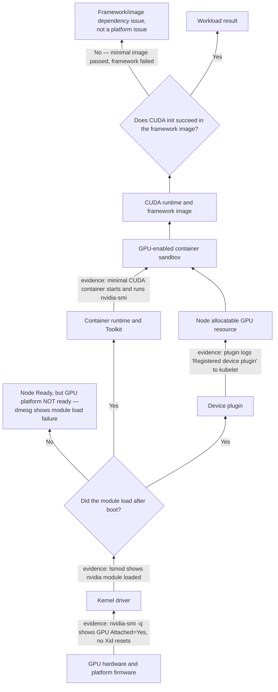
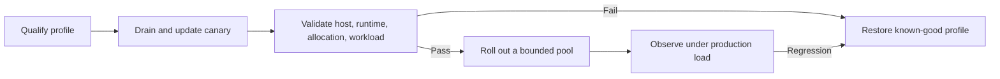

# GPU Software Lifecycle in Kubernetes

The most dangerous GPU-platform change is one that looks local. A kernel patch appears to be an operating-system concern; a container-runtime update appears to be a node-service concern; a framework image refresh appears to be an application concern. In a GPU cluster, any of those can break the same execution path. The platform must therefore manage versions and evidence as a lifecycle, not as independent package upgrades.

The lifecycle starts before Kubernetes: firmware initializes the device, the kernel driver binds it, and the host exposes the driver interface. Kubernetes adds discovery and allocation. The runtime turns allocation into a container sandbox. Finally, CUDA and the framework consume that interface. A green status at one layer is evidence for that layer only.

## Learning Objectives

After this chapter, you can:

- map a GPU change to the layers it can invalidate;
- distinguish host-driver compatibility from container-image compatibility;
- define acceptance evidence for a canary GPU node;
- design a staged rollout, drain, and rollback procedure; and
- diagnose why Kubernetes node health does not prove GPU workload health.

## The Lifecycle Is a Dependency Graph



**Figure 10.2.1 — A workload needs both allocation and execution.** The device plugin makes a resource eligible for scheduling; the runtime makes the allocation real inside a container. Both depend on a functioning host driver. The `Loaded?` branch is the exact failure this chapter's production story below walks through: a node can be `Ready` at the Kubernetes layer while sitting on the `DriverFail` branch here, invisible to kubelet health checks entirely. The `Init?` branch separates a platform fault from an application fault using the same minimal-image discriminator used throughout this volume.

The graph explains common surprises. A device plugin can advertise a resource while a misconfigured runtime prevents Pod startup. A minimal CUDA container can pass while a framework image fails due to its own dependencies. A node can be `Ready` while the driver failed to load after reboot. Treating the graph as an ordered set of validation gates makes the failure visible at the right boundary.

**Reading the `Loaded?` branch as real output.** After a kernel update, the node reports `Ready` normally:

```text
$ kubectl get node gpu-node-22
NAME          STATUS   ROLES    AGE   VERSION
gpu-node-22   Ready    <none>   14m   v1.29.4
```
`Ready` here only reflects kubelet heartbeats, container runtime health, and disk/PID pressure — none of which touch the NVIDIA driver at all. The driver-specific evidence is a separate check:

```text
$ ssh gpu-node-22 'lsmod | grep nvidia; nvidia-smi'
(no output from lsmod)
NVIDIA-SMI has failed because it couldn't communicate with the NVIDIA driver.
Make sure that the latest NVIDIA driver is installed and running.
```
Empty `lsmod | grep nvidia` (module not loaded at all) plus the NVML communication failure is definitive: this node is `Ready` and will happily accept CPU Pods, but is on the `DriverFail` branch of Figure 10.2.1 for anything GPU-related. `dmesg` on the same node typically shows the reason:

```text
$ ssh gpu-node-22 'dmesg -T | grep -i nvidia | tail -3'
[Thu Aug  6 08:02:11 2026] nvidia: module verification failed: signature and/or required key missing - tainting kernel
[Thu Aug  6 08:02:11 2026] nvidia: probe of 0000:07:00.0 failed with error -1
```
`module verification failed` naming secure-boot/signing is the specific dependency this kernel update broke — the module package is present, it simply cannot load under the node's current signing policy.

## Compatibility Is Policy, Not a Spreadsheet Afterthought

A container image does not carry a kernel driver for its host. Its CUDA user-space stack uses the host driver interface. Therefore the platform must qualify the whole supported combination: GPU and platform firmware, operating-system kernel, driver branch, runtime and toolkit configuration, device-plugin and operator release, Kubernetes release, and workload image family.

| Layer changed | What can break | Evidence to retain |
|---|---|---|
| Firmware or platform BIOS | Device initialization, reset, topology, enumeration | Platform release record and hardware acceptance result |
| Kernel | Module build, load, signing, and host reboot behavior | Kernel version, module/load evidence, boot logs |
| NVIDIA driver | CUDA compatibility, device health, runtime interface | Driver version and minimal workload result |
| Runtime or Toolkit | Sandbox creation, device injection, CDI or handler behavior | Runtime config revision and container validation |
| Device plugin or operator | Resource registration, allocation, operand reconciliation | Node allocatable state, operand status, events |
| Framework image | CUDA initialization and application behavior | Image digest and representative workload result |

Do not convert this into an unbounded test matrix. Define a small number of approved node profiles and workload base-image families, then test the combinations customers are allowed to run. An unsupported combination is not made safe because its individual components each appear recent.

**Why "unbounded" is not hyperbole (illustrative numbers).** Take just three of the six layers in the table: 3 supported kernel versions, 2 driver branches, and 4 workload base-image families. Testing every combination independently is `3 x 2 x 4 = 24` qualification runs before adding runtime/toolkit revisions, operator releases, or Kubernetes versions at all — each of which multiplies the count further (adding just 2 Kubernetes versions takes it to 48). This is exactly why the fix is not "test more" but "support fewer": collapsing to a small number of named node profiles (for example, 2 profiles: "current" and "previous known-good") each paired with a fixed, qualified image family turns an exponential matrix into a short, enumerable list — 2 profiles x 4 image families = 8 combinations, all of which can actually be re-tested on every change instead of sampled.

## A Production Change Model

Use a release record that names the desired state, its compatibility evidence, and its reversal point. A useful record contains pinned image digests or package versions, operating-system and kernel release, operator values or policy revision, supported GPU pools, validation images, maintenance window, and accountable owners.



**Figure 10.2.2 — A GPU rollout expands only after execution evidence.** Kubernetes readiness alone is not a promotion condition.

Drain before a change that can reset a GPU, unload a driver, restart the runtime, or invalidate running CUDA contexts. The drain plan must account for checkpointing, PodDisruptionBudgets, daemon workloads, and reserved spare capacity. A team that cannot drain a pool safely has not yet designed a safe platform upgrade.

Rollback must restore a coherent profile, not merely one package. Reverting the driver while retaining a changed kernel or runtime configuration can create a new incompatible state. Preserve the last known-good images, configuration, and node-image path before starting rollout.

## Node Acceptance Gates

| Gate | Question answered | Example evidence |
|---|---|---|
| Hardware and driver | Does the host control the expected device? | Device enumeration, loaded-driver state, host diagnostic output |
| Runtime | Can a newly created sandbox receive an allocated device? | Scoped minimal GPU container result |
| Kubernetes resource | Can the kubelet advertise the expected healthy capacity? | Node capacity and allocatable resource, plugin health |
| Workload | Does an approved image execute its initialization path? | Framework smoke test and logs |
| Operations | Can the platform observe and support this node? | Telemetry scrape, alerts, and recorded versions |

Automate these gates and keep their output with the change record. An acceptance test should be intentionally smaller than an application benchmark; it exists to prove the platform boundary, not to certify every model or dataset. [Chapter 9](./chapter-09-gpu-observability-with-dcgm) covers the telemetry required after promotion.

## Production Story: Green Nodes, Failed GPUs

An operating-system team rolls a kernel update through half of a GPU pool. Nodes rejoin as `Ready`, and CPU services recover. The driver operand fails on a subset of nodes because the expected module cannot be loaded. On another subset, capacity is advertised but new CUDA Pods fail as the runtime service retained stale configuration.

The immediate mitigation is to cordon the nonconforming nodes, restore the last known-good profile, and capture the first failure from driver and runtime logs. The corrective action is more important: a dedicated GPU canary, explicit promotion gates, and a rule that node `Ready` does not remove the GPU-pool taint. Only acceptance evidence does.

## Troubleshooting by Layer

| Symptom | Start here | Do not conclude yet |
|---|---|---|
| GPU disappears after reboot | Kernel, driver load, signing, and device enumeration | A driver package’s presence does not prove a loaded module |
| GPUs are allocatable but Pods fail at creation | Runtime service, Toolkit config, allocation result | A resource count does not prove sandbox injection |
| Minimal image works; framework fails | Framework image, CUDA stack, app initialization | The device plugin is unlikely to be the first fault |
| One node pool fails | Compare profile revisions and acceptance evidence | Labels alone do not reveal runtime drift |
| Cluster upgrade changed behavior | Node image, CRI, kubelet, admission, and operator compatibility | An unchanged operator release does not isolate the change |

Capture the exact versions before remediation. Recreating Pods or restarting all operands first may remove the evidence that distinguishes a bad node profile from a transient workload failure.

**Evidence for "GPUs are allocatable but Pods fail at creation."** This is the most common gap between what Kubernetes reports and what actually runs, and it produces a specific, checkable mismatch:

```text
$ kubectl get node gpu-node-30 -o jsonpath='{.status.allocatable.nvidia\.com/gpu}'
4

$ kubectl get pods -n ml-team -l job=resnet-train
NAME              READY   STATUS                 RESTARTS   AGE
resnet-train-0    0/1     CreateContainerError   0          3m
resnet-train-1    0/1     CreateContainerError   0          3m

$ kubectl get events -n ml-team --field-selector involvedObject.name=resnet-train-0
LAST SEEN   TYPE      REASON    MESSAGE
2m          Warning   Failed    Error: failed to create containerd task: OCI runtime create failed:
                                 nvidia-container-cli: mount error: file creation failed:
                                 /run/containerd/.../dev/nvidia0: no such device or address
```
`Allocatable: 4` is correct and unchanged — the plugin's advertisement is not the problem. The event's `mount error` naming a specific device path (`/dev/nvidia0`) that the container-runtime attempted and failed to bind-mount is proof the fault is in the Toolkit/runtime configuration layer, consistent with the table's "runtime service, Toolkit config, allocation result" guidance — not a plugin registration issue, which would instead show up as an `Allocatable` drop or `Insufficient nvidia.com/gpu` scheduling event.

**Evidence for "Minimal image works; framework fails."** Running the platform's minimal validation image and the production framework image back to back isolates the layer immediately:

```text
$ kubectl logs minimal-cuda-check
GPU 0: NVIDIA A100-SXM4-80GB (UUID: GPU-3a1e...)
CUDA_CHECK_OK

$ kubectl logs resnet-train-0
Traceback (most recent call last):
  ...
RuntimeError: CUDA error: no kernel image is available for execution on the device
```
The minimal image printing `CUDA_CHECK_OK` proves the platform boundary — driver, runtime injection, device visibility — is entirely healthy on this node. The framework error (`no kernel image is available`) is a compute-capability/build mismatch inside the framework image itself, e.g. a PyTorch wheel built without this GPU's `sm_` architecture — which the table flags explicitly: "the device plugin is unlikely to be the first fault" once a minimal image has already succeeded on the same node.

## Customer Architecture Discussion

Customers often ask for an “automatic driver upgrade.” The correct answer begins with workload disruption and compatibility. A driver operation can affect kernel modules, containers, active CUDA contexts, scheduling capacity, and support posture. Automation is valuable when it applies a qualified profile consistently and exposes failure; it is unsafe when it bypasses drain, canary, validation, and rollback decisions.

Offer a lifecycle contract: approved profiles, a release cadence, node-pool scope, a validation suite, a rollback target, and a clear owner for each layer. It gives applications a stable platform boundary while allowing the infrastructure team to evolve the fleet deliberately.

## Interview Questions

**Why is a Kubernetes node `Ready` condition insufficient for GPU admission?**

**Model answer:** "`Ready` is a kubelet-heartbeat signal — it means the kubelet is checking in, the container runtime is responsive, and disk/memory/PID pressure are within bounds. None of those checks touch the NVIDIA driver at all. I've seen a node stay `Ready` through an entire kernel update where the driver module failed to load afterward — `lsmod | grep nvidia` came back empty and `nvidia-smi` couldn't talk to NVML, but kubelet never noticed because it was never checking that in the first place. That's exactly why this chapter treats GPU admission as its own gate, separate from `Ready`: driver load, device-plugin advertisement, runtime injection, CUDA init, and telemetry all have to be checked explicitly, because Kubernetes's own health model doesn't check any of them."

**Why should rollback restore a profile rather than a driver package?**

**Model answer:** "Because the driver isn't an independent component — its compatibility is with the specific kernel it's loaded against and the runtime/toolkit configuration that injects it into containers. If I roll back just the driver package but leave the new kernel and an already-updated runtime config in place, I've created a three-way combination that was never actually tested together — it might work, or it might fail in a new way that's harder to diagnose than the original incident. The safer model is to version the whole node profile — kernel, driver, runtime/toolkit config, operator values — as one unit with one known-good tag, and roll the entire tag back together. That's the only way I can be confident I'm restoring a state that was actually qualified, not just reverting the one component that happened to change most recently."

**Walk through how you'd design the node-acceptance gates for a new GPU pool before it takes production traffic.**

**Model answer:** "I'd chain them in the order Figure 10.2.1 implies, because each gate is a prerequisite for the next one meaning anything. First, hardware/driver — does `nvidia-smi` on the host show the expected GPU count and driver version, no Xid errors. Second, runtime — does a minimal, platform-owned CUDA container actually start and run `nvidia-smi` inside it, which proves injection, not just host visibility. Third, the Kubernetes resource — does the node's `Allocatable` for `nvidia.com/gpu` match the physical count. Fourth, workload — does the approved framework image's own initialization path succeed, not just the minimal image. Fifth, operations — is DCGM actually scraping this node and are alerts wired up. I'd automate all five as one canary job and refuse to promote the pool out of its taint until all five pass and their output is attached to the change record — 'the node is Ready' by itself proves none of this."

## Key Takeaways

- GPU software is a dependency graph spanning host, Kubernetes, runtime, and image layers.
- Compatibility is an approved-profile policy backed by representative evidence.
- A staged rollout promotes on GPU execution evidence, not node readiness.
- Drain and rollback are design requirements for disruptive GPU changes.
- The first failed layer is more useful than the most visible application symptom.

## Cross References

- [Why Kubernetes Needs a GPU Platform Layer](./chapter-01-why-kubernetes-needs-a-gpu-platform-layer)
- [NVIDIA Container Toolkit, RuntimeClass, and CDI](./chapter-03-container-toolkit-runtimeclass-and-cdi)
- [Driver Containers and Node Operands](./chapter-07-driver-containers-and-node-operands)
- [GPU Observability with DCGM](./chapter-09-gpu-observability-with-dcgm)
