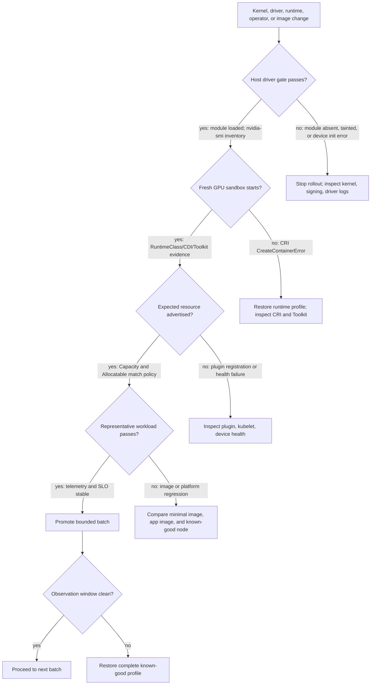
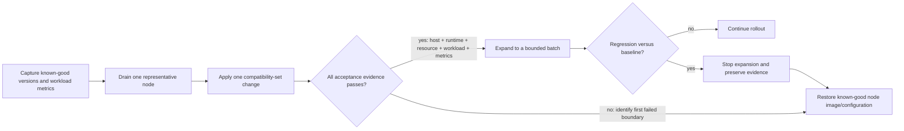

# GPU Software Lifecycle in Kubernetes

The most dangerous GPU-platform change is one that looks local. A kernel patch appears to be an operating-system concern; a container-runtime update appears to be a node-service concern; a framework image refresh appears to be an application concern. In a GPU cluster, any of those can break the same execution path. The platform must therefore manage versions and evidence as a lifecycle, not as independent package upgrades.

The lifecycle starts before Kubernetes: firmware initializes the device, the kernel driver binds it, and the host exposes the driver interface. Kubernetes adds discovery and allocation. The runtime turns allocation into a container sandbox. Finally, CUDA and the framework consume that interface. A green status at one layer is evidence for that layer only.

## Learning Objectives

After this chapter, you can:

- map a GPU change to the layers it can invalidate;
- distinguish host-driver compatibility from container-image compatibility;
- define acceptance evidence for a canary GPU node;
- design a staged rollout, drain, and rollback procedure; and
- diagnose why Kubernetes node health does not prove GPU workload health.

## The Lifecycle Is a Dependency Graph



**Figure 10.2.1 — The lifecycle diagram is a release gate and a fault-isolation path.** Each branch names the evidence that permits progression. A Kubernetes `Ready` condition appears nowhere as a sufficient promotion gate because it does not exercise the GPU path.

The graph explains common surprises. A device plugin can advertise a resource while a misconfigured runtime prevents Pod startup. A minimal CUDA container can pass while a framework image fails due to its own dependencies. A node can be `Ready` while the driver failed to load after reboot. Treating the graph as an ordered set of validation gates makes the failure visible at the right boundary.

## Compatibility Is Policy, Not a Spreadsheet Afterthought

A container image does not carry a kernel driver for its host. Its CUDA user-space stack uses the host driver interface. Therefore the platform must qualify the whole supported combination: GPU and platform firmware, operating-system kernel, driver branch, runtime and toolkit configuration, device-plugin and operator release, Kubernetes release, and workload image family.

| Layer changed | What can break | Evidence to retain |
|---|---|---|
| Firmware or platform BIOS | Device initialization, reset, topology, enumeration | Platform release record and hardware acceptance result |
| Kernel | Module build, load, signing, and host reboot behavior | Kernel version, module/load evidence, boot logs |
| NVIDIA driver | CUDA compatibility, device health, runtime interface | Driver version and minimal workload result |
| Runtime or Toolkit | Sandbox creation, device injection, CDI or handler behavior | Runtime config revision and container validation |
| Device plugin or operator | Resource registration, allocation, operand reconciliation | Node allocatable state, operand status, events |
| Framework image | CUDA initialization and application behavior | Image digest and representative workload result |

Do not convert this into an unbounded test matrix. Define a small number of approved node profiles and workload base-image families, then test the combinations customers are allowed to run. An unsupported combination is not made safe because its individual components each appear recent.

### Capture the actual compatibility set

**Purpose:** record the node kernel, loaded driver module, container runtime, kubelet, and GPU inventory before a change.

```bash
printf 'kernel='; uname -r
printf 'driver-module='; modinfo -F version nvidia 2>/dev/null || echo unavailable
printf 'runtime='; crictl info | jq -r '.config.containerd.runtimes // .config | tostring' | head -c 180; echo
printf 'kubelet='; kubelet --version
nvidia-smi --query-gpu=index,name,uuid,driver_version --format=csv,noheader
```

**Representative output:**

```text
kernel=6.8.0-40-generic
driver-module=550.54.15
runtime={"nvidia":{"runtimeType":"io.containerd.runc.v2","options":{"BinaryName":"/usr/bin/nvidia-container-runtime"}}}
kubelet=Kubernetes v1.30.3
0, NVIDIA H100 80GB HBM3, GPU-3c2e38d1-6a2c-4a31-b44b-9d82a8c80735, 550.54.15
1, NVIDIA H100 80GB HBM3, GPU-722d1344-1b6d-4a95-8cb9-1c572eb5ad94, 550.54.15
```

This is a **representative** snapshot, not a prescribed support matrix. `uname -r` identifies the running kernel rather than merely the installed package. `modinfo` reports the module metadata available on disk; pairing it with `nvidia-smi` proves the driver is loaded and responding. The runtime fragment proves that an NVIDIA handler exists in this example, but only a fresh Pod proves that kubelet and the runtime can use it.

A suspicious snapshot looks like this:

```text
kernel=6.8.0-41-generic
driver-module=550.54.15
NVIDIA-SMI has failed because it couldn't communicate with the NVIDIA driver.
```

The package or module file exists, but the running kernel cannot use the device. This is exactly why package inventory is weaker evidence than an execution gate.

## A Production Change Model

Use a release record that names the desired state, its compatibility evidence, and its reversal point. A useful record contains pinned image digests or package versions, operating-system and kernel release, operator values or policy revision, supported GPU pools, validation images, maintenance window, and accountable owners.



**Figure 10.2.2 — Promotion is based on a complete evidence bundle, not elapsed time.** The rollback branch restores a coherent profile rather than reversing whichever package was changed most recently.

Drain before a change that can reset a GPU, unload a driver, restart the runtime, or invalidate running CUDA contexts. The drain plan must account for checkpointing, PodDisruptionBudgets, daemon workloads, and reserved spare capacity. A team that cannot drain a pool safely has not yet designed a safe platform upgrade.

Rollback must restore a coherent profile, not merely one package. Reverting the driver while retaining a changed kernel or runtime configuration can create a new incompatible state. Preserve the last known-good images, configuration, and node-image path before starting rollout.

### Worked rollout arithmetic

A pool contains 24 nodes with eight GPUs each:

```text
24 × 8 = 192 GPUs
```

A canary of one node removes eight GPUs:

```text
(24 − 1) × 8 = 184 GPUs remain
184 / 192 = 95.83% nominal capacity
```

A four-node rollout batch removes 32 GPUs:

```text
(24 − 4) × 8 = 160 GPUs remain
160 / 192 = 83.33% nominal capacity
```

Suppose the queue contains ten eight-GPU jobs and six four-GPU jobs. Raw capacity may still look adequate, but draining four nodes can eliminate four full-node slots and make eight-GPU jobs wait while smaller allocations fragment the remaining nodes. The rollout controller therefore needs queue shape, checkpoint behavior, and node-level free-GPU distribution—not only the percentage above.

## Node Acceptance Gates

| Gate | Question answered | Example evidence |
|---|---|---|
| Hardware and driver | Does the host control the expected device? | Device enumeration, loaded-driver state, host diagnostic output |
| Runtime | Can a newly created sandbox receive an allocated device? | Scoped minimal GPU container result |
| Kubernetes resource | Can the kubelet advertise the expected healthy capacity? | Node capacity and allocatable resource, plugin health |
| Workload | Does an approved image execute its initialization path? | Framework smoke test and logs |
| Operations | Can the platform observe and support this node? | Telemetry scrape, alerts, and recorded versions |

Automate these gates and keep their output with the change record. An acceptance test should be intentionally smaller than an application benchmark; it exists to prove the platform boundary, not to certify every model or dataset. [Chapter 9](./chapter-09-gpu-observability-with-dcgm) covers the telemetry required after promotion.

### A concrete acceptance snapshot

```bash
kubectl get node gpu-canary-01 -o json | jq '{ready:[.status.conditions[]|select(.type=="Ready")|.status],capacity:.status.capacity["nvidia.com/gpu"],allocatable:.status.allocatable["nvidia.com/gpu"]}'
```

**Representative output:**

```json
{
  "ready": [
    "True"
  ],
  "capacity": "8",
  "allocatable": "8"
}
```

`capacity=8` proves kubelet accepted eight healthy devices from the plugin. `allocatable=8` proves none were removed from scheduling by kubelet accounting at this moment. Neither field proves runtime injection. The next gate is a **newly created** Pod, because an existing Pod can survive while a changed runtime configuration breaks only future sandboxes.

```bash
kubectl logs cuda-acceptance-gpu-canary-01
```

```text
device_count=8
selected_device=0
matrix_add_elements=1048576
verification=PASS
elapsed_ms=4.8
```

This **representative application output** proves CUDA initialization and a functional kernel execution. `elapsed_ms=4.8` is illustrative and must not be used as a performance acceptance threshold across hardware or software releases. The decisive field is `verification=PASS`; performance comparison belongs in a controlled benchmark with a baseline.

## Production Story: Green Nodes, Failed GPUs

An operating-system team rolls a kernel update through half of a GPU pool. Nodes rejoin as `Ready`, and CPU services recover. The driver operand fails on a subset of nodes because the expected module cannot be loaded. On another subset, capacity is advertised but new CUDA Pods fail as the runtime service retained stale configuration.

The immediate mitigation is to cordon the nonconforming nodes, restore the last known-good profile, and capture the first failure from driver and runtime logs. The corrective action is more important: a dedicated GPU canary, explicit promotion gates, and a rule that node `Ready` does not remove the GPU-pool taint. Only acceptance evidence does.

## Troubleshooting by Layer

| Symptom | Start here | Do not conclude yet |
|---|---|---|
| GPU disappears after reboot | Kernel, driver load, signing, and device enumeration | A driver package’s presence does not prove a loaded module |
| GPUs are allocatable but Pods fail at creation | Runtime service, Toolkit config, allocation result | A resource count does not prove sandbox injection |
| Minimal image works; framework fails | Framework image, CUDA stack, app initialization | The device plugin is unlikely to be the first fault |
| One node pool fails | Compare profile revisions and acceptance evidence | Labels alone do not reveal runtime drift |
| Cluster upgrade changed behavior | Node image, CRI, kubelet, admission, and operator compatibility | An unchanged operator release does not isolate the change |

### Evidence row 1: driver disappears after reboot

```bash
uname -r
lsmod | grep '^nvidia'
journalctl -k -b | grep -i -E 'nvidia|module verification|secure boot' | tail -12
```

**Representative broken output:**

```text
6.8.0-41-generic

Aug 06 09:17:22 gpu-node-07 kernel: Lockdown: modprobe: unsigned module loading is restricted
Aug 06 09:17:22 gpu-node-07 kernel: nvidia: module verification failed: signature and/or required key missing
Aug 06 09:17:22 gpu-node-07 kernel: NVRM: No NVIDIA GPU found.
```

The empty `lsmod` result proves no NVIDIA module is loaded. The kernel log identifies a signing or Secure Boot boundary before the later `No NVIDIA GPU found` message. Reinstalling the device plugin cannot fix a kernel that rejected the driver module.

After remediation, verify both module load and NVML communication:

```bash
lsmod | awk '$1 ~ /^nvidia/ {print $1,$3}'
nvidia-smi --query-gpu=count,driver_version --format=csv,noheader
```

```text
nvidia_uvm 2
nvidia_modeset 1
nvidia 6
8, 550.54.15
```

### Evidence row 2: resource remains, but new Pods fail after runtime change

```bash
kubectl get node gpu-node-08 -o jsonpath='{.status.allocatable.nvidia\.com/gpu}{"\n"}'
kubectl describe pod cuda-new | sed -n '/Events:/,$p'
```

```text
8
Events:
  Warning  Failed  14s  kubelet  Error: failed to create containerd task:
  OCI runtime create failed: nvidia-container-runtime: executable file not found in $PATH
```

The node still advertises eight GPUs, so plugin registration is not the first failure. The CRI event names the missing runtime executable. This is a node-image or runtime-configuration regression. A workload retry will reproduce it until the runtime profile is restored.

### Evidence row 3: minimal image passes, framework image fails

```bash
kubectl logs cuda-minimal
kubectl logs trainer-framework -c trainer | tail -10
```

```text
# cuda-minimal
CUDA devices: 8
vector-add verification: PASS

# trainer-framework
RuntimeError: CUDA error: initialization error
framework CUDA build: 12.4
loaded libcuda.so.1 from: /opt/vendor/compat/libcuda.so.1
```

The minimal image proves the node, allocation, and default runtime path. The framework log shows it is loading a compatibility library from an application-specific path. The next action is to inspect the image and library search path, not to replace the physical GPU.

Capture exact versions before remediation. Recreating Pods or restarting all operands first may remove the evidence that distinguishes a bad node profile from a transient workload failure.

## Customer Architecture Discussion

Customers often ask for an “automatic driver upgrade.” The correct answer begins with workload disruption and compatibility. A driver operation can affect kernel modules, containers, active CUDA contexts, scheduling capacity, and support posture. Automation is valuable when it applies a qualified profile consistently and exposes failure; it is unsafe when it bypasses drain, canary, validation, and rollback decisions.

Offer a lifecycle contract: approved profiles, a release cadence, node-pool scope, a validation suite, a rollback target, and a clear owner for each layer. It gives applications a stable platform boundary while allowing the infrastructure team to evolve the fleet deliberately.

## Interview Questions

**Why is a Kubernetes node `Ready` condition insufficient for GPU admission?**

> “I use node `Ready` as evidence that kubelet can participate in the cluster, not as proof that the accelerator service is healthy. Before admitting the node, I verify the running driver, create a fresh GPU sandbox, confirm expected `capacity` and `allocatable`, run a minimal CUDA workload, and check telemetry. That sequence matters because a node can be `Ready` with a failed driver, and it can advertise GPUs while a runtime regression breaks only newly created Pods.”

**Why should rollback restore a profile rather than a driver package?**

> “I define the rollback unit as the qualified compatibility set. A driver depends on the running kernel and interacts with the runtime, toolkit, device plugin, and workload libraries. If I revert only the driver after changing the kernel or runtime, I may create a combination that was never tested. My rollback therefore restores the known-good node image or kernel, driver, runtime configuration, operator values, and validation image, then reruns the complete acceptance suite.”

**How would you explain canary size to a customer?**

> “I would start with failure containment and workload shape. One representative node is often the minimum useful canary because it proves the exact hardware, image, security, and runtime profile. I would then calculate the capacity removed and verify that queued jobs can still fit on the remaining nodes. For example, one eight-GPU canary in a 24-node pool removes 4.17% of raw capacity, but it may remove a full eight-GPU scheduling slot, so I would evaluate both the percentage and the job topology.”

## Key Takeaways

- GPU software is a dependency graph spanning host, Kubernetes, runtime, and image layers.
- Compatibility is an approved-profile policy backed by representative evidence.
- A staged rollout promotes on GPU execution evidence, not node readiness.
- Drain and rollback are design requirements for disruptive GPU changes.
- The first failed layer is more useful than the most visible application symptom.

## Cross References

- [Why Kubernetes Needs a GPU Platform Layer](./chapter-01-why-kubernetes-needs-a-gpu-platform-layer)
- [NVIDIA Container Toolkit, RuntimeClass, and CDI](./chapter-03-container-toolkit-runtimeclass-and-cdi)
- [Driver Containers and Node Operands](./chapter-07-driver-containers-and-node-operands)
- [GPU Observability with DCGM](./chapter-09-gpu-observability-with-dcgm)
