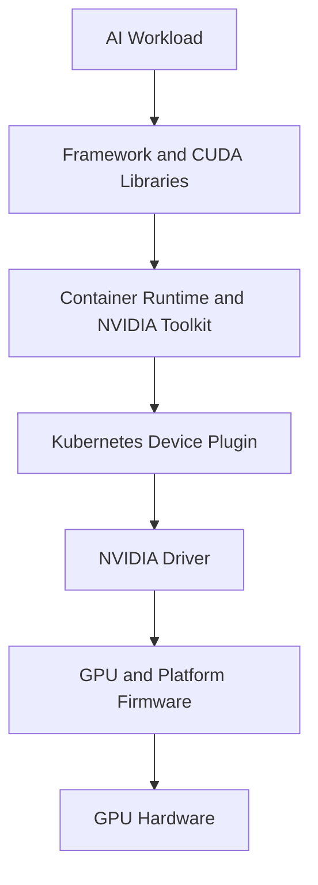

# GPU Software Lifecycle in Kubernetes

A GPU is not one component. It is a stack that begins in firmware, continues through the kernel driver and container runtime, and ends inside the workload image. Kubernetes can only schedule the resource after those layers agree that the resource exists and is healthy.

That means a GPU platform has to be managed as a lifecycle, not as a one-time installation. Change the kernel, and the driver may need to rebuild. Change the runtime, and device injection may need to be revalidated. Change the workload image, and the CUDA libraries may stop matching the host driver. The operational question is not whether each layer works in isolation, but whether the full stack stays consistent through change.

## Learning Objectives

After completing this chapter, you will be able to:

- trace the GPU software chain from firmware to application;
- identify the ownership boundary between host software and container software;
- explain which changes require canary validation and drain windows;
- distinguish compatibility failures from discovery failures;
- design a safe upgrade and rollback approach for GPU nodes.

## A Production Story

A production cluster upgrades its container runtime and Linux kernel during a maintenance window. The rollout completes, kubelet remains healthy, and node Ready conditions recover. But GPU workloads fail to start on the newly updated nodes because the driver module is not available, and a subset of containers still reference a runtime configuration that was valid before the upgrade.

The incident review shows that the platform team validated the kernel and runtime separately, but not as one lifecycle. The fix is not just a rollback package. It is a staged operating model with a golden node profile, canary pools, validation Pods, and rollback steps that treat firmware, driver, runtime, and workload images as one compatibility domain.

## The Stack

The diagram is intentionally linear, but operations are not. A failure can appear at the workload, runtime, plugin, driver, firmware, or hardware layer, and the symptom can surface several steps away from the actual root cause.

## Lifecycle Boundaries

| Layer | Owns | What changes here | What can break |
|---|---|---|---|
| Firmware | Device behavior below the OS | Microcode, board behavior, reset semantics | Hardware initialization and reset handling |
| Kernel driver | Host access to the GPU | Driver branch, module build, secure boot compatibility | Device visibility and health |
| Container runtime integration | How containers receive GPU access | Hooks, RuntimeClass, CDI configuration | Device mounts and runtime startup |
| Device plugin | Kubernetes resource advertisement | Registration, health, allocation | `nvidia.com/gpu` capacity and assignment |
| Workload image | Application behavior | CUDA toolkit, framework version, app config | CUDA initialization and runtime errors |

The ownership boundary matters because teams often change one layer and assume another layer will adapt automatically. In practice, the layers are coupled but managed independently.

## Compatibility Is a Matrix, Not a Single Version

A container CUDA toolkit does not replace the host driver. The host driver must support the user-space runtime. Kernel, secure boot, driver branch, GPU model, container runtime, toolkit, operator version, and Kubernetes version form a compatibility matrix.

| Layer | Change risk |
|---|---|
| Firmware | Reset behavior, platform quirks, and device initialization |
| Kernel | Driver module build and load success |
| Driver | CUDA compatibility, health reporting, and device access |
| Container runtime | Hook or CDI integration and sandbox startup |
| Device plugin | Resource advertisement and allocation behavior |
| Framework image | CUDA libraries, ABI expectations, and application behavior |

The safest assumption is that every upgrade may expose a compatibility edge until it is validated on representative hardware.

## How the Lifecycle Changes

The GPU lifecycle changes in at least four common ways:

- a kernel or OS patch modifies driver behavior;
- a runtime upgrade changes device injection or sandbox startup;
- a driver or toolkit release changes the supported CUDA surface;
- a workload image update changes framework expectations or library loading.

Those changes do not fail in the same way. A broken driver may hide the GPU from Kubernetes. A runtime issue may leave the Pod running with no device access. A workload change may only appear as a CUDA initialization error. That is why platform teams need a diagnostic ladder rather than one generic health check.

## Safe Rollout Pattern

1. Define a golden node profile for the target release.
2. Validate on a development or test node with the same kernel and hardware class.
3. Roll one canary node or small node pool.
4. Run a validation Pod that exercises discovery, runtime access, and CUDA execution.
5. Verify node labels, allocatable resources, and telemetry.
6. Drain and expand only after the canary matches expected behavior.
7. Keep a rollback path for both the operating system and the GPU software stack.

Rollback is not just "install the old package." Kernel, driver, runtime, and operator-managed resources may have to be restored together.

## What To Validate

| Validation | Evidence | Why it matters |
|---|---|---|
| Driver load | Host logs and module state | Confirms the host can see the GPU |
| Device discovery | Node capacity and allocatable resources | Confirms Kubernetes can schedule GPU Pods |
| Runtime access | Minimal CUDA container | Confirms the container can receive devices and libraries |
| Image compatibility | Framework startup and CUDA initialization | Confirms the workload stack can use the driver |
| Observability | Metrics and health signals | Confirms the platform can be operated after rollout |

These checks should be automated wherever possible. Manual validation is acceptable for a pilot, but not for every fleet change.

## Troubleshooting Patterns

**Symptom:** `nvidia-smi` works on the host, but Pods cannot see GPUs.

Inspect runtime integration, RuntimeClass or CDI configuration, device-plugin health, container device mounts, and Pod events.

**Symptom:** the node advertises GPUs but workloads fail at startup.

Inspect driver and library compatibility, container image content, allocation annotations, security policy, and application logs.

**Symptom:** the GPU disappears after a reboot.

Inspect driver rebuild behavior, secure boot, kernel updates, and whether the node was revalidated after restart.

## Customer Perspective

A GPU Operator reduces manual lifecycle work, but it does not eliminate compatibility planning, maintenance windows, workload disruption, or validation. The operator improves repeatability; it does not remove the need for a release process.

## Interview Preparation

**Question:** Why can a Kubernetes upgrade affect GPUs even when the GPU Operator is unchanged?

The upgrade may change the kernel, container runtime, admission behavior, APIs, or node lifecycle, all of which interact with driver and device management.

## Key Takeaways

- Kubernetes GPU support is a multi-layer lifecycle.
- Host driver and container libraries have distinct roles.
- Upgrades require canary, validation, and rollback.
- Resource advertisement does not prove application health.

## Cross References

- [Volume 10 Introduction](./index)
- [Why Kubernetes Needs a GPU Platform Layer](./chapter-01-why-kubernetes-needs-a-gpu-platform-layer)
- [NVIDIA Container Toolkit, RuntimeClass, and CDI](./chapter-03-container-toolkit-runtimeclass-and-cdi)
- [Kubernetes Device Plugin and Kubernetes Resource Model](./chapter-04-device-plugin-and-kubernetes-resource-model)
- [GPU Operator Architecture](./chapter-06-gpu-operator-architecture)
