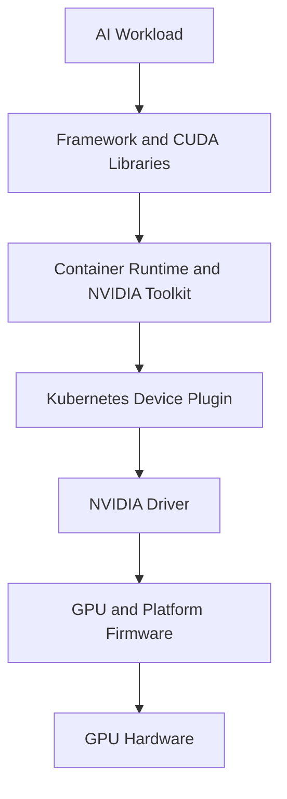

# GPU Software Lifecycle in Kubernetes

Kubernetes can schedule a resource only after the operating system, driver, container runtime, and device plugin agree that the resource exists. A GPU platform therefore spans layers that Kubernetes does not natively install or validate.

## Learning Objectives

Trace the GPU software chain, identify compatibility boundaries, and design a controlled lifecycle for upgrades and rollback.

## Stack

The driver controls the hardware. User-space CUDA libraries inside containers communicate through the driver interface. The NVIDIA Container Toolkit configures device access and mounts required host components. The device plugin advertises allocatable resources to Kubernetes.

## Compatibility

A container’s CUDA toolkit does not replace the host driver. The host driver must support the user-space runtime. Kernel, secure boot, driver branch, GPU model, container runtime, toolkit, operator version, and Kubernetes version form a compatibility matrix.

| Layer | Change risk |
|---|---|
| Firmware | Reset, compatibility, and hardware behavior |
| Kernel | Driver module build/load |
| Driver | CUDA compatibility and device health |
| Container runtime | Hook/CDI integration |
| Device plugin | Resource advertisement and allocation |
| Framework image | CUDA libraries and application behavior |

## Production Lifecycle

Define a golden node profile. Upgrade through development, canary nodes, a small production pool, and wider rollout. Drain workloads before disruptive changes. Validate GPU visibility, CUDA execution, topology, DCGM health, and representative application performance after every stage.

Rollback is not simply installing the old package. Kernel, driver, runtime, and operator resources may need to move as a set. Preserve prior images and configuration.

## Troubleshooting

**Symptom:** `nvidia-smi` works on the host but Pods cannot see GPUs.

Inspect runtime integration, RuntimeClass or CDI configuration, device-plugin health, container device mounts, and Pod events.

**Symptom:** the node advertises GPUs but workloads fail at startup.

Inspect driver/library compatibility, container image, allocation annotations, security policy, and application logs.

## Customer Perspective

A GPU Operator reduces manual lifecycle work, but it does not eliminate compatibility planning, maintenance windows, workload disruption, or validation.

## Interview Preparation

**Question:** Why can a Kubernetes upgrade affect GPUs even when the GPU Operator is unchanged?

The upgrade may change kernel, container runtime, admission behavior, APIs, or node lifecycle, all of which interact with driver and device management.

## Key Takeaways

- Kubernetes GPU support is a multi-layer lifecycle.
- Host driver and container libraries have distinct roles.
- Upgrades require canary, validation, and rollback.
- Resource advertisement does not prove application health.

## Cross References

- [Volume 10 Introduction](./index)
- [Next: Container Toolkit](./chapter-03-container-toolkit-runtimeclass-and-cdi)
