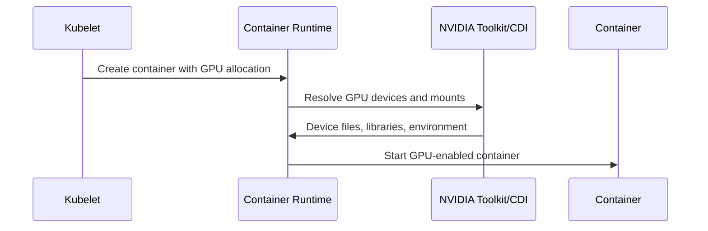

# NVIDIA Container Toolkit, RuntimeClass, and CDI

A GPU on the host is not automatically visible inside a container. The runtime has to expose device files, mount or reference the correct driver libraries, and start the container with the right low-level configuration. NVIDIA Container Toolkit provides that integration for runtimes such as containerd and CRI-O. RuntimeClass and the Container Device Interface (CDI) provide ways to select or describe that behavior in Kubernetes-native terms.

## Learning Objectives

After completing this chapter, you will be able to:

- explain why container images do not replace host GPU drivers;
- describe the boundary between host libraries and container libraries;
- compare RuntimeClass and CDI in a GPU deployment;
- validate runtime integration with a minimal CUDA workload;
- troubleshoot the common failure modes for GPU container startup.

## A Production Story

A platform team updates the node image and restarts a batch of GPU nodes. The device plugin still advertises capacity, but a workload that used to work now fails at container startup. The host driver is present, yet the pod cannot load the expected device libraries. A later investigation shows that the runtime configuration was not revalidated after the node update.

The lesson is simple: device advertisement and container access are separate checks. A GPU can be schedulable and still unreachable inside the workload if the runtime boundary is wrong.

## Runtime Path

The host driver provides kernel modules and driver-facing libraries. The image contains the application, framework, and compatible CUDA user-space components. Runtime integration makes the host capabilities visible without baking a kernel driver into the image.

## What The Toolkit Does

The NVIDIA Container Toolkit is the runtime integration layer. It helps the container runtime translate a GPU allocation into the device files, mounts, and environment that the container needs.

| Responsibility | Example effect |
|---|---|
| Device exposure | The container can access the assigned GPU device files |
| Library visibility | The container can load host driver libraries where required |
| Runtime plumbing | The sandbox starts with the expected GPU-specific configuration |
| Integration with orchestration | The runtime behavior aligns with Kubernetes allocation |

The important point is that the toolkit does not replace the host driver. It bridges the host driver and the container.

## RuntimeClass and CDI

RuntimeClass lets a Pod request a named runtime handler. It is useful when GPU containers need a runtime path that differs from the cluster default. CDI describes devices in a vendor-neutral format that runtimes can consume. In practice, a cluster may use either mechanism, or both, depending on runtime version and platform policy.

| Mechanism | What it expresses | Why it helps |
|---|---|---|
| RuntimeClass | Which runtime handler to use | Gives the Pod a named, declarative runtime path |
| CDI | Which devices and mounts should be made available | Decouples device description from a vendor-specific runtime hook |
| Toolkit configuration | How the runtime should translate allocation into container access | Centralizes the node-level plumbing |

The choice is usually driven by the runtime standard in the cluster, the operator model, and how much device behavior the platform team wants to express directly in Kubernetes.

## Why The Driver Stays On The Host

A GPU driver belongs on the host because it must match the kernel and hardware lifecycle. If every application container carried its own driver, the kernel-module problem would not go away; it would become unmanageable. Containers should carry application-specific CUDA libraries and frameworks, while the host keeps the kernel driver and low-level device control.

That separation makes the platform more supportable. The host owns hardware access. The image owns application behavior.

## Production Design

Standardize one runtime path per cluster release. Generate configuration through automation, validate after runtime upgrades, and avoid manual edits on individual nodes. Secure the runtime socket and toolkit configuration because device injection is privileged infrastructure behavior.

| Control | Good practice |
|---|---|
| Runtime configuration | Store it in Git and roll it through a tested change process |
| Node drift | Reconcile runtime state after image refresh or reboot |
| Validation | Run a minimal CUDA image before platform-wide rollout |
| Security | Restrict who can modify runtime handlers and device configuration |

## Troubleshooting

If the device plugin advertises GPUs but a Pod sees none, inspect Pod allocation, runtime handler or CDI spec, containerd or CRI-O logs, toolkit logs, device files, and mounts. Run a minimal CUDA image before debugging the application image.

| Symptom | Likely boundary to inspect |
|---|---|
| Pod sandbox fails | Runtime handler or runtime configuration |
| Container starts but no GPU is visible | CDI spec, toolkit config, or device mounts |
| CUDA initialization fails | Driver and user-space library compatibility |
| Works on one node only | Node drift in runtime config or toolkit version |

## Customer Perspective

The runtime layer should be invisible to application teams when healthy. Platform teams own a tested base image policy, runtime configuration, and diagnostics.

## Interview Preparation

**Question:** Why should the NVIDIA driver not be installed inside every application container?

The kernel driver must match the host kernel and hardware lifecycle. Containers should consume the host driver interface while carrying application-specific user-space libraries.

**Question:** When would you prefer CDI over a custom runtime handler?

When you want a more declarative device description that can be consumed by a runtime without coupling every GPU workload to a bespoke handler name.

## Key Takeaways

- Runtime integration exposes host GPUs to containers.
- RuntimeClass selects runtime behavior; CDI describes devices.
- Host driver and container CUDA libraries are separate layers.
- Minimal container validation isolates runtime from application issues.

## Cross References

- [GPU Software Lifecycle in Kubernetes](./chapter-02-gpu-software-lifecycle-in-kubernetes)
- [Kubernetes Device Plugin and Kubernetes Resource Model](./chapter-04-device-plugin-and-kubernetes-resource-model)
- [GPU Operator Architecture](./chapter-06-gpu-operator-architecture)
