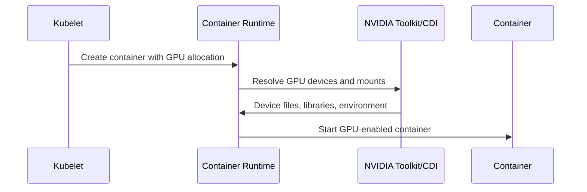

# NVIDIA Container Toolkit, RuntimeClass, and CDI

A container image cannot access a GPU merely because the node has one. The container runtime must expose device files, driver libraries, environment, and permissions. NVIDIA Container Toolkit integrates these requirements with runtimes such as containerd and CRI-O. RuntimeClass and the Container Device Interface (CDI) provide mechanisms for selecting or describing runtime behavior.

## Learning Objectives

Explain runtime integration, distinguish host and image libraries, compare RuntimeClass and CDI concepts, and troubleshoot device injection.

## Runtime Flow

The host driver provides kernel modules and driver-facing libraries. The image contains the application, framework, and compatible CUDA user-space components. Runtime integration makes the host capabilities visible without baking a kernel driver into the image.

## RuntimeClass and CDI

RuntimeClass allows a Pod to request a named runtime handler. It is useful when GPU containers require a configured NVIDIA runtime distinct from the default. CDI describes devices in a vendor-neutral specification that runtimes can consume. Current deployments may use either or both depending on toolkit and runtime configuration.

| Failure | Evidence |
|---|---|
| Runtime handler missing | Pod sandbox creation events |
| CDI spec absent/stale | Runtime and toolkit logs |
| Devices not mounted | Container `/dev` and allocation data |
| Driver library mismatch | Loader or CUDA initialization errors |
| Permissions blocked | Security context and device-cgroup evidence |

## Production Design

Standardize one runtime path per cluster release. Generate configuration through automation, validate after runtime upgrades, and avoid manual edits on individual nodes. Secure the runtime socket and toolkit configuration because device injection is privileged infrastructure behavior.

## Troubleshooting

If the device plugin advertises GPUs but a Pod sees none, inspect Pod allocation, runtime handler/CDI spec, containerd or CRI-O logs, toolkit logs, device files, and mounts. Run a minimal CUDA image before debugging the application image.

## Customer Perspective

The runtime layer should be invisible to application teams when healthy. Platform teams own a tested base image policy, runtime configuration, and diagnostics.

## Interview Preparation

**Question:** Why should the NVIDIA driver not be installed inside every application container?

The kernel driver must match the host kernel and hardware lifecycle. Containers should consume the host driver interface while carrying application-specific user-space libraries.

## Key Takeaways

- Runtime integration exposes host GPUs to containers.
- RuntimeClass selects runtime behavior; CDI describes devices.
- Host driver and container CUDA libraries are separate layers.
- Minimal container validation isolates runtime from application issues.

## Cross References

- [GPU Software Lifecycle](./chapter-02-gpu-software-lifecycle-in-kubernetes)
- [Next: Device Plugin](./chapter-04-device-plugin-and-kubernetes-resource-model)
