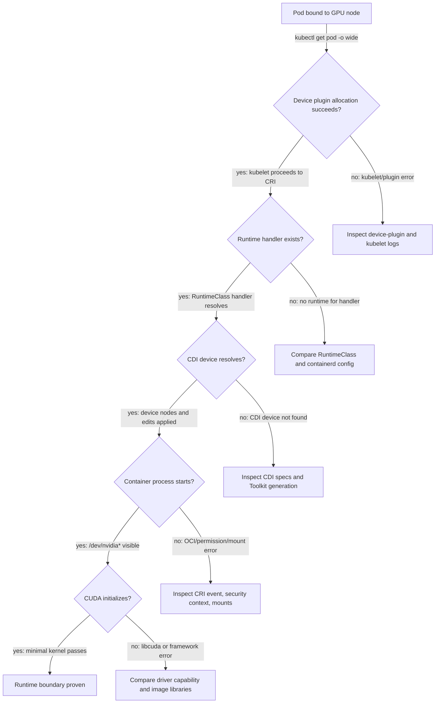

# NVIDIA Container Toolkit, RuntimeClass, and CDI

Scheduling a GPU is not the same as giving a process a GPU. The scheduler selects a node using an extended-resource request; the kubelet asks the device plugin to allocate devices; then the CRI runtime creates a sandbox. At that final boundary, device nodes, driver-facing libraries, mounts, environment, and permissions must describe the allocation accurately. NVIDIA Container Toolkit provides the NVIDIA-specific runtime integration needed by supported container runtimes.

This boundary deserves separate design and validation. A node may advertise GPUs correctly and still produce Pods that cannot create a CUDA context. That is not a contradiction: allocation is a kubelet/device-plugin concern, while sandbox construction is a runtime concern.

## Learning Objectives

After this chapter, you can:

- explain the handoff from device allocation to container creation;
- distinguish the host driver from CUDA and framework components in an image;
- distinguish RuntimeClass runtime selection from CDI device description;
- choose a standardized runtime path for a cluster; and
- isolate runtime-injection failures from scheduling and application failures.

## From Allocation to Process



**Figure 10.3.1 — The runtime path is a sequence of inspectable handoffs.** The scheduler has already finished before the first decision. Every failure branch points to evidence at the boundary that actually owns the failure.

The host owns the kernel modules and the low-level driver interface. The workload image owns the application, its framework, and its CUDA user-space dependencies. The toolkit bridges those domains at container start. Putting a kernel driver in every application image would not solve the host-kernel problem; it would obscure it and make version control unmanageable.

## Three Mechanisms, Three Different Questions

| Mechanism | Question it answers | Scope | Common misuse |
|---|---|---|---|
| NVIDIA Container Toolkit configuration | How does this node’s runtime support NVIDIA devices? | Node runtime | Treating it as an application dependency |
| RuntimeClass | Which configured runtime handler should this Pod use? | Pod scheduling/runtime selection | Assuming it itself allocates a GPU |
| Container Device Interface (CDI) | How is a device described to a CDI-capable runtime? | Device injection | Assuming CDI makes the device schedulable |

RuntimeClass is a Kubernetes API object that refers to a runtime handler configured on each eligible node. It can also carry scheduling information and overhead. It is valuable when a platform intentionally exposes more than one runtime path, but it is not a substitute for consistent runtime configuration across the nodes selected by the Pod.

CDI is an open specification for describing container devices and their required edits. A CDI-capable runtime consumes a device reference and applies the specified device nodes, mounts, environment, or hooks. NVIDIA tooling and the device plugin can be configured to use CDI-related strategies in supported environments. The platform must qualify the exact runtime, toolkit, plugin, and Kubernetes combination it deploys; “CDI” is a mechanism, not a universal compatibility claim.

### Inspect the runtime contract instead of guessing

**Purpose:** show which RuntimeClass objects application manifests can reference.

```bash
kubectl get runtimeclass -o custom-columns='NAME:.metadata.name,HANDLER:.handler,NODESELECTOR:.scheduling.nodeSelector'
```

**Representative output:**

```text
NAME      HANDLER   NODESELECTOR
nvidia    nvidia    map[nvidia.com/gpu.deploy.container-toolkit:true]
runc      runc      <none>
```

The `NAME` is the value used in `spec.runtimeClassName`. `HANDLER=nvidia` must match a handler configured in the node’s CRI runtime. The node selector prevents a Pod using this RuntimeClass from landing on a node where the Toolkit contract is absent. The output does not prove that every eligible node has an identical handler configuration.

**Purpose:** verify the handler on the affected node.

```bash
sudo containerd config dump | sed -n '/runtimes.nvidia/,+9p'
```

**Representative healthy output:**

```toml
[plugins.'io.containerd.grpc.v1.cri'.containerd.runtimes.nvidia]
  runtime_type = 'io.containerd.runc.v2'
  [plugins.'io.containerd.grpc.v1.cri'.containerd.runtimes.nvidia.options]
    BinaryName = '/usr/bin/nvidia-container-runtime'
```

The runtime table name `nvidia` matches the RuntimeClass handler. `BinaryName` points to the NVIDIA-aware runtime wrapper. A configuration block on disk is not enough; the running containerd process must have loaded it. A fresh sandbox is the execution proof.

**Purpose:** inspect the concrete CDI devices available to the runtime.

```bash
sudo nvidia-ctk cdi list
```

**Representative output:**

```text
INFO[0000] Found 3 CDI devices
nvidia.com/gpu=0
nvidia.com/gpu=1
nvidia.com/gpu=all
```

The two indexed entries describe individual devices and `all` is a convenience reference. A kubelet event requesting `nvidia.com/gpu=0` while this list is empty is a CDI generation or discovery problem, not a scheduler shortage.

## Design the Runtime Contract

Avoid making application teams choose among undocumented handler names or node-local exceptions. Publish a small runtime contract:

- supported container runtime and its versioned configuration;
- whether GPU workloads use a RuntimeClass and, if so, its stable name and eligible node pools;
- the supported toolkit and device-plugin strategy, including CDI where enabled;
- a minimal approved validation image and the expected evidence;
- ownership and rollback steps for the runtime configuration.

Store node-runtime configuration and GPU Operator values in version control. Manual edits to a live runtime configuration are particularly risky: they can differ across the fleet, be overwritten by a reconciler, or not take effect until the correct service restart. [Chapter 7](./chapter-07-driver-containers-and-node-operands) explains why this is privileged node infrastructure.

### Worked fleet-drift example

A 20-node pool has the correct RuntimeClass on the API server. Nineteen nodes contain the `nvidia` handler; one rebuilt node contains only `runc`.

```text
19 / 20 nodes = 95% configuration compliance
```

A 95% compliance dashboard sounds healthy, but a stateless service creating 200 Pods uniformly across the pool can encounter roughly ten placements on the bad node:

```text
200 × 1/20 = 10 expected failed placements before retries or policy effects
```

The correct control is not a retry loop. Use node acceptance labels or the RuntimeClass scheduling selector so the rebuilt node is ineligible until the runtime evidence passes.

## Production Story: Schedulable but Unusable

After a node-image refresh, the device plugin continues to advertise the expected resource. GPU Pods schedule, but newly created containers fail during startup. The team initially chases quotas and scheduler events because the failure begins with a Kubernetes workload. The decisive evidence is different: a bound Pod, successful allocation, and a CRI error that exposes a runtime configuration mismatch on the refreshed pool.

The recovery is to stop scheduling onto the affected nodes, restore the known-good runtime profile, restart only the required node service under the approved procedure, and run the minimal validation container before reopening the pool. The prevention is a runtime gate in the image-refresh pipeline, not another workload retry.

## Security and Isolation

Runtime configuration controls what privileged device interfaces enter a container. Protect its configuration, sockets, and operator operands with image provenance, registry policy, RBAC, and narrow write access. Workload-level access control also matters: a request for a GPU should be governed by namespace policy, quotas, and the appropriate node pool—not by a user’s ability to alter host runtime settings.

Do not conflate device access with tenant isolation. The runtime correctly injecting a GPU answers an execution question. Isolation and sharing semantics depend on the GPU configuration, the resource exposed by the plugin, and the platform policy; [Volume 11](../volume-11/index) covers these models.

## Troubleshooting the Runtime Boundary

| Symptom | Evidence to inspect | Likely boundary |
|---|---|---|
| Pod remains Pending | Events, request, allocatable capacity, affinity | Scheduling or policy; runtime has not run yet |
| Bound Pod fails before application logs | Kubelet and CRI logs, handler configuration | Runtime sandbox creation |
| Process starts but sees no expected GPU | Allocation result, toolkit/CDI configuration, container device view | Injection path |
| CUDA initialization fails after injection | Driver version, image stack, framework logs | Driver-to-image compatibility |
| Same manifest fails on one pool | Compare runtime revision, handler availability, node image | Fleet drift |

### Evidence row 1: RuntimeClass handler is missing

```bash
kubectl get pod runtime-test -o wide
kubectl describe pod runtime-test | sed -n '/Events:/,$p'
```

**Representative broken output:**

```text
NAME           READY   STATUS              NODE
runtime-test   0/1     ContainerCreating   gpu-node-12

Events:
  Warning  FailedCreatePodSandBox  17s  kubelet  Failed to create pod sandbox:
  rpc error: code = Unknown desc = no runtime for "nvidia" is configured
```

The Pod is bound, so scheduling succeeded. The exact handler name in the event matches the RuntimeClass but is absent from the running CRI configuration on `gpu-node-12`. Repair the node runtime profile and create a **new** Pod; an already-created sandbox cannot prove the new handler works.

### Evidence row 2: CDI specification is stale

```bash
kubectl describe pod cdi-test | sed -n '/Events:/,$p'
sudo nvidia-ctk cdi list
```

```text
Events:
  Warning  Failed  9s  kubelet  OCI runtime create failed:
  requested CDI device nvidia.com/gpu=GPU-3c2e38d1-6a2c-4a31-b44b-9d82a8c80735 not found

INFO[0000] Found 1 CDI devices
nvidia.com/gpu=all
```

The allocation references a UUID-specific CDI name, but the local CDI registry exposes only `all`. This is a concrete naming mismatch. Regenerate the CDI specification using the qualified Toolkit procedure, then confirm the UUID appears before rerunning the Pod.

### Evidence row 3: container starts but device injection is incomplete

```bash
kubectl exec device-view -- sh -c 'ls -l /dev/nvidia*; ldconfig -p 2>/dev/null | grep libcuda.so.1 | head'
```

**Representative broken output:**

```text
crw-rw-rw- 1 root root 195, 255 Aug  6 11:52 /dev/nvidiactl
crw-rw-rw- 1 root root 195, 254 Aug  6 11:52 /dev/nvidia-modeset
```

There is no `/dev/nvidia0` device and no `libcuda.so.1` line. The container received control devices but not the allocated GPU or driver library view. That points to the injection edits or allocation response. A CUDA framework error is downstream evidence, not the first failure.

Use a minimal approved GPU workload to separate the platform from the application. If that workload fails on the node, do not begin by changing framework flags. If it succeeds and the production image fails, retain the Pod specification and compare image behavior and compatibility evidence.

## Customer Architecture Discussion

Application teams should experience a stable request contract—resource name, supported image family, and any documented RuntimeClass—not the internal debate between runtime hooks and CDI. Platform teams should retain the implementation choice because it carries runtime support, security, and upgrade consequences.

This separation also improves incident communication. “The resource is allocated but runtime injection is failing on the new node image” is an actionable platform statement. “GPU Pod broken” is not.

## Interview Questions

**Why does a RuntimeClass not make a GPU workload schedulable by itself?**

> “RuntimeClass selects a runtime handler and may add scheduling constraints, but it does not create GPU capacity. The device plugin must first report a resource to kubelet, and the Pod must request that resource. I therefore separate three questions: can the scheduler find an eligible node, can kubelet allocate a device, and can the selected runtime handler inject it? A RuntimeClass answers only part of the third question.”

**Why keep the NVIDIA driver on the host?**

> “The kernel driver binds to the host kernel and controls the physical device, so it belongs to the host lifecycle. The container carries the application, framework, and compatible user-space libraries. NVIDIA Container Toolkit bridges those domains at sandbox creation. Packaging a kernel driver in every image would not let it bind safely to the host kernel and would create an unmanageable set of competing driver owners.”

**How would you whiteboard a CDI failure?**

> “I would draw the bound Pod, kubelet allocation, CRI runtime, CDI registry, device nodes, and container process. I would write `kubectl describe pod` at the CRI edge and `nvidia-ctk cdi list` at the registry edge. If the event requests a CDI name that the list does not contain, I can stop before debugging CUDA. I would regenerate or restore the qualified CDI specification, verify the exact device name, and then create a fresh Pod.”

## Key Takeaways

- GPU allocation, runtime injection, and CUDA execution are separate gates.
- NVIDIA Container Toolkit bridges the host driver and container runtime; it is not a driver replacement.
- RuntimeClass selects a runtime handler; CDI describes a device to CDI-capable runtimes.
- Standardize and qualify one clear runtime contract per platform release.
- A minimal GPU container is the fastest safe discriminator between runtime and application faults.

## Cross References

- [GPU Software Lifecycle in Kubernetes](./chapter-02-gpu-software-lifecycle-in-kubernetes)
- [Device Plugin and Kubernetes Resource Model](./chapter-04-device-plugin-and-kubernetes-resource-model)
- [Driver Containers and Node Operands](./chapter-07-driver-containers-and-node-operands)
- [Volume 11 — GPU Sharing and Virtualization](../volume-11/index)
