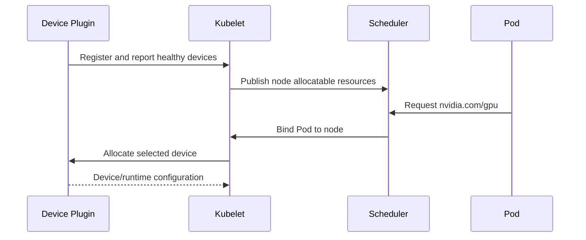

# Device Plugin and Kubernetes Resource Model

Kubernetes does not discover GPUs by itself. A device plugin registers with the kubelet, reports healthy devices, and allocates them when a Pod requests an extended resource such as `nvidia.com/gpu`.

## Learning Objectives

Explain registration, ListAndWatch, allocation, health changes, and the limits of the default extended-resource model.

## Allocation Flow

Extended resources are integer, non-overcommitted resources. The scheduler reasons about quantity, not internal NVLink topology, memory size, or performance unless additional labels and scheduling logic are provided.

## Health and Advertisement

The plugin continuously reports device state. A failed plugin can remove allocatable resources or prevent new allocations while existing containers continue. A failed GPU may reduce capacity, but recovery can require node drain or reset.

| Kubernetes view | What it proves |
|---|---|
| Capacity | Number detected for the node |
| Allocatable | Number available to scheduling |
| Pod request/limit | Quantity requested |
| Allocation | Device assigned by kubelet/plugin |
| Application test | CUDA actually works |

## Production Design

Run the plugin as a managed DaemonSet, protect its socket and privileges, and monitor restarts and registration. Use admission policy to require requests and limits consistently. For MIG, time slicing, or other sharing, the resource model changes and must be documented for users.

## Troubleshooting

**No `nvidia.com/gpu` on node:** inspect plugin Pod, kubelet logs, driver health, plugin socket, node labels, and tolerations.

**Pod Pending:** inspect resource requests, node allocatable, taints, affinity, and fragmentation.

**Pod Running but CUDA fails:** allocation succeeded; move to runtime, driver, image, and application layers.

## Customer Perspective

The device plugin makes GPUs schedulable, not optimized. Topology, sharing, quotas, fairness, and application health require additional platform capabilities.

## Interview Preparation

**Question:** Why does Kubernetes list GPU capacity even if a CUDA workload later fails?

Resource advertisement validates discovery and health at the plugin level, not every driver-library or application operation.

## Key Takeaways

- Device plugins bridge hardware discovery and kubelet allocation.
- Extended resources are integer and non-overcommitted by default.
- Scheduler quantity awareness is not topology awareness.
- Allocation success and application success are different gates.

## Cross References

- [Container Toolkit](./chapter-03-container-toolkit-runtimeclass-and-cdi)
- [Next: Node and GPU Feature Discovery](./chapter-05-node-and-gpu-feature-discovery)
