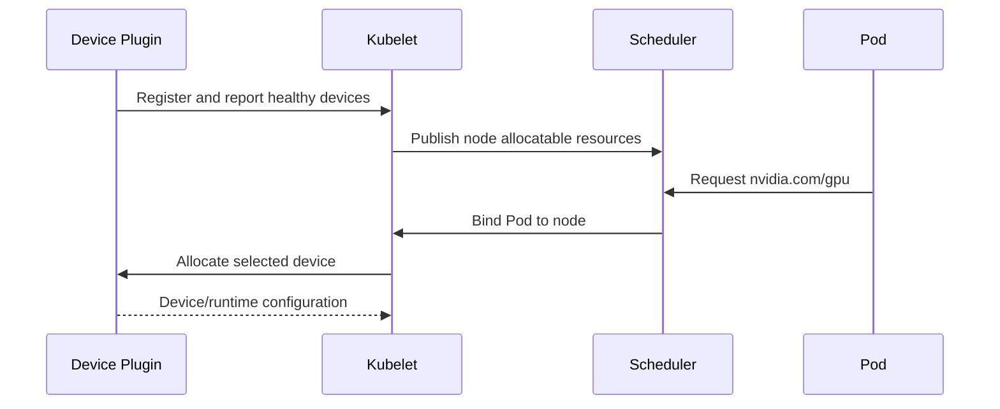

# Device Plugin and Kubernetes Resource Model

Kubernetes does not discover GPUs by itself. A device plugin registers with the kubelet, reports healthy devices, and allocates them when a Pod requests an extended resource such as `nvidia.com/gpu`.

## Learning Objectives

After completing this chapter, you will be able to:

- explain how a device plugin registers with kubelet;
- describe how `ListAndWatch` and allocation work together;
- distinguish allocatable capacity from workload readiness;
- explain why extended resources are integer and non-overcommitted;
- identify what the default resource model does not express;
- design the first checks for a missing GPU allocation.

## Allocation Flow

Extended resources are integer, non-overcommitted resources. The scheduler reasons about quantity, not internal NVLink topology, memory size, or performance unless additional labels and scheduling logic are provided.

That design is useful because it keeps the core scheduler simple. It is also limiting because a platform team must supply the missing policy if a workload needs locality, shared capacity, or a specific GPU class.

## Production Story

A cluster adds a new GPU node pool, and the node labels look correct, but GPU workloads still fail to land where the platform team expects. The scheduler sees `nvidia.com/gpu`, but it has no idea which nodes have the preferred topology or which nodes should remain reserved for a latency-sensitive tenant.

The incident is not a scheduling bug. It is a resource-model mismatch. The device plugin did exactly what Kubernetes asked: it advertised a count. The missing work was policy and labeling.

The fix introduces a stable label set, a documented resource policy, and a validation step that checks both quantity and placement after each rollout.

## Health and Advertisement

The plugin continuously reports device state. A failed plugin can remove allocatable resources or prevent new allocations while existing containers continue. A failed GPU may reduce capacity, but recovery can require node drain or reset.

The important distinction is between discovery and execution. The device plugin tells Kubernetes what exists and what is safe to assign. It does not prove that every CUDA call, application launch, or distributed-training path will succeed.

| Kubernetes view | What it proves |
|---|---|
| Capacity | Number detected for the node |
| Allocatable | Number available to scheduling |
| Pod request/limit | Quantity requested |
| Allocation | Device assigned by kubelet/plugin |
| Application test | CUDA actually works |

The important lesson is that the resource model is a control-plane signal, not a full application-health guarantee. The cluster can report a healthy allocatable count while a runtime or CUDA compatibility problem still breaks the workload.

## Production Design

Run the plugin as a managed DaemonSet, protect its socket and privileges, and monitor restarts and registration. Use admission policy to require requests and limits consistently. For MIG, time slicing, or other sharing, the resource model changes and must be documented for users.

The plugin should be treated as infrastructure, not as a convenience sidecar. If it is down, the cluster may still run CPU workloads, but the GPU pool is partially or completely unavailable. That makes logging, alerting, and rollout discipline important.

If the cluster uses multiple GPU classes, prefer a small set of stable labels and resource names over free-form node annotations. That gives the scheduler enough information to make useful placement decisions without turning every manifest into hardware trivia.

When the platform needs richer placement behavior, add that policy explicitly. Examples include node affinity for a specific GPU class, taints for reserved pools, or a custom scheduler policy for topology-sensitive jobs. Do not expect the base resource model to infer intent.

## Troubleshooting

**No `nvidia.com/gpu` on node:** inspect plugin Pod, kubelet logs, driver health, plugin socket, node labels, and tolerations.

**Pod Pending:** inspect resource requests, node allocatable, taints, affinity, and fragmentation.

**Pod Running but CUDA fails:** allocation succeeded; move to runtime, driver, image, and application layers.

**Pod requests one GPU but lands on the wrong pool:** inspect labels, taints, node affinity, and whether the request should be using a class label rather than a bare resource quantity.

**Only some nodes advertise GPUs:** compare plugin version, node health, runtime integration, and daemonset placement between healthy and unhealthy nodes.

**Allocatable disappears after a reboot:** compare kubelet status, driver load, device-plugin logs, and any automation that should reinstall or re-register the operand stack.

## Customer Perspective

The device plugin makes GPUs schedulable, not optimized. Topology, sharing, quotas, fairness, and application health require additional platform capabilities.

For customers, this means the platform promise should be phrased carefully. "You can request one GPU" is not the same as "your workload will land on the best GPU for this job." The first promise is a resource contract. The second is a scheduling and policy contract.

## Interview Preparation

**Question:** Why does Kubernetes list GPU capacity even if a CUDA workload later fails?

Resource advertisement validates discovery and health at the plugin level, not every driver-library or application operation.

**Question:** Why do operators sometimes call the device plugin an infrastructure component?

Because it directly controls whether GPU nodes are visible to the scheduler and whether new Pods can be assigned devices.

**Question:** Why is the scheduler still blind after a GPU resource appears?

Because the default resource model only understands quantity. It does not infer topology, memory geometry, tenant preference, or workload criticality.

## Key Takeaways

- Device plugins bridge hardware discovery and kubelet allocation.
- Extended resources are integer and non-overcommitted by default.
- Scheduler quantity awareness is not topology awareness.
- Allocation success and application success are different gates.
- The plugin is an infrastructure control plane component.
- Scheduling policy and hardware policy are not the same thing.
- A resource count is not a placement policy.
- Additional labels and selectors are required for topology-aware scheduling.

## Cross References

- [Container Toolkit](./chapter-03-container-toolkit-runtimeclass-and-cdi)
- [Next: Node and GPU Feature Discovery](./chapter-05-node-and-gpu-feature-discovery)
