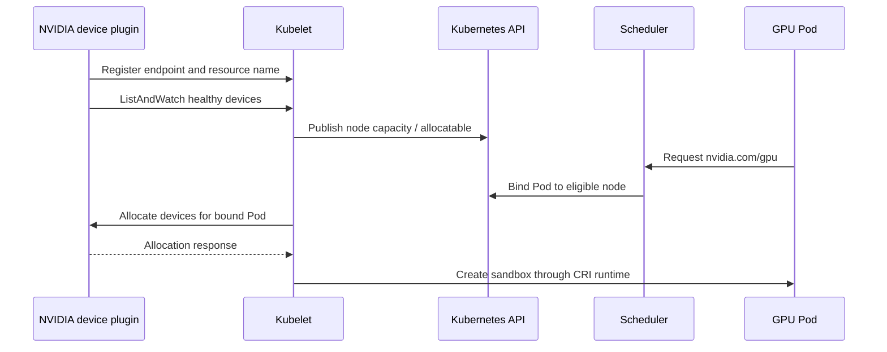

# Device Plugin and Kubernetes Resource Model

The Kubernetes scheduler cannot inspect a GPU driver, reason about device files, or allocate a vendor device directly. The device-plugin framework separates that vendor-specific work from the scheduler. An NVIDIA device plugin discovers supported devices on a node, registers with the kubelet, reports their health, and participates in allocation when a bound Pod requests the corresponding resource.

This model makes a GPU schedulable. It intentionally does not make every hardware characteristic schedulable. That boundary is the source of both its operational simplicity and its most important production trade-offs.

## Learning Objectives

After this chapter, you can:

- explain device-plugin registration, health reporting, and allocation at a high level;
- distinguish node capacity, allocatable resources, a Pod request, and an allocated device;
- explain why extended resources express quantity rather than placement quality;
- identify the policy needed for GPU classes, topology, and sharing; and
- troubleshoot a missing or unusable GPU without confusing resource advertisement with workload success.

## The Kubelet Contract

**Figure 10.4.1 — The kubelet is the bridge between a device plugin and Kubernetes scheduling.** The scheduler reads node resource state from the API; it does not call the plugin. Allocation occurs after a Pod is bound to a node.

The plugin exposes a local gRPC endpoint under the device-plugin framework and registers it with the kubelet. `ListAndWatch` keeps the kubelet informed of the discovered device IDs and health state. When the health set changes, the kubelet updates the node’s resource view. During allocation, the plugin returns the device-specific information required by the node’s configured runtime path. [Chapter 3](./chapter-03-container-toolkit-runtimeclass-and-cdi) covers the next handoff to the runtime.

The exact API version and allocation strategy are implementation details that must match the Kubernetes release and NVIDIA device-plugin configuration in use. Treat the plugin’s release notes and supported configuration as the authority, rather than copying old socket paths or annotations from a different cluster.

## Read the Resource States Precisely

| State | Meaning | What it does not prove |
|---|---|---|
| Node capacity | Quantity the kubelet reports as present | That every device is allocatable or a workload can use one |
| Node allocatable | Quantity available to scheduling after kubelet accounting | Runtime injection, CUDA initialization, or desired topology |
| Pod request/limit | Quantity the workload asks Kubernetes to reserve | That an eligible node exists |
| Pod binding | Scheduler chose a node | That the kubelet has completed allocation |
| Allocation | Kubelet/plugin selected devices for the bound Pod | That the application stack can execute |
| Workload validation | A process used the device successfully | Performance, distributed behavior, or tenant policy |

For extended resources such as a GPU, Kubernetes expects the quantity in `limits`; when a request is specified it must match the limit. GPUs are ordinarily consumed as whole allocatable units. Sharing, MIG, and virtual-GPU policies can expose different resource names or quantities, but they are deliberate platform configurations—not implicit overcommit behavior. See [Volume 11](../volume-11/index) before promising concurrency or isolation semantics to tenants.

## The Resource Model’s Productive Limitation

The default scheduler can filter and score based on resource quantity and Kubernetes placement rules. It does not automatically infer that a training job needs four mutually close GPUs, a particular compute capability, a GPU close to a NIC, or a reserved low-latency pool. A bare resource request is therefore a capacity contract, not a hardware-intent contract.

| Requirement | Mechanism to add | Trade-off |
|---|---|---|
| Supported GPU class | Controlled feature labels and node affinity | Tighter eligibility can strand capacity |
| Dedicated pool | Taints, tolerations, quota, and namespace policy | More pools increase operational overhead |
| CPU/device locality | CPU Manager, Topology Manager, and qualified placement policy | Strict alignment can reduce utilization |
| Multi-Pod job start | Queue or gang-aware scheduling integration | More scheduler complexity |
| Shared GPU experience | Explicit MIG, time-slicing, or vGPU design | Different resource and isolation semantics |

This is not a defect in the device plugin. It is a clean separation of responsibilities. The plugin provides device discovery and allocation. The platform adds policy based on workload intent. [Chapter 8](./chapter-08-gpu-scheduling-and-topology) develops the placement consequences.

## Production Story: Correct Count, Wrong Outcome

A new GPU pool reports the expected number of `nvidia.com/gpu` resources. A latency-sensitive service lands there, but its performance is inconsistent because the manifest asked only for one GPU. It had no affinity for the qualified pool, no CPU locality policy, and no contract for the hardware class. The device plugin and scheduler behaved correctly; the resource request was underspecified.

The remediation is not a custom device-plugin patch. The platform publishes a small label taxonomy and workload classes, reserves the appropriate pool with taints and policy, and validates both placement and performance on the canary. The lesson is that resource discovery is an input to scheduling design, not the design itself.

## Operate the Plugin as Infrastructure

The device plugin normally runs node-locally as a managed DaemonSet and requires access to kubelet’s device-plugin registration path. It is an infrastructure component: if it is unavailable or reports devices unhealthy, new GPU allocations can be blocked even while CPU workloads and already-running GPU containers continue.

Monitor operand availability, restarts, registration errors, node resource deltas, and unexpected changes in healthy-device count. Protect the plugin’s namespace, images, RBAC, and host-path access. A compromised or misconfigured plugin can alter scheduling capacity across the fleet.

If GPU Operator manages the plugin, use its policy and status as the desired-state entry point; [Chapter 6](./chapter-06-gpu-operator-architecture) explains that reconciliation model. Do not let a second deployment system overwrite the same DaemonSet or configuration.

## Troubleshooting in Dependency Order

| Symptom | First evidence | Likely next action |
|---|---|---|
| Resource absent on node | Driver health, plugin Pod, kubelet/plugin registration logs | Repair the lowest failing host or registration layer |
| Pod Pending | Pod events, request, allocatable quantity, taints, affinity, quota | Separate shortage from policy and fragmentation |
| Pod bound but fails at startup | Allocation and CRI/runtime logs | Move to runtime integration, not scheduler tuning |
| Pod starts but CUDA fails | Driver/image compatibility and application logs | Compare a minimal approved image on the same node |
| Only some nodes advertise capacity | Plugin version, node profile, driver and runtime evidence | Find configuration drift or a pool-specific host issue |

Do not use `kubectl describe node` as the only test. It is a control-plane view. Pair it with the plugin’s health evidence and a scoped runtime validation before returning a node to service.

## Customer Architecture Discussion

The device plugin provides a reliable statement: “this node has this many healthy, allocatable units of this resource.” It does not provide the broader statement some customers assume: “this workload will receive the best device for its performance target.” The latter needs a service-class design that combines resource requests with placement, sharing, fairness, and observability policy.

Be explicit about the distinction in tenant documentation. It sets the right expectation and prevents a one-line GPU request from becoming an accidental hardware-SLA promise.

## Interview Questions

**Why can a node advertise GPU capacity while a CUDA workload later fails?**

The plugin validates discovery and reports health to the kubelet. CUDA execution still depends on allocation, runtime injection, host-driver compatibility, and the workload image.

**Why does the scheduler not choose the best NVLink topology from a GPU count alone?**

An extended resource communicates quantity. Topology and workload communication needs require additional metadata and scheduling policy.

## Key Takeaways

- The device plugin delegates vendor discovery, health, and allocation to a kubelet-integrated component.
- Capacity, allocatable quantity, allocation, and workload success are different facts.
- Extended resources give Kubernetes a count, not complete hardware intent.
- Sharing and topology are explicit platform designs with their own resource contracts.
- Treat the plugin and its registration path as critical node infrastructure.

## Cross References

- [NVIDIA Container Toolkit, RuntimeClass, and CDI](./chapter-03-container-toolkit-runtimeclass-and-cdi)
- [Node and GPU Feature Discovery](./chapter-05-node-and-gpu-feature-discovery)
- [GPU Operator Architecture](./chapter-06-gpu-operator-architecture)
- [GPU Scheduling and Topology](./chapter-08-gpu-scheduling-and-topology)
