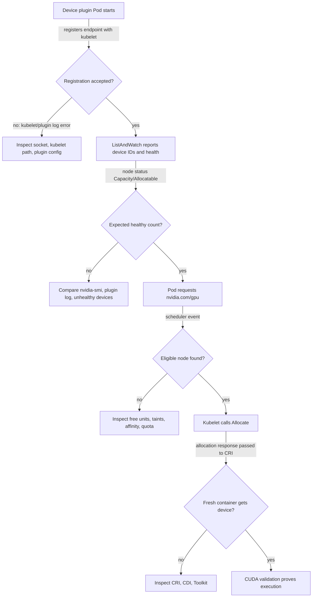

# Device Plugin and Kubernetes Resource Model

The Kubernetes scheduler cannot inspect a GPU driver, reason about device files, or allocate a vendor device directly. The device-plugin framework separates that vendor-specific work from the scheduler. An NVIDIA device plugin discovers supported devices on a node, registers with the kubelet, reports their health, and participates in allocation when a bound Pod requests the corresponding resource.

This model makes a GPU schedulable. It intentionally does not make every hardware characteristic schedulable. That boundary is the source of both its operational simplicity and its most important production trade-offs.

## Learning Objectives

After this chapter, you can:

- explain device-plugin registration, health reporting, and allocation at a high level;
- distinguish node capacity, allocatable resources, a Pod request, and an allocated device;
- explain why extended resources express quantity rather than placement quality;
- identify the policy needed for GPU classes, topology, and sharing; and
- troubleshoot a missing or unusable GPU without confusing resource advertisement with workload success.

## The Kubelet Contract



**Figure 10.4.1 — Device-plugin health becomes useful only when it survives the complete kubelet contract.** Registration, health reporting, scheduling, allocation, and runtime use are separate evidence gates.

The plugin exposes a local gRPC endpoint under the device-plugin framework and registers it with the kubelet. `ListAndWatch` keeps the kubelet informed of the discovered device IDs and health state. When the health set changes, the kubelet updates the node’s resource view. During allocation, the plugin returns the device-specific information required by the node’s configured runtime path. [Chapter 3](./chapter-03-container-toolkit-runtimeclass-and-cdi) covers the next handoff to the runtime.

The exact API version and allocation strategy are implementation details that must match the Kubernetes release and NVIDIA device-plugin configuration in use. Treat the plugin’s release notes and supported configuration as the authority, rather than copying old socket paths or annotations from a different cluster.

## Read the Resource States Precisely

| State | Meaning | What it does not prove |
|---|---|---|
| Node capacity | Quantity the kubelet reports as present | That every device is allocatable or a workload can use one |
| Node allocatable | Quantity available to scheduling after kubelet accounting | Runtime injection, CUDA initialization, or desired topology |
| Pod request/limit | Quantity the workload asks Kubernetes to reserve | That an eligible node exists |
| Pod binding | Scheduler chose a node | That the kubelet has completed allocation |
| Allocation | Kubelet/plugin selected devices for the bound Pod | That the application stack can execute |
| Workload validation | A process used the device successfully | Performance, distributed behavior, or tenant policy |

For extended resources such as a GPU, Kubernetes expects the quantity in `limits`; when a request is specified it must match the limit. GPUs are ordinarily consumed as whole allocatable units. Sharing, MIG, and virtual-GPU policies can expose different resource names or quantities, but they are deliberate platform configurations—not implicit overcommit behavior. See [Volume 11](../volume-11/index) before promising concurrency or isolation semantics to tenants.

### Inspect capacity, allocatable, and active requests together

**Purpose:** compare what kubelet reports with what running Pods have requested.

```bash
kubectl get node gpu-node-03 -o json | jq '{capacity:.status.capacity["nvidia.com/gpu"],allocatable:.status.allocatable["nvidia.com/gpu"]}'
```

**Representative output:**

```json
{
  "capacity": "8",
  "allocatable": "8"
}
```

`capacity=8` means the kubelet currently reports eight healthy units. `allocatable=8` means kubelet has not withheld any from scheduling at the node-status layer. These values are not “free GPU” counters; scheduler availability also depends on Pod allocations.

```bash
kubectl get pods -A --field-selector spec.nodeName=gpu-node-03 \
  -o custom-columns='NS:.metadata.namespace,POD:.metadata.name,GPU:.spec.containers[*].resources.limits.nvidia\.com/gpu'
```

```text
NS          POD                         GPU
training    trainer-rank-0              4
inference   embedding-service-6f9b2     2
platform    dcgm-exporter-7kc4m         <none>
```

Six of the eight units are requested by running workload Pods. The exporter row has no extended-resource request and therefore does not consume an allocatable GPU unit in this example. The scheduler should see two units available before considering affinity, taints, or other Pods in transition.

**Purpose:** inspect the exact Pod contract.

```bash
kubectl get pod trainer-rank-0 -n training -o json | jq '.spec.containers[] | {name,requests:.resources.requests,limits:.resources.limits}'
```

```json
{
  "name": "trainer",
  "requests": {
    "cpu": "8",
    "memory": "64Gi",
    "nvidia.com/gpu": "4"
  },
  "limits": {
    "cpu": "8",
    "memory": "64Gi",
    "nvidia.com/gpu": "4"
  }
}
```

The GPU request and limit both equal four. A manifest that requests one GPU but limits four is invalid for an extended resource; Kubernetes does not interpret that as elastic GPU use.

## The Resource Model’s Productive Limitation

The default scheduler can filter and score based on resource quantity and Kubernetes placement rules. It does not automatically infer that a training job needs four mutually close GPUs, a particular compute capability, a GPU close to a NIC, or a reserved low-latency pool. A bare resource request is therefore a capacity contract, not a hardware-intent contract.

| Requirement | Mechanism to add | Trade-off |
|---|---|---|
| Supported GPU class | Controlled feature labels and node affinity | Tighter eligibility can strand capacity |
| Dedicated pool | Taints, tolerations, quota, and namespace policy | More pools increase operational overhead |
| CPU/device locality | CPU Manager, Topology Manager, and qualified placement policy | Strict alignment can reduce utilization |
| Multi-Pod job start | Queue or gang-aware scheduling integration | More scheduler complexity |
| Shared GPU experience | Explicit MIG, time-slicing, or vGPU design | Different resource and isolation semantics |

This is not a defect in the device plugin. It is a clean separation of responsibilities. The plugin provides device discovery and allocation. The platform adds policy based on workload intent. [Chapter 8](./chapter-08-gpu-scheduling-and-topology) develops the placement consequences.

### Worked fragmentation example

Three nodes each advertise eight GPUs. Their current allocations are seven, four, and eight:

```text
node-a: 8 − 7 = 1 free
node-b: 8 − 4 = 4 free
node-c: 8 − 8 = 0 free
cluster-wide free = 5 GPUs
```

A Pod requesting five GPUs cannot schedule because the largest node-local free block is four. A pair of Pods requesting two GPUs each can schedule on node-b, but doing so may leave no node for a later four-GPU job. The device-plugin count is correct in both cases; the platform needs queue policy and workload-aware bin packing to manage the trade-off.

## Production Story: Correct Count, Wrong Outcome

A new GPU pool reports the expected number of `nvidia.com/gpu` resources. A latency-sensitive service lands there, but its performance is inconsistent because the manifest asked only for one GPU. It had no affinity for the qualified pool, no CPU locality policy, and no contract for the hardware class. The device plugin and scheduler behaved correctly; the resource request was underspecified.

The remediation is not a custom device-plugin patch. The platform publishes a small label taxonomy and workload classes, reserves the appropriate pool with taints and policy, and validates both placement and performance on the canary. The lesson is that resource discovery is an input to scheduling design, not the design itself.

## Operate the Plugin as Infrastructure

The device plugin normally runs node-locally as a managed DaemonSet and requires access to kubelet’s device-plugin registration path. It is an infrastructure component: if it is unavailable or reports devices unhealthy, new GPU allocations can be blocked even while CPU workloads and already-running GPU containers continue.

Monitor operand availability, restarts, registration errors, node resource deltas, and unexpected changes in healthy-device count. Protect the plugin’s namespace, images, RBAC, and host-path access. A compromised or misconfigured plugin can alter scheduling capacity across the fleet.

If GPU Operator manages the plugin, use its policy and status as the desired-state entry point; [Chapter 6](./chapter-06-gpu-operator-architecture) explains that reconciliation model. Do not let a second deployment system overwrite the same DaemonSet or configuration.

## Troubleshooting in Dependency Order

| Symptom | First evidence | Likely next action |
|---|---|---|
| Resource absent on node | Driver health, plugin Pod, kubelet/plugin registration logs | Repair the lowest failing host or registration layer |
| Pod Pending | Pod events, request, allocatable quantity, taints, affinity, quota | Separate shortage from policy and fragmentation |
| Pod bound but fails at startup | Allocation and CRI/runtime logs | Move to runtime integration, not scheduler tuning |
| Pod starts but CUDA fails | Driver/image compatibility and application logs | Compare a minimal approved image on the same node |
| Only some nodes advertise capacity | Plugin version, node profile, driver and runtime evidence | Find configuration drift or a pool-specific host issue |

### Evidence row 1: plugin fails to register

```bash
kubectl -n gpu-operator get pod -l app=nvidia-device-plugin-daemonset -o wide
kubectl -n gpu-operator logs nvidia-device-plugin-daemonset-rgk7m --tail=20
```

**Representative broken output:**

```text
NAME                                      READY   STATUS             NODE
nvidia-device-plugin-daemonset-rgk7m      0/1     CrashLoopBackOff   gpu-node-05

I0806 10:41:08.213004 main.go:235] Starting FS watcher for /var/lib/kubelet/device-plugins
E0806 10:41:08.214799 main.go:262] failed to create plugin: open /var/lib/kubelet/device-plugins: no such file or directory
```

The plugin cannot reach the kubelet registration path. The `CrashLoopBackOff` status explains repeated restarts; the log identifies the missing host path. Verify the DaemonSet mount and kubelet path for this node image before changing GPU health settings.

### Evidence row 2: scheduler shortage versus policy

```bash
kubectl describe pod inference-7b9c5 | sed -n '/Events:/,$p'
```

```text
Events:
  Warning  FailedScheduling  31s  default-scheduler  0/6 nodes are available:
  2 Insufficient nvidia.com/gpu, 4 node(s) didn't match Pod's node affinity/selector.
```

This event contains two independent filters. Two nodes pass affinity but lack free GPU capacity; four have capacity status that is irrelevant because the workload excludes them. Removing affinity may increase schedulability but could violate the approved hardware class. The incident decision must use workload intent, not only the quickest placement.

### Evidence row 3: device marked unhealthy

```bash
kubectl get node gpu-node-06 -o json | jq '{capacity:.status.capacity["nvidia.com/gpu"],allocatable:.status.allocatable["nvidia.com/gpu"]}'
kubectl -n gpu-operator logs nvidia-device-plugin-daemonset-4qj2x --since=15m | tail -12
```

```text
{
  "capacity": "8",
  "allocatable": "7"
}
I0806 11:02:19.617 device.go:194] Event: XidCriticalError, Device=GPU-722d1344-1b6d-4a95-8cb9-1c572eb5ad94
I0806 11:02:19.618 server.go:168] Marking device unhealthy: GPU-722d1344-1b6d-4a95-8cb9-1c572eb5ad94
```

The difference between capacity and allocatable shows one unit withheld from new allocation. The plugin log ties that reduction to a specific UUID and health event. Do not force allocatable back to eight; quarantine and investigate the device according to the hardware runbook.

Do not use `kubectl describe node` as the only test. It is a control-plane view. Pair it with the plugin’s health evidence and a scoped runtime validation before returning a node to service.

## Customer Architecture Discussion

The device plugin provides a reliable statement: “this node has this many healthy, allocatable units of this resource.” It does not provide the broader statement some customers assume: “this workload will receive the best device for its performance target.” The latter needs a service-class design that combines resource requests with placement, sharing, fairness, and observability policy.

Be explicit about the distinction in tenant documentation. It sets the right expectation and prevents a one-line GPU request from becoming an accidental hardware-SLA promise.

## Interview Questions

**Why can a node advertise GPU capacity while a CUDA workload later fails?**

> “I separate discovery from execution. The device plugin can discover devices, report them healthy, and register capacity with kubelet even though a later RuntimeClass, CDI, driver-library, or framework boundary fails. I would check the Pod phase and events first. If it is Pending, I stay with resource and policy evidence. If it is bound but cannot start, I inspect allocation and CRI. If it starts and CUDA fails, I compare a minimal image with the application image.”

**Why does the scheduler not choose the best NVLink topology from a GPU count alone?**

> “The extended resource is an integer contract. It tells the scheduler how many units a Pod needs, not how the physical GPUs are connected. I would expose a controlled hardware class through labels and affinity, then use topology-aware policy appropriate to the workload. I would also explain the utilization cost: every additional hard constraint reduces the set of eligible nodes and can increase fragmentation.”

**How would you explain `capacity=8` and `allocatable=7`?**

> “I would say the kubelet knows about eight units but is exposing only seven for new scheduling. I would not infer the reason from the numbers alone. I would inspect device-plugin health logs, kubelet events, and hardware telemetry for an unhealthy device or a policy adjustment. If the plugin marked a UUID unhealthy after an XID event, the correct response is quarantine and diagnosis, not editing node status.”

## Key Takeaways

- The device plugin delegates vendor discovery, health, and allocation to a kubelet-integrated component.
- Capacity, allocatable quantity, allocation, and workload success are different facts.
- Extended resources give Kubernetes a count, not complete hardware intent.
- Sharing and topology are explicit platform designs with their own resource contracts.
- Treat the plugin and its registration path as critical node infrastructure.

## Cross References

- [NVIDIA Container Toolkit, RuntimeClass, and CDI](./chapter-03-container-toolkit-runtimeclass-and-cdi)
- [Node and GPU Feature Discovery](./chapter-05-node-and-gpu-feature-discovery)
- [GPU Operator Architecture](./chapter-06-gpu-operator-architecture)
- [GPU Scheduling and Topology](./chapter-08-gpu-scheduling-and-topology)
