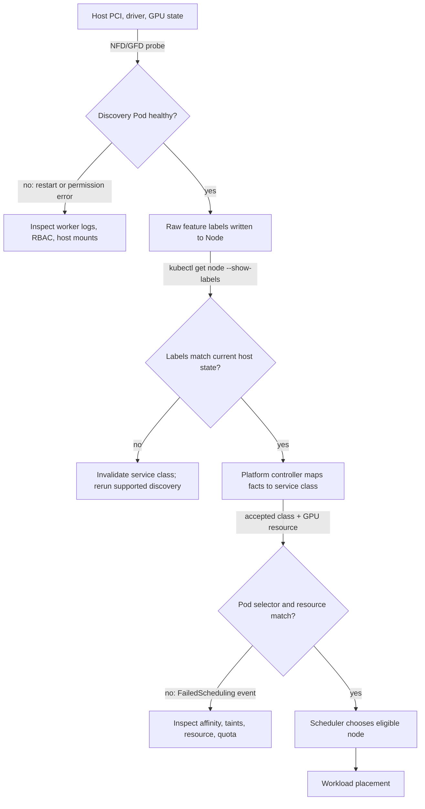

# Node and GPU Feature Discovery

An allocator can assign only the resources it knows about, and a scheduler can discriminate only on facts that reach the API. A GPU request answers *how many* devices a Pod needs. It does not answer whether those devices are the intended architecture, have the required partitioning state, sit in an approved node pool, or have passed the platform acceptance test.

Node Feature Discovery (NFD) and GPU Feature Discovery (GFD) convert selected host facts into node labels. That makes capability visible to scheduling and policy. It also creates an API contract: a wrong, stale, or freely mutable label can place a workload incorrectly even when every component involved is healthy.

## Learning objectives

After this chapter, you will be able to:

- distinguish resource advertisement from descriptive node metadata;
- trace discovery from a node-local probe to a scheduling decision;
- design a label taxonomy that preserves workload portability;
- protect capability labels as infrastructure-controlled data; and
- diagnose a pending Pod caused by discovery drift rather than capacity loss.

## The problem: quantity is not a platform contract

Consider an inference team that needs a validated pool with a particular accelerator class and a training team that needs nodes configured for a different sharing model. Both teams may request `nvidia.com/gpu: 1`. The device plugin can satisfy that request on either node. If the platform has not published a deliberate distinction, Kubernetes has no basis for applying it.

The tempting response is to expose every hardware string and ask teams to use required node affinity. That works briefly, then binds manifests to inventory. A refresh from one SKU to another becomes an application migration, capacity fragments, and a typo can turn a performance preference into a hard outage. Discovery should expose facts; the platform should turn the small subset that users need into durable service classes.

## From host evidence to a scheduling decision



**Figure 10.5.1 — Discovery is useful only when its data is fresh, governed, and joined with allocatable capacity.** The decision branches distinguish a detector failure, stale metadata, and a legitimate scheduling policy mismatch.

NFD normally runs node-local workers and publishes detected host features through Kubernetes resources. GFD is the NVIDIA-specific discovery component commonly deployed with the GPU platform stack. Exact label keys and values are release- and configuration-dependent. Treat them as an implementation detail until they have been reviewed as part of your platform API.

## Facts, assertions, and classes

Three kinds of labels are useful, but they should not have the same owner or lifetime.

| Kind | Example intent | Authoritative writer | Consumer |
|---|---|---|---|
| Discovered fact | accelerator family, detected driver, partitioning state | discovery component | platform automation and diagnostics |
| Lifecycle assertion | node accepted, maintenance pending, network validated | controlled platform controller | admission and operations |
| Service class | `gpu.platform.example/class=training-topology` | platform engineering | workload manifests |

A discovered fact is evidence observed at a point in time. A lifecycle assertion says the platform has completed a process against a defined standard. A service class is a promise to users. Keeping those distinctions explicit avoids a common failure: using a raw inventory label as though it were proof that a node is safe for a workload.

For example, `gpu-validation=passed` should be set only after the driver, runtime, device plugin, and a defined validation workload succeed. It should be removed or withheld during a disruptive change. This gives admission control and node affinity a stable condition without claiming that discovery alone tested the entire stack.

### Read discovery output as evidence

**Purpose:** list selected NVIDIA-related labels without dumping the entire Node object.

```bash
kubectl get node gpu-node-04 -o json | jq -r '.metadata.labels | to_entries[] | select(.key | startswith("nvidia.com/") or startswith("feature.node.kubernetes.io/")) | "\(.key)=\(.value)"' | sort
```

**Representative output:**

```text
feature.node.kubernetes.io/pci-10de.present=true
nvidia.com/cuda.driver.major=550
nvidia.com/gpu.count=8
nvidia.com/gpu.deploy.container-toolkit=true
nvidia.com/gpu.deploy.device-plugin=true
nvidia.com/gpu.family=hopper
nvidia.com/gpu.memory=81559
nvidia.com/mig.capable=true
```

`pci-10de.present=true` is a discovered vendor-presence fact. `gpu.count=8` describes inventory, while `gpu.deploy.*=true` is commonly used as an operand-deployment selector rather than a workload SLO. `gpu.memory=81559` is reported in MiB in this representative example; do not build an application API around a raw numeric label without documenting units and lifecycle. `mig.capable=true` says the hardware can support MIG, not that MIG is currently configured or that a particular MIG resource is allocatable.

**Purpose:** compare raw facts with the platform service-class assertion.

```bash
kubectl get node gpu-node-04 -o custom-columns='NAME:.metadata.name,RAW-FAMILY:.metadata.labels.nvidia\.com/gpu\.family,CLASS:.metadata.labels.gpu\.platform\.example/class,VALIDATED:.metadata.labels.gpu\.platform\.example/validated'
```

```text
NAME          RAW-FAMILY   CLASS                VALIDATED
gpu-node-04   hopper       training-topology    true
```

The raw family is discovery output. The class and validation labels are organization-owned assertions. If `VALIDATED` is absent after maintenance, the node should remain outside production eligibility even if the raw family is correct.

## A practical label contract

Publish a short catalog, not an accidental dump of detector output. For each workload-facing label, document:

- its semantic meaning and owner;
- the evidence or controller that sets it;
- whether it is a hard eligibility constraint or a preference;
- the change process and deprecation window; and
- the operational action when it disagrees with node reality.

Prefer coarse classes such as `inference-general`, `training-topology`, or `mig-serving` when those are the actual service offerings. Retain raw labels for inventory, audits, and controller logic. Do not promise a memory size, interconnect shape, or driver behavior through a class unless the acceptance process tests the promised property.

### Worked portability example

Suppose 40 manifests select a literal product label. A hardware refresh changes the product string, so all 40 manifests require review. If the platform instead exposes one stable class label, only the class-mapping controller and acceptance test change.

```text
SKU-bound approach: 40 workload changes + platform change
Service-class approach: 1 platform mapping change + validation
```

This does not eliminate testing. It moves testing to the owner who can verify the new hardware against the service contract, rather than distributing inventory knowledge across application repositories.

## Security and integrity boundary

Node labels influence placement, isolation, licensing, and sometimes compliance. A tenant that can write an eligibility label can potentially steer work onto hardware it should not use. A compromised node can also make a false claim. RBAC should therefore restrict Node mutation and the service accounts used by discovery and reconciliation. Admission policy should reject workload selectors that target unapproved namespaces or keys when that is appropriate for the tenancy model.

This is not a reason to distrust all labels. It is a reason to make the trust chain visible: who observed the fact, who transformed it into a class, and who is allowed to consume or alter it. Keep manual exception labels in a clearly separate namespace and attach an expiry or review process to them.

### Inspect who can mutate Nodes

```bash
kubectl auth can-i patch nodes --as=system:serviceaccount:tenant-a:default
kubectl auth can-i patch nodes --as=system:serviceaccount:gpu-operator:gpu-feature-discovery
```

**Representative output:**

```text
no
yes
```

The tenant service account cannot patch Nodes, while the controlled discovery service account can. This proves an authorization decision, not that the discovery image or credentials are uncompromised. Image provenance, namespace control, and audit logging remain separate controls.

## Drift is an availability issue

Discovery drift appears after events that change node reality: a GPU replacement, driver update, MIG reconfiguration, BIOS or firmware work, an OS rebuild, or a discovery Pod failure. The resource may remain allocatable while its descriptive metadata is wrong. That is especially dangerous because the scheduler will make a confident but invalid decision.

Operate discovery with the same discipline as any other node-critical DaemonSet:

1. Alert when the worker is absent, repeatedly restarting, or unable to update its node.
2. Compare expected pool membership with the labels actually present.
3. Re-run the supported discovery or reconciliation path after state-changing maintenance.
4. Gate re-entry to production on the platform acceptance label, not merely `NodeReady`.
5. Record the observed facts and validation result with the maintenance change.

## Scheduling patterns and trade-offs

Use required affinity when a mismatch makes the workload incorrect or unsupported; use preferred affinity when it only improves performance or cost. Taints protect expensive GPU nodes from unconstrained workloads, while tolerations only grant eligibility—they do not select a node. Pair a service-class selector with a GPU request and a capacity policy; neither mechanism replaces the others.

| Requirement | Recommended expression | Cost of overuse |
|---|---|---|
| Run only in a validated GPU pool | required affinity on a platform class | fewer eligible nodes during maintenance |
| Prefer newest available accelerator | preferred affinity | modest scoring complexity |
| Prevent ordinary Pods landing on GPU nodes | taint plus controlled toleration | additional admission and documentation work |
| Require a specific physical topology | dedicated pool and topology-aware policy | substantial fragmentation |

For partitioned or shared GPU configurations, coordinate labels with the resource names advertised by the device plugin. A label saying that a node is MIG-enabled does not by itself guarantee that the requested partition resource exists. Check both conditions, and handle reconfiguration as a capacity-changing maintenance operation.

## Troubleshooting: the selector is correct, yet no Pod schedules

| Symptom | First evidence | Decision |
|---|---|---|
| Discovery Pod absent | DaemonSet desired/current/ready and node selector | repair deployment eligibility or image access |
| Label missing on one node | worker log and Node patch authorization | repair discovery path; do not hand-edit raw fact |
| Label present but stale | compare host fact, label, and maintenance timeline | invalidate class and rerun supported discovery |
| Pod Pending with correct class | scheduler event, labels, taints, allocatable GPU | separate policy, capacity, and fragmentation |
| MIG label and resource disagree | label state plus node allocatable resource names | treat as incomplete reconfiguration |

### Evidence row 1: discovery worker is not scheduled

```bash
kubectl -n gpu-operator get ds gpu-feature-discovery -o custom-columns='DESIRED:.status.desiredNumberScheduled,CURRENT:.status.currentNumberScheduled,READY:.status.numberReady,MISSCHEDULED:.status.numberMisscheduled'
```

**Representative broken output:**

```text
DESIRED   CURRENT   READY   MISSCHEDULED
12        11        11      0
```

One intended node has no worker. The next step is to compare the DaemonSet selector and that node’s labels or taints.

```bash
kubectl -n gpu-operator describe ds gpu-feature-discovery | sed -n '/Node-Selector:/,/Events:/p'
kubectl get node gpu-node-04 --show-labels | tr ',' '\n' | grep 'nvidia.com/gpu.deploy'
```

```text
Node-Selector:  nvidia.com/gpu.deploy.gpu-feature-discovery=true

nvidia.com/gpu.deploy.gpu-feature-discovery=false
```

The node explicitly excludes the worker. Determine whether this was intentional maintenance state or drift before changing it.

### Evidence row 2: stale hardware label after replacement

```bash
nvidia-smi --query-gpu=name,memory.total --format=csv,noheader | sort -u
kubectl get node gpu-node-04 -o jsonpath='{.metadata.labels.nvidia\.com/gpu\.product}{"\n"}{.metadata.labels.nvidia\.com/gpu\.memory}{"\n"}'
```

```text
NVIDIA H100 80GB HBM3, 81559 MiB
NVIDIA A100-SXM4-40GB
40536
```

The host reports H100 devices, while Kubernetes still exposes A100-era product and memory labels. The resource count can remain correct, but affinity decisions are now wrong. Remove the production acceptance assertion, repair or restart discovery through the supported reconciliation path, and verify the labels before readmission.

### Evidence row 3: affinity excludes all capacity

```bash
kubectl describe pod topology-trainer | sed -n '/Events:/,$p'
kubectl get nodes -l 'gpu.platform.example/class=training-topology' -o custom-columns='NAME:.metadata.name,GPU:.status.allocatable.nvidia\.com/gpu,VALIDATED:.metadata.labels.gpu\.platform\.example/validated'
```

```text
Events:
  Warning  FailedScheduling  54s  default-scheduler  0/12 nodes are available:
  8 node(s) didn't match Pod's node affinity/selector, 4 Insufficient nvidia.com/gpu.

NAME          GPU   VALIDATED
gpu-node-01   8     true
gpu-node-02   8     true
gpu-node-03   8     true
gpu-node-04   8     true
```

The four valid class nodes exist but are already allocated; eight other GPU nodes are intentionally excluded. This is a real class-capacity shortage. Weakening affinity may violate the workload contract, so escalate it as capacity planning rather than “fixing” discovery.

## Production checklist

- Discovery components run only with the minimum node access and API permissions they require.
- Workload-facing labels have named owners, semantics, and deprecation rules.
- A separate acceptance signal reflects end-to-end validation.
- Maintenance workflows invalidate or revalidate the node’s service class.
- Dashboards expose discovery health, label distribution, and unexpected pool drift.
- Application templates use platform classes rather than SKU strings wherever possible.

## Customer architecture discussion

For a shared platform, discovery is where hardware inventory becomes a product boundary. The platform team owns the translation from fluctuating supply to stable classes; application teams choose the class that matches their SLO and budget. That separation lets the platform replace hardware behind a class after validation, instead of asking every team to revise affinity rules.

## Interview preparation

**Why is a GPU model label not sufficient evidence that a node can run a workload?**

> “I treat a model label as an observed inventory fact, not an acceptance result. It does not prove the driver, runtime, advertised resource, topology, network path, or representative application. I would keep raw discovery labels for automation, then expose a separate platform-owned class and validation label after the node passes the full acceptance suite.”

**When does node affinity harm a GPU platform?**

> “Required affinity harms utilization when it encodes a preference as a compatibility rule. It shrinks the eligible pool, strands GPUs, and turns a hardware refresh into an application migration. I use hard affinity only when the workload would be unsupported or violate its service contract; otherwise I prefer soft affinity and measure whether the locality benefit is real.”

**How would you diagnose a label/resource disagreement?**

> “I would compare three sources: the host fact from `nvidia-smi`, the Node labels, and the allocatable resource names and counts. If the host changed but labels did not, I would remove the node’s acceptance assertion, inspect the discovery worker and its authorization, rerun the supported discovery path, and then validate the resource contract. I would not hand-edit the raw label because that hides the failed reconciler.”

## Key takeaways

- Feature discovery supplies scheduling metadata; the device plugin supplies allocatable devices.
- Treat labels that affect placement as governed infrastructure data.
- Separate raw facts, validation assertions, and user-facing service classes.
- Revalidate labels after every change that can alter node reality.
- Prefer portable platform classes over hardware strings in workload manifests.

## Cross references and further reading

- [Device Plugin and Kubernetes Resource Model](./chapter-04-device-plugin-and-kubernetes-resource-model)
- [GPU Operator Architecture](./chapter-06-gpu-operator-architecture)
- [GPU Scheduling and Topology](./chapter-08-gpu-scheduling-and-topology)
- [Kubernetes node affinity documentation](https://kubernetes.io/docs/concepts/scheduling-eviction/assign-pod-node/)
- [NVIDIA GPU Operator documentation](https://docs.nvidia.com/datacenter/cloud-native/gpu-operator/latest/)
