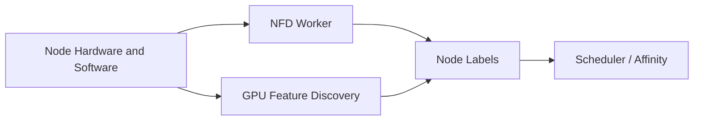

# Node Feature Discovery and GPU Feature Discovery

A scheduler cannot place workloads by GPU model, memory, MIG capability, topology, or driver characteristics unless those facts are represented in the Kubernetes API. Node Feature Discovery (NFD) detects host features. GPU Feature Discovery (GFD) publishes NVIDIA-specific labels.

## Learning Objectives

After completing this chapter, you will be able to:

- explain how Node Feature Discovery and GPU Feature Discovery publish node labels;
- distinguish automatically discovered labels from operator-assigned lifecycle labels;
- describe why labels matter to scheduling, validation, and compliance;
- identify the trust boundary around label mutation;
- design a label taxonomy that reduces coupling and drift;
- troubleshoot missing or stale GPU labels.

## Discovery Flow

Labels can describe GPU product, count, memory class, compute capability, driver information, MIG state, and other features depending on deployment and version.

## Production Story

A platform team rolls out a new GPU node pool and expects inference workloads to land only on the validated nodes. The hardware is correct, but the Pods spread across both the new and old pools because the manifests only request a GPU count. Nothing in the request says which class of node the workload should use.

The fix is not to add more ad hoc labels to every manifest. It is to define a small, stable platform taxonomy such as a validated class label, a GPU-family label, and a lifecycle label. Once those labels exist, platform policy can separate pool selection from application intent.

## Why Labels Matter

Workloads may require a minimum architecture, a specific GPU family, MIG-enabled nodes, or validated network capability. Labels allow node affinity and policy to express these requirements.

Labels are not automatically trustworthy in a hostile environment. Discovery components run with access to node information, and operators must control who can mutate nodes or spoof scheduling metadata.

| Use | Risk |
|---|---|
| Select GPU generation | Fragmentation and tight coupling |
| Separate validated pools | Drift between label and actual state |
| Route MIG workloads | Incorrect label after reconfiguration |
| Enforce compliance | User-created labels bypass policy |

The important detail is that labels are an API, not just metadata. Once an application or policy depends on them, they must be treated with the same care as any other contract that can break production placement.

## Production Design

Define an approved label taxonomy. Distinguish automatically discovered labels from operator-assigned lifecycle labels such as `gpu-validation=passed`. Use admission and RBAC to restrict mutation. Monitor label drift and reconcile after firmware, driver, or MIG changes.

Avoid binding application manifests directly to long product strings when a platform class label would provide a stable contract.

| Label type | Example | Ownership |
|---|---|---|
| Hardware discovery | GPU family, MIG state, driver branch | NFD/GFD or platform automation |
| Lifecycle state | `gpu-validation=passed` | Platform operations |
| Scheduling class | `gpu-class=inference-a100` | Platform architecture |
| Tenant or environment | `env=prod`, `tenant=research` | Cluster policy or governance |

This separation keeps discovery facts from becoming long-lived application dependencies.

## Troubleshooting

**Symptom:** Pod affinity matches no nodes.

Inspect actual labels, discovery Pod health, label spelling, required versus preferred affinity, and whether the node changed state. For stale GPU labels, rerun or restart the supported discovery workflow after fixing the underlying configuration.

**Symptom:** a node keeps old GPU labels after a hardware change.

Inspect the discovery Pods, stale annotations, reboots, and any manual labels that were never cleared. Rebuild the node state from the authoritative source rather than editing individual workloads around the stale label.

**Symptom:** users can label nodes directly.

Inspect RBAC, admission policy, and any automation that is supposed to own label mutation. Trust breaks when the same field is managed by both policy and humans.

## Customer Perspective

Discovery converts infrastructure facts into a scheduling API. The platform team should offer stable workload classes instead of requiring every application owner to understand hardware SKUs.

Customers should not have to memorize GPU part numbers to request capacity. The platform should translate hardware detail into a small number of approved, supportable scheduling classes.

## Interview Preparation

**Question:** Why not let users label nodes themselves?

Because scheduling and compliance decisions depend on label integrity. Hardware capability labels should come from controlled discovery or platform automation.

**Question:** What is the difference between a discovered label and a lifecycle label?

A discovered label reflects node state. A lifecycle label reflects platform judgment, such as whether the node has passed validation or belongs to a special pool.

## Key Takeaways

- NFD/GFD expose hardware facts as node labels.
- Labels enable workload-aware scheduling but can fragment capacity.
- Taxonomy, RBAC, and drift monitoring are production requirements.
- Stable platform-class labels reduce application coupling.
- Labels are contracts, not comments.
- Discovery should feed policy, not replace it.

## Cross References

- [Device Plugin](./chapter-04-device-plugin-and-kubernetes-resource-model)
- [Next: GPU Operator Architecture](./chapter-06-gpu-operator-architecture)
