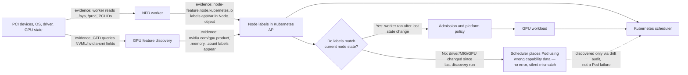

# Node and GPU Feature Discovery

An allocator can assign only the resources it knows about, and a scheduler can discriminate only on facts that reach the API. A GPU request answers *how many* devices a Pod needs. It does not answer whether those devices are the intended architecture, have the required partitioning state, sit in an approved node pool, or have passed the platform acceptance test.

Node Feature Discovery (NFD) and GPU Feature Discovery (GFD) convert selected host facts into node labels. That makes capability visible to scheduling and policy. It also creates an API contract: a wrong, stale, or freely mutable label can place a workload incorrectly even when every component involved is healthy.

## Learning objectives

After this chapter, you will be able to:

- distinguish resource advertisement from descriptive node metadata;
- trace discovery from a node-local probe to a scheduling decision;
- design a label taxonomy that preserves workload portability;
- protect capability labels as infrastructure-controlled data; and
- diagnose a pending Pod caused by discovery drift rather than capacity loss.

## The problem: quantity is not a platform contract

Consider an inference team that needs a validated pool with a particular accelerator class and a training team that needs nodes configured for a different sharing model. Both teams may request `nvidia.com/gpu: 1`. The device plugin can satisfy that request on either node. If the platform has not published a deliberate distinction, Kubernetes has no basis for applying it.

The tempting response is to expose every hardware string and ask teams to use required node affinity. That works briefly, then binds manifests to inventory. A refresh from one SKU to another becomes an application migration, capacity fragments, and a typo can turn a performance preference into a hard outage. Discovery should expose facts; the platform should turn the small subset that users need into durable service classes.

## From host evidence to a scheduling decision



**Figure 10.5.1 — Discovery produces metadata; it does not allocate a GPU.** The device plugin supplies the allocatable extended resource described in [Chapter 04](./chapter-04-device-plugin-and-kubernetes-resource-model). Labels narrow the eligible nodes before allocation. The `Fresh` decision point is the diagram's most important edge: a label that is present is not the same claim as a label that is *current*. When discovery has not re-run after a state-changing event, the API still holds a valid-looking label — the scheduler has no way to know it is stale, so it makes a confident, wrong placement decision with zero errors logged anywhere. That silent failure mode is exactly what the "Drift is an availability issue" section below is written to prevent.

NFD normally runs node-local workers and publishes detected host features through Kubernetes resources. GFD is the NVIDIA-specific discovery component commonly deployed with the GPU platform stack. Exact label keys and values are release- and configuration-dependent. Treat them as an implementation detail until they have been reviewed as part of your platform API.

**What discovered labels actually look like.** `kubectl get nodes --show-labels` on a node where both NFD and GFD have completed a run:

```text
$ kubectl get node gpu-node-03 --show-labels | tr ',' '\n' | grep -E 'nvidia.com|feature.node'
feature.node.kubernetes.io/cpu-cpuid.AVX512F=true
feature.node.kubernetes.io/pci-10de.present=true
nvidia.com/cuda.driver-version.full=550.90.07
nvidia.com/gpu.compute.major=9
nvidia.com/gpu.count=8
nvidia.com/gpu.memory=81920
nvidia.com/gpu.product=NVIDIA-H100-80GB-HBM3
nvidia.com/mig.capable=true
nvidia.com/mig.strategy=single
```

Read field by field: `pci-10de.present=true` is NFD's raw PCI-vendor evidence (`10de` is NVIDIA's PCI vendor ID) — this is the "Discovered fact" row of the labels table, owned by the discovery component. `gpu.product=NVIDIA-H100-80GB-HBM3` and `gpu.memory=81920` (MiB) are GFD reading NVML directly; they describe inventory, not validated capability. `mig.capable=true` says the hardware supports MIG partitioning — it does **not** say MIG is currently configured or that a `nvidia.com/mig-1g.10gb` resource exists on this node; that check is separate, per the "coordinate labels with the resource names advertised by the device plugin" warning later in this chapter. None of these eight labels is a lifecycle assertion or a service class — a workload manifest that hard-selects on `gpu.product=NVIDIA-H100-80GB-HBM3` directly (instead of a platform class) is exactly the anti-pattern this chapter argues against.

The NFD worker's own log confirms when the probe last ran, which is the evidence the `Fresh` decision in Figure 10.5.1 depends on:

```text
$ kubectl logs -n node-feature-discovery nfd-worker-gpu-node-03-x7q2n --tail=5
I0812 11:00:02.771001       1 nfd-worker.go:451] labeling node "gpu-node-03" with feature labels
I0812 11:00:02.771312       1 nfd-worker.go:452] 42 label(s), 3 changed since last run
I0812 11:00:02.803009       1 nfd-worker.go:470] sending labeling request to nfd-master
```

`3 changed since last run` is the concrete evidence of a re-probe actually happening — if a driver upgrade completed at `11:15` and this timestamp still reads `11:00`, that is stale-label drift, not a hypothetical.

## Facts, assertions, and classes

Three kinds of labels are useful, but they should not have the same owner or lifetime.

| Kind | Example intent | Authoritative writer | Consumer |
|---|---|---|---|
| Discovered fact | accelerator family, detected driver, partitioning state | discovery component | platform automation and diagnostics |
| Lifecycle assertion | node accepted, maintenance pending, network validated | controlled platform controller | admission and operations |
| Service class | `gpu.platform.example/class=training-topology` | platform engineering | workload manifests |

A discovered fact is evidence observed at a point in time. A lifecycle assertion says the platform has completed a process against a defined standard. A service class is a promise to users. Keeping those distinctions explicit avoids a common failure: using a raw inventory label as though it were proof that a node is safe for a workload.

For example, `gpu-validation=passed` should be set only after the driver, runtime, device plugin, and a defined validation workload succeed. It should be removed or withheld during a disruptive change. This gives admission control and node affinity a stable condition without claiming that discovery alone tested the entire stack.

## A practical label contract

Publish a short catalog, not an accidental dump of detector output. For each workload-facing label, document:

- its semantic meaning and owner;
- the evidence or controller that sets it;
- whether it is a hard eligibility constraint or a preference;
- the change process and deprecation window; and
- the operational action when it disagrees with node reality.

Prefer coarse classes such as `inference-general`, `training-topology`, or `mig-serving` when those are the actual service offerings. Retain raw labels for inventory, audits, and controller logic. Do not promise a memory size, interconnect shape, or driver behavior through a class unless the acceptance process tests the promised property.

## Security and integrity boundary

Node labels influence placement, isolation, licensing, and sometimes compliance. A tenant that can write an eligibility label can potentially steer work onto hardware it should not use. A compromised node can also make a false claim. RBAC should therefore restrict Node mutation and the service accounts used by discovery and reconciliation. Admission policy should reject workload selectors that target unapproved namespaces or keys when that is appropriate for the tenancy model.

This is not a reason to distrust all labels. It is a reason to make the trust chain visible: who observed the fact, who transformed it into a class, and who is allowed to consume or alter it. Keep manual exception labels in a clearly separate namespace and attach an expiry or review process to them.

## Drift is an availability issue

Discovery drift appears after events that change node reality: a GPU replacement, driver update, MIG reconfiguration, BIOS or firmware work, an OS rebuild, or a discovery Pod failure. The resource may remain allocatable while its descriptive metadata is wrong. That is especially dangerous because the scheduler will make a confident but invalid decision.

Operate discovery with the same discipline as any other node-critical DaemonSet:

1. Alert when the worker is absent, repeatedly restarting, or unable to update its node.
2. Compare expected pool membership with the labels actually present.
3. Re-run the supported discovery or reconciliation path after state-changing maintenance.
4. Gate re-entry to production on the platform acceptance label, not merely `NodeReady`.
5. Record the observed facts and validation result with the maintenance change.

The last point matters during incident response. A node that has the correct product label but has not completed validation is not equivalent to a ready production node.

## Scheduling patterns and trade-offs

Use required affinity when a mismatch makes the workload incorrect or unsupported; use preferred affinity when it only improves performance or cost. Taints protect expensive GPU nodes from unconstrained workloads, while tolerations only grant eligibility—they do not select a node. Pair a service-class selector with a GPU request and a capacity policy; neither mechanism replaces the others.

| Requirement | Recommended expression | Cost of overuse |
|---|---|---|
| Run only in a validated GPU pool | required affinity on a platform class | fewer eligible nodes during maintenance |
| Prefer newest available accelerator | preferred affinity | modest scoring complexity |
| Prevent ordinary Pods landing on GPU nodes | taint plus controlled toleration | additional admission and documentation work |
| Require a specific physical topology | dedicated pool and topology-aware policy | substantial fragmentation |

For partitioned or shared GPU configurations, coordinate labels with the resource names advertised by the device plugin. A label saying that a node is MIG-enabled does not by itself guarantee that the requested partition resource exists. Check both conditions, and handle reconfiguration as a capacity-changing maintenance operation.

**Quantifying fragmentation from SKU-level affinity.** Suppose a fleet has 80 GPU nodes across three hardware generations acquired over 18 months: 30 nodes with product label `NVIDIA-A100-80GB`, 30 with `NVIDIA-H100-80GB-HBM3`, and 20 with an older `NVIDIA-A100-40GB`. If workload manifests hard-select `nvidia.com/gpu.product=NVIDIA-A100-80GB` directly (the anti-pattern this chapter warns against) instead of a class like `inference-general`, then when the platform adds a fourth generation and retires the 20 oldest nodes, every one of those manifests becomes invalid at once — not gradually. Contrast that with a `service class` label: retiring the 20 old nodes means updating one label's node selector membership in the platform controller, and zero application manifests change. The blast radius of a hardware refresh goes from "N application teams edit N manifests under a deadline" to "one platform config change," which is the concrete cost the "portable platform classes" recommendation is protecting against — illustrative fleet-size numbers, but the ratio (manifests-changed vs. platform-configs-changed) holds regardless of fleet size.

## Troubleshooting: the selector is correct, yet no Pod schedules

Start at the scheduling event. It states which predicate excluded each node. Then inspect the node’s labels, allocatable GPU resource, taints, and the workload’s required versus preferred terms. Do not begin by changing the selector; first establish whether the intended platform contract is absent, stale, or too narrow.

| Symptom | First evidence | Likely next action |
|---|---|---|
| Pod Pending, selector looks correct | `describe pod` predicate message | Separate "no node has the label" from "label is stale" from "capacity is fragmented" |
| Label present but node just went through maintenance | NFD/GFD worker log timestamp vs. maintenance change time | Re-run discovery; do not trust the label until it postdates the change |
| Only some nodes in an identical pool advertise the label | Compare `--show-labels` output across the pool | Configuration drift or a per-node discovery Pod failure, not capacity |

**Evidence for row 1 — reading the predicate message.** `kubectl describe pod` on a Pending Pod prints exactly which condition excluded which nodes, which is the difference between "no capacity" and "no label":

```text
$ kubectl describe pod training-job-0 | tail -5
Events:
  Type     Reason            Age   From               Message
  ----     ------            ----  ---------------     -------
  Warning  FailedScheduling  55s   default-scheduler  0/40 nodes are available:
           40 node(s) didn't match Pod's node affinity/selector: key
           "gpu.platform.example/class" value "training-topology" not found.
```

`40 node(s) didn't match ... not found` (not "insufficient resource") tells you every node was excluded on the label predicate before capacity was even evaluated. If 25 of those 40 nodes are, in fact, running qualified GPUs, the platform has either never published the `training-topology` class on them or a discovery run silently failed there — this event line rules out "we're out of GPUs" as the explanation in one read.

**Evidence for row 2 — catching a stale label after maintenance.** Compare the discovery worker's last-run timestamp against the maintenance record:

```text
$ kubectl logs -n node-feature-discovery nfd-worker-gpu-node-19-p8k1 --tail=3
I0812 08:40:11.002331       1 nfd-worker.go:451] labeling node "gpu-node-19" with feature labels
I0812 08:40:11.002550       1 nfd-worker.go:452] 0 label(s) changed since last run
```

`08:40:11` with `0 label(s) changed` sitting next to a maintenance ticket showing the node's MIG configuration was changed at `09:15` is the concrete proof of drift: the worker has not run since the state change, so every MIG-related label on this node is describing hardware that no longer exists in that shape. This is the "labels are stale" branch of the prose above — the fix is re-running discovery, not editing the workload's selector.

**Evidence for row 3 — spotting per-node drift inside one pool.** `grep`-diffing labels across a pool that is supposed to be uniform surfaces the one node that fell behind:

```text
$ for n in gpu-node-1{9,3}; do echo "== $n =="; kubectl get node $n --show-labels | tr ',' '\n' | grep 'nvidia.com/mig'; done
== gpu-node-19 ==
nvidia.com/mig.capable=true
nvidia.com/mig.strategy=single
== gpu-node-13 ==
nvidia.com/mig.capable=true
```

`gpu-node-13` is missing `mig.strategy` entirely, even though the pool is documented as uniform — this asymmetry, not a Pending Pod, is usually the first sign of drift, since a Pod that happens to schedule on `gpu-node-19` will work fine and mask the problem on `gpu-node-13` until traffic or a rescheduling event lands there.

If labels are stale, identify the state change that made them stale, repair the underlying driver or partition configuration, and use the supported discovery workflow. If the label is correct but no node qualifies, this is a capacity and fragmentation decision, not a discovery incident. Escalate it as such instead of weakening requirements without the workload owner’s agreement.

## Production checklist

- Discovery components run only with the minimum node access and API permissions they require.
- Workload-facing labels have named owners, semantics, and deprecation rules.
- A separate acceptance signal reflects end-to-end validation.
- Maintenance workflows invalidate or revalidate the node’s service class.
- Dashboards expose discovery health, label distribution, and unexpected pool drift.
- Application templates use platform classes rather than SKU strings wherever possible.

## Customer architecture discussion

For a shared platform, discovery is where hardware inventory becomes a product boundary. The platform team owns the translation from fluctuating supply to stable classes; application teams choose the class that matches their SLO and budget. That separation lets the platform replace hardware behind a class after validation, instead of asking every team to revise affinity rules.

## Interview preparation

**Why is a GPU model label not sufficient evidence that a node can run a workload?**

**Model answer:** "Because a label is just NFD or GFD reporting what it observed through NVML or PCI enumeration at one point in time — it's inventory, not a health check. `nvidia.com/gpu.product=NVIDIA-H100-80GB-HBM3` tells you what chip is physically present. It doesn't tell you the driver actually loaded cleanly, that the device plugin is currently reporting it healthy, that the network path for a distributed job is validated, or that the application image is compatible. I've seen a node keep a perfectly correct product label for hours after its driver crashed, because nothing in the discovery pipeline re-checks that label against live driver health — discovery ran once, found the PCI device, and moved on. That's exactly why this chapter treats a real acceptance label, like `gpu-validation=passed`, as something set only after the driver, runtime, plugin, and a validation workload all succeed — the product label alone was never meant to carry that weight."

**When does node affinity harm a GPU platform?**

**Model answer:** "When it encodes SKU-level constraints that don't actually matter to the workload. If I hard-affinity a manifest to `gpu.product=NVIDIA-A100-80GB` because that's what was available when someone wrote the YAML, I've silently made every other equivalent GPU in the fleet ineligible — including newer, faster ones. Multiply that across dozens of teams and a routine hardware refresh turns into a coordinated manifest migration instead of a platform config change. I only reach for required affinity when there's a real compatibility or contractual boundary — a specific compute capability the code depends on, or a topology guarantee that's part of an SLA. Everything else should resolve through a platform service class, so the fleet can change underneath the workload without anyone noticing."

## Key takeaways

- Feature discovery supplies scheduling metadata; the device plugin supplies allocatable devices.
- Treat labels that affect placement as governed infrastructure data.
- Separate raw facts, validation assertions, and user-facing service classes.
- Revalidate labels after every change that can alter node reality.
- Prefer portable platform classes over hardware strings in workload manifests.

## Cross references and further reading

- [Device Plugin and Kubernetes Resource Model](./chapter-04-device-plugin-and-kubernetes-resource-model)
- [GPU Operator Architecture](./chapter-06-gpu-operator-architecture)
- [GPU Scheduling and Topology](./chapter-08-gpu-scheduling-and-topology)
- [Kubernetes node affinity documentation](https://kubernetes.io/docs/concepts/scheduling-eviction/assign-pod-node/)
- [NVIDIA GPU Operator documentation](https://docs.nvidia.com/datacenter/cloud-native/gpu-operator/latest/)
