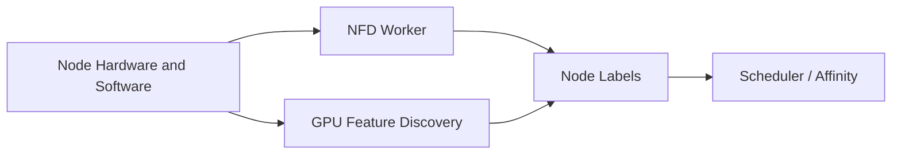

# Node Feature Discovery and GPU Feature Discovery

A scheduler cannot place workloads by GPU model, memory, MIG capability, topology, or driver characteristics unless those facts are represented in the Kubernetes API. Node Feature Discovery (NFD) detects host features. GPU Feature Discovery (GFD) publishes NVIDIA-specific labels.

## Learning Objectives

Explain discovery workers, labels, trust boundaries, scheduling use, and drift handling.

## Discovery Flow

Labels can describe GPU product, count, memory class, compute capability, driver information, MIG state, and other features depending on deployment and version.

## Why Labels Matter

Workloads may require a minimum architecture, a specific GPU family, MIG-enabled nodes, or validated network capability. Labels allow node affinity and policy to express these requirements.

Labels are not automatically trustworthy in a hostile environment. Discovery components run with access to node information, and operators must control who can mutate nodes or spoof scheduling metadata.

| Use | Risk |
|---|---|
| Select GPU generation | Fragmentation and tight coupling |
| Separate validated pools | Drift between label and actual state |
| Route MIG workloads | Incorrect label after reconfiguration |
| Enforce compliance | User-created labels bypass policy |

## Production Design

Define an approved label taxonomy. Distinguish automatically discovered labels from operator-assigned lifecycle labels such as `gpu-validation=passed`. Use admission and RBAC to restrict mutation. Monitor label drift and reconcile after firmware, driver, or MIG changes.

Avoid binding application manifests directly to long product strings when a platform class label would provide a stable contract.

## Troubleshooting

**Symptom:** Pod affinity matches no nodes.

Inspect actual labels, discovery Pod health, label spelling, required versus preferred affinity, and whether the node changed state. For stale GPU labels, rerun or restart the supported discovery workflow after fixing the underlying configuration.

## Customer Perspective

Discovery converts infrastructure facts into a scheduling API. The platform team should offer stable workload classes instead of requiring every application owner to understand hardware SKUs.

## Interview Preparation

**Question:** Why not let users label nodes themselves?

Because scheduling and compliance decisions depend on label integrity. Hardware capability labels should come from controlled discovery or platform automation.

## Key Takeaways

- NFD/GFD expose hardware facts as node labels.
- Labels enable workload-aware scheduling but can fragment capacity.
- Taxonomy, RBAC, and drift monitoring are production requirements.
- Stable platform-class labels reduce application coupling.

## Cross References

- [Device Plugin](./chapter-04-device-plugin-and-kubernetes-resource-model)
- [Next: GPU Operator Architecture](./chapter-06-gpu-operator-architecture)
