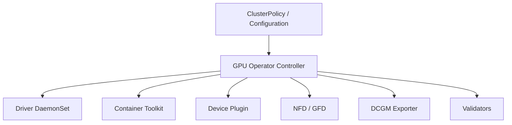

# GPU Operator Architecture

Manually installing GPU software on every Kubernetes node creates drift and makes upgrades difficult. The NVIDIA GPU Operator uses Kubernetes controllers and node-level workloads to manage the GPU software stack as declarative cluster infrastructure.

## Learning Objectives

Explain the operator reconciliation model, component responsibilities, node states, and boundaries between automation and platform ownership.

## Architecture

The exact resources vary by release and configuration. Some environments preinstall drivers or toolkit components; the operator can be configured not to manage those layers.

## Reconciliation

The operator watches desired policy and creates operands. Node labels and state indicate progress. DaemonSets ensure node-local components run where required. Validators test important boundaries such as driver availability, toolkit integration, and CUDA execution.

| Component | Responsibility |
|---|---|
| Operator controller | Reconcile policy and operands |
| Driver | Load kernel modules and expose devices |
| Toolkit | Integrate GPUs with container runtime |
| Device plugin | Advertise and allocate GPU resources |
| NFD/GFD | Label node and GPU capabilities |
| DCGM exporter | Publish GPU metrics |
| Validators | Confirm layer health |

## Production Design

Pin operator and operand versions through a tested release process. Store Helm values or custom resources in Git. Decide explicitly whether nodes use host drivers or driver containers. Apply taints and tolerations so operands reach GPU nodes without running unnecessarily elsewhere.

The operator does not replace maintenance planning. Driver updates can reset GPUs or require node drain. Operator reconciliation can also amplify a bad configuration across every node, so canary pools and staged rollout remain essential.

## Troubleshooting

Start with the ClusterPolicy status, operator logs, node labels, operand Pods, and events. Identify the first operand not Ready. Then move to that component’s logs and host state. Avoid deleting all operands simultaneously; reconciliation may obscure the initial failure.

## Customer Perspective

The operator reduces repetitive installation and drift. Its value is lifecycle consistency, not a promise that every hardware, kernel, and workload combination is automatically safe.

## Interview Preparation

**Question:** Why use an operator rather than a shell script?

An operator continuously reconciles desired state, reports status, handles node changes, and integrates with Kubernetes lifecycle. A script usually performs a one-time mutation without ongoing state management.

## Key Takeaways

- GPU Operator manages a collection of interdependent operands.
- Reconciliation reduces drift but can propagate bad policy quickly.
- Host-managed and operator-managed components must be chosen deliberately.
- Troubleshooting begins with the first failed operand.

## Cross References

- [Node and GPU Feature Discovery](./chapter-05-node-and-gpu-feature-discovery)
- [Next: Driver Containers and Toolkit Operands](./chapter-07-driver-containers-and-node-operands)
