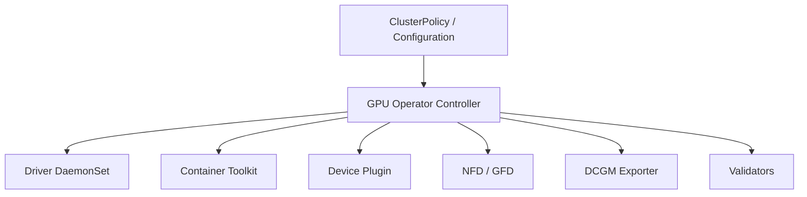

# GPU Operator Architecture

Manually installing GPU software on every Kubernetes node creates drift and makes upgrades difficult. The NVIDIA GPU Operator uses Kubernetes controllers and node-level workloads to manage the GPU software stack as declarative cluster infrastructure.

## Learning Objectives

After completing this chapter, you will be able to:

- explain the GPU Operator reconciliation model;
- identify the responsibility of each core operand;
- describe the boundary between automation and platform ownership;
- reason about node state transitions during rollout and recovery;
- choose where canary validation belongs in the lifecycle;
- troubleshoot an unhealthy operand chain from the top down.

## Architecture

The exact resources vary by release and configuration. Some environments preinstall drivers or toolkit components; the operator can be configured not to manage those layers.

## Production Story

A platform team decides to standardize GPU nodes by moving from manual installs to GPU Operator. The first rollout looks promising: the operator Pod is healthy, but one driver DaemonSet stalls on a subset of nodes because the host image changed under the team’s feet. CPU workloads continue, yet the GPU pool is partially unavailable.

The lesson is that declarative reconciliation does not make compatibility disappear. It makes drift visible and repeatable. The team still needs a node acceptance gate, a canary pool, and a clear policy for which layer owns the driver.

## Reconciliation

The operator watches desired policy and creates operands. Node labels and state indicate progress. DaemonSets ensure node-local components run where required. Validators test important boundaries such as driver availability, toolkit integration, and CUDA execution.

| Component | Responsibility |
|---|---|
| Operator controller | Reconcile policy and operands |
| Driver | Load kernel modules and expose devices |
| Toolkit | Integrate GPUs with container runtime |
| Device plugin | Advertise and allocate GPU resources |
| NFD/GFD | Label node and GPU capabilities |
| DCGM exporter | Publish GPU metrics |
| Validators | Confirm layer health |

The operator is a control loop, not a guarantee. It keeps attempting to converge the desired state, but it cannot invent a compatible kernel, driver, or runtime combination if the cluster policy allows one that does not work.

## Ownership Boundaries

| Question | Host-managed answer | Operator-managed answer |
|---|---|---|
| Who installs the driver? | OS image or config management | Driver DaemonSet or driver container |
| Who configures runtime integration? | Node image or runtime automation | Toolkit operand |
| Who advertises resources? | Device plugin installed by the platform team | Device plugin operand |
| Who validates the node? | External acceptance workflow | Validator workloads plus external checks |

The important part is choosing one owner per layer. Shared ownership almost always turns into drift or duplicate remediation.

## Production Design

Pin operator and operand versions through a tested release process. Store Helm values or custom resources in Git. Decide explicitly whether nodes use host drivers or driver containers. Apply taints and tolerations so operands reach GPU nodes without running unnecessarily elsewhere.

The operator does not replace maintenance planning. Driver updates can reset GPUs or require node drain. Operator reconciliation can also amplify a bad configuration across every node, so canary pools and staged rollout remain essential.

Use a release checklist that names the compatibility matrix, the validation Pod, the rollback plan, and the node pool that will absorb the first change. If the operator changes all nodes at once, the blast radius is the entire fleet.

## Troubleshooting

Start with the ClusterPolicy status, operator logs, node labels, operand Pods, and events. Identify the first operand not Ready. Then move to that component’s logs and host state. Avoid deleting all operands simultaneously; reconciliation may obscure the initial failure.

Useful symptom patterns:

- the controller is healthy but the driver DaemonSet is not;
- the driver is healthy but the toolkit or plugin is not;
- the operator reconciles but labels never appear;
- validators fail even though the core operands are Ready.

Each pattern points to a different layer, so the first job is to identify which layer is actually missing, not which layer produced the most recent log line.

## Customer Perspective

The operator reduces repetitive installation and drift. Its value is lifecycle consistency, not a promise that every hardware, kernel, and workload combination is automatically safe.

Customers usually care about three outcomes: predictable rollout, clear ownership, and a supportable rollback. The operator is the mechanism that helps deliver those outcomes, not the outcome itself.

## Interview Preparation

**Question:** Why use an operator rather than a shell script?

An operator continuously reconciles desired state, reports status, handles node changes, and integrates with Kubernetes lifecycle. A script usually performs a one-time mutation without ongoing state management.

**Question:** What should you inspect first when the operator is degraded?

Start with the ClusterPolicy and the first operand that is not Ready. Then move downward into host evidence and operand logs.

## Key Takeaways

- GPU Operator manages a collection of interdependent operands.
- Reconciliation reduces drift but can propagate bad policy quickly.
- Host-managed and operator-managed components must be chosen deliberately.
- Troubleshooting begins with the first failed operand.
- The operator is a control loop with a blast radius.
- Canary pools and explicit ownership keep reconciliation safe.

## Cross References

- [Node and GPU Feature Discovery](./chapter-05-node-and-gpu-feature-discovery)
- [Next: Driver Containers and Toolkit Operands](./chapter-07-driver-containers-and-node-operands)
