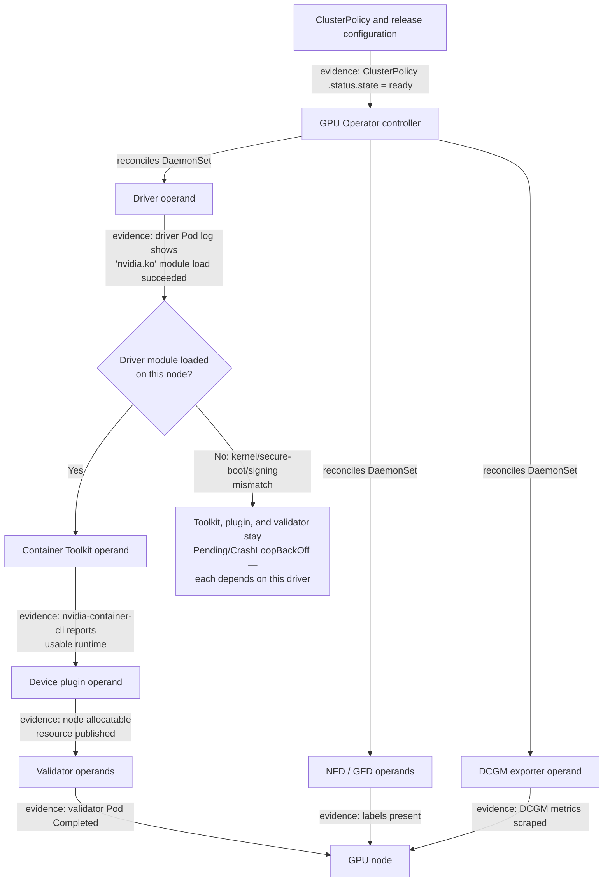

# GPU Operator Architecture

A GPU node is not configured when a single installation command returns successfully. Its driver, container-runtime integration, device discovery, allocation, validation, and telemetry must continue to agree as nodes are added, rebooted, drained, patched, and replaced. NVIDIA GPU Operator expresses much of that lifecycle as Kubernetes-managed desired state.

That is powerful precisely because it is not a thin installer. A bad policy or incompatible version can be reconciled across an entire fleet with the same efficiency that a correct one can. Treat the operator as production infrastructure with an ownership model, a compatibility policy, and staged change control.

## Learning objectives

After this chapter, you will be able to:

- explain the control loop and the node-level operands it manages;
- identify the handoffs between platform, operating-system, and Kubernetes ownership;
- reason about readiness as an ordered set of evidence rather than a Pod phase; and
- build a rollout and diagnostic process that limits fleet-wide blast radius.

## Architecture: desired state becomes node-local work



**Figure 10.6.1 — The controller manages an interdependent set of operands.** The exact components, resource names, and configuration choices vary by GPU Operator release and the selected deployment model. The `DriverOK` decision point makes the "evidence chain" argument in the next section visible in the diagram itself, not just in prose: everything downstream of the driver — toolkit, plugin, validator — depends on that single module load succeeding. A cluster where the driver operand Pod is `Running` but the kernel module never actually loaded looks healthy at the Pod-phase level while every dependent operand quietly stalls, which is precisely the trap the "Reconciliation is not a serial installer" section below is warning about.

The controller watches its declarative policy and reconciles the child resources needed to reach it. Most node-facing components run as DaemonSets because their work is tied to local hardware and the kubelet. A controller can converge Kubernetes objects, but it cannot make an unsupported kernel, a failed module load, or an unavailable registry safe. Those conditions remain operational dependencies.

**What the reconciled state looks like as real output.** `kubectl get clusterpolicy -o yaml` on a healthy install:

```yaml
$ kubectl get clusterpolicy cluster-policy -o yaml
apiVersion: nvidia.com/v1
kind: ClusterPolicy
metadata:
  name: cluster-policy
spec:
  driver: {enabled: true, version: "550.90.07"}
  toolkit: {enabled: true}
status:
  namespace: gpu-operator
  state: ready
  conditions:
  - type: Ready
    status: "True"
    reason: OperandsReady
```

`status.state: ready` is the controller's own summary claim — the diagram's `Policy` node reaching `Controller` with an evidence label. It means every operand it is configured to own converged at least once; it does **not** mean every node in the fleet is currently healthy, only that the controller has reached its last-observed steady state. Cross-check against the operand Pods themselves:

```text
$ kubectl get pods,daemonsets -n gpu-operator -o wide | grep -E 'driver|toolkit|device-plugin'
daemonset.apps/nvidia-driver-daemonset            25   25   25   25   25
daemonset.apps/nvidia-container-toolkit-daemonset 25   25   25   25   25
daemonset.apps/nvidia-device-plugin-daemonset      25   24   24   25   24
pod/nvidia-device-plugin-daemonset-h9x2q            0/1  CrashLoopBackOff  6   14m
```

The DaemonSet columns (`DESIRED CURRENT READY UP-TO-DATE AVAILABLE`) read `25 25 25 25 25` for driver and toolkit — fully converged. The device-plugin row reads `25 24 24 25 24`: one pod short of `READY`, and the individual Pod line shows why — `CrashLoopBackOff` with `6` restarts on one specific node. `ClusterPolicy.status.state` can still say `ready` while this single Pod fails, because that field reflects the controller's reconciliation of desired objects, not per-node operand health — which is exactly why the evidence-chain approach below insists on checking operand-level state, not just policy state.

## Responsibilities and boundaries

| Layer | Primary responsibility | Evidence of success |
|---|---|---|
| Platform engineering | supported configurations, values, rollout policy, node classes | reviewed configuration in source control |
| Operator controller | reconcile operands and surface component state | intended workloads created and progressing |
| Driver and toolkit operands | host driver and container runtime integration | usable driver and GPU-enabled container path |
| Discovery and device plugin | labels, health, and allocatable resources | expected labels and allocatable resource |
| Validation | test configured boundaries | defined checks pass on the node |
| Cluster operations | drains, kernels, images, registries, incident response | safe maintenance and recoverability |

The line between the first and second rows deserves special attention. The operator controls only the components it is configured to own. If the OS image pipeline installs the driver, do not also ask the operator to manage that driver. A hybrid model can be valid, but dual ownership of one host component turns reconciliation into conflict.

## Reconciliation is not a serial installer

It is useful to explain the dependency flow—driver before a meaningful CUDA validation, toolkit before a workload runtime path, plugin before allocation—but do not assume the Pods behave like a shell script. Controllers and DaemonSets independently retry. A component may be Running while it waits for a host condition, and a downstream component may report a more visible symptom than the upstream failure.

For operations, use an evidence chain instead:

1. The node is in the intended pool and can run the required operands.
2. The driver binds to the detected GPU.
3. The container runtime can create a GPU-enabled container.
4. The device plugin reports the expected healthy allocatable resources.
5. Discovery and acceptance labels match the service class.
6. Validation and telemetry complete successfully.

This is stronger than waiting for `NodeReady` or for every DaemonSet Pod to appear Running. The former proves basic Kubernetes reachability; the latter does not necessarily prove a workload can execute CUDA.

## Deployment models: choose one owner per layer

| Model | Best fit | Principal trade-off |
|---|---|---|
| Operator-managed driver and runtime | Kubernetes-centric fleets with controlled node OS compatibility | operator rollout must be coordinated with kernel lifecycle |
| Host-managed driver and runtime | immutable images or established OS configuration management | desired state and drift evidence partly live outside Kubernetes |
| Hybrid | a constrained enterprise boundary requires host ownership of selected layers | handoffs must be documented, tested, and monitored |

The choice should be decided before installation and encoded in release documentation. It affects image construction, privilege review, rollback, support boundaries, and who responds when a driver no longer loads after a node update. "It was already on the host" is not an ownership model.

## A release is a compatibility decision

Pin and review the operator chart or manifest source, its operand configuration, Kubernetes version, node operating-system and kernel channel, runtime, GPU fleet, and workload images as one release candidate. The goal is not to create an unmanageably large matrix; it is to prevent an unexamined change at one boundary from being treated as independent of the others.

A defensible promotion path uses a disposable environment or non-production pool, a production canary pool, then progressively wider pools. At each gate, confirm the evidence chain above and run a representative workload. Use a maintenance window and drain behavior that match the disruption tolerance of the workloads. Keep the prior known-good configuration and required images available for rollback, especially in restricted or disconnected environments.

## Production story: the policy that spread too far

A platform team changes a common value to update the driver path. The controller promptly updates all GPU-node operands. New nodes fail validation because their kernel channel differs from the nodes used in testing; existing nodes drain for unrelated maintenance and cannot return to service. The incident is not caused by Kubernetes reconciliation being unreliable. It is caused by treating cluster-wide desired state as if it were a canary.

The corrective design separates node pools by compatibility class, pins configuration in Git, applies it to a canary pool first, and permits production scheduling only after acceptance validation. It also defines the rollback trigger: loss of allocatable capacity or failed representative CUDA execution, not merely a controller log line.

**Quantifying the blast radius.** Say the fleet is 60 GPU nodes in one `ClusterPolicy` with no pool separation. The DaemonSet controller reconciles the changed driver value across all matching nodes roughly in parallel, bounded mainly by `maxUnavailable`/rollout concurrency, not by node count — so a single `helm upgrade` that changes `driver.version` can put a meaningful fraction of 60 nodes into a driver-reload state within minutes, long before the first validation failure is even observed. If the incompatible kernel channel affects 35 of those 60 nodes (the newer OS image, say), that is 35/60 ≈ 58% of total GPU capacity degraded from one value change, discovered only once workloads start failing to schedule or CUDA-initialize on the affected nodes. Compare that to a canary-first rollout: the same change applied to a 3-node canary pool first caps the worst case at 3/60 = 5% of capacity while validation runs, and the other 57 nodes are never touched until that canary passes representative CUDA execution. The ratio between those two numbers — 58% vs. 5% — is the entire argument for pool separation stated as a number instead of a warning.

## Security model

Several operands require elevated host access to load modules, configure a runtime, inspect devices, or expose telemetry. Put the operator and its operands in a tightly controlled namespace. Restrict who can modify the policy, DaemonSets, service accounts, and Node labels. Use approved registries and image provenance controls, and account for registry access during node recovery.

Privileged access is justified by host work, not by convenience. Review every operand’s permissions and host mounts as part of the platform threat model. The application namespace must not inherit the authority required to operate the node.

## Troubleshooting: find the first broken contract

Begin with the policy status, controller logs, events, and node labels, then identify the earliest missing evidence in the chain. A missing GPU resource points to driver, discovery, plugin, or kubelet registration; a resource that allocates but fails in a container moves the investigation to runtime and workload compatibility. Do not delete all operands as a first action. That destroys useful ordering evidence and can create a wider outage.

| Observation | Likely boundary to inspect first |
|---|---|
| Operand absent from an intended node | selectors, taints, tolerations, image pull, policy configuration |
| Driver operand unhealthy | host kernel, module load, secure-boot and signing policy, node logs |
| No allocatable GPU | driver health, device plugin, kubelet registration |
| Pod starts without CUDA access | toolkit/runtime integration and allocation path |
| Validation fails after a change | the changed layer and its declared compatibility assumptions |

**Evidence for "Driver operand unhealthy."** The driver Pod's own logs distinguish a kernel-incompatibility failure from a transient one:

```text
$ kubectl logs -n gpu-operator nvidia-driver-daemonset-7z4kd
Detected Kernel version 6.5.0-1015-aws is not supported.
Only kernel versions supported by the driver branch listed in
container image nvcr.io/nvidia/driver:550.90.07-ubuntu22.04 are compatible.
```

`is not supported` naming the exact kernel string and the exact driver-image tag is the direct evidence for this row — it points at the kernel/driver compatibility boundary named in the table, not at the operator or Kubernetes reconciliation, which are both functioning correctly here (the Pod is scheduled and running; the *content* of what it tried to do failed). This is the same failure shape the canary story above describes, caught here at the single-node level before it reaches 35 nodes.

**Evidence for "No allocatable GPU."** Walk the chain in order rather than guessing: driver health first, then plugin, then kubelet's view:

```text
$ kubectl get pods -n gpu-operator -l app=nvidia-driver-daemonset -o wide | grep gpu-node-22
nvidia-driver-daemonset-9mvxq   1/1   Running   0   4h   gpu-node-22

$ kubectl logs -n gpu-operator nvidia-device-plugin-daemonset-k2vqp
I0812 13:02:04.771       1 main.go:145] Unable to load NVML: could not communicate with driver

$ kubectl describe node gpu-node-22 | grep -A1 Allocatable | grep nvidia
```

The driver Pod reads `1/1 Running` — it looks healthy at the Pod-phase level. But the device-plugin log on the same node reports `Unable to load NVML: could not communicate with driver`, and the final `describe node` grep returns nothing at all (no `nvidia.com/gpu` line). Read together: the driver container is running, but the kernel module it's supposed to have loaded isn't actually usable by NVML — a driver-content failure masquerading as a healthy Pod. This is exactly the gap the `DriverOK` decision in Figure 10.6.1 exists to name: `Running` is not the same evidence as "module load succeeded."

**Evidence for "Validation fails after a change."** The validator operand's job is specifically to catch this, so its logs name the layer that regressed:

```text
$ kubectl logs -n gpu-operator nvidia-cuda-validator-9x2kq
running CUDA sample application...
CUDA error: no kernel image is available for execution on the device
```

`no kernel image is available for execution on the device` is a compute-capability mismatch — the CUDA sample was built for a different architecture than the driver/GPU actually present, which usually traces straight back to whichever layer's version changed most recently in the release candidate (per "A release is a compatibility decision" above). This log line is the difference between "the operator is broken" and "one specific compatibility assumption in this release regressed" — only the second diagnosis leads to a correct fix.

## Customer architecture discussion

The operator is most valuable when it establishes a repeatable node contract. It should sit behind a platform interface: documented GPU classes, controlled configuration, acceptance gates, and an upgrade path. It does not remove customer choices about kernel governance, disconnected operations, security controls, or workload maintenance windows; it makes those choices observable and enforceable in the cluster.

## Interview preparation

**Why is a controller better than a configuration script for GPU nodes?**

**Model answer:** "A script gives you a point-in-time mutation — it runs once, and from then on it has no relationship with the node. If a GPU gets replaced, the kernel gets patched, or a Pod gets evicted and the DaemonSet re-schedules, nothing re-applies the script's intent unless you rerun it, and usually nobody does until something breaks. A controller like GPU Operator is watching a declared target state continuously, so when a node comes back after replacement, the controller notices the operand is missing or drifted and reconciles it back automatically. That said, I'd be careful not to oversell it — reconciling Kubernetes objects doesn't make an unsupported kernel supported or a failed module load succeed. The controller closes the drift-detection gap; it doesn't remove compatibility risk."

**What is the biggest risk of operator-managed infrastructure?**

**Model answer:** "The exact same reconciliation loop that keeps 60 nodes consistent will apply a mistake to all 60 nodes with equal enthusiasm. I've walked through this with teams as a concrete number: one `ClusterPolicy` covering the whole fleet with no pool separation means a single bad driver-version bump can degrade the majority of your GPU capacity in minutes, versus capping the blast radius at a handful of canary nodes if you'd pooled first. My answer to 'how do you manage that risk' is always the same three things — separate node pools by compatibility class, pin the configuration in Git so every change is reviewable, and gate promotion on real evidence: allocatable capacity holding steady and a representative CUDA workload actually completing, not just a green controller status."

## Key takeaways

- GPU Operator manages a lifecycle of related operands, not a single package.
- Configure one clear owner for every host layer.
- Validate an evidence chain from hardware to CUDA execution.
- Reconciliation reduces drift but increases the need for controlled rollout scope.
- Start incident analysis at the first failed contract, not the most visible downstream Pod.

## Cross references and further reading

- [Node and GPU Feature Discovery](./chapter-05-node-and-gpu-feature-discovery)
- [Driver Containers and Node Operands](./chapter-07-driver-containers-and-node-operands)
- [Upgrades and Production Troubleshooting](./chapter-11-upgrades-and-production-troubleshooting)
- [NVIDIA GPU Operator documentation](https://docs.nvidia.com/datacenter/cloud-native/gpu-operator/latest/)
- [Kubernetes controller pattern](https://kubernetes.io/docs/concepts/architecture/controller/)
