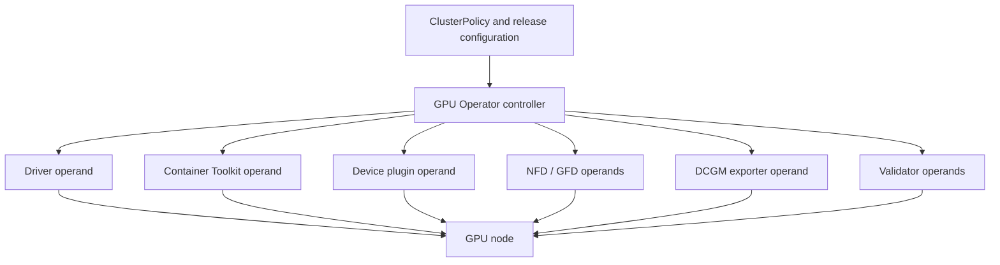

# GPU Operator Architecture

A GPU node is not configured when a single installation command returns successfully. Its driver, container-runtime integration, device discovery, allocation, validation, and telemetry must continue to agree as nodes are added, rebooted, drained, patched, and replaced. NVIDIA GPU Operator expresses much of that lifecycle as Kubernetes-managed desired state.

That is powerful precisely because it is not a thin installer. A bad policy or incompatible version can be reconciled across an entire fleet with the same efficiency that a correct one can. Treat the operator as production infrastructure with an ownership model, a compatibility policy, and staged change control.

## Learning objectives

After this chapter, you will be able to:

- explain the control loop and the node-level operands it manages;
- identify the handoffs between platform, operating-system, and Kubernetes ownership;
- reason about readiness as an ordered set of evidence rather than a Pod phase; and
- build a rollout and diagnostic process that limits fleet-wide blast radius.

## Architecture: desired state becomes node-local work

**Figure 10.6.1 — The controller manages an interdependent set of operands.** The exact components, resource names, and configuration choices vary by GPU Operator release and the selected deployment model.

The controller watches its declarative policy and reconciles the child resources needed to reach it. Most node-facing components run as DaemonSets because their work is tied to local hardware and the kubelet. A controller can converge Kubernetes objects, but it cannot make an unsupported kernel, a failed module load, or an unavailable registry safe. Those conditions remain operational dependencies.

## Responsibilities and boundaries

| Layer | Primary responsibility | Evidence of success |
|---|---|---|
| Platform engineering | supported configurations, values, rollout policy, node classes | reviewed configuration in source control |
| Operator controller | reconcile operands and surface component state | intended workloads created and progressing |
| Driver and toolkit operands | host driver and container runtime integration | usable driver and GPU-enabled container path |
| Discovery and device plugin | labels, health, and allocatable resources | expected labels and allocatable resource |
| Validation | test configured boundaries | defined checks pass on the node |
| Cluster operations | drains, kernels, images, registries, incident response | safe maintenance and recoverability |

The line between the first and second rows deserves special attention. The operator controls only the components it is configured to own. If the OS image pipeline installs the driver, do not also ask the operator to manage that driver. A hybrid model can be valid, but dual ownership of one host component turns reconciliation into conflict.

## Reconciliation is not a serial installer

It is useful to explain the dependency flow—driver before a meaningful CUDA validation, toolkit before a workload runtime path, plugin before allocation—but do not assume the Pods behave like a shell script. Controllers and DaemonSets independently retry. A component may be Running while it waits for a host condition, and a downstream component may report a more visible symptom than the upstream failure.

For operations, use an evidence chain instead:

1. The node is in the intended pool and can run the required operands.
2. The driver binds to the detected GPU.
3. The container runtime can create a GPU-enabled container.
4. The device plugin reports the expected healthy allocatable resources.
5. Discovery and acceptance labels match the service class.
6. Validation and telemetry complete successfully.

This is stronger than waiting for `NodeReady` or for every DaemonSet Pod to appear Running. The former proves basic Kubernetes reachability; the latter does not necessarily prove a workload can execute CUDA.

## Deployment models: choose one owner per layer

| Model | Best fit | Principal trade-off |
|---|---|---|
| Operator-managed driver and runtime | Kubernetes-centric fleets with controlled node OS compatibility | operator rollout must be coordinated with kernel lifecycle |
| Host-managed driver and runtime | immutable images or established OS configuration management | desired state and drift evidence partly live outside Kubernetes |
| Hybrid | a constrained enterprise boundary requires host ownership of selected layers | handoffs must be documented, tested, and monitored |

The choice should be decided before installation and encoded in release documentation. It affects image construction, privilege review, rollback, support boundaries, and who responds when a driver no longer loads after a node update. "It was already on the host" is not an ownership model.

## A release is a compatibility decision

Pin and review the operator chart or manifest source, its operand configuration, Kubernetes version, node operating-system and kernel channel, runtime, GPU fleet, and workload images as one release candidate. The goal is not to create an unmanageably large matrix; it is to prevent an unexamined change at one boundary from being treated as independent of the others.

A defensible promotion path uses a disposable environment or non-production pool, a production canary pool, then progressively wider pools. At each gate, confirm the evidence chain above and run a representative workload. Use a maintenance window and drain behavior that match the disruption tolerance of the workloads. Keep the prior known-good configuration and required images available for rollback, especially in restricted or disconnected environments.

## Production story: the policy that spread too far

A platform team changes a common value to update the driver path. The controller promptly updates all GPU-node operands. New nodes fail validation because their kernel channel differs from the nodes used in testing; existing nodes drain for unrelated maintenance and cannot return to service. The incident is not caused by Kubernetes reconciliation being unreliable. It is caused by treating cluster-wide desired state as if it were a canary.

The corrective design separates node pools by compatibility class, pins configuration in Git, applies it to a canary pool first, and permits production scheduling only after acceptance validation. It also defines the rollback trigger: loss of allocatable capacity or failed representative CUDA execution, not merely a controller log line.

## Security model

Several operands require elevated host access to load modules, configure a runtime, inspect devices, or expose telemetry. Put the operator and its operands in a tightly controlled namespace. Restrict who can modify the policy, DaemonSets, service accounts, and Node labels. Use approved registries and image provenance controls, and account for registry access during node recovery.

Privileged access is justified by host work, not by convenience. Review every operand’s permissions and host mounts as part of the platform threat model. The application namespace must not inherit the authority required to operate the node.

## Troubleshooting: find the first broken contract

Begin with the policy status, controller logs, events, and node labels, then identify the earliest missing evidence in the chain. A missing GPU resource points to driver, discovery, plugin, or kubelet registration; a resource that allocates but fails in a container moves the investigation to runtime and workload compatibility. Do not delete all operands as a first action. That destroys useful ordering evidence and can create a wider outage.

| Observation | Likely boundary to inspect first |
|---|---|
| Operand absent from an intended node | selectors, taints, tolerations, image pull, policy configuration |
| Driver operand unhealthy | host kernel, module load, secure-boot and signing policy, node logs |
| No allocatable GPU | driver health, device plugin, kubelet registration |
| Pod starts without CUDA access | toolkit/runtime integration and allocation path |
| Validation fails after a change | the changed layer and its declared compatibility assumptions |

## Customer architecture discussion

The operator is most valuable when it establishes a repeatable node contract. It should sit behind a platform interface: documented GPU classes, controlled configuration, acceptance gates, and an upgrade path. It does not remove customer choices about kernel governance, disconnected operations, security controls, or workload maintenance windows; it makes those choices observable and enforceable in the cluster.

## Interview preparation

**Why is a controller better than a configuration script for GPU nodes?**

A controller continuously observes and reconciles declared state as nodes change. A script can perform an initial mutation, but it does not inherently provide drift detection, state reporting, or reconciliation after node replacement. Neither approach eliminates kernel and compatibility risk.

**What is the biggest risk of operator-managed infrastructure?**

The same reconciliation mechanism that reduces drift can distribute a bad configuration rapidly. Scope changes by node pool, validate a canary with real workload evidence, and retain a rollback path.

## Key takeaways

- GPU Operator manages a lifecycle of related operands, not a single package.
- Configure one clear owner for every host layer.
- Validate an evidence chain from hardware to CUDA execution.
- Reconciliation reduces drift but increases the need for controlled rollout scope.
- Start incident analysis at the first failed contract, not the most visible downstream Pod.

## Cross references and further reading

- [Node and GPU Feature Discovery](./chapter-05-node-and-gpu-feature-discovery)
- [Driver Containers and Node Operands](./chapter-07-driver-containers-and-node-operands)
- [Upgrades and Production Troubleshooting](./chapter-11-upgrades-and-production-troubleshooting)
- [NVIDIA GPU Operator documentation](https://docs.nvidia.com/datacenter/cloud-native/gpu-operator/latest/)
- [Kubernetes controller pattern](https://kubernetes.io/docs/concepts/architecture/controller/)
