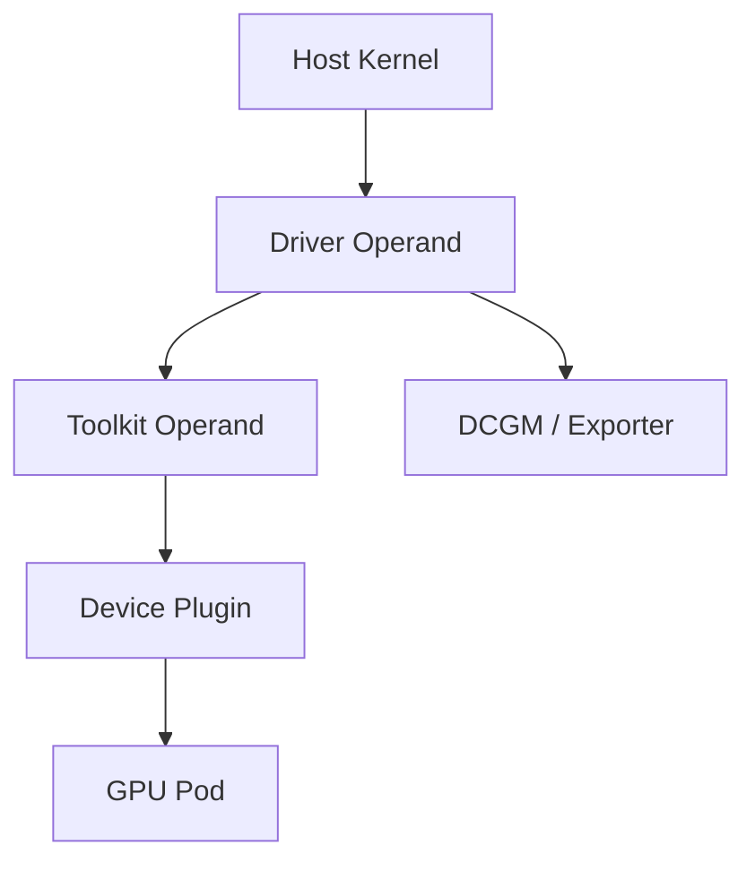

# Driver Containers and Node Operands

GPU Operator operands run close to the host. Driver containers may build or load kernel modules, toolkit Pods configure the runtime, device plugins register with kubelet, and monitoring agents read hardware telemetry. These workloads are privileged infrastructure, not ordinary applications.

## Learning Objectives

Explain node-operand responsibilities, host mounts, privilege boundaries, startup ordering, and failure isolation.

## Node Flow

Driver containers interact with kernel headers, module paths, device files, and host state. A mismatch between kernel and driver build requirements can leave the Pod running or restarting while no usable module exists.

## Privilege and Mounts

Operands may require host PID or filesystem access, device mounts, elevated capabilities, or privileged mode. Restrict deployment to trusted namespaces and images. Apply image-signing, registry, admission, and RBAC controls.

| Operand failure | User-visible effect |
|---|---|
| Driver | No host GPU access |
| Toolkit | Containers cannot receive devices/libraries |
| Device plugin | No new GPU scheduling/allocation |
| Discovery | Missing or stale labels |
| DCGM exporter | Monitoring blind spot |
| Validator | Node remains unaccepted or exposes latent failure |

## Startup and Recovery

Dependencies are not always a simple serial chain; components reconcile and retry. A node reboot, kernel update, or runtime restart can cause temporary unavailability. Platform readiness should wait for all required operands and a CUDA validation, not only node `Ready`.

## Production Design

Use dedicated GPU node pools, stable kernel channels, controlled reboot workflows, PodDisruptionBudgets where appropriate, and monitoring for operand restarts. Keep enough spare capacity to drain nodes safely.

## Troubleshooting

For driver failures, inspect kernel version, headers, secure boot, module signing, build logs, and `dmesg`. For toolkit failures, inspect runtime config and restart behavior. For device-plugin failures, inspect kubelet registration and socket paths.

## Customer Perspective

Containerizing drivers centralizes lifecycle but does not make kernel dependencies disappear. It makes them declarative and observable.

## Interview Preparation

**Question:** Why are GPU Operator Pods privileged?

They configure host-level driver, runtime, device, and telemetry functions that normal application Pods must not control.

## Key Takeaways

- Node operands bridge Kubernetes and host infrastructure.
- Privilege requires strong supply-chain and RBAC controls.
- Node Ready is not GPU platform Ready.
- Diagnose the first failed dependency and host evidence.

## Cross References

- [GPU Operator Architecture](./chapter-06-gpu-operator-architecture)
- [Next: Scheduling and Topology](./chapter-08-gpu-scheduling-and-topology)
