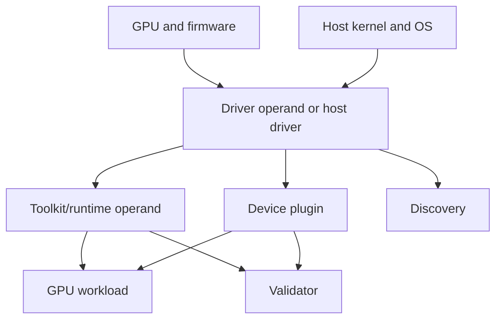

# Driver Containers and Node Operands

The Kubernetes objects that make a GPU usable are Pods, but their work is often performed on the host. A driver container may interact with kernel modules and device files. A toolkit operand configures the container runtime. A device plugin communicates with the kubelet. Discovery and telemetry agents observe hardware state. These are node-operating components delivered through Kubernetes, not ordinary workload containers.

Their privilege is necessary for their job and dangerous if their supply chain, RBAC, or lifecycle is weak. A sound design starts by treating the node as the security and failure domain, then making the path from a newly joined node to an accepted GPU node explicit.

## Learning objectives

After this chapter, you will be able to:

- distinguish the host responsibilities of the major GPU node operands;
- select an ownership model for driver and runtime configuration;
- define GPU readiness beyond Kubernetes `NodeReady`; and
- diagnose recovery failures without masking the original host-level evidence.

## One node, several host-facing contracts

**Figure 10.7.1 — A node is ready for GPU workloads only when host, runtime, allocation, and validation contracts agree.** The GPU Operator architecture and reconciliation model are covered in [Chapter 06](./chapter-06-gpu-operator-architecture).

| Operand or layer | Host-facing responsibility | Failure visible to users |
|---|---|---|
| Driver | bind the OS to the GPU and expose the driver interface | no usable GPU or failed CUDA initialization |
| Toolkit/runtime | make allocated devices and driver-facing components available to containers | GPU resource allocates, but the container cannot use it |
| Device plugin | register devices and health with kubelet, handle allocation | capacity missing or new workloads cannot be allocated |
| Discovery | publish selected hardware and software facts | wrong pool selection or unschedulable affinity |
| DCGM/exporter | observe hardware telemetry | monitoring blind spot, not necessarily workload failure |
| Validator | exercise defined integration boundaries | node may look healthy while remaining unaccepted |

The table is a diagnostic aid, not a promise that each failure maps to one Pod. The same symptom can be downstream of multiple failures. For example, an absent resource can originate in driver health, plugin configuration, kubelet registration, or scheduling labels.

## Driver containers are a delivery model, not an abstraction escape hatch

A driver container packages driver installation and host integration as a Kubernetes-managed operand. It can make intended versions, logs, and reconciliation visible in the cluster. It cannot make the host kernel irrelevant. Kernel ABI compatibility, module signing and secure-boot policy, node image content, GPU support, storage availability, and reboot behavior remain part of the contract.

Host-installed drivers remain reasonable when a golden-image pipeline, immutable OS policy, or support boundary owns that layer. The decision is architectural: choose who owns updates, evidence, rollback, and incident response. Do not allow both the image pipeline and an operator operand to independently modify the same driver or runtime configuration.

| Approach | Operational strength | Design obligation |
|---|---|---|
| Driver container | declarative rollout and Kubernetes-visible state | coordinate with node kernel lifecycle and privileged host access |
| Host-installed driver | reproducible image construction and OS-owned maintenance | surface driver version and validation status to the platform |
| Mixed ownership | accommodates constrained environments | define exactly which system controls each layer |

## Readiness has gates, not one boolean

`NodeReady` proves that kubelet has reported a functioning node. It does not prove that the driver loaded, that a runtime can inject a device, or that the advertised GPU works for a CUDA process. Adopt an explicit acceptance sequence for each GPU node:

1. **Infrastructure gate:** the correct image, kernel policy, network, registry access, and node-pool controls are present.
2. **Driver gate:** the GPU is visible to the host and the driver interface is healthy.
3. **Runtime gate:** an allocated test container receives the expected device path and driver interface.
4. **Kubernetes gate:** discovery labels and device-plugin allocatable resources match the intended class.
5. **Acceptance gate:** a scoped validation workload and required telemetry checks pass.

Only the last gate should make the node eligible for production workloads that depend on the platform contract. This can be represented by a controlled lifecycle label, taint removal, or pool admission mechanism. The mechanism matters less than documenting who changes it and what evidence permits the change.

## Privilege and supply-chain controls

Host-integrating operands can require privileged execution, host filesystem mounts, access to device files, or runtime sockets. Such access can change the node’s security posture. Limit it to a protected namespace, approved service accounts, scoped node selectors, and images obtained through the organization’s approved registry path.

Review the following together:

- who may change the operator policy, operand image references, and service accounts;
- which host paths, sockets, capabilities, and namespaces each operand requires;
- how image provenance, vulnerability response, and air-gapped replication are handled;
- how user workloads are prevented from gaining equivalent host control; and
- whether audit logs identify configuration changes and node-level failures.

Avoid the false comfort of a restrictive application Pod policy while leaving the node-management namespace broadly writable. The privileged operand is a legitimate control-plane extension and needs equivalent protection.

## Recovery and maintenance behavior

Node reboots, kernel updates, runtime restarts, GPU resets, and replacement hardware all interrupt some part of the chain. Design the recovery path before the maintenance window. Drain workloads using their service-specific policy, preserve enough spare capacity, and expect distributed training to require coordinated checkpoint and restart behavior. A PodDisruptionBudget may limit voluntary disruption, but it does not make a driver update non-disruptive.

After a host change, wait for each readiness gate rather than assuming a DaemonSet rollout has completed. Reconfigure or revalidate feature discovery after partitioning or inventory changes. Keep the previous known-good node image, configuration, and required artifacts reachable long enough to perform the planned rollback.

## Troubleshooting sequence

Start with the narrowest observable boundary and preserve evidence. On the affected node, verify the intended OS and kernel state, then inspect the driver operand or host driver, kernel messages, runtime configuration, device-plugin registration, and validation results. Compare a failing node with an accepted node in the same class; this often exposes a kernel, label, registry, or configuration difference faster than reading a large cluster-wide log stream.

| Symptom | First evidence | Likely next decision |
|---|---|---|
| Driver Pod restarting | operand logs, kernel logs, module-load evidence | repair compatibility or signing; do not proceed to plugin debugging |
| GPU absent from allocatable | host driver state, device-plugin logs, kubelet events | restore healthy discovery/allocation before changing workload manifests |
| GPU allocated but unusable in Pod | runtime logs, allocation data, minimal CUDA test | isolate toolkit/runtime from application image compatibility |
| Node returns after reboot but stays excluded | acceptance label or taint, validator result | complete the failed gate; do not manually mark accepted without evidence |
| Metrics disappear while workloads run | exporter and scrape path | treat as observability degradation and preserve workload evidence |

For driver investigation, kernel version, installed headers where relevant, secure-boot policy, signing, module-load logs, and node events are meaningful evidence. Commands that query or modify these details are host- and distribution-specific; use the operating system’s supported procedures and execute disruptive actions only in a drained maintenance scope.

## Customer architecture discussion

The operational choice is not "containers versus hosts." It is whether host changes are managed by a transparent, reconciled platform contract or hidden across manual processes. A mature service defines accepted node classes, protects privileged operands, and makes a node unavailable until it passes end-to-end validation. That keeps infrastructure change from leaking as an application-team debugging exercise.

## Interview preparation

**Why can every GPU operand Pod be Running while a workload still fails?**

Running proves only that Kubernetes started the operands. The driver may not provide a usable interface, runtime injection may be incomplete, the allocated device may be unhealthy, or the workload’s user-space stack may be incompatible. Validate the full workload path.

**Why should driver containers be upgraded with a node lifecycle plan?**

They affect host kernel integration and can disrupt GPU workloads. The plan must include compatibility review, drain behavior, acceptance tests, capacity headroom, and rollback—not merely an image tag change.

## Key takeaways

- GPU node operands perform privileged host work even when packaged as Pods.
- Driver containers simplify delivery but retain kernel and platform dependencies.
- Pick one owner for each host-facing layer.
- Node readiness and GPU production acceptance are distinct states.
- Diagnose from host evidence toward allocation and workload execution, preserving the first failure.

## Cross references and further reading

- [GPU Operator Architecture](./chapter-06-gpu-operator-architecture)
- [Container Toolkit, RuntimeClass, and CDI](./chapter-03-container-toolkit-runtimeclass-and-cdi)
- [GPU Observability with DCGM](./chapter-09-gpu-observability-with-dcgm)
- [NVIDIA GPU Operator documentation](https://docs.nvidia.com/datacenter/cloud-native/gpu-operator/latest/)
- [Kubernetes DaemonSet documentation](https://kubernetes.io/docs/concepts/workloads/controllers/daemonset/)
