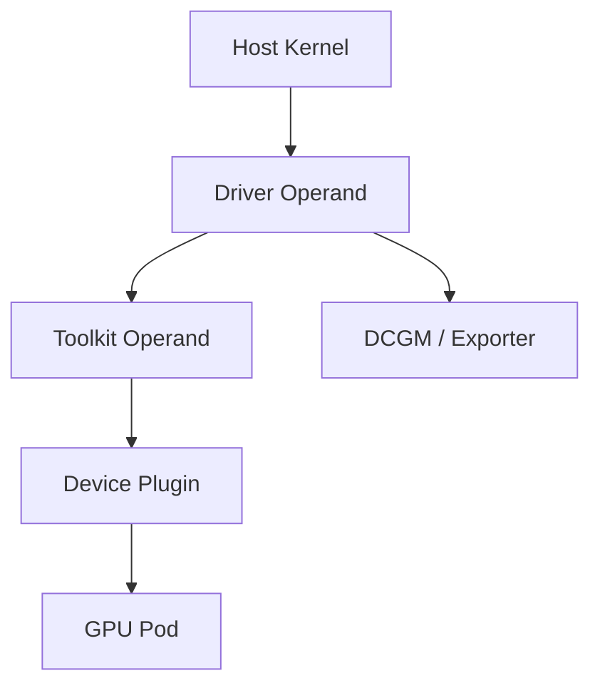

# Driver Containers and Node Operands

GPU Operator operands run close to the host. Driver containers may build or load kernel modules, toolkit Pods configure the runtime, device plugins register with kubelet, and monitoring agents read hardware telemetry. These workloads are privileged infrastructure, not ordinary applications.

## Learning Objectives

After completing this chapter, you will be able to:

- explain why node operands need host access;
- distinguish driver, toolkit, plugin, monitoring, and validator responsibilities;
- describe the privilege and mount surface required by GPU operands;
- reason about startup ordering and recovery after reboot or kernel change;
- identify the first evidence to inspect when an operand fails;
- articulate why node Ready is not the same as GPU platform Ready.

## Node Flow

Driver containers interact with kernel headers, module paths, device files, and host state. A mismatch between kernel and driver build requirements can leave the Pod running or restarting while no usable module exists.

## Production Story

A node pool reboots after a kernel patch. The Kubernetes nodes come back Ready, but one driver operand still fails to load its module on a subset of machines because the kernel headers or signing state no longer match the build assumptions.

CPU workloads recover immediately. GPU workloads do not. The incident shows why node operands must be observed as infrastructure components with their own readiness criteria rather than as ordinary Pods that happen to use a GPU.

## Privilege and Mounts

Operands may require host PID or filesystem access, device mounts, elevated capabilities, or privileged mode. Restrict deployment to trusted namespaces and images. Apply image-signing, registry, admission, and RBAC controls.

| Operand failure | User-visible effect |
|---|---|
| Driver | No host GPU access |
| Toolkit | Containers cannot receive devices/libraries |
| Device plugin | No new GPU scheduling/allocation |
| Discovery | Missing or stale labels |
| DCGM exporter | Monitoring blind spot |
| Validator | Node remains unaccepted or exposes latent failure |

## Startup and Recovery

Dependencies are not always a simple serial chain; components reconcile and retry. A node reboot, kernel update, or runtime restart can cause temporary unavailability. Platform readiness should wait for all required operands and a CUDA validation, not only node `Ready`.

One useful pattern is to define a simple order of evidence:

1. the host sees the GPU;
2. the driver operand succeeds;
3. the runtime operand configures containers;
4. the device plugin advertises resources;
5. the validator proves CUDA access;
6. monitoring confirms the node is observable.

When the order is broken, do not start with the application. The first missing layer usually explains the later failure.

## Production Design

Use dedicated GPU node pools, stable kernel channels, controlled reboot workflows, PodDisruptionBudgets where appropriate, and monitoring for operand restarts. Keep enough spare capacity to drain nodes safely.

Treat every privileged operand as a supply-chain asset. Pin images, mirror them if needed, and keep the rollout order predictable so one operand does not outrun the others. A good rollout leaves one clear place to look when the first failure appears.

## Troubleshooting

For driver failures, inspect kernel version, headers, secure boot, module signing, build logs, and `dmesg`. For toolkit failures, inspect runtime config and restart behavior. For device-plugin failures, inspect kubelet registration and socket paths.

| Symptom | First evidence |
|---|---|
| Driver operand crash loops | Kernel logs, module state, build output |
| Toolkit operand starts but Pods fail | Runtime configuration and container mounts |
| Device plugin is healthy but no resources appear | Kubelet registration and node allocatable |
| Validator fails after reboot | Host state, version drift, and reboot sequence |

## Customer Perspective

Containerizing drivers centralizes lifecycle but does not make kernel dependencies disappear. It makes them declarative and observable.

That observability matters because support teams need to know which layer owns a failure. If the customer only sees "GPU cluster down," the platform contract was too vague.

## Interview Preparation

**Question:** Why are GPU Operator Pods privileged?

They configure host-level driver, runtime, device, and telemetry functions that normal application Pods must not control.

**Question:** Why is a reboot a meaningful test for GPU node readiness?

Because it exercises driver rebuild, module load, operand startup ordering, and node re-registration rather than just the current in-memory state.

## Key Takeaways

- Node operands bridge Kubernetes and host infrastructure.
- Privilege requires strong supply-chain and RBAC controls.
- Node Ready is not GPU platform Ready.
- Diagnose the first failed dependency and host evidence.
- Host evidence and operand health must agree.
- Reboot and kernel changes are part of the operational contract.

## Cross References

- [GPU Operator Architecture](./chapter-06-gpu-operator-architecture)
- [Next: Scheduling and Topology](./chapter-08-gpu-scheduling-and-topology)
