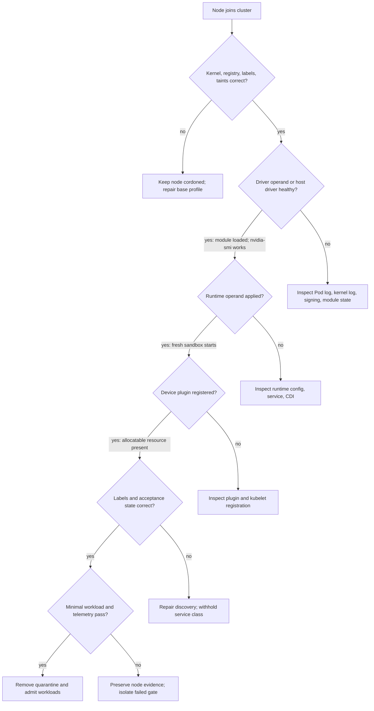

# Driver Containers and Node Operands

The Kubernetes objects that make a GPU usable are Pods, but their work is often performed on the host. A driver container may interact with kernel modules and device files. A toolkit operand configures the container runtime. A device plugin communicates with the kubelet. Discovery and telemetry agents observe hardware state. These are node-operating components delivered through Kubernetes, not ordinary workload containers.

Their privilege is necessary for their job and dangerous if their supply chain, RBAC, or lifecycle is weak. A sound design starts by treating the node as the security and failure domain, then making the path from a newly joined node to an accepted GPU node explicit.

## Learning objectives

After this chapter, you will be able to:

- distinguish the host responsibilities of the major GPU node operands;
- select an ownership model for driver and runtime configuration;
- define GPU readiness beyond Kubernetes `NodeReady`; and
- diagnose recovery failures without masking the original host-level evidence.

## One node, several host-facing contracts



**Figure 10.7.1 — Node admission follows host-facing gates in dependency order.** A Running DaemonSet Pod is not the decision point. Each edge names the evidence that must exist before the next layer is trusted.

| Operand or layer | Host-facing responsibility | Failure visible to users |
|---|---|---|
| Driver | bind the OS to the GPU and expose the driver interface | no usable GPU or failed CUDA initialization |
| Toolkit/runtime | make allocated devices and driver-facing components available to containers | GPU resource allocates, but the container cannot use it |
| Device plugin | register devices and health with kubelet, handle allocation | capacity missing or new workloads cannot be allocated |
| Discovery | publish selected hardware and software facts | wrong pool selection or unschedulable affinity |
| DCGM/exporter | observe hardware telemetry | monitoring blind spot, not necessarily workload failure |
| Validator | exercise defined integration boundaries | node may look healthy while remaining unaccepted |

The table is a diagnostic aid, not a promise that each failure maps to one Pod. The same symptom can be downstream of multiple failures. For example, an absent resource can originate in driver health, plugin configuration, kubelet registration, or scheduling labels.

## Driver containers are a delivery model, not an abstraction escape hatch

A driver container packages driver installation and host integration as a Kubernetes-managed operand. It can make intended versions, logs, and reconciliation visible in the cluster. It cannot make the host kernel irrelevant. Kernel ABI compatibility, module signing and secure-boot policy, node image content, GPU support, storage availability, and reboot behavior remain part of the contract.

Host-installed drivers remain reasonable when a golden-image pipeline, immutable OS policy, or support boundary owns that layer. The decision is architectural: choose who owns updates, evidence, rollback, and incident response. Do not allow both the image pipeline and an operator operand to independently modify the same driver or runtime configuration.

| Approach | Operational strength | Design obligation |
|---|---|---|
| Driver container | declarative rollout and Kubernetes-visible state | coordinate with node kernel lifecycle and privileged host access |
| Host-installed driver | reproducible image construction and OS-owned maintenance | surface driver version and validation status to the platform |
| Mixed ownership | accommodates constrained environments | define exactly which system controls each layer |

### Evidence from the node and the operand

**Purpose:** determine whether the driver container is merely Running or has actually made the driver usable.

```bash
kubectl -n gpu-operator get pod -l app=nvidia-driver-daemonset -o wide
kubectl -n gpu-operator logs nvidia-driver-daemonset-m4k7q -c nvidia-driver-ctr --tail=12
```

**Representative output:**

```text
NAME                              READY   STATUS    NODE
gpu-driver-daemonset-m4k7q        1/1     Running   gpu-node-10

Loading NVIDIA kernel modules...
nvidia 550.54.15 loaded
Creating device nodes...
Driver installation completed successfully
```

This is operand-level evidence. It proves that the container reports completing its procedure, but it does not independently prove the running host can use the GPU. Pair it with host evidence:

```bash
nvidia-smi --query-gpu=index,name,uuid,driver_version --format=csv,noheader
lsmod | awk '$1 ~ /^nvidia/ {print $1,$3}'
```

```text
0, NVIDIA H100 80GB HBM3, GPU-3c2e38d1-6a2c-4a31-b44b-9d82a8c80735, 550.54.15
1, NVIDIA H100 80GB HBM3, GPU-722d1344-1b6d-4a95-8cb9-1c572eb5ad94, 550.54.15
nvidia_uvm 2
nvidia_modeset 1
nvidia 6
```

`nvidia-smi` proves NVML communication with the devices. `lsmod` proves the kernel modules are loaded. Neither validates the container runtime; a fresh GPU Pod is still required.

## Readiness has gates, not one boolean

`NodeReady` proves that kubelet has reported a functioning node. It does not prove that the driver loaded, that a runtime can inject a device, or that the advertised GPU works for a CUDA process. Adopt an explicit acceptance sequence for each GPU node:

1. **Infrastructure gate:** the correct image, kernel policy, network, registry access, and node-pool controls are present.
2. **Driver gate:** the GPU is visible to the host and the driver interface is healthy.
3. **Runtime gate:** an allocated test container receives the expected device path and driver interface.
4. **Kubernetes gate:** discovery labels and device-plugin allocatable resources match the intended class.
5. **Acceptance gate:** a scoped validation workload and required telemetry checks pass.

Only the last gate should make the node eligible for production workloads that depend on the platform contract. This can be represented by a controlled lifecycle label, taint removal, or pool admission mechanism. The mechanism matters less than documenting who changes it and what evidence permits the change.

### Worked node-admission arithmetic

A 16-node pool uses two node states: `quarantined` and `accepted`. After a base-image rollout, 13 nodes pass all gates and three fail the driver gate.

```text
accepted capacity = 13 nodes × 8 GPUs = 104 GPUs
physical inventory = 16 nodes × 8 GPUs = 128 GPUs
admitted fraction = 104 / 128 = 81.25%
```

Reporting 128 GPUs to customers would confuse owned inventory with usable service capacity. The three failed nodes should remain tainted or excluded until their evidence bundle passes.

## Privilege and supply-chain controls

Host-integrating operands can require privileged execution, host filesystem mounts, access to device files, or runtime sockets. Such access can change the node’s security posture. Limit it to a protected namespace, approved service accounts, scoped node selectors, and images obtained through the organization’s approved registry path.

Review the following together:

- who may change the operator policy, operand image references, and service accounts;
- which host paths, sockets, capabilities, and namespaces each operand requires;
- how image provenance, vulnerability response, and air-gapped replication are handled;
- how user workloads are prevented from gaining equivalent host control; and
- whether audit logs identify configuration changes and node-level failures.

Avoid the false comfort of a restrictive application Pod policy while leaving the node-management namespace broadly writable. The privileged operand is a legitimate control-plane extension and needs equivalent protection.

**Purpose:** expose the actual privilege and host mounts of the driver DaemonSet.

```bash
kubectl -n gpu-operator get ds nvidia-driver-daemonset -o json | jq '.spec.template.spec.containers[] | {name,privileged:.securityContext.privileged,capabilities:.securityContext.capabilities,hostMounts:[.volumeMounts[]|select(.name|test("host|run|dev"))|{name,mountPath,readOnly}]}'
```

**Representative output:**

```json
{
  "name": "nvidia-driver-ctr",
  "privileged": true,
  "capabilities": null,
  "hostMounts": [
    {"name":"host-root","mountPath":"/host","readOnly":false},
    {"name":"dev-char","mountPath":"/dev/char","readOnly":false}
  ]
}
```

The output shows why this is a node-management component: it is privileged and writes host-facing paths. The security review must protect who can change its image and specification. A tenant Pod should not inherit equivalent access.

## Recovery and maintenance behavior

Node reboots, kernel updates, runtime restarts, GPU resets, and replacement hardware all interrupt some part of the chain. Design the recovery path before the maintenance window. Drain workloads using their service-specific policy, preserve enough spare capacity, and expect distributed training to require coordinated checkpoint and restart behavior. A PodDisruptionBudget may limit voluntary disruption, but it does not make a driver update non-disruptive.

After a host change, wait for each readiness gate rather than assuming a DaemonSet rollout has completed. Reconfigure or revalidate feature discovery after partitioning or inventory changes. Keep the previous known-good node image, configuration, and required artifacts reachable long enough to perform the planned rollback.

## Troubleshooting sequence

| Symptom | First evidence | Likely next decision |
|---|---|---|
| Driver Pod restarting | operand logs, kernel logs, module-load evidence | repair compatibility or signing; do not proceed to plugin debugging |
| GPU absent from allocatable | host driver state, device-plugin logs, kubelet events | restore healthy discovery/allocation before changing workload manifests |
| GPU allocated but unusable in Pod | runtime logs, allocation data, minimal CUDA test | isolate toolkit/runtime from application image compatibility |
| Node returns after reboot but stays excluded | acceptance label or taint, validator result | complete the failed gate; do not manually mark accepted without evidence |
| Metrics disappear while workloads run | exporter and scrape path | treat as observability degradation and preserve workload evidence |

### Evidence row 1: driver Pod restarts on a kernel mismatch

```bash
kubectl -n gpu-operator get pod nvidia-driver-daemonset-p6j5x
kubectl -n gpu-operator logs nvidia-driver-daemonset-p6j5x --previous | tail -12
```

```text
NAME                                  READY   STATUS             RESTARTS
nvidia-driver-daemonset-p6j5x          0/1     CrashLoopBackOff   7

ERROR: kernel headers for 6.8.0-41-generic were not found
ERROR: failed to build NVIDIA kernel module
```

The previous log preserves the failed container attempt. The driver cannot build for the running kernel. The next decision is to restore the qualified node image or provide the supported host prerequisites—not to restart the device plugin.

### Evidence row 2: node is healthy but remains quarantined

```bash
kubectl get node gpu-node-11 -o custom-columns='READY:.status.conditions[?(@.type=="Ready")].status,TAINTS:.spec.taints,VALIDATED:.metadata.labels.gpu\.platform\.example/validated,GPU:.status.allocatable.nvidia\.com/gpu'
kubectl logs gpu-validator-gpu-node-11 --tail=10
```

```text
READY   TAINTS                                              VALIDATED   GPU
True    [map[effect:NoSchedule key:gpu.platform/quarantine]] <none>     8

runtime=PASS
resource=PASS
cuda=PASS
telemetry=FAIL: Prometheus target not discovered
```

The compute path passes, but the platform contract requires telemetry. The quarantine is intentional. Repair target discovery and rerun validation; manually deleting the taint would admit an unobservable node.

### Evidence row 3: metrics disappear while workloads continue

```bash
kubectl -n gpu-operator get pod -l app=nvidia-dcgm-exporter -o wide | grep gpu-node-03
kubectl -n gpu-operator logs nvidia-dcgm-exporter-r8p4s --tail=8
```

```text
nvidia-dcgm-exporter-r8p4s   0/1   Running   gpu-node-03

Error connecting to DCGM hostengine: connection refused
Retrying in 5 seconds
```

The exporter process is Running but not Ready and cannot reach DCGM. Existing workloads may continue, yet the node has lost a required support signal. Treat this as an observability incident and preserve workload evidence rather than claiming hardware health from silence.

## Customer architecture discussion

The operational choice is not “containers versus hosts.” It is whether host changes are managed by a transparent, reconciled platform contract or hidden across manual processes. A mature service defines accepted node classes, protects privileged operands, and makes a node unavailable until it passes end-to-end validation. That keeps infrastructure change from leaking as an application-team debugging exercise.

## Interview preparation

**Why can every GPU operand Pod be Running while a workload still fails?**

> “Running only proves that Kubernetes started each container. It does not prove the driver module loaded, the runtime injected the allocated device, the device remained healthy, or the application image loaded compatible libraries. I would check the acceptance gates in order: host driver, fresh sandbox, allocatable resource, minimal CUDA workload, and telemetry. The first failed proof determines the owner.”

**Why should driver containers be upgraded with a node lifecycle plan?**

> “A driver container changes host kernel integration, so it can invalidate active CUDA contexts and prevent a node from returning after reboot. I would drain according to workload checkpoint policy, preserve spare capacity, update a representative canary, validate host and workload evidence, and retain the known-good node image and driver profile. Changing only an image tag is not a rollback plan.”

**How do you justify privileged operands to a security reviewer?**

> “I start by showing the exact host function that requires privilege, such as loading modules or configuring the runtime. Then I constrain the namespace, service account, image provenance, node selector, host mounts, and change permissions. I also verify that tenant workloads cannot obtain equivalent access. The argument is not that privilege is harmless; it is that the platform has a narrowly defined, audited control-plane extension.”

## Key takeaways

- GPU node operands perform privileged host work even when packaged as Pods.
- Driver containers simplify delivery but retain kernel and platform dependencies.
- Pick one owner for each host-facing layer.
- Node readiness and GPU production acceptance are distinct states.
- Diagnose from host evidence toward allocation and workload execution, preserving the first failure.

## Cross references and further reading

- [GPU Operator Architecture](./chapter-06-gpu-operator-architecture)
- [Container Toolkit, RuntimeClass, and CDI](./chapter-03-container-toolkit-runtimeclass-and-cdi)
- [GPU Observability with DCGM](./chapter-09-gpu-observability-with-dcgm)
- [NVIDIA GPU Operator documentation](https://docs.nvidia.com/datacenter/cloud-native/gpu-operator/latest/)
- [Kubernetes DaemonSet documentation](https://kubernetes.io/docs/concepts/workloads/controllers/daemonset/)
