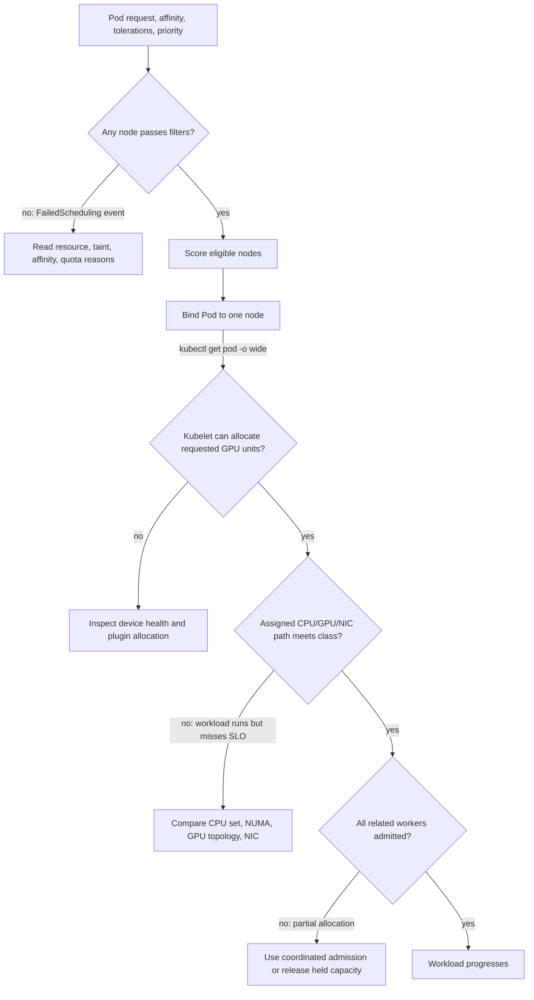

# GPU Scheduling and Topology

Kubernetes can place a Pod that requests an integer GPU resource on a node that advertises sufficient allocatable capacity. That is necessary but often not sufficient. A multi-GPU training job may care about peer connectivity, CPU and NIC locality, and simultaneous start. An inference service may prefer flexible placement and fast scale-out. Treating both as the same scheduling problem either wastes scarce capacity or produces unpredictable performance.

GPU scheduling is therefore the practice of expressing only the placement constraints that the workload can justify, then measuring the utilization cost of those constraints. The best placement is not always the most local one; it is the one that meets the service objective without creating unnecessary stranded capacity.

## Learning objectives

After this chapter, you will be able to:

- separate GPU capacity, node eligibility, and device-level locality;
- select Kubernetes controls for pool isolation and workload placement;
- recognize when distributed jobs need coordinated scheduling; and
- balance performance predictability against fragmentation and operational complexity.

## The scheduler sees a staged decision



**Figure 10.8.1 — Scheduling success and workload suitability are separate decisions.** The first branch explains Pending Pods. The later branches explain why a Running job can still be incorrectly placed or make no progress.

The device plugin and extended-resource model are described in [Chapter 04](./chapter-04-device-plugin-and-kubernetes-resource-model). Feature discovery supplies the labels that make pool eligibility expressible in [Chapter 05](./chapter-05-node-and-gpu-feature-discovery). Neither component by itself turns a generic scheduler decision into a complete topology policy.

## Four placement questions

Ask these in order for every workload class:

1. **Capacity:** how many GPU resources, and of which resource name, are required?
2. **Eligibility:** which validated node class may run the workload?
3. **Locality:** does the workload have measured sensitivity to CPU, NUMA, NIC, storage, or GPU-peer topology?
4. **Coordination:** must multiple Pods start together or be admitted through a queue?

This order prevents a common design error: encoding topology rules before proving that the application benefits from them. It also makes a Pending Pod easier to diagnose because the scheduler event can be mapped to one explicit question.

## Core controls and what they do not do

| Control | Appropriate use | It does not guarantee |
|---|---|---|
| GPU request and limit | reserve an integer extended resource | model, memory, topology, or application health |
| Taint and toleration | reserve GPU pools for authorized workloads | selection of a particular node or GPU |
| Node affinity | require or prefer a governed service class | a particular device within the node |
| Pod affinity / anti-affinity | co-locate or separate related Pods | gang admission or network topology |
| CPU Manager | allocate CPUs according to configured CPU policy | GPU-to-NIC locality by itself |
| Topology Manager | coordinate NUMA hints from participating components | an application-aware communication plan |
| Queue or gang scheduler | admit related Pods together | free capacity or correct hardware labels |

Use a request and limit consistently for GPU extended resources according to the cluster policy. Then add the fewest eligibility and locality constraints needed to meet a documented workload objective. Required affinity is a compatibility commitment; preferred affinity is usually more appropriate for an optimization.

### Read the scheduler’s actual decision

```bash
kubectl describe pod trainer-rank-0 | sed -n '/Events:/,$p'
```

**Representative Pending output:**

```text
Events:
  Type     Reason            Age   From               Message
  ----     ------            ----  ----               -------
  Warning  FailedScheduling  36s   default-scheduler  0/10 nodes are available:
  2 Insufficient nvidia.com/gpu,
  4 node(s) had untolerated taint {gpu.platform/serving: true},
  4 node(s) didn't match Pod's node affinity/selector.
```

The event is a compressed decision trace. Two nodes are eligible by policy but short of free GPUs. Four are reserved for serving. Four fail the requested training class. Restarting kubelet or the scheduler would not create capacity or change the workload contract.

**Purpose:** prove the Pod’s effective placement policy.

```bash
kubectl get pod trainer-rank-0 -o json | jq '{gpu:[.spec.containers[].resources.limits["nvidia.com/gpu"]],nodeSelector:.spec.nodeSelector,affinity:.spec.affinity.nodeAffinity,tolerations:.spec.tolerations}'
```

```json
{
  "gpu": ["8"],
  "nodeSelector": {
    "gpu.platform.example/class": "training-topology"
  },
  "affinity": null,
  "tolerations": [
    {
      "key": "gpu.platform/training",
      "operator": "Equal",
      "value": "true",
      "effect": "NoSchedule"
    }
  ]
}
```

The Pod needs eight GPUs on one node, requires the training class, and tolerates only the training taint. This is more precise than saying “the cluster has free GPUs.”

## Topology is a path, not a label

Performance-sensitive work moves data across paths: CPU memory through a PCIe root complex, GPU-to-GPU links, GPU-to-NIC paths for distributed communication, and storage or network adapters. A label such as `topology=fast` can describe an approved class, but it cannot reveal whether the resources actually assigned to a particular Pod form the intended path.

Kubernetes CPU Manager and Topology Manager can help coordinate CPU, device, and NUMA allocation when configured policies and hint providers align. They are not universal topology solvers. GPU peer connectivity, multi-node fabric behavior, and network attachment can require platform-specific topology awareness, node-pool design, or scheduler integration. Read [Volume 07, Chapter 08](../volume-07/chapter-08-topology-aware-placement) before designing placement for distributed GPU communication.

For single-node multi-GPU training, a homogeneous pool with documented topology may be simpler and safer than per-Pod topology logic. For multi-node jobs, combine node-class selection with verified fabric configuration and the workload framework’s communication behavior; a perfect local CPU allocation cannot compensate for a congested or misconfigured network path.

### Inspect the assigned locality

**Purpose:** read the CPU set assigned to the container and compare host NUMA placement.

```bash
kubectl exec trainer-rank-0 -- sh -c 'grep Cpus_allowed_list /proc/self/status; nvidia-smi topo -m'
```

**Representative output:**

```text
Cpus_allowed_list: 0-31

        GPU0  GPU1  GPU2  GPU3  NIC0  CPU Affinity  NUMA Affinity
GPU0     X    NV18  NV18  NV18  NODE  0-31          0
GPU1    NV18   X    NV18  NV18  NODE  0-31          0
GPU2    NV18  NV18   X    NV18  SYS   32-63         1
GPU3    NV18  NV18  NV18   X    SYS   32-63         1
NIC0    NODE  NODE  SYS   SYS    X
```

The process is restricted to CPUs `0-31`, corresponding to NUMA node 0 in this representative topology. GPU0 and GPU1 are local to NIC0 through `NODE`; GPU2 and GPU3 cross the broader system path shown as `SYS`. A four-GPU job using all devices may therefore have asymmetric host and NIC locality even though all four GPUs are connected by NVLink. The exact legend is platform-specific; use the command output from the actual node rather than memorizing this example.

## Coordinated-start workloads

Distributed training often needs a complete set of workers before useful work starts. If independent Pods are scheduled one at a time, some can reserve GPUs while their peers wait in Pending state. The cluster appears allocated, but the job produces no progress.

Queueing or gang-style admission mechanisms can avoid this partial allocation by admitting the group only when its required resources are available. They introduce their own policy decisions: queue fairness, priority, timeout, preemption, and how long capacity may wait for a large job. Do not bolt them onto every GPU workload. They are justified when partial start has material cost, such as tightly coupled training, not merely because the workload uses GPUs.

### Worked partial-allocation cost

A distributed job needs four Pods, each requesting eight GPUs. Only three eight-GPU nodes are available.

```text
requested = 4 Pods × 8 GPUs = 32 GPUs
available full-node slots = 3 × 8 GPUs = 24 GPUs
```

Without coordinated admission, three Pods can reserve 24 GPUs while the fourth remains Pending. If the framework cannot make progress until all ranks join, utilization can show allocated capacity with zero useful training steps. Gang admission can keep all 24 GPUs available to other work until the complete 32-GPU request can start.

## Fragmentation is the price of specificity

Every hard constraint reduces the candidate set. That can protect SLOs, but it can also leave isolated GPUs, create long queues while other pools are idle, and turn a hardware refresh into a capacity incident. Track these effects by service class rather than only by total cluster utilization.

| Workload class | Typical priority | Scheduling posture |
|---|---|---|
| Interactive development | rapid admission | flexible pool, bounded sharing or quotas as policy allows |
| Online inference | latency and availability | validated serving class, replicas spread for resilience |
| Batch inference | throughput and cost | flexible placement, queue-aware admission where useful |
| Distributed training | predictable collective performance | topology-aware class, coordinated admission, checkpoint-aware disruption policy |

Start with a small service catalog and add a class only when it has a measured performance, reliability, or governance reason. Review class utilization and wait time after changes. A constraint that provides no measurable benefit is operational debt.

### Quantify stranded capacity

Assume a 10-node pool with eight GPUs per node. Six nodes belong to the training class and four to serving.

```text
training capacity = 6 × 8 = 48 GPUs
serving capacity  = 4 × 8 = 32 GPUs
```

If training uses 40 GPUs while serving uses only eight, the fleet has 32 physically idle GPUs:

```text
training idle = 48 − 40 = 8
serving idle  = 32 − 8  = 24
total idle    = 32 / 80 = 40%
```

Only eight of those idle GPUs are eligible for training. The other 24 are intentionally stranded by the service-class boundary. The architecture review should compare the serving SLO benefit with that utilization cost.

## Production story: a successful placement that missed the objective

A four-worker training job begins on nodes with sufficient GPU count. The scheduler is healthy and every Pod is Running, but step time varies dramatically between runs. Investigation shows CPU allocation, GPU peer layout, and network attachment differ among the chosen nodes. The platform had defined only a generic GPU pool, so it had no contract for the data path the job required.

The remediation is not to hard-code a specific SKU into every job. The team creates a validated topology-sensitive training class, tests representative jobs, and uses coordinated admission for the worker group. Less sensitive inference workloads remain in a flexible pool. This improves predictability while preserving a place for capacity-efficient work.

## Fairness, preemption, and disruption

Quota, priority, and preemption policies are capacity-management controls, not performance features. A high-priority workload may need to displace lower-priority work, but terminating a training job can discard expensive progress if its checkpoint path is not healthy. Define which classes are preemptible, required checkpoint expectations, grace behavior, and the human approval or automation boundary before enabling aggressive policy.

Likewise, a drain policy for a topology-sensitive workload must consider the group, not only the individual Pod. Capacity headroom and checkpoint verification are often more valuable than a clever scheduler rule during planned maintenance.

## Troubleshooting placement and performance

| Symptom | First evidence | Next decision |
|---|---|---|
| Pod Pending | scheduler event and effective placement policy | shortage, taint, affinity, quota, or group admission |
| One rank Pending | peer states, queue/gang object, free full-node slots | wait, preempt, or release partial allocation |
| Running job is slow | assigned GPUs, CPU set, NUMA, NIC, peer topology | compare path with known-good placement |
| Pool utilization low | idle GPUs by class and queue wait by class | relax unjustified constraints or resize pools |
| Drain stalls | PDB, checkpoints, group ownership, termination state | protect progress or escalate maintenance decision |

### Evidence row 1: coordinated group is partially admitted

```bash
kubectl get pods -l training-job=run-42 -o custom-columns='POD:.metadata.name,PHASE:.status.phase,NODE:.spec.nodeName,GPU:.spec.containers[*].resources.limits.nvidia\.com/gpu'
```

```text
POD        PHASE     NODE          GPU
rank-0     Running   gpu-node-01   8
rank-1     Running   gpu-node-02   8
rank-2     Running   gpu-node-03   8
rank-3     Pending   <none>        8
```

Three Pods reserve 24 GPUs while the group cannot complete. If the framework requires all four ranks, useful progress is zero. Inspect the queue or gang admission policy; deleting only the Pending Pod does not release the held capacity.

### Evidence row 2: running placement has asymmetric locality

```bash
kubectl exec rank-0 -- sh -c 'grep Cpus_allowed_list /proc/self/status; nvidia-smi topo -m | head -8'
```

```text
Cpus_allowed_list: 32-63
        GPU0  GPU1  NIC0  CPU Affinity  NUMA Affinity
GPU0     X    NV18  SYS   0-31          0
GPU1    NV18   X    SYS   0-31          0
NIC0    SYS   SYS    X    32-63         1
```

The container runs on CPUs local to NUMA node 1 and NIC0, while the selected GPUs are associated with NUMA node 0 in this representative output. The job can run, but host preprocessing or network communication may cross sockets. Confirm with workload and fabric telemetry before claiming causality.

### Evidence row 3: hard affinity creates service-class starvation

```bash
kubectl get pods -A --field-selector=status.phase=Pending -o custom-columns='NS:.metadata.namespace,POD:.metadata.name,CLASS:.spec.nodeSelector.gpu\.platform\.example/class,GPU:.spec.containers[*].resources.limits.nvidia\.com/gpu'
kubectl get nodes -L gpu.platform.example/class -o custom-columns='NAME:.metadata.name,CLASS:.metadata.labels.gpu\.platform\.example/class,GPU:.status.allocatable.nvidia\.com/gpu'
```

```text
NS         POD             CLASS                GPU
training   trainer-991     training-topology    8
training   trainer-992     training-topology    8

NAME          CLASS                GPU
gpu-node-01   training-topology    8
gpu-node-02   training-topology    8
gpu-node-03   serving-lowlatency   8
gpu-node-04   serving-lowlatency   8
```

The two training-class nodes may be occupied while 16 serving-class GPUs are idle. This is not a scheduler bug; it is the explicit pool boundary. Decide whether the SLO justifies it or whether an overflow policy is acceptable.

## Customer architecture discussion

One global policy is rarely appropriate for a shared GPU cluster. Offer clear service classes: flexible capacity for elastic work, protected serving capacity for latency-sensitive workloads, and controlled topology-aware capacity for tightly coupled jobs. Make the cost of each class visible in utilization, queue time, and operational complexity. That lets application teams choose a contract instead of reverse-engineering the fleet.

## Interview preparation

**Why can topology-aware scheduling lower total utilization?**

> “Topology-aware policy removes otherwise free devices from the eligible set. That is worthwhile only when measured locality gains exceed the queueing and stranded-capacity cost. I would show utilization and wait time by service class, compare representative workload performance, and keep hard constraints only for compatibility or a proven SLO.”

**Why is `nvidia.com/gpu: 4` insufficient for a distributed training placement policy?**

> “It asks for four integer resources on one node, but it says nothing about peer links, CPU and NIC locality, the network fabric, or coordinated start across worker Pods. I would combine the resource request with a validated node class, locality policy where measured, and gang-style admission if partial start wastes capacity.”

**How would you troubleshoot a Running but slow GPU job?**

> “I would not start with the scheduler because binding already succeeded. I would record the assigned nodes and GPU UUIDs, the container CPU sets, NUMA and GPU topology, NIC placement, and competing workloads. Then I would compare application step time, DCGM, network, and storage evidence with a known-good placement. A topology difference is a hypothesis until the workload metrics correlate with it.”

## Key takeaways

- Capacity, eligibility, locality, and coordination are distinct scheduling questions.
- Extended GPU resources express quantity, not complete performance intent.
- Use topology controls only for a measured workload requirement.
- Gang-style admission addresses partial starts for coordinated workloads.
- Manage fragmentation through a small, evidence-based service-class catalog.

## Cross references and further reading

- [Node and GPU Feature Discovery](./chapter-05-node-and-gpu-feature-discovery)
- [Device Plugin and Kubernetes Resource Model](./chapter-04-device-plugin-and-kubernetes-resource-model)
- [GPU Observability with DCGM](./chapter-09-gpu-observability-with-dcgm)
- [Volume 07 — Topology-Aware Placement](../volume-07/chapter-08-topology-aware-placement)
- [Kubernetes Topology Manager documentation](https://kubernetes.io/docs/tasks/administer-cluster/topology-manager/)
